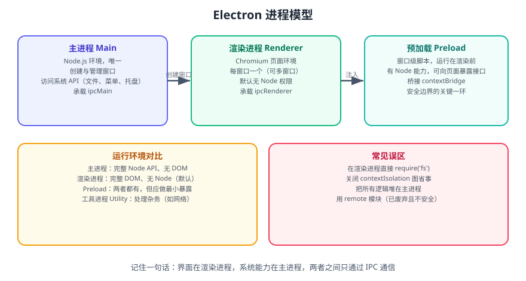

# Electron 进程

Electron 采用**多进程架构**：主进程负责系统能力与窗口管理，渲染进程负责界面渲染与交互，预加载脚本站在两者之间做安全桥接。理解这三者的边界，是写出安全、稳定 Electron 应用的前提。



在 Electron 中主要控制三类进程：主进程、渲染器进程、预加载脚本所在的桥接层。此外还有工具进程（Utility Process）用于承载杂务。

## 一句话定位

**界面在渲染进程，系统能力在主进程，两者之间只通过 IPC 通信。** 任何「在渲染进程里直接读文件」的想法，都会破坏安全模型。

## 主进程

每个 Electron 应用都有一个单一的主进程，作为应用程序的入口点。

主进程在 Node.js 环境中运行，它具有 require 模块和使用所有 Node.js API 的能力。

主进程的核心就是：**使用 BrowserWindow 来创造和管理窗口**

```javascript [main.js]
const { app, BrowserWindow } = require('electron')

app.whenReady().then(() => {
  const win = new BrowserWindow({
    width: 800,
    height: 600,
    webPreferences: {
      // 推荐的安全默认值
      contextIsolation: true,
      nodeIntegration: false,
      sandbox: true,
      preload: require('node:path').join(__dirname, 'preload.js'),
    },
  })

  win.loadFile('index.html')
})
```

## 渲染进程

每个 BrowserWindow 实例都对应一个单独的渲染器进程，运行在渲染器进程中的代码，必须遵守网页标准，这也就意味着：渲染器进程无权直接访问 require 或使用任何 Node.js 的 API。

```html [index.html]
<!DOCTYPE html>
<html>
  <head>
    <meta charset="UTF-8" />
    <title>渲染进程</title>
  </head>
  <body>
    <h1>这是渲染进程</h1>
    <script src="./renderer.js"></script>
  </body>
</html>
```

```javascript [renderer.js]
console.log('运行在渲染进程中')
document.body.innerHTML += '<p>Hello from Renderer!</p>'
```

## 预加载脚本

预加载脚本运行在渲染进程的**上下文隔离边界**上：它先于页面脚本执行，可以访问 Node API，并通过 `contextBridge` 向页面暴露一个**最小接口**。

```javascript [preload.js]
const { contextBridge, ipcRenderer } = require('electron')

// 只暴露业务真正需要的方法，不要把 ipcRenderer 整体暴露出去
contextBridge.exposeInMainWorld('api', {
  readConfig: () => ipcRenderer.invoke('config:read'),
  onUpdate: (cb) => ipcRenderer.on('app:update', (_e, payload) => cb(payload)),
})
```

::: danger 注意
1. **不要把 `ipcRenderer` 整个暴露给页面**：页面（含第三方脚本）就能调用任意 channel，等于放弃安全边界。
2. **关闭 `contextIsolation` 是重大退让**：会让页面能篡改预加载注入的对象，是 Electron 安全通告里的高频问题成因。
3. **`sandbox: true` 下预加载也不能 `require` 任意 Node 模块**，只能使用 Electron 提供的有限 API 与 `require('electron')` 的部分内容。
:::

## 工具进程（Utility Process）

除了主进程与渲染进程，Electron 还提供 `utilityProcess.fork()` 创建**工具进程**，用于承载不需要界面的杂务：

```javascript [main.js]
const { utilityProcess } = require('electron')

const child = utilityProcess.fork(require('node:path').join(__dirname, 'worker.js'))
child.postMessage({ task: 'index-data' })
child.on('message', (msg) => console.log('工具进程回传', msg))
```

| 用途 | 说明 |
| --- | --- |
| 密集计算 | 不阻塞主进程事件循环 |
| 网络与解析 | 隔离不稳定的第三方依赖 |
| 崩溃隔离 | 工具进程崩溃不影响主进程 |

## 进程对比

| 特性 | 主进程 | 渲染进程 | 预加载脚本 |
|------|--------|----------|------------|
| 数量 | 每个应用一个 | 每个窗口一个 | 每个窗口一个 |
| 运行环境 | Node.js | Chromium | 桥接（受限） |
| Node.js API | 完全访问 | 默认不可访问 | 受沙箱限制 |
| DOM API | 不可访问 | 完全访问 | 无（不渲染） |
| 职责 | 创建窗口、生命周期管理、系统能力 | 渲染页面、用户交互 | 安全暴露接口 |

## 进程生命周期

### 主进程事件

```javascript [main.js]
const { app, BrowserWindow } = require('electron')

app.on('ready', () => {
  console.log('应用准备就绪')
})

app.on('window-all-closed', () => {
  console.log('所有窗口已关闭')
  if (process.platform !== 'darwin') {
    app.quit()
  }
})

app.on('before-quit', (event) => {
  console.log('应用即将退出')
})

app.on('will-quit', (event) => {
  console.log('应用即将退出（可阻止）')
})

app.on('quit', () => {
  console.log('应用已退出')
})
```

### 渲染进程事件

```javascript [renderer.js]
window.addEventListener('DOMContentLoaded', () => {
  console.log('DOM 加载完成')
})

window.addEventListener('load', () => {
  console.log('页面加载完成')
})

window.addEventListener('beforeunload', (event) => {
  console.log('页面即将卸载')
})
```

## 进程间通信

主进程和渲染进程之间通过 IPC（Inter-Process Communication）进行通信。

```javascript [preload.js]
const { contextBridge, ipcRenderer } = require('electron')

contextBridge.exposeInMainWorld('electronAPI', {
  sendMessage: (message) => ipcRenderer.send('message', message),
  onReply: (callback) => ipcRenderer.on('reply', (_event, value) => callback(value))
})
```

```javascript [main.js]
const { ipcMain } = require('electron')

ipcMain.on('message', (event, message) => {
  console.log('收到消息:', message)
  event.sender.send('reply', '主进程已收到')
})
```

```javascript [renderer.js]
window.electronAPI.sendMessage('Hello from Renderer!')
window.electronAPI.onReply((reply) => {
  console.log(reply)
})
```

## 常见误区

| 误区 | 问题 | 正确做法 |
| --- | --- | --- |
| 在渲染进程直接 `require('fs')` | 关闭 `nodeIntegration` 后不可用，开启则极不安全 | 通过 IPC 交给主进程 |
| 把业务逻辑全堆在主进程 | 主进程被阻塞会拖垮整个应用 | 重计算放工具进程或渲染进程 |
| 关闭 `contextIsolation` 图方便 | 页面可篡改注入对象 | 保持默认 `true`，用 `contextBridge` 精确暴露 |
| 每个窗口都加载一份重资源 | 内存成倍增长 | 多窗口共享主进程缓存，或复用窗口 |
| 用已废弃的 `remote` 模块 | 安全风险且性能差 | 改用 IPC |

## 验证方式

1. 在渲染进程执行 `console.log(typeof require)`，确认输出 `undefined`（说明未开启 Node 集成）。
2. 在预加载脚本中断点，确认它在页面脚本之前执行，且能访问 `ipcRenderer`。
3. 打开开发者工具的「任务管理器」或系统任务管理器，确认存在一个主进程与每个窗口对应的渲染进程。
4. 用 `utilityProcess.fork` 起一个工具进程做耗时计算，确认主进程事件循环未被阻塞（界面仍可响应）。

## 相关专题

- [Electron 进程通信 IPC](../IPC/index.md)：三类进程之间的通信方式
- [Electron Preload 脚本](../Preload/index.md)：安全桥接的实现细节
- [Electron 安全最佳实践](../Security/index.md)：安全配置基线
- [Electron 窗口管理](../WindowManagement/index.md)：多窗口与生命周期

## 参考资料

- Electron 官方文档 · 进程模型：https://www.electronjs.org/zh/docs/latest/tutorial/process-model
- Electron 官方文档 · contextBridge：https://www.electronjs.org/zh/docs/latest/api/context-bridge
- Electron 官方文档 · utilityProcess：https://www.electronjs.org/zh/docs/latest/api/utility-process

