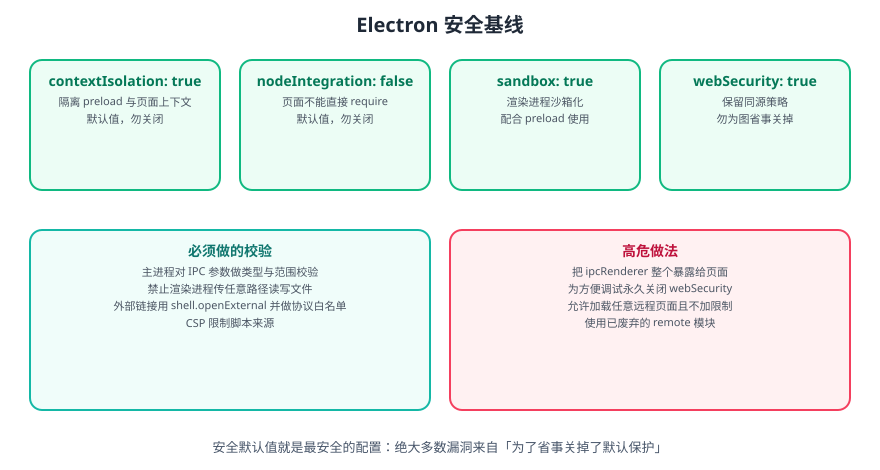

# Electron 安全最佳实践

Electron 的安全模型建立在「**渲染进程不可信**」这一前提上：只要渲染进程加载了任何不可控内容（远程页面、第三方脚本、用户输入的 HTML），它就可能被利用。因此所有系统能力都必须经过主进程校验。



## 一句话原则

**默认值就是最安全的配置。** 绝大多数 Electron 安全漏洞，来自「为了省事关掉了默认保护」。先保证不做错，再考虑加防护。

## 安全配置

### 推荐的 webPreferences 配置

```javascript [main.js]
const win = new BrowserWindow({
  webPreferences: {
    contextIsolation: true,
    nodeIntegration: false,
    sandbox: true,
    preload: require('node:path').join(__dirname, 'preload.js'),
    webSecurity: true,
    allowRunningInsecureContent: false,
    experimentalFeatures: false,
    enableRemoteModule: false
  }
})
```

| 选项 | 推荐值 | 说明 |
|------|--------|------|
| `contextIsolation` | `true` | 隔离预加载脚本和页面脚本 |
| `nodeIntegration` | `false` | 禁止渲染进程直接访问 Node.js |
| `sandbox` | `true` | 沙盒模式，限制渲染进程权限 |
| `webSecurity` | `true` | 启用同源策略 |
| `allowRunningInsecureContent` | `false` | 禁止混合内容 |
| `enableRemoteModule` | `false` | 禁用 remote 模块 |

::: danger 注意
`preload` 必须用 `path.join(__dirname, 'preload.js')` 形式的**绝对路径**。写相对路径 `'./preload.js'` 在开发时看似正常，打包后往往失效，且可能因解析基准不同加载到非预期文件。
:::

## 内容安全策略

CSP 用来限制页面能加载与执行哪些资源，是抵御 XSS 的关键一层：

```html [index.html]
<meta
  http-equiv="Content-Security-Policy"
  content="default-src 'self'; script-src 'self'; style-src 'self' 'unsafe-inline'; img-src 'self' data:; connect-src 'self' https://api.example.com;"
/>
```

也可以通过响应头设置（对远程内容更可靠）：

```javascript [main.js]
const { session } = require('electron')

session.defaultSession.webRequest.onHeadersReceived((details, callback) => {
  callback({
    responseHeaders: {
      ...details.responseHeaders,
      'Content-Security-Policy': ["default-src 'self'; script-src 'self'"],
    },
  })
})
```

::: warning 说明
`'unsafe-inline'` 会削弱 CSP 的防护效果。若样式必须内联，尽量只对 `style-src` 放开，`script-src` 保持 `'self'`。
:::

## 使用 contextBridge

```javascript [preload.js]
const { contextBridge, ipcRenderer } = require('electron')

contextBridge.exposeInMainWorld('electronAPI', {
  getVersion: () => process.versions.electron,
  readFile: (path) => ipcRenderer.invoke('read-file', path),
  writeFile: (path, content) => ipcRenderer.invoke('write-file', path, content)
})
```

## IPC 通信安全

### 验证通道名称

Electron **没有**「通配符 channel」能力，正确做法是**逐个显式注册**，让可用能力本身就是一份白名单：

```javascript [main.js]
const { ipcMain } = require('electron')

// 逐个注册 = 天然白名单；每个 handler 内部再做参数校验
ipcMain.handle('read-file', (event, filePath) => readFileSafe(filePath))
ipcMain.handle('write-file', (event, filePath, content) => writeFileSafe(filePath, content))
ipcMain.handle('get-version', () => require('electron').app.getVersion())
```

::: danger 注意
不要为了实现「统一入口」而写类似 `ipcMain.handle(channel, ...)` 的透传逻辑——那等于把主进程能力全量开放。**白名单的正确形态是「只注册需要的那几个 channel」**，而不是「注册一个再过滤」。
:::

### 验证参数

```javascript [main.js]
const path = require('node:path')
const fs = require('node:fs/promises')

const ALLOWED_DIR = path.resolve(__dirname, 'data')

function resolveSafe(filePath) {
  const resolved = path.resolve(ALLOWED_DIR, filePath)
  // 关键：解析后必须仍位于允许目录内，防止 ../ 目录穿越
  if (resolved !== ALLOWED_DIR && !resolved.startsWith(ALLOWED_DIR + path.sep)) {
    throw new Error('不允许访问该路径')
  }
  return resolved
}

async function readFileSafe(filePath) {
  return fs.readFile(resolveSafe(filePath), 'utf-8')
}

async function writeFileSafe(filePath, content) {
  if (typeof content !== 'string') throw new Error('内容类型不合法')
  await fs.writeFile(resolveSafe(filePath), content, 'utf-8')
  return { ok: true }
}
```

::: danger 注意
`path.resolve` 的「前缀判断」有一个经典陷阱：`/data-evil` 会以 `/data` 为前缀。因此必须判断 `resolved === ALLOWED_DIR` **或** `resolved.startsWith(ALLOWED_DIR + path.sep)`，只写 `startsWith(ALLOWED_DIR)` 是不安全的。
:::

## 避免使用 remote 模块

```javascript
// 错误：使用 remote 模块
const { remote } = require('@electron/remote')
const win = remote.getCurrentWindow()

// 正确：使用 IPC
const { ipcRenderer } = require('electron')
ipcRenderer.invoke('get-window-info')
```

## 加载远程内容

```javascript [main.js]
// 错误：加载不可信的远程内容
win.loadURL('https://untrusted-site.com')

// 正确：加载本地内容
win.loadFile('index.html')

// 如果必须加载远程内容，使用沙盒 + 严格白名单
const win = new BrowserWindow({
  webPreferences: {
    sandbox: true,
    contextIsolation: true,
    nodeIntegration: false
  }
})
```

### 拦截新窗口与外部链接

渲染进程里的 `<a target="_blank">` 或 `window.open` 默认可能创建**不受控的新窗口**，必须接管：

```javascript [main.js]
const { shell } = require('electron')

// 禁止页面自行打开新窗口
win.webContents.setWindowOpenHandler(({ url }) => {
  // 只允许 https 外部链接交给系统浏览器打开
  if (url.startsWith('https://')) shell.openExternal(url)
  return { action: 'deny' }
})

// 阻止页面内跳转到外部地址
win.webContents.on('will-navigate', (event, url) => {
  if (!url.startsWith('file://')) {
    event.preventDefault()
    shell.openExternal(url)
  }
})
```

::: danger 注意
**不限制 `shell.openExternal` 的协议是危险做法**。若攻击者能控制传给它的 URL，`file://`、`smb://` 等协议可能触发本地可执行文件或凭据泄露。**必须做协议白名单，只允许 `https:`**。
:::

## 协议处理

```javascript [main.js]
const { app, protocol } = require('electron')

app.whenReady().then(() => {
  protocol.registerFileProtocol('myapp', (request, callback) => {
    const url = request.url.replace('myapp://', '')
    const filePath = path.resolve(__dirname, url)
    const allowRoot = path.resolve(__dirname, 'public')

    if (filePath !== allowRoot && !filePath.startsWith(allowRoot + path.sep)) {
      callback({ error: -10 })
      return
    }

    callback({ path: filePath })
  })
})
```

## 完整性保护与版本维护

| 机制 | 说明 |
| --- | --- |
| ASAR 打包 | 把源码打进 `app.asar`，减少文件散落，也便于完整性校验 |
| ASAR 完整性摘要 | 较新版本支持在 macOS 上嵌入 ASAR 完整性摘要并在启动时校验，用于检测包被篡改 |
| 代码签名 | macOS 需签名 + 公证，Windows 建议签名；**未签名的应用在较新 macOS 上通知等功能会失败** |
| 及时升级 | Electron 修复的安全问题通过升级发布；**停留在旧大版本会持续暴露于已修复漏洞** |
| 32 位平台 | 官方已宣布停止支持 32 位平台，存量项目需规划迁移到 64 位 |

::: tip 建议
把 Electron 版本升级纳入常规维护节奏。Electron 跟随 Chromium 发布，**每个大版本都包含大量安全修复**，长期不升级是桌面应用最容易被忽略的风险。
:::

## 安全检查清单

- [ ] 启用 `contextIsolation`
- [ ] 禁用 `nodeIntegration`
- [ ] 启用 `sandbox`
- [ ] 配置 CSP
- [ ] 使用 `contextBridge` 暴露最小 API，不暴露 `ipcRenderer` 本体
- [ ] 逐个注册 IPC channel（白名单）并校验参数
- [ ] 校验路径时防止目录穿越（注意 `path.sep`）
- [ ] 接管 `setWindowOpenHandler` 与 `will-navigate`
- [ ] `shell.openExternal` 做协议白名单
- [ ] 禁用 `remote` 模块
- [ ] 使用 HTTPS 加载远程内容
- [ ] 及时更新 Electron 版本
- [ ] 审查第三方依赖
- [ ] 使用代码签名
- [ ] 启用 ASAR 打包

::: tip 进阶阅读
Web 侧安全原理（XSS/CSRF/CSP/HTTPS）见 [前端安全专题](../../../Others/Security/index.md)；依赖审计方法见 [依赖与供应链安全](../../../Others/Security/Dependency/index.md)。
:::

## 验证方式

1. 在渲染进程执行 `require`，确认报错（未开启 Node 集成）。
2. 传入 `../../../etc/hosts` 这类路径调用 IPC，确认被拒绝。
3. 在页面中构造一个 `<a target="_blank" href="file:///...">`，确认被 `setWindowOpenHandler` 拦截。
4. 用开发者工具的控制台检查 CSP 是否生效（尝试内联 `<script>` 应被拒绝）。
5. 用 `@electron/fuses` 或官方检查工具核对生产包的安全配置是否被意外关闭。

## 参考资料

- Electron 官方文档 · 安全：https://www.electronjs.org/zh/docs/latest/tutorial/security
- Electron 官方文档 · 安全检查清单：https://www.electronjs.org/zh/docs/latest/tutorial/security#checklist
- Electron 官方博客 · 版本发布与安全公告：https://www.electronjs.org/blog

