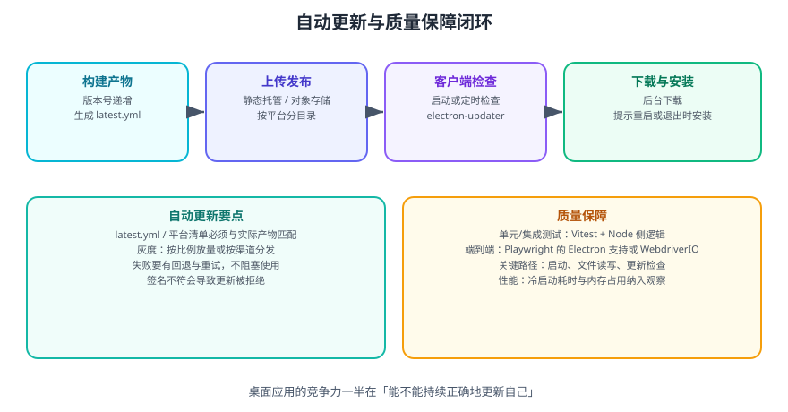

# Electron 自动化测试

桌面应用的自动化测试比 Web 更麻烦：它有**两个进程、两种运行环境**，还有安装包与更新这类只有真实环境才能验证的环节。本页给出可落地的分层测试策略。



## 一句话定位

Electron 的测试按「**能测多远**」分三层：单元测试测主进程与工具函数，集成测试测 IPC 与窗口行为，端到端测试测真实应用启动后的完整流程。**层次越低越快越稳，层次越高越接近真实**。

## 分层策略

| 层次 | 测什么 | 工具 | 特点 |
| --- | --- | --- | --- |
| 单元测试 | 纯函数、主进程业务逻辑、状态管理 | Vitest / Jest（Node 环境） | 快、稳、成本低，应占大头 |
| 集成测试 | IPC 协议、preload 暴露的接口、窗口创建 | Vitest + 模拟 `electron` 模块 | 中速，验证进程边界 |
| 端到端测试 | 真实启动应用、点击、读取界面 | Playwright（Electron 支持）/ WebdriverIO | 慢、脆，只覆盖关键路径 |

::: tip 建议
遵循「**测试金字塔**」：大量单元测试 + 适量集成测试 + 少量关键路径端到端测试。反过来（大量端到端）会让 CI 变慢且频繁因环境抖动而失败。
:::

## 单元测试：把 Electron 依赖隔离掉

主进程代码常直接 `require('electron')`，在 Node 测试环境中会失败。做法是**把纯逻辑抽出来**，让测试只依赖纯函数：

```javascript [src/main/file-service.js]
// 抽离成不依赖 electron 的纯逻辑，便于测试
const path = require('node:path');

function resolveSafe(root, relativePath) {
  const resolved = path.resolve(root, relativePath);
  if (resolved !== root && !resolved.startsWith(root + path.sep)) {
    throw new Error('路径不合法');
  }
  return resolved;
}

module.exports = { resolveSafe };
```

```javascript [test/file-service.test.js]
import { describe, it, expect } from 'vitest';
const path = require('node:path');
const { resolveSafe } = require('../src/main/file-service');

const ROOT = path.resolve('/app/data');

describe('resolveSafe', () => {
  it('允许访问允许目录内的文件', () => {
    expect(resolveSafe(ROOT, 'a.txt')).toBe(path.resolve(ROOT, 'a.txt'));
  });

  it('拒绝目录穿越', () => {
    expect(() => resolveSafe(ROOT, '../../etc/passwd')).toThrow('路径不合法');
  });

  it('拒绝前缀相似但越界的路径', () => {
    // 经典陷阱：/app/data-evil 以 /app/data 为前缀
    expect(() => resolveSafe(ROOT, '../data-evil/x')).toThrow();
  });
});
```

```shell
npx vitest run
```

::: danger 注意
**不要把「路径校验」这类安全逻辑写成需要启动 Electron 才能测的形态**。它越容易测，就越可能被持续验证；写进主进程深处反而会没人测。**可测性是安全的前提。**
:::

## 集成测试：用 mock 模拟 electron 模块

需要验证 IPC 注册与 preload 暴露的内容时，可以 mock 掉 `electron`：

```javascript [test/ipc.test.js]
import { describe, it, expect, vi, beforeEach } from 'vitest';

// 用 vi.mock 拦截 electron，避免真正启动
const handlers = new Map();
vi.mock('electron', () => ({
  ipcMain: {
    handle: (channel, fn) => handlers.set(channel, fn),
  },
  app: { getVersion: () => '1.2.3' },
}));

describe('IPC 注册', () => {
  beforeEach(() => handlers.clear());

  it('注册了允许的 channel', async () => {
    require('../src/main/ipc-register');

    expect(handlers.has('fs:read')).toBe(true);
    expect(handlers.has('app:version')).toBe(true);

    const version = await handlers.get('app:version')();
    expect(version).toBe('1.2.3');
  });

  it('未注册未授权 channel', () => {
    require('../src/main/ipc-register');
    expect(handlers.has('shell:exec')).toBe(false);
  });
});
```

::: warning 说明
mock `electron` 只能验证「代码结构是否正确」，**验证不了真实运行时的行为**（例如沙箱下某些 API 是否可用）。真正的行为验证要放到端到端层。
:::

## 端到端测试：Playwright

Playwright 提供了 `_electron` 支持，可以启动真实应用并操作界面：

```shell
npm i -D @playwright/test
```

```javascript [e2e/app.spec.js]
const { test, expect, _electron: electron } = require('@playwright/test');
const path = require('node:path');

test('应用启动后显示首页标题', async () => {
  // 启动打包前的应用目录
  const app = await electron.launch({
    args: [path.resolve(__dirname, '../dist/main.js')],
  });

  const window = await app.firstWindow();
  await expect(window.locator('h1')).toHaveText('首页');

  // 验证主进程侧状态
  const version = await app.evaluate(async ({ app }) => app.getVersion());
  expect(version).toBe('1.2.3');

  await app.close();
});

test('点击按钮后渲染进程能拿到主进程返回值', async () => {
  const app = await electron.launch({
    args: [path.resolve(__dirname, '../dist/main.js')],
  });
  const window = await app.firstWindow();

  await window.locator('#version-btn').click();
  await expect(window.locator('#version-text')).toContainText('1.2.3');

  await app.close();
});
```

核心能力：

| API | 作用 |
| --- | --- |
| `electron.launch()` | 启动 Electron 应用 |
| `app.firstWindow()` | 获取第一个窗口 |
| `app.evaluate(fn)` | **在主进程上下文执行代码** |
| `window.locator()` | 在渲染进程查找元素 |
| `app.close()` | 关闭应用 |
| `app.windows()` | 获取所有窗口（多窗口测试） |

::: danger 注意
1. **端到端测试要用真实启动路径**：直接指向打包前的入口（如 `dist/main.js`）比指向源码更接近真实产物。
2. **不要用固定 `sleep` 等界面**：用 Playwright 的自动等待与 `expect(...).toHaveText` 轮询，否则在慢机器上必然抖动。
3. **CI 上跑 Electron 需要图形环境**：Linux runner 需配置 `xvfb`，或用 `--headless` 相关方案；这也是端到端测试不适合放进每次提交流水线的原因。
4. **只测关键路径**：启动、核心交互、更新检查。把所有功能都塞进端到端测试，维护成本会迅速失控。
:::

## 只有真实环境才能验证的项

| 项目 | 为什么必须真实环境 |
| --- | --- |
| 安装包能否安装 | 涉及系统安装流程与权限 |
| 代码签名是否有效 | 只有签名后的产物才被系统认可 |
| 自动更新 | 依赖真实更新服务器与清单文件 |
| 系统集成（托盘、通知、全局快捷键） | 依赖真实桌面环境 |
| 原生模块 | 依赖目标平台编译结果 |

这些项目建议做成**发布前的验收清单**，而不是自动化用例。

## 检查清单

| 项 | 要求 |
| --- | --- |
| 单元测试 | 覆盖主进程纯逻辑与安全校验（路径、参数） |
| 集成测试 | 覆盖 IPC channel 白名单与 preload 暴露接口 |
| 端到端测试 | 只覆盖启动 + 核心路径，使用自动等待 |
| CI 配置 | 单元/集成必跑；端到端按需或夜间跑 |
| 发布验收 | 安装、签名、更新、系统集成逐项人工确认 |

## 验证方式

1. 执行 `npx vitest run`，确认单元与集成测试全部通过。
2. 故意把 `resolveSafe` 的前缀判断改成 `startsWith(ROOT)`（去掉 `path.sep`），确认「相似前缀」用例失败——验证测试真的有效。
3. 执行端到端测试，确认能启动应用、读取主进程版本号并关闭。
4. 在 CI 中跑一次，确认图形环境缺失时给出明确报错，而不是静默跳过。

## 相关专题

- [Electron 进程通信 IPC](../IPC/index.md)：集成测试要覆盖的协议边界
- [Electron 安全最佳实践](../Security/index.md)：路径校验等安全逻辑的测试
- [Electron 构建工具](../BuildingTools/index.md)：端到端测试指向的产物
- [前端测试专题](../../../Testing/index.md)：Vitest 与 Playwright 的通用用法

## 参考资料

- Electron 官方文档 · 自动化测试：https://www.electronjs.org/zh/docs/latest/tutorial/automated-testing
- Playwright · Electron 支持：https://playwright.dev/docs/api/class-electron
- Vitest 官方文档：https://vitest.dev/
