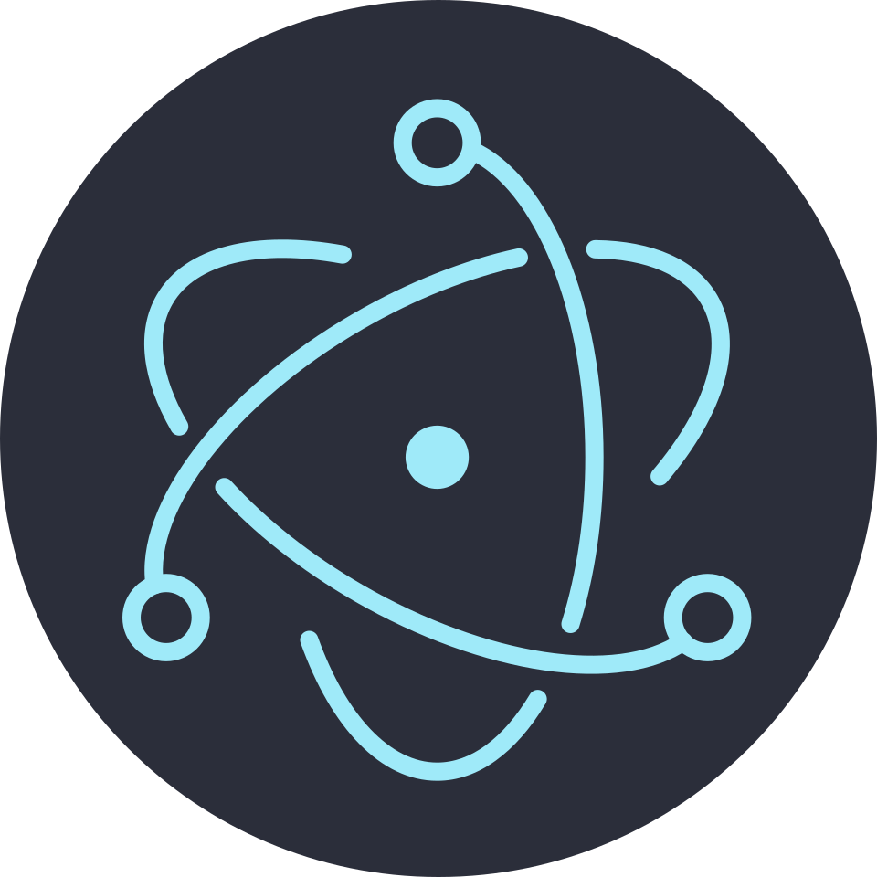

# Electron

Electron（原名 Atom Shell）是**用 Web 技术构建跨平台桌面应用**的框架：它把 Chromium 渲染引擎与 Node.js 运行时打包进同一个可执行文件，让前端团队可以用 HTML / CSS / JavaScript 交付 Windows、macOS、Linux 桌面应用。

本专题覆盖从进程模型、IPC、安全基线，到窗口能力、打包发布、自动更新、测试与性能的完整链路。

## 目录

### 入门与核心概念

- [Electron 概述](Overview/index.md)
- [Electron 搭建环境](BuildEnvironment/index.md)
- [Electron 配置](Configuration/index.md)
- [Electron 进程](Process/index.md)
- [Electron Preload 脚本](Preload/index.md)
- [Electron 进程通信 IPC](IPC/index.md)

### 桌面能力

- [Electron 窗口管理](WindowManagement/index.md)
- [Electron 菜单与快捷键](Menu/index.md)
- [Electron 系统托盘](Tray/index.md)
- [Electron 对话框](Dialog/index.md)
- [Electron 通知系统](Notification/index.md)
- [Electron 剪贴板](Clipboard/index.md)

### 工程化与发布

- [Electron 打包应用](PackageApplications/index.md)
- [Electron 构建工具](BuildingTools/index.md)
- [Electron 安全最佳实践](Security/index.md)
- [Electron 自动更新](AutoUpdate/index.md)

### 质量与性能

- [Electron 自动化测试](Testing/index.md)
- [Electron 性能优化](Performance/index.md)

## 拓展

- [Electron+Vue3 项目打包](VuePackaging/index.md)

::: info 版本约定
本专题以**当前稳定大版本**为主线（Electron 采用「最近三个大版本」的支持策略）。示例代码按最新稳定版的 API 编写；旧版本写法与已废弃能力（如 `remote` 模块）**保留说明并标注「仅存量项目使用」**，不删除、不覆盖。各版本的 Chromium / Node.js 对应关系见 [Electron 概述](Overview/index.md)。
:::

::: tip 学习路径建议
先读「进程 → Preload → IPC」建立**安全心智模型**，这是 Electron 与普通 Web 开发最大的差异；再按需补「窗口管理、菜单、托盘」等桌面能力；最后做「打包 → 自动更新 → 测试 → 性能」。跳过进程与安全部分直接写业务，几乎必然会在打包或安全审计阶段返工。
:::

## 相关专题

- [桌面端跨端](../CrossPlatform/Desktop/index.md)：Electron / Tauri / 纯 Web 的选型对比与安全基线
- [多端工程架构](../CrossPlatform/Architecture/index.md)：桌面端如何与 H5、小程序共用共享层
- [跨端开发专题](../CrossPlatform/index.md)：整体方案地图与上线顺序
- [前端安全专题](../../Others/Security/index.md)：Web 侧安全原理的对照
- [前端测试专题](../../Testing/index.md)：Vitest 与 Playwright 的通用用法
