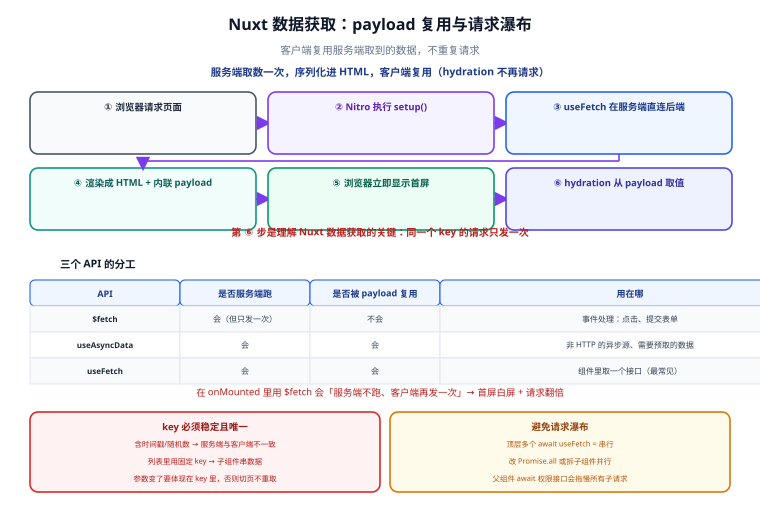

# 数据获取与状态

一句话定位：Nuxt 数据获取的全部难点可以浓缩成一个问题——**「这次请求发几次、在哪发」**。`useFetch` 与 `useAsyncData` 的存在就是为了让答案是 **「一次，在服务端发，客户端复用结果」**。理解不了缓存键（`key`），就会写出「首屏渲染后立刻又请求一遍」的代码。



## 一、三个 API 的分工

| API | 是什么 | 会不会在服务端跑 | 会不会被 payload 复用 | 用在哪 |
| --- | --- | --- | --- | --- |
| `$fetch` | 一个基于 `ofetch` 的 HTTP 客户端 | 会（但**只发一次，不复用**） | 不会 | 用户点击、表单提交等**事件处理**里 |
| `useAsyncData` | 包装任意异步逻辑 + 缓存/去重/SSR 传输 | 会 | **会** | 需要预取的数据；或用 SDK/ORM 而非 HTTP |
| `useFetch` | `useAsyncData` + `$fetch` 的语法糖 | 会 | **会** | 最常见的「组件里取一个接口」 |

::: tip 一句话记法
**「组件里准备好数据」用 `useFetch`；「事件处理里发请求」用 `$fetch`；「不是 HTTP 而是别的异步源」用 `useAsyncData`。**

在 `onMounted` 里用 `$fetch` 会**只在客户端执行**，导致服务端渲染时组件是空的、客户端再补一次请求——首屏白屏 + 请求翻倍。这是最高频的错误。
:::

```vue
<script setup lang="ts">
// ✅ 组件 setup 里：服务端预取，客户端复用
const { data: products, pending, error, refresh } =
  await useFetch('/api/products', { query: { page: 1 } })

// ✅ 事件处理里：只在客户端发（这里是用户点击触发的，本来也不该在服务端跑）
async function addToCart(id: number) {
  const res = await $fetch('/api/cart', { method: 'POST', body: { id } })
  if (res.ok) await refresh()
}
</script>
```

## 二、`key`：缓存与去重的唯一标识

`useAsyncData` / `useFetch` 内部维护一个以 `key` 为索引的映射：同一 key 在一次渲染中**只发一次请求**，且服务端的结果会通过 payload 传到客户端复用。

### key 的三条规则

1. **必须稳定**：同样的数据在服务端与客户端必须算出**同一个** key，否则 hydration 时会重新请求。
2. **必须唯一**：不同数据不能共用一个 key，否则会串数据。
3. **参数变化必须体现在 key 里**：否则切页时不会重新请求。

```typescript
// ❌ 自动 key 的陷阱：参数是对象字面量时，每次渲染都是新对象
//    官方会做序列化，但如果用到函数或非纯值，key 会不稳定
const { data } = await useFetch('/api/products', {
  query: { tags: [1, 2, 3] },   // 数组会参与 key，正常
})

// ✅ 显式声明 key：稳定、可读、可被 clear/refresh 精确引用
const route = useRoute()
const { data } = await useFetch(`/api/products/${route.params.id}`, {
  key: `product-${route.params.id}`,
})
```

::: danger 注意：三类「key 不稳定」的写法
1. **在 key 里放时间戳或随机数**：`key: 'p-' + Date.now()` → 服务端与客户端 key 不一致 → **必然重复请求，且可能出现 hydration mismatch 警告**。
2. **key 里放了未序列化的对象**：`key: { id }` 会被序列化，多数情况可用，但只要对象里含函数/`Symbol`/`undefined`，两次计算结果就可能不同。**key 只用字符串与基本类型的模板**。
3. **列表里用同一个固定 key**：`v-for` 里每个子组件都 `key: 'item'`，结果所有子组件共享第一份数据。**必须把 id 拼进 key**。

排查手段：在 `nuxt.config.ts` 里临时开启 devtools，或在网络面板看 hydration 后是否有同名请求重复出现。
:::

## 三、常用选项：控制「在哪跑、什么时候跑」

| 选项 | 默认 | 作用 |
| --- | --- | --- |
| `server` | `true` | 是否在服务端预取；设 `false` 则只在客户端跑 |
| `lazy` | `false` | 不阻塞路由导航（不 `await`），先渲染再看数据 |
| `immediate` | `true` | 是否立即执行；设 `false` 需手动 `execute()` |
| `watch` | `[]` | 响应式来源变化时自动重取（不要手动 `refresh`） |
| `transform` | — | 对返回数据做整形（避免在模板里到处 `.map`） |
| `getCachedData` | — | 自定义「什么情况下复用已有数据」（实现「返回列表页不重新加载」） |
| `default` | — | `data` 的初始值（避免模板里到处判空） |
| `dedupe` | `cancel` | 短时间内重复触发时的策略（`cancel` / `defer`） |

```typescript
// 典型组合：筛选条件变化自动重取 + 不阻塞导航 + 整形
const filters = reactive({ keyword: '', sort: 'new' })

const { data: list, pending } = await useFetch('/api/products', {
  key: `list-${JSON.stringify(filters)}`,
  query: filters,
  watch: [() => filters.keyword, () => filters.sort],   // 精确指定依赖，避免过度重取
  transform: (raw) => raw.items.map((i) => ({ ...i, priceLabel: `¥${(i.priceCents / 100).toFixed(2)}` })),
  default: () => [],
})
```

### 三个控制方法

```typescript
const { data, refresh, execute, clear } = await useAsyncData('k', fetcher, { immediate: false })

await execute()          // 首次执行（immediate: false 时用）
await refresh()          // 重新执行，保留旧数据直到新数据到达（不闪白）
clear()                  // 清空缓存与数据
```

::: tip `refresh()` 与 `clear()` + `execute()` 的区别
- `refresh()`：**保留**旧数据渲染，新数据到达后替换。用户视角「内容不闪」。
- `clear()` + `execute()`：先清空再取，中间有 `pending` 空档。适合「切换用户」这类**旧数据绝对不能残留**的场景。

用错的表现：切换用户时用 `refresh()`，会短暂显示上一个用户的数据（这在多租户系统里是数据泄漏级问题）。
:::

## 四、避免请求瀑布（waterfall）

```typescript
// ❌ 串行：三个接口依次等待，总耗时 = 三者之和
const { data: user } = await useFetch('/api/user')
const { data: cart } = await useFetch('/api/cart')
const { data: coupons } = await useFetch('/api/coupons')
```

三种正确写法：

```typescript
// ✅ 1. 并行：三个请求同时发出，总耗时 = 最慢的那个
const [{ data: user }, { data: cart }, { data: coupons }] = await Promise.all([
  useFetch('/api/user'),
  useFetch('/api/cart'),
  useFetch('/api/coupons'),
])

// ✅ 2. 组件拆分：每个子组件各自 useFetch，Nuxt 会并行处理同层组件
//    父组件不 await，子组件内部自己取数

// ✅ 3. 服务端聚合：在 server/api 里一次拿全（减少浏览器-服务端的往返次数）
//    server/api/dashboard.get.ts 里并行调多个上游，一次返回给前端
```

::: danger 注意：`await useFetch` 的位置决定是否形成瀑布
`await` 一旦写在顶层 setup 里，后面的代码就会等它完成。所以：

- **确实要先有数据才能渲染** → `await`（首页依赖用户信息决定布局）。
- **不依赖前一个结果的多个请求** → `Promise.all` 或 `lazy: true` + 子组件。

最隐蔽的瀑布是**「父组件 await 了一个只用于判断权限的接口，子组件的所有请求都排在它后面」**。排查方法：看服务端日志里请求的时间戳，如果三个接口的开始时间依次错开，就是瀑布。
:::

## 五、跨组件状态：`useState`

`ref` 在 SSR 下是**每个请求独立**的（不会串数据），但也**不会跨组件共享**。需要跨组件共享的状态用 `useState`：

```typescript
// composables/useCart.ts
export const useCart = () => {
  // key 必须是全局唯一的字符串；第一个参数是「状态的身份证」
  const items = useState<CartItem[]>('cart-items', () => [])
  const count = computed(() => items.value.reduce((s, i) => s + i.qty, 0))

  async function add(id: number) {
    await $fetch('/api/cart', { method: 'POST', body: { id } })
    items.value = await $fetch<CartItem[]>('/api/cart')
  }
  return { items, count, add }
}
```

| 方案 | 跨组件 | SSR 安全 | 持久化 | 适用 |
| --- | --- | --- | --- | --- |
| `ref` | 否 | 安全（每请求独立） | 否 | 组件内部状态 |
| `useState` | **是** | 安全（服务端会随 payload 传递） | 否 | 跨组件的共享状态 |
| Pinia | 是 | 安全（官方适配） | 需插件 | 中大型应用、需 devtools |
| `localStorage` | 是 | **不安全**（服务端没有该 API） | 是 | 只应通过 `onMounted` 或插件读写 |

::: warning 说明：`useState` 不能用来存「敏感信息」
`useState` 的内容会被序列化进 HTML 的 payload，**任何打开页面的人都能在源码里看到**。所以不要把 Token、用户隐私字段、内部 ID 放进 `useState`。服务端专用的密钥一律放 `runtimeConfig` 的私有段（见 [服务端能力](../ServerRoute/index.md)）。
:::

## 六、加载与错误的完整处理

```vue
<script setup lang="ts">
const { data, pending, error, status, refresh } = await useFetch('/api/products', {
  key: 'products',
  default: () => [],
})

// status 的取值：idle | pending | success | error
if (error.value) {
  // 服务端已渲染出错误态，用户不会看到白屏
  console.error('加载商品失败', error.value)
}
</script>

<template>
  <div v-if="pending" class="skeleton">加载中…</div>
  <div v-else-if="error" class="error">
    加载失败：{{ error.message }}
    <button @click="refresh()">重试</button>
  </div>
  <ul v-else>
    <li v-for="p in data" :key="p.id">{{ p.name }}</li>
  </ul>
</template>
```

::: danger 注意：SSR 下的错误必须在服务端就被处理
`error` 在服务端渲染时就已经有值了。如果不处理（比如只写了 `v-if="pending"` 与列表），服务端会渲染出**空列表**，客户端 hydration 后又是空列表——用户看到的是「页面正常但没有内容」，比报错更难排查。

三条实践：
1. 每个 `useFetch` 都处理 `error`（至少给用户一个重试入口）；
2. 需要让 HTTP 状态码也变成错误（利于 SEO 与监控）用 `createError`；
3. **不要在模板里直接 `data.value.xxx`**：用 `default` 给初始值，否则服务端渲染时可能命中 `undefined`。
:::

## 七、常见问题与排错

| 现象 | 高概率原因 | 定位手段 |
| --- | --- | --- |
| 同一接口请求了两次 | key 不稳定（含时间戳/随机数），或用了 `$fetch` + `onMounted` | 网络面板看两次请求的发起时机；对比服务端与客户端的 key |
| 首屏无数据、加载后才有 | 数据请求写在 `onMounted` 里 | 改成 `useFetch` / `useAsyncData` |
| 切换详情页数据不更新 | key 固定不含参数 | 把路由参数拼进 key |
| hydration mismatch 警告 | 服务端与客户端渲染结果不一致（用了 `Date.now()`、随机数、客户端专属 API） | 把这类值放进 `onMounted` 或 `<ClientOnly>` |
| 列表页返回后重新加载 | 组件被卸载，缓存失效 | 用 `getCachedData` 复用，或把数据提升到 `useState` |
| 请求串行、页面很慢 | 顶层多个 `await useFetch` | 改 `Promise.all` 或拆子组件 |
| 密钥出现在浏览器源码里 | 用了 `runtimeConfig.public` 存私有值 | 私有值必须放非 public 段 |

### 用 `getCachedData` 实现「返回不重载」

```typescript
const nuxtApp = useNuxtApp()
const { data } = await useFetch('/api/products', {
  key: 'products',
  getCachedData: (key) => nuxtApp.payload.data[key] ?? nuxtApp.static.data[key],
})
```

::: tip 这个模式的价值
默认行为是「组件重新挂载就重新请求」。对「列表 → 详情 → 返回列表」这种高频路径，重新请求会让用户看到闪烁的骨架屏。`getCachedData` 让返回时**直接用缓存**，配合 `refreshNuxtData` 在数据真正变化时手动失效。

代价是**新鲜度**：缓存的数据可能已过期。所以这个策略只适合「容忍短暂陈旧」的列表，不适合余额、库存这类强实时数据。
:::

## 八、验证方式

```shell
# 1. 确认数据在服务端就被取到（HTML 里应有内容，而不是空壳）
curl -s http://127.0.0.1:3000/products | grep -o 'class="product-card"' | wc -l
# 期望：> 0（SPA 模式下这里会是 0）

# 2. 确认 payload 内联（客户端复用而非再请求）
curl -s http://127.0.0.1:3000/products | grep -c '__NUXT__'
# 期望：>= 1

# 3. 确认没有重复请求：看服务端访问日志里 /api/products 的次数
#    打开一个页面 → 期望恰好 1 次（hydration 后又出现 1 次即为 key 不稳定）
```

```typescript
// 4. 在开发期打印 key，直观确认稳定性（仅在开发环境保留）
if (import.meta.dev) {
  const { data } = await useAsyncData('debug-key', fetcher, {
    // 观察两次渲染的 key 是否一致
    getCachedData: (k) => { console.log('[cache]', k); return undefined },
  })
}
```

## 参考资料

- [Nuxt 官方：数据获取（`useFetch` / `useAsyncData`）](https://nuxt.com/docs/getting-started/data-fetching)
- [Nuxt 官方：`useAsyncData` API 参考](https://nuxt.com/docs/api/composables/use-async-data)
- [Nuxt 官方：`useState`](https://nuxt.com/docs/api/composables/use-state)
- [Nuxt 官方：`refreshNuxtData` 与缓存失效](https://nuxt.com/docs/api/utils/refresh-nuxt-data)
- [ofetch 官方文档（`$fetch` 的底层实现）](https://github.com/unjs/ofetch)

## 相关页面

- [渲染模式与架构](../Overview/index.md) —— payload 与 SSR 的整体机制
- [服务端能力：Server Routes 与中间件](../ServerRoute/index.md) —— 数据从哪来（`server/api`）
- [部署与实战](../Deployment/index.md) —— 缓存在部署层的配置
- [Vue 框架](../../Vue/index.md) —— 组合式 API 与 `ref` / `computed` 的基础
