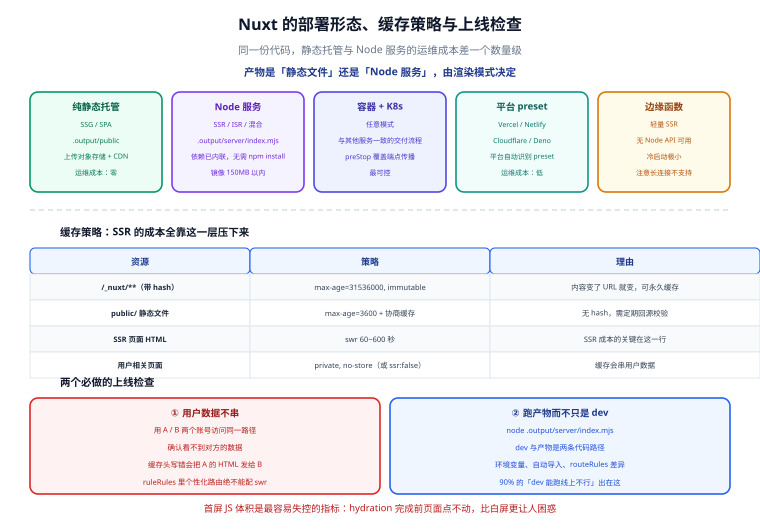

# 部署与实战

一句话定位：Nuxt 的部署比传统前端多一层决策——**产物是「静态文件」还是「Node 服务」**。这个决策由渲染模式决定，而且它决定了你要不要运维一个进程、要不要配 CDN 回源、缓存该怎么做。选错的话，SSR 的收益会被缓存配错吃光。



## 一、部署形态矩阵

| 形态 | 适用渲染模式 | 产物 | 运维成本 | 典型平台 |
| --- | --- | --- | --- | --- |
| **纯静态托管** | SSG / SPA | `.output/public/` | **零** | 对象存储 + CDN、GitHub Pages、静态托管 |
| **Node 服务** | SSR / ISR / 混合 | `.output/server/index.mjs` | 中（1 个进程） | 自建 Docker、PM2、systemd |
| **容器 + K8s** | SSR / 混合 | 镜像 | 高（但最可控） | 自建集群、云容器服务 |
| **平台 preset** | 任意 | 平台专用产物 | 低 | Vercel / Netlify / Cloudflare / Deno Deploy |
| **边缘函数** | SSR（轻量） | 边缘 bundle | 低 | Cloudflare Workers 等 |

::: tip 决策顺序
1. **所有页面都能预渲染吗？** 能 → 纯静态（成本最低、性能最好、**没有服务端可挂**）。
2. **有没有「每个请求都不同」的页面？** 有 → 需要 Node 服务（或平台 preset）。
3. **团队已经在用 K8s 吗？** 是 → 容器化（与其他服务一致的交付流程，最省沟通成本）。

**不要为了「SSR 更现代」而选 SSR**。一个内容型站点用 SSG 部署到对象存储，成本为零、首屏最快、没有进程要重启——这比部署一个 Node 服务好得多。
:::

## 二、构建产物与 preset

```shell
npx nuxi build
```

```text [产物结构]
.output/
├─ public/                 # 客户端资源：HTML、JS、CSS、图片（可直接丢 CDN）
│  ├─ index.html
│  ├─ _nuxt/               # 带 hash 的资源（可长缓存）
│  └─ ...
├─ server/
│  ├─ index.mjs            # 服务端入口（依赖已内联，无需 node_modules）
│  └─ chunks/              # 服务端分块
└─ nitro.json              # 构建元信息
```

```typescript [nuxt.config.ts]
export default defineNuxtConfig({
  nitro: {
    preset: 'node-server',       // 默认；其余见下表
    // 压缩：服务端产物 gzip（部分平台自带压缩可关闭）
    compressPublicAssets: { gzip: true, brotli: true },
  },
  // 构建期预渲染：把指定路由生成静态 HTML
  routeRules: {
    '/': { prerender: true },
    '/docs/**': { prerender: true },
    '/account/**': { ssr: false },
  },
})
```

| preset | 产物形态 | 说明 |
| --- | --- | --- |
| `node-server` | `.output/server/index.mjs` | 默认，`node .output/server/index.mjs` 即可跑 |
| `node-cluster` | 同上的多进程版本 | 多核单容器场景 |
| `static` | 纯静态 | 等价于 `nuxi generate` |
| `vercel` / `netlify` / `cloudflare-pages` | 平台专用 | 由平台自动识别，通常无需手写 |
| `cloudflare_module` / `deno-deploy` | 边缘运行时 | 需注意边缘环境无 Node API |

::: danger 注意：`static` preset 下 SSR 会静默降级
用 `nuxi generate`（或 `preset: 'static'`）时，**所有需要 SSR 的路由会在构建期被渲染一次**，运行时不再有服务端。如果某个页面依赖请求时的用户身份，构建期渲染出来的会是「未登录」版本，而且**这个版本会被所有用户看到**。

判断方法：`nuxi generate` 后检查输出，如果日志里出现 `Prerendering` 了本该动态的路由，就要用 `routeRules` 显式排除。**凡是含用户数据的路由，必须配 `ssr: false` 或留在 `node-server` 模式下。**
:::

## 三、多阶段 Dockerfile

```dockerfile [Dockerfile]
# ---------- 依赖层 ----------
FROM node:22-alpine AS deps
WORKDIR /app
COPY package.json pnpm-lock.yaml ./
RUN corepack enable && pnpm install --frozen-lockfile

# ---------- 构建层 ----------
FROM node:22-alpine AS builder
WORKDIR /app
COPY --from=deps /app/node_modules ./node_modules
COPY . .
# 构建期需要的公开变量可以在这里注入；私有变量不要注入（会进产物）
ENV NUXT_PUBLIC_SITE_NAME="示例商城"
RUN corepack enable && pnpm build

# ---------- 运行层 ----------
FROM node:22-alpine AS runner
WORKDIR /app
ENV NODE_ENV=production \
    HOST=0.0.0.0 \
    PORT=3000 \
    NITRO_PORT=3000
RUN addgroup -g 10001 -S nodejs && adduser -u 10001 -S nuxt -G nodejs
# 只需要产物，不需要源码与 node_modules
COPY --from=builder --chown=nuxt:nodejs /app/.output ./.output
USER nuxt
EXPOSE 3000
HEALTHCHECK --interval=15s --timeout=3s --start-period=10s --retries=3 \
  CMD node -e "fetch('http://127.0.0.1:3000/').then(r=>process.exit(r.ok?0:1)).catch(()=>process.exit(1))"
CMD ["node", ".output/server/index.mjs"]
```

```text [.dockerignore]
node_modules
.nuxt
.output
.git
.env*
*.log
test
coverage
```

::: tip 为什么运行层不需要 `node_modules`
Nitro 在构建时**把服务端依赖全部内联**进 `.output/server/`。所以运行镜像里只有三样东西：`node` 运行时、`.output/`、启动命令。这带来两个实际好处：镜像通常 150 MB 以内；**没有 `npm install` 步骤，就没有「本地能跑线上报缺包」的经典问题**。
:::

## 四、环境变量：分清「构建期」与「运行时」

这是 Nuxt 部署最容易踩的坑。

| 变量类型 | 何时读取 | 改了要不要重新构建 | 例 |
| --- | --- | --- | --- |
| **`NUXT_PUBLIC_*`** | 构建期被内联进客户端产物 | **要** | 站点名、公开 API 地址 |
| **私有 `NUXT_*`** | **运行时**从环境变量读 | 不要 | 密钥、内部 API 地址 |
| `import.meta.env.VITE_*` | 构建期内联 | 要 | 尽量不用（Nuxt 场景下用 runtimeConfig） |

```shell
# 同一份镜像，三个环境用不同变量启动（无需重新构建）
docker run -e NUXT_API_KEY=sk-prod -e NUXT_API_BASE=https://api.prod.example.com shop-web:latest
docker run -e NUXT_API_KEY=sk-stage -e NUXT_API_BASE=https://api.stage.example.com shop-web:latest
```

::: danger 注意：`public` 段改了必须重新构建，这会让「一次构建多环境部署」失效
如果站点名这类展示文案放在 `public` 段，那么切环境必须重新构建镜像——CI 从「构建一次、部署三处」退化成「每个环境构建一次」，且**无法保证三个环境跑的是同一份代码**。

实践建议：**`public` 段只放真正与构建绑定的值**（如 CDN 域名、埋点 ID 若需编译期优化）；纯粹的环境差异（API 地址、开关）尽量放到服务端，由 `/api/config` 接口下发，或接受放在 `public` 但明确「不同环境使用不同镜像」。
:::

## 五、缓存策略：SSR 的成本全靠这一层压下来

| 资源 | 缓存位置 | 策略 | 理由 |
| --- | --- | --- | --- |
| `/_nuxt/**`（带 hash） | CDN + 浏览器 | `max-age=31536000, immutable` | 内容变了 URL 就变，可以永久缓存 |
| `public/` 静态文件 | CDN | `max-age=3600` + 协商缓存 | 无 hash，需定期回源校验 |
| **SSR 页面 HTML** | CDN 或 Nitro SWR | `swr` 按内容更新频率（60~600s） | **这是 SSR 成本的关键** |
| 用户相关页面 | **不缓存** | `private, no-store` | 缓存会串用户数据 |
| API 响应 | 应用层（Nitro storage） | 按业务容忍度 | 见 [服务端能力](../ServerRoute/index.md) |

```typescript [nuxt.config.ts]
export default defineNuxtConfig({
  routeRules: {
    '/_nuxt/**': { headers: { 'cache-control': 'public, max-age=31536000, immutable' } },
    '/': { swr: 60 },
    '/products/**': { swr: 300 },
    '/account/**': { ssr: false, headers: { 'cache-control': 'private, no-store' } },
  },
})
```

::: danger 注意：SSR 页面的缓存头写错会泄漏用户数据
最常见的严重事故：给**所有**页面统一配 `Cache-Control: public, max-age=300`，包括「我的订单」页面。于是：

1. 用户 A 打开「我的订单」，CDN 缓存了这份 HTML；
2. 用户 B 打开同一个 URL，CDN 直接把 A 的订单页面返回给 B。

规避方法有三条，**必须至少做到一条**：
- 用户相关路由统一 `ssr: false`（推荐，客户端取数，天然不会缓存服务端 HTML）；
- 或服务端设 `Cache-Control: private, no-store`，并在 CDN 上排除这些路径；
- 或按用户维度做缓存键（成本高，一般不划算）。

上线前必做的检查：**用 A 账号与 B 账号分别访问同一路径，确认看不到对方的数据**。
:::

## 六、实战：从零到可访问

```shell
# 1. 创建项目
npx nuxi@latest init shop-web && cd shop-web && pnpm install

# 2. 配置（nuxt.config.ts 里加 routeRules 与 runtimeConfig，见前几节）
# 3. 本地验证渲染模式确实是 SSR
pnpm dev
curl -s http://127.0.0.1:3000/ | grep -o '<h1[^>]*>[^<]*</h1>' | head -2
# 期望：能看到标题 HTML（若为空则说明实际是 SPA）

# 4. 生产构建
pnpm build
# 期望日志：✔ Client built / ✔ Server built / Σ Total size

# 5. 本地跑产物（不是 dev server，这一步必须做）
node .output/server/index.mjs
# 期望：Listening on http://[::]:3000

# 6. 验证产物与 dev 行为一致
curl -s http://127.0.0.1:3000/ | grep -c '__NUXT__'     # 期望 >= 1
curl -sI http://127.0.0.1:3000/products/1 | grep -i cache  # 期望看到 swr 相关头

# 7. 构建镜像
docker build -t shop-web:dev .

# 8. 跑容器并验证
docker run --rm -d --name shop-web -p 3000:3000 \
  -e NUXT_API_KEY=sk-dev -e NUXT_API_BASE=http://host.docker.internal:8080 shop-web:dev
sleep 3 && curl -s -o /dev/null -w '%{http_code}\n' http://127.0.0.1:3000/
# 期望：200

# 9. 确认密钥没进客户端产物（必做）
docker run --rm shop-web:dev sh -c \
  "grep -rl 'sk-dev\|NUXT_API_KEY' /app/.output/public/ | head" 
# 期望：无输出
```

::: tip 第 5 步「跑产物」不能省
`pnpm dev` 用的是开发服务器（Vite dev + 按需编译），与 `.output/server/index.mjs` 是**两条完全不同的代码路径**。很多问题只在产物里出现：

- 自动导入在产物里失效（`defineProps` 之类宏的边界情况）；
- 环境变量在产物里是构建期的值；
- `routeRules` 的预渲染/缓存行为只在产物里生效。

**「dev 能跑，产物跑不起来」的原因 90% 在环境变量与自动导入上。**
:::

## 七、可观测与错误页面

```vue [app/error.vue]
<script setup lang="ts">
import type { NuxtError } from '#app'

const props = defineProps<{ error: NuxtError }>()
const isNotFound = computed(() => props.error.statusCode === 404)
</script>

<template>
  <div class="error-page">
    <h1>{{ error.statusCode }}</h1>
    <p>{{ isNotFound ? '页面不存在' : '服务出错了，请稍后重试' }}</p>
    <!-- 只在开发环境显示详情，生产环境不外泄堆栈 -->
    <pre v-if="$config.public.env !== 'production'">{{ error.message }}</pre>
    <button @click="clearError({ redirect: '/' })">返回首页</button>
  </div>
</template>
```

```typescript [server/plugins/error-hook.ts]
export default defineNitroPlugin((nitro) => {
  nitro.hooks.hook('error', (error, { event }) => {
    // 结构化日志：把 trace_id 与路径带上，便于与前端日志对齐
    console.error(JSON.stringify({
      level: 'error',
      trace_id: event?.context?.traceId ?? '-',
      path: event?.path ?? '-',
      msg: error.message,
      stack: error.stack,
    }))
  })
})
```

```typescript [server/middleware/trace.ts]
export default defineEventHandler((event) => {
  const tid = getHeader(event, 'x-trace-id') || crypto.randomUUID().slice(0, 16)
  event.context.traceId = tid
  setHeader(event, 'x-trace-id', tid)
})
```

::: warning 说明：SSR 的错误要在两个地方记录
SSR 应用有两条错误路径，必须都覆盖：
1. **服务端渲染时抛错** → 被 `NuxtError` 捕获，走 `error.vue`；同时要进服务端日志（上面的 `error` hook）。
2. **客户端 hydration 后抛错** → 只在前端控制台可见，需要前端错误监控（`nuxt.config.ts` 里接 Sentry 等）。

只做第 1 条时，表现为「用户报错但服务端日志里什么都没有」——因为错误发生在浏览器里。
:::

## 八、上线前性能核对清单

| 检查项 | 期望 | 怎么测 |
| --- | --- | --- |
| 首屏 HTML 含实际内容 | 是（不是空壳 div） | `curl -s / \| grep -c '<h1'` |
| `/_nuxt/**` 有长缓存头 | `immutable` | `curl -sI /_nuxt/xxx.js` |
| 静态资源有 hash | 是 | 看 HTML 里的 `<script src>` |
| 图片使用现代格式 | WebP/AVIF | `<NuxtImg>` 或平台自动转换 |
| 客户端 JS 体积 | 首屏 JS < 200 KB（gzip） | `nuxi analyze` 或构建日志 |
| payload 体积 | 不随列表页数据无限增长 | 检查 HTML 里的 `__NUXT__` 大小 |
| SSR 响应时间 | p95 < 300 ms | 压测或 APM |
| 用户数据不串 | A/B 账号互不可见 | 双账号同一路径对比 |

::: danger 注意：首屏 JS 体积是 SSR 应用最容易失控的指标
SSR 让首屏「看起来快」，但如果 hydration 需要下载 1 MB JS，**页面在 hydration 完成前不可交互**（点了没反应），这比 SPA 的「白屏」更让人困惑——用户以为页面坏了。

三条控制手段：
1. **按路由分包**，避免把后台管理组件打进首页 bundle；
2. 重组件用 `<LazyXxx>` 或 `defineAsyncComponent` 延迟加载；
3. 定期跑 `nuxi analyze` 看包体构成，把「不小心全量引入的 UI 库」找出来。
:::

## 九、常见问题与排错

| 现象 | 高概率原因 | 定位手段 |
| --- | --- | --- |
| 容器启动即退出 | 缺 `HOST=0.0.0.0`，只监听了 `127.0.0.1` | 加 `ENV HOST=0.0.0.0`；看启动日志的监听地址 |
| 改了环境变量不生效 | 该变量是 `public` 段，构建期已内联 | 区分构建期/运行时变量（第四节） |
| 页面能开但点了没反应 | hydration 失败或 JS 太大还没加载完 | 看浏览器控制台的 hydration 警告；查首屏 JS 体积 |
| 部署到 CDN 后接口 404 | 静态托管没有 Node 服务，`/api` 不存在 | 改用 `node-server` 或把 API 部署到独立后端 |
| `nuxi generate` 后动态页变成静态内容 | 被预渲染了 | 用 `routeRules` 排除动态路由 |
| 多副本下缓存命中率低 | Nitro storage 用了 `memory` driver | 换成 Redis（见 [服务端能力](../ServerRoute/index.md)） |
| 内存随流量上涨 | storage 无上限 / payload 太大 | 给缓存设 TTL 与容量上限；检查 payload 体积 |

## 参考资料

- [Nuxt 官方：部署（各平台 preset）](https://nuxt.com/docs/getting-started/deployment)
- [Nuxt 官方：运行时配置与环境变量](https://nuxt.com/docs/guide/going-further/runtime-config)
- [Nitro 官方：部署与 preset 列表](https://nitro.build/deploy)
- [Nuxt 官方：错误处理](https://nuxt.com/docs/getting-started/error-handling)
- [Nuxt 官方：性能与 Core Web Vitals](https://nuxt.com/docs/guide/best-practices/performance)
- [web.dev：Core Web Vitals 指标定义](https://web.dev/articles/vitals)

## 相关页面

- [渲染模式与架构](../Overview/index.md) —— 部署形态由渲染模式决定
- [数据获取与状态](../DataFetching/index.md) —— payload 体积与首屏 JS 的关系
- [服务端能力：Server Routes 与中间件](../ServerRoute/index.md) —— 服务端缓存与配置注入
- [前端性能优化](../../../Others/PerformanceOptimization/index.md) —— 加载、构建、运行时优化的完整体系
- [前端安全](../../../Others/Security/index.md) —— 缓存与 Cookie 相关的安全边界
- [Docker](../../../../Ops/Docker/index.md) 与 [Kubernetes](../../../../Ops/Kubernetes/index.md) —— 容器化交付与编排
- [Nuxt 通用模板 · 部署与交付](../../../../../project/Base/NuxtTemplate/Deployment/index.md)：**分工是**——本页讲「Nuxt 项目怎么部署」，那一页讲「**产物形态会随 UI 组件库改变，但交付流程一个字都不改**」。后者关注的是「模板层面的封装是否完整」，而不是某个平台怎么配。
