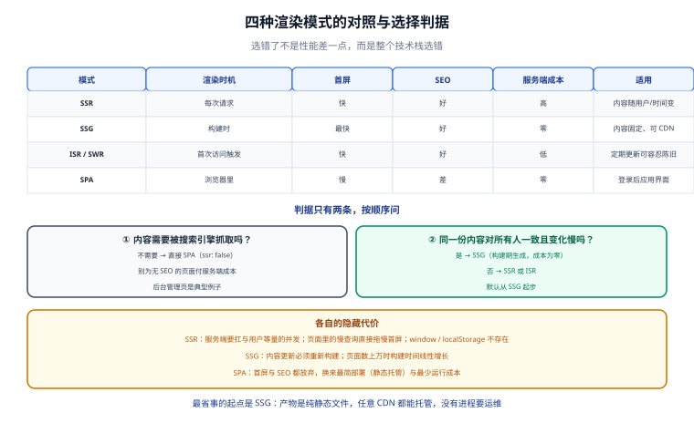

# 渲染模式与架构

一句话定位：Nuxt 最需要先想清楚的一件事是**「这个页面在哪里被渲染」**——在服务器上（SSR）、在构建时（SSG）、在用户浏览器里（SPA），还是三者混合。选错了不是性能差一点，而是**整个技术栈选错**（比如给纯后台管理页上 SSR，白付服务端成本）。



## 一、四种渲染模式

| 模式 | 渲染时机 | 首屏 | SEO | 服务端成本 | 适用 |
| --- | --- | --- | --- | --- | --- |
| **SSR**（服务端渲染） | 每次请求在服务端渲染 | 快（返回完整 HTML） | 好 | 高（每次请求都占 CPU） | 内容随用户/时间变化，且需要 SEO |
| **SSG / 预渲染** | 构建时渲染成静态 HTML | 最快（可直接 CDN） | 好 | **零** | 内容相对固定（博客、文档、营销页） |
| **ISR / SWR**（增量静态） | 首次访问触发，后台重新生成 | 快 | 好 | 低（按需重建） | 内容定期更新，且可容忍短暂陈旧 |
| **SPA**（客户端渲染） | 浏览器里渲染 | 慢（需等 JS） | 差 | 零 | 登录后的应用界面、无 SEO 需求 |

::: tip 判据只有两条，按顺序问
1. **这个页面的内容需要被搜索引擎抓取吗？** 不需要 → **SPA**（直接 `ssr: false`），别折腾。
2. **同一份内容对所有人是否一致、且变化频率低？** 是 → **SSG**（构建期生成，成本为零）；否 → **SSR** 或 **ISR**。

**默认用 SSG，只有确实需要「每个请求都不同」时才切到 SSR**。这是成本最低的起点：SSG 产物是纯静态文件，Any CDN 都能托管，没有服务端进程要运维。
:::

### 各自的隐藏代价

| 模式 | 容易被忽略的问题 |
| --- | --- |
| SSR | 服务端要能承受与用户等量的并发；页面里任何慢查询都会拖慢首屏；**不再有「浏览器专属 API」可用**（`window`、`localStorage` 在服务端不存在） |
| SSG | 内容更新必须重新构建；页面数量多时构建时间线性增长（1 万页可能几十分钟） |
| ISR | 需要服务端（或平台支持）来存缓存；「陈旧窗口」内的不一致要让业务能接受 |
| SPA | 首屏、SEO 都放弃；但换来的是最简单的部署（静态托管）与最少的运行成本 |

::: danger 注意：SSR 里访问 `window` / `localStorage` 会直接 500
服务端没有浏览器 API。正确做法有三种，按推荐顺序：

```vue
<script setup lang="ts">
// 1. 用 Nuxt 内置的可组合式（它们内部处理了环境差异）
const { isHydrating } = useNuxtApp()

// 2. 需要「只在客户端执行」的逻辑，用 onMounted 或 ClientOnly 组件
onMounted(() => { localStorage.setItem('k', 'v') })   // onMounted 不会在服务端执行
</script>

<template>
  <!-- 3. 组件级隔离：内容只在客户端渲染 -->
  <ClientOnly>
    <BrowserOnlyWidget />
    <template #fallback><div class="skeleton" /></template>
  </ClientOnly>
</template>
```

另外，`process.client` / `process.server` 在 Nuxt 3+ 里**已被移除**，改用 `import.meta.client` / `import.meta.server`，或 `if (import.meta.client) { ... }`。抄旧教程时最常见的报错就是 `process is not defined`。
:::

## 二、Nitro：服务端到底跑的是什么

Nuxt 的服务端不是「一个 Node 服务器」，而是 **Nitro**——一个构建期就把服务端代码打包好的**跨运行时引擎**。

| 特性 | 说明 |
| --- | --- |
| **产物形态** | 一个 `.output/server/index.mjs` + `.output/public/`，不依赖 `node_modules` |
| **跨运行时** | 通过 preset 适配 Node / Deno / Bun / Cloudflare Workers / Vercel / 静态 |
| **自动导入** | `server/utils`、`server/api` 下的内容自动可用，无需 import |
| **存储抽象** | `useStorage()` 统一 KV 接口（本地文件 / Redis / 云 KV） |
| **任务** | Nitro Tasks（构建期或定时任务），替代「额外起一个 cron 服务」 |

::: tip 产物形态带来的好处
因为 Nitro 把服务端依赖**全部内联打进 `index.mjs`**，所以部署时：

```shell
# 只需要三样东西，不需要 npm install
.output/
├─ server/index.mjs
└─ public/
Dockerfile + node
```

镜像可以做到 100~200 MB（用 `node:*-slim` 基础镜像），启动时间通常 < 1 秒。这是 Nuxt 在容器环境里比「传统 Node 应用 + `npm ci`」轻量的根本原因。
:::

## 三、项目结构（Nuxt 4 的 `app/` 布局）

```text [目录结构]
my-nuxt/
├─ app/                        # 前端代码（Nuxt 4 起集中在 app/ 下）
│  ├─ app.vue                  # 根组件
│  ├─ pages/                   # 文件路由：pages/index.vue → /
│  │  ├─ index.vue
│  │  ├─ products/
│  │  │  ├─ index.vue          # /products
│  │  │  └─ [id].vue           # /products/:id
│  │  └─ [...slug].vue         # 通配路由
│  ├─ components/              # 自动导入的组件
│  │  └─ ProductCard.vue
│  ├─ composables/             # 自动导入的组合式函数
│  │  └─ useCart.ts
│  ├─ layouts/                 # 布局
│  │  └─ default.vue
│  ├─ middleware/              # 路由中间件（可在客户端/服务端跑）
│  │  └─ auth.ts
│  └─ assets/                  # 需被构建处理的静态资源（CSS/图片）
├─ server/                     # 服务端代码（不参与客户端打包）
│  ├─ api/                     # /api/** 接口，文件名即路径
│  │  └─ products.get.ts       # GET /api/products
│  ├─ middleware/              # 服务端中间件（每个请求都跑）
│  │  └─ trace.ts
│  └─ utils/                   # 服务端工具（自动导入）
├─ public/                     # 原样拷贝的静态资源（robots.txt 等）
├─ shared/                     # 前后端共享的类型与工具（Nuxt 4 新增）
├─ nuxt.config.ts
└─ package.json
```

::: warning 说明：`app/assets` 与 `public/` 的区别
- `app/assets/` 里的文件**会被构建管线处理**（Vite 处理、加 hash、可优化），用 `~/assets/x.png` 引用。
- `public/` 里的文件**原样拷贝**到产物根目录，用 `/x.png` 引用，**不会加 hash**。

需要缓存失效（改内容就换 URL）的放 `assets/`；必须固定路径的（`robots.txt`、`favicon.ico`、第三方回调验证文件）放 `public/`。
:::

## 四、一次 SSR 请求的完整路径

```text [SSR 时序]
浏览器 ──GET /products/42──▶ Nitro 服务端
                              │
                              ├─ 1. server/middleware 依次执行（trace、鉴权、日志）
                              ├─ 2. 路由匹配到 app/pages/products/[id].vue
                              ├─ 3. 执行 setup()：useAsyncData 触发数据请求
                              │     └─ 数据请求在服务端直连后端（不复经浏览器）
                              ├─ 4. 渲染成 HTML 字符串
                              └─ 5. HTML 里内联 __NUXT__ 状态（payload）
                              │
浏览器 ◀── 完整 HTML + payload ──┘
   │
   ├─ 6. 立即显示 HTML（首屏可见，无需等 JS）
   └─ 7. 加载 JS → hydration：复用 payload，**不重复请求数据**
```

**第 7 步是理解 Nuxt 数据获取的关键**：`useAsyncData` / `useFetch` 会把服务端拿到的数据序列化进 HTML 的 payload，客户端 hydration 时直接从 payload 取，所以「同一个 key 的请求只发一次」。而裸用 `onMounted` + `$fetch` 会**在服务端不执行、在客户端又发一次**，结果就是「首屏空白 + 重复请求」。

## 五、混合渲染：用 `routeRules` 按路由配置

不需要全站统一用一种模式。`nuxt.config.ts` 里可以逐条路由配置，这是 Nuxt 相比「选一个模式」最实用的能力：

```typescript [nuxt.config.ts]
export default defineNuxtConfig({
  routeRules: {
    // 首页：增量静态，60 秒内可容忍陈旧（销量、公告类内容）
    '/': { swr: 60 },

    // 商品列表与详情：增量静态，300 秒
    '/products/**': { swr: 300 },

    // 用户中心：仅客户端渲染（登录后内容，无需 SEO，且个性化）
    '/account/**': { ssr: false },

    // 营销页：构建期预渲染，零服务端成本
    '/promo/**': { prerender: true },

    // API 代理：把跨域请求收拢到同源，避免 CORS
    '/api/legacy/**': { proxy: 'https://legacy.example.com/api/**' },

    // 重定向
    '/old-path': { redirect: { to: '/new-path', statusCode: 301 } },

    // 给静态资源加长缓存头
    '/_nuxt/**': { headers: { 'cache-control': 'public, max-age=31536000, immutable' } },
  },
})
```

| 指令 | 语义 | 典型用途 |
| --- | --- | --- |
| `prerender: true` | 构建时生成静态 HTML | 营销页、文档 |
| `swr: N` | 缓存 N 秒，过期后首次访问触发后台重建 | 商品列表 |
| `isr: N` | 同 `swr`，在支持的平台上走平台原生 ISR | 平台托管场景 |
| `ssr: false` | 该路由只在客户端渲染 | 用户中心、后台 |
| `proxy` | 反向代理到另一个地址 | 渐进迁移、避免 CORS |
| `redirect` | 服务端重定向 | 旧链接兼容 |
| `headers` | 自定义响应头 | 缓存控制、安全头 |

::: danger 注意：`ssr: false` 是**每个路由**配置，不是全局开关
全局 `ssr: false` 会让整个应用退化成 SPA。如果只想让「登录后的页面」不走 SSR，用 `routeRules` 精确指定（如上例）。另一个常见混淆是：`ssr: false` 与 `<ClientOnly>` **不是同一件事**——前者让该路由完全不走服务端渲染，后者只是隔离某个组件。

还有一点：**`swr` 的缓存是「按 URL」的**，不含用户身份。所以任何跟用户相关的页面**绝不能**配 `swr`，否则 A 用户会看到 B 用户缓存的 HTML。个性化页面的正确配置是 `ssr: false`，或在服务端明确按用户维度做缓存（并接受成本）。
:::

## 六、与 Next.js 的对照

| 维度 | Nuxt 4 | Next.js（App Router） |
| --- | --- | --- |
| 底层视图 | Vue 3（组合式 API） | React（Server Components） |
| 服务端引擎 | Nitro（跨运行时 preset） | Next 自带 Node/Edge runtime |
| 服务端组件模型 | 无 RSC；用 `server/` 目录写接口 + 客户端组件 | **React Server Components 是一等公民** |
| 数据获取 | `useFetch` / `useAsyncData`（显式 key 与缓存） | `fetch` 扩展 + `cache` 选项（隐式） |
| 路由 | 文件路由（`pages/`，Nuxt 4 在 `app/` 下） | 文件路由（`app/`） |
| 状态传递 | payload 自动内联（`useAsyncData` 负责） | RSC 序列化流 |
| 混合渲染 | `routeRules` 按路由 | `export const dynamic` / `revalidate` 按路由 |
| 学习曲线 | 相对平缓（延续 Vue 心智） | 陡（RSC 与客户端边界的取舍是新概念） |

::: tip 两者最大的心智差异
**Next 的 RSC 把「服务端/客户端」的边界做进了组件粒度**，你需要判断每个组件在哪跑；**Nuxt 把边界做在目录粒度**（`server/` 是服务端，`app/` 是前端）。后者更好理解，前者在「减少客户端 JS」上能做到更细。

选型上：**团队是 Vue 技术栈 → Nuxt；是 React 技术栈 → Next**。架构差异不足以让人跨栈迁移。
:::

## 七、验证方式

```shell
# 1. 开发模式：确认页面是 SSR（源码里能看到渲染后的 HTML）
npx nuxi dev
curl -s http://127.0.0.1:3000/ | grep -o '<h1[^>]*>[^<]*</h1>' | head -3
# 期望：能直接 grep 到页面标题的 HTML（SPA 模式下这里会是空）

# 2. 确认 routeRules 生效（看响应头）
curl -sI http://127.0.0.1:3000/products/1 | grep -i -E 'cache|age|x-nitro'
# 期望：swr 路由出现缓存相关头

# 3. 确认数据在服务端预取（payload 已内联）
curl -s http://127.0.0.1:3000/products/1 | grep -o '__NUXT__' | head -1
# 期望：输出 __NUXT__，说明 payload 已内联

# 4. 浏览器打开 Network，确认无重复请求
# 期望：商品数据在文档请求里就带回来了（不是 hydration 后再发一次）

# 5. 生产构建与本地预览
npx nuxi build && node .output/server/index.mjs
# 期望：Listening on http://localhost:3000
```

## 参考资料

- [Nuxt 官方文档：渲染模式](https://nuxt.com/docs/guide/concepts/rendering)
- [Nuxt 官方文档：routeRules](https://nuxt.com/docs/guide/concepts/rendering#hybrid-rendering)
- [Nuxt 官方文档：目录结构](https://nuxt.com/docs/guide/directory-structure/app)
- [Nitro 官方文档](https://nitro.build/guide)
- [Nuxt 3 → 4 升级指南](https://nuxt.com/docs/getting-started/upgrade)
- [Next.js App Router 文档（对照）](https://nextjs.org/docs/app)

## 相关页面

- [数据获取与状态](../DataFetching/index.md) —— payload 与缓存键的机制展开
- [服务端能力：Server Routes 与中间件](../ServerRoute/index.md) —— `server/` 目录怎么写
- [部署与实战](../Deployment/index.md) —— 四种模式各自的部署形态
- [Next 框架](../../Next/index.md) —— React 侧的同层方案
- [Vue 框架](../../Vue/index.md) —— 组件与响应式基础
- [前端性能优化](../../../Others/PerformanceOptimization/index.md) —— SSR 在性能优化体系里的位置
