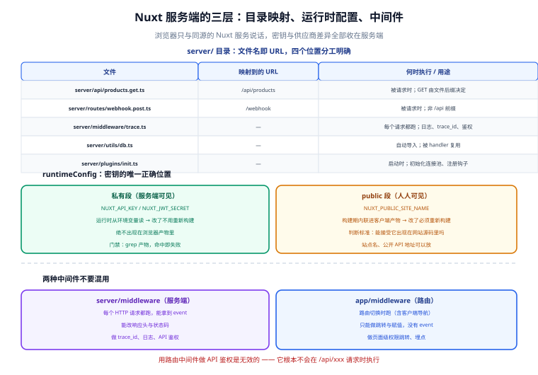

# 服务端能力：Server Routes 与中间件

一句话定位：Nuxt 的 `server/` 目录让你**在同一个仓库、同一个部署单元里写后端**。它的价值不是「省一个后端项目」，而是**把 BFF（Backend for Frontend）这一层做进框架**：浏览器只和同源的 Nuxt 服务说话，跨域、密钥、供应商差异全部收在服务端。



## 一、`server/` 目录的四个位置

| 路径 | 映射到的 URL | 何时执行 | 用途 |
| --- | --- | --- | --- |
| `server/api/**` | `/api/**` | 被请求时 | 业务接口 |
| `server/routes/**` | `/**` | 被请求时 | 非 `/api` 前缀的接口（webhook、回调、`robots.txt` 动态生成） |
| `server/middleware/**` | — | **每个请求**都跑 | 日志、trace_id、鉴权、CORS |
| `server/utils/**` | — | 自动导入 | 工具函数（`server/utils/` 下的内容在 `server/` 内自动可用） |
| `server/plugins/**` | — | 启动时 | 初始化连接池、注册钩子 |

```text [URL 映射规则]
server/api/products.get.ts      → GET  /api/products
server/api/products.post.ts     → POST /api/products
server/api/products.ts          → 任意 /api/products
server/api/products/index.get.ts → GET /api/products
server/api/products/[id].get.ts  → GET  /api/products/:id   （参数用 getRouterParam 取）
server/api/[...].ts              → 通配 /api/任意路径
server/routes/webhook.post.ts    → POST /webhook
```

## 二、事件处理器（event handler）

```typescript [server/api/products/[id].get.ts]
import { z } from 'zod'

const QuerySchema = z.object({
  withStock: z.coerce.boolean().default(false),   // coerce：把字符串 "false" 转成 boolean
})

export default defineEventHandler(async (event) => {
  // 1. 取参数：路径参数 / 查询串 / 请求体 各有专用 API
  const id = getRouterParam(event, 'id')
  const query = await getValidatedQuery(event, QuerySchema.parse)

  // 2. 校验：非法参数直接抛 400，不要让它进到下游
  const parsed = z.coerce.number().int().positive().safeParse(id)
  if (!parsed.success) {
    throw createError({ statusCode: 400, statusMessage: 'id 必须是正整数' })
  }

  // 3. 读私有配置（见第三节）
  const { apiBase, apiKey } = useRuntimeConfig(event)

  // 4. 调上游：服务端直连，密钥不经过浏览器
  const upstream = await $fetch<{ id: number; name: string; stock: number }>(
    `${apiBase}/products/${parsed.data}`,
    { headers: { 'x-api-key': apiKey }, timeout: 3000 },
  )

  // 5. 只返回需要给浏览器的字段（上游多余字段不外泄）
  return {
    id: upstream.id,
    name: upstream.name,
    stock: query.withStock ? upstream.stock : undefined,
  }
})
```

| 常用工具 | 作用 |
| --- | --- |
| `getQuery(event)` / `getValidatedQuery(event, fn)` | 查询参数（后者带校验） |
| `readBody(event)` / `readValidatedBody(event, fn)` | 请求体 |
| `getRouterParam(event, 'id')` | 路径参数 |
| `getHeader(event, 'x-trace-id')` / `getRequestHeaders(event)` | 请求头 |
| `setResponseStatus(event, 201)` | 设置状态码 |
| `setHeader(event, 'cache-control', '...')` | 设置响应头 |
| `setCookie(event, 'k', 'v', {...})` / `getCookie` | Cookie 读写 |
| `getRequestIP(event, { xForwardedFor: true })` | 客户端 IP（**必须显式允许读 XFF**） |
| `defineEventHandler` / `defineLazyEventHandler` | 处理器定义 |

::: tip `readValidatedBody` 应该成为默认写法
```typescript
const body = await readValidatedBody(event, (b) => {
  const r = OrderSchema.safeParse(b)
  if (!r.success) {
    throw createError({ statusCode: 422, statusMessage: '参数校验失败', data: r.error.flatten() })
  }
  return r.data
})
```
好处是**校验失败返回的是 422 而不是 500**，并且错误结构与前端约定一致。裸露地 `readBody` 再手动 `if (!body.xxx)` 的写法，最终一定会漏掉某个字段。
:::

### 流式与 SSE

```typescript [server/api/stream.get.ts]
export default defineEventHandler(async (event) => {
  setHeader(event, 'content-type', 'text/event-stream')
  setHeader(event, 'cache-control', 'no-cache')
  setHeader(event, 'connection', 'keep-alive')

  const stream = new ReadableStream({
    async start(controller) {
      const enc = new TextEncoder()
      for (let i = 0; i < 5; i++) {
        controller.enqueue(enc.encode(`data: ${JSON.stringify({ i })}\n\n`))
        await new Promise((r) => setTimeout(r, 500))
      }
      controller.close()
    },
  })
  return stream
})
```

::: danger 注意：SSE 在开发环境会被缓冲
`nuxi dev` 与部分反向代理（Nginx 默认配置）会缓冲响应，导致「前端等了 10 秒后一次性收到全部事件」。本地验证时如果看不到「逐条到达」，先怀疑缓冲而不是代码：

- Nginx 侧加 `proxy_buffering off;` 与 `X-Accel-Buffering: no` 响应头；
- 某些托管平台（Serverless）不支持长连接流式，这类场景应换成轮询或 WebSocket。
:::

## 三、`runtimeConfig`：密钥的唯一正确位置

```typescript [nuxt.config.ts]
export default defineNuxtConfig({
  runtimeConfig: {
    // ---- 私有段：只在服务端可见，绝不出现在浏览器产物里 ----
    apiBase: 'https://internal-api.example.com',   // 可被 NUXT_API_BASE 覆盖
    apiKey: '',                                     // 部署时注入 NUXT_API_KEY
    jwtSecret: '',

    // ---- public 段：会被打进客户端产物，任何人可见 ----
    public: {
      siteName: '示例商城',
      apiTimeout: 5000,
    },
  },
})
```

```shell
# 环境变量映射规则：NUXT_ + 大驼峰转下划线
NUXT_API_BASE=https://api.prod.example.com
NUXT_API_KEY=sk-live-xxxxx
NUXT_PUBLIC_SITE_NAME=生产商城
```

::: danger 注意：三条关于密钥的红线
1. **任何放进 `public` 的值都会出现在客户端 JS 里**。判断标准只有一个：**你能接受它出现在网站源码里吗**。密钥、内部域名、数据库连接串一律放私有段。
2. **不要在客户端代码里 `import` 服务端的 `server/utils`**。构建时可能不报错，但会把服务端依赖打进浏览器包（既增大体积，也可能泄漏实现）。客户端的工具放 `app/utils` 或 `app/composables`。
3. **不要在 `app/` 里直接读 `process.env`**。构建时会做替换，**替换成构建时的值**——运行时改环境变量不生效。要用运行时值必须走 `useRuntimeConfig()`（客户端侧只能读 `public` 段）。
:::

### 在服务端中间件里用配置

```typescript [server/middleware/auth.ts]
export default defineEventHandler(async (event) => {
  // 只保护 /api 下的写操作
  if (!event.path.startsWith('/api') || event.method === 'GET') return

  const { jwtSecret } = useRuntimeConfig(event)
  const token = getHeader(event, 'authorization')?.replace(/^Bearer\s+/i, '')
  if (!token) {
    throw createError({ statusCode: 401, statusMessage: '未登录' })
  }
  try {
    event.context.user = await verifyJwt(token, jwtSecret)
  } catch {
    throw createError({ statusCode: 401, statusMessage: 'Token 无效或已过期' })
  }
})
```

`event.context` 是**单次请求的上下文对象**（不跨请求共享），适合挂载「本次请求解析出的用户」「trace_id」。

## 四、服务端中间件 vs 路由中间件

两者名字像、机制完全不同，混用会写出「为什么不执行」的问题。

| 维度 | 服务端中间件 `server/middleware/` | 路由中间件 `app/middleware/` |
| --- | --- | --- |
| 运行环境 | **只在服务端** | 默认同构（服务端 + 客户端都跑） |
| 触发时机 | 每个 HTTP 请求（含 `/api`、静态资源） | 路由切换时（含客户端内部导航） |
| 能否访问 `event` | 能 | 不能（拿到的是 `to` / `from` 路由对象） |
| 能否改响应 | 能（设头、设状态码、直接返回） | 只能做跳转与赋值 |
| 典型用途 | trace_id、日志、鉴权、CORS | 页面级权限跳转、埋点 |
| 注册方式 | 文件即注册 | 文件 + 在页面/全局 `definePageMeta` 引用 |

::: tip 分工原则
- **「请求」层面的横切** → 服务端中间件（每个 API 都要带 trace_id）。
- **「页面」层面的横切** → 路由中间件（未登录访问 `/account` 跳登录页）。

最典型的错误是**用路由中间件做 API 鉴权**——它根本不会在 `/api/xxx` 请求时执行（除非是客户端导航到该路由）。API 鉴权必须在服务端中间件或每个 handler 里做。
:::

```typescript [app/middleware/auth.ts]
export default defineNuxtRouteMiddleware((to) => {
  // 注意：这里在服务端与客户端都会执行，判断要同构
  const { loggedIn } = useAuth()
  if (!loggedIn.value && to.path.startsWith('/account')) {
    return navigateTo(`/login?redirect=${encodeURIComponent(to.fullPath)}`)
  }
})
```

## 五、Cookie、表单与文件上传

```typescript [server/api/login.post.ts]
export default defineEventHandler(async (event) => {
  const { email, password } = await readValidatedBody(event, LoginSchema.parse)
  const user = await verifyCredentials(email, password)
  if (!user) throw createError({ statusCode: 401, statusMessage: '邮箱或密码错误' })

  const token = await signJwt({ sub: user.id }, useRuntimeConfig(event).jwtSecret)

  // httpOnly：JS 读不到，防 XSS 窃取
  setCookie(event, 'session', token, {
    httpOnly: true,
    secure: true,          // 生产必须 true（HTTPS）
    sameSite: 'lax',       // 'strict' 更安全但会影响外部链接跳转携带 Cookie
    path: '/',
    maxAge: 60 * 60 * 24 * 7,
  })
  return { ok: true, user: { id: user.id, name: user.name } }
})
```

```typescript [server/api/upload.post.ts]
export default defineEventHandler(async (event) => {
  const form = await readMultipartFormData(event)
  if (!form?.length) throw createError({ statusCode: 400, statusMessage: '没有文件' })

  const file = form.find((f) => f.name === 'file')
  if (!file) throw createError({ statusCode: 400, statusMessage: '缺少 file 字段' })

  const ALLOWED = ['image/png', 'image/jpeg', 'image/webp']
  const MAX = 5 * 1024 * 1024
  // 服务端必须自己校验类型与大小——浏览器端的校验只是体验优化
  if (!ALLOWED.includes(file.type ?? '')) {
    throw createError({ statusCode: 415, statusMessage: '仅支持 png/jpeg/webp' })
  }
  if (file.data.length > MAX) {
    throw createError({ statusCode: 413, statusMessage: '文件超过 5MB' })
  }
  await saveToStorage(file.data, file.filename)
  return { ok: true }
})
```

::: danger 注意：两个安全细节
1. **`readMultipartFormData` 会把整个文件读进内存**。默认情况下大文件会导致 Node 进程内存暴涨。生产环境应设置平台级/代理级的请求体大小限制（Nginx `client_max_body_size`），大文件走「前端直传对象存储（预签名 URL）」而不是经过 Nuxt 服务。
2. **`file.type` 来自客户端的 Content-Type，不可信**。要真正校验类型需读文件头魔数（PNG 是 `89 50 4E 47`）。至少要把上传后的文件放到**不可执行、独立域名**的对象存储里，避免上传一个 `.html` 后被当页面执行（存储型 XSS）。

`secure: true` 的 Cookie 在本地 HTTP 环境下浏览器不会保存——开发时用 `secure: process.env.NODE_ENV === 'production'`，但**生产环境绝不允许降级成 `false`**。
:::

## 六、Nitro Storage：统一的 KV 抽象

```typescript [server/api/cache-demo.get.ts]
export default defineEventHandler(async (event) => {
  const storage = useStorage('cache')
  const key = `products:${getQuery(event).page ?? 1}`

  const hit = await storage.getItem<{ at: number; items: unknown[] }>(key)
  if (hit && Date.now() - hit.at < 60_000) {
    setHeader(event, 'x-cache', 'HIT')
    return hit.items
  }

  const items = await $fetch('/internal/products')
  await storage.setItem(key, { at: Date.now(), items })
  setHeader(event, 'x-cache', 'MISS')
  return items
})
```

```typescript [nuxt.config.ts]
export default defineNuxtConfig({
  nitro: {
    storage: {
      cache: {
        driver: process.env.REDIS_URL ? 'redis' : 'memory',
        url: process.env.REDIS_URL,
      },
    },
  },
})
```

| driver | 适用 | 说明 |
| --- | --- | --- |
| `memory` | 开发、单实例 | 多实例不共享，重启即清 |
| `redis` | 生产、多实例 | 多实例共享，需外部 Redis |
| `fs` | 单机、构建期数据 | 写本地磁盘，容器重启可能丢失（除非挂卷） |
| 平台 KV | 边缘部署 | 如 Cloudflare KV，用对应 preset |

::: warning 说明：`memory` driver 在多实例下是陷阱
本地开发用 `memory` 一切正常；上线多副本后，每个实例各自缓存 → 命中率降到 `1/副本数`，而且用户会在不同副本间看到不一致的数据。**多实例部署必须换成 Redis（或平台 KV）**，这一点和传统后端完全一样。
:::

## 七、常见问题与排错

| 现象 | 高概率原因 | 定位手段 |
| --- | --- | --- |
| 接口 404 | 文件名与 URL 映射不符（漏了 `.get` 后缀或放错目录） | 对照第一节的映射规则；看 `.nuxt/` 生成的路由表 |
| 改了 `nuxt.config.ts` 里的 `runtimeConfig` 不生效 | 客户端读了 `process.env` 被构建期替换 | 改成 `useRuntimeConfig()` |
| 密钥出现在浏览器源码里 | 放进了 `public` 段 | 全局搜 `sk-`、搜私有字段名 |
| 列表接口总是 500 | handler 里未捕获的异常（如上游超时） | 看服务端日志；上游调用统一加 `timeout` 与 try/catch |
| 客户端 `window is not defined` | 客户端组件里在服务端也执行了 | 用 `import.meta.client` 判断或移到 `onMounted` |
| `event.context.user` 在 handler 里是 undefined | 鉴权中间件没跑（路径不匹配）或不在同一请求 | 中间件里加日志确认是否命中 |
| SSE 一次性收到全部事件 | 代理/开发服务器缓冲 | 加 `X-Accel-Buffering: no`；检查平台是否支持流式 |

## 八、验证方式

```shell
# 1. API 路由存在且返回正确
curl -s http://127.0.0.1:3000/api/products/1 | python -m json.tool
# 期望：只返回 id / name（不含上游的内部字段）

# 2. 参数校验返回 400 而不是 500
curl -s -o /dev/null -w '%{http_code}\n' http://127.0.0.1:3000/api/products/abc
# 期望：400

# 3. 鉴权中间件生效
curl -s -o /dev/null -w '%{http_code}\n' -X POST http://127.0.0.1:3000/api/login \
  -H 'Content-Type: application/json' -d '{}'
# 期望：422（参数校验先失败）或 401

# 4. 私有配置没有泄漏到客户端产物
npx nuxi build && grep -rl 'sk-live\|jwtSecret\|internal-api' .output/public/ | head
# 期望：无输出（一个文件都不该命中）

# 5. 运行时配置可被环境变量覆盖
NUXT_API_BASE=https://changed.example.com nuxi dev
# 在 handler 里打印 useRuntimeConfig(event).apiBase，期望输出新的值
```

::: tip 第 4 步应该写进 CI
「密钥没进客户端产物」这件事，靠人 review 是不可靠的（几百 KB 的压缩产物里翻一眼根本看不出来）。**做成一条 grep 命令放进流水线**，成本几秒，收益是避免一次真实的密钥泄漏事故。
:::

## 参考资料

- [Nuxt 官方：Server Routes（`server/` 目录）](https://nuxt.com/docs/guide/directory-structure/server)
- [Nuxt 官方：runtimeConfig 与运行时配置](https://nuxt.com/docs/guide/going-further/runtime-config)
- [Nuxt 官方：服务端中间件](https://nuxt.com/docs/guide/directory-structure/server#server-middleware)
- [Nuxt 官方：路由中间件](https://nuxt.com/docs/guide/directory-structure/middleware)
- [Nitro 官方：Storage 层](https://nitro.build/guide/storage)
- [Nuxt 官方：`useStorage`](https://nuxt.com/docs/api/composables/use-storage)

## 相关页面

- [数据获取与状态](../DataFetching/index.md) —— 客户端怎么消费这些接口
- [渲染模式与架构](../Overview/index.md) —— Nitro 在整体架构中的位置
- [部署与实战](../Deployment/index.md) —— 服务端能力对部署形态的要求
- [前端安全](../../../Others/Security/index.md) —— XSS、CSRF、Cookie 策略的完整讨论
- [认证与授权](../../../../Backend/Auth/index.md) —— JWT 与 OAuth2 的服务端实现
- [Nuxt 通用模板 · 引导器服务端与安全边界](../../../../../project/Base/NuxtTemplate/WizardBackend/index.md) —— **分工是**：本页讲 Server Routes 的通用用法，那一页是「用 Server Routes 做一个只能在本机执行的初始化调度器」，含五道安全闸（仅 dev / 仅 loopback / 一次性令牌 / 单次锁 / 无任意路径）与 SSE 进度转发
