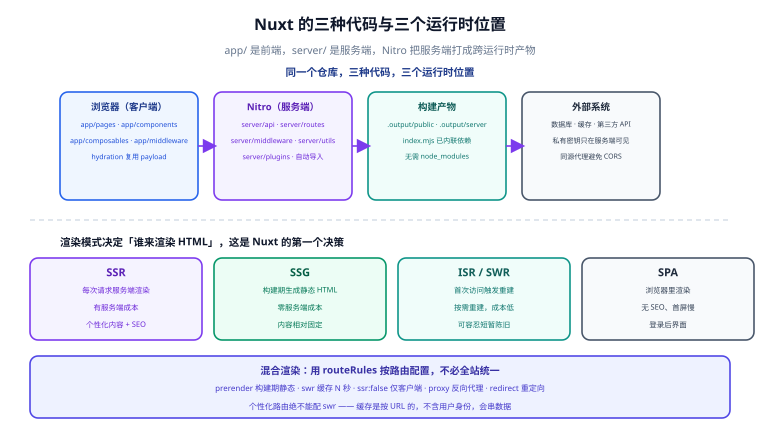

# Nuxt 全栈开发

Nuxt 是 Vue 生态的**全栈框架**：它把 Vue 从「浏览器里的视图层」扩展成「一个前后端一体的应用」。同一个项目里，你可以写页面组件、也可以写服务端接口；可以产出静态 HTML、也可以跑成 Node 服务。它的核心价值是把**首屏渲染**、**SEO**、**数据预取**、**服务端逻辑**这四件事从「需要自己搭一套」变成「框架配置项」。

## 目录

### 入门与架构

- [渲染模式与架构](Overview/index.md)

### 核心能力

- [数据获取与状态](DataFetching/index.md)
- [服务端能力：Server Routes 与中间件](ServerRoute/index.md)

### 落地

- [部署与实战](Deployment/index.md)

::: info 版本约定
本专题以 **Nuxt 4**（当前稳定主线）为主线。Nuxt 4 相对 Nuxt 3 的关键变化：

- **默认目录结构改为 `app/`**：`app/pages`、`app/components`、`app/composables`，把「前端代码」与「服务端代码（`server/`）」在顶层就分开。
- **数据获取 API 成熟**：`useFetch` / `useAsyncData` 的 `key` 与缓存语义更明确，`useAsyncData` 支持 `getCachedData`。
- **Nitro 服务端引擎持续演进**：跨运行时部署（Node / Deno / Bun / 边缘函数）由 Nitro preset 统一。

Vue 侧以 **Vue 3.5+** 为准。涉及 Nuxt 3 的差异会明确标注。
:::

::: tip 阅读前提
本专题假设你已读过 [Vue 框架](../Vue/index.md)（组合式 API、`ref`/`computed`、`<script setup>`）与 [Vite 深入](../../Basic/BuildTool/Vite/index.md)（构建与 dev server 机制）。Nuxt 的地基就是这两样：**Vue 的组件模型 + Vite 的构建管线**，再加上一层服务端运行时（Nitro）。
:::

## 各篇定位

| 页面 | 回答什么问题 |
| --- | --- |
| [渲染模式与架构](Overview/index.md) | SSR / SSG / ISR / SPA 怎么选，Nitro 是什么，与 Next.js 的对照，Nuxt 的项目结构 |
| [数据获取与状态](DataFetching/index.md) | `useFetch` / `useAsyncData` / `$fetch` 的分工、缓存键怎么定、怎么避免「一份数据请求两次」 |
| [服务端能力：Server Routes 与中间件](ServerRoute/index.md) | 怎么在同一个项目里写 API、`runtimeConfig` 怎么管密钥、路由中间件与服务端中间件的区别 |
| [部署与实战](Deployment/index.md) | 部署形态矩阵、从零到可访问的完整步骤、缓存与错误处理、排错 |

## 与既有专题的分工

库内 [Frame](../index.md) 目录下已有 **Vue / React / Next / Angular / UmiJS / Uniapp / Electron / WxMini / CrossPlatform**，唯独缺 Nuxt。本专题定位为 **Vue 生态的服务端渲染与全栈方案**：

| | 归属 | 关系 |
| --- | --- | --- |
| [Vue](../Vue/index.md) | 视图层 | Nuxt 的组件写法完全沿用 Vue，本专题不重复讲组件语法 |
| [Vite](../../Basic/BuildTool/Vite/index.md) | 构建工具 | Nuxt 的客户端构建就是 Vite，本专题只讲 Nuxt 特有的构建产物差异 |
| [Next](../Next/index.md) | 同层对照 | 同为全栈框架，本专题在 [架构篇](Overview/index.md) 给了逐项对照 |
| [Uniapp](../Uniapp/index.md) | 跨端 | 面向小程序/多端；Nuxt 面向 Web 全栈，两者解决的不是同一个问题 |

::: warning 说明
**不要用 Nuxt 去写纯静态的后台管理页**（登录后无 SEO 需求、不需要服务端渲染）。这类场景 Vite + Vue Router 更简单，Nuxt 只会多一层服务端复杂度。Nuxt 的价值集中在**面向外部用户的、需要首屏性能与 SEO 的页面**。
:::

## 相关专题

- [Vue](../Vue/index.md)：组件与响应式的语言基础
- [Next](../Next/index.md)：React 侧的同层方案，架构决策可互相对照
- [国际化与无障碍](../../IntlA11y/index.md)：**分工是**——本专题讲 Nuxt 的渲染模式与数据获取，该专题讲**多语言在服务端渲染下的口径**（locale 从 URL/Cookie 解析、首屏语言必须与 HTML 一致、`hreflang` 与 `canonical` 由服务端写入）。三条「接缝」在 [框架落地](../../IntlA11y/FrameworkIntegration/index.md) 里逐条展开
- [Vite](../../Basic/BuildTool/Vite/index.md)：Nuxt 的开发与构建底座
- [前端性能优化](../../Others/PerformanceOptimization/index.md)：SSR 在性能优化中的位置与代价
- [前端安全](../../Others/Security/index.md)：SSR 特有的安全问题（服务端注入、密钥泄漏）
- [Docker](../../../Ops/Docker/index.md) 与 [Kubernetes](../../../Ops/Kubernetes/index.md)：Node 服务的交付形态
- [Nuxt 通用模板](../../../../project/Base/NuxtTemplate/index.md)：**分工是**——本专题讲框架本身（渲染模式、数据获取、服务端能力、部署），通用模板讲「**怎么让模板自己完成技术栈初始化**」（默认零依赖、首次运行打开选择页、引擎自删引导器并按选择装依赖）。后者是工程组织问题，换到 Vue、React 上同样成立，与框架能力无关。
- [PWA 与离线应用](../../PWA/index.md)：**分工是**——本专题讲 Nuxt 怎么把页面渲染出来；该专题讲**渲染产物之外的那一层**：Service Worker 缓存、离线兜底、安装与推送。两者在 Nuxt 上会正面相遇，共三处必须处理的冲突：① **HTML 不该进预缓存**（SSR 的 HTML 是每次请求现渲染的，预缓存等于把构建那一刻的页面冻结），② **`useAsyncData` 的服务端取数不经过 SW**（首访内容已在 HTML 里，客户端不会再发那次接口请求，所以「配了接口缓存却离线仍是空的」是预期现象），③ **`navigateFallbackDenylist` 必须排除 `/api/`**（Nitro 路由不能被回退成 HTML）。三条的完整配置与判据见[框架与构建落地](../../PWA/Framework/index.md)第四节。
