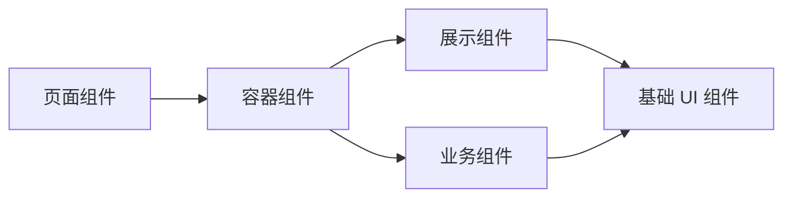
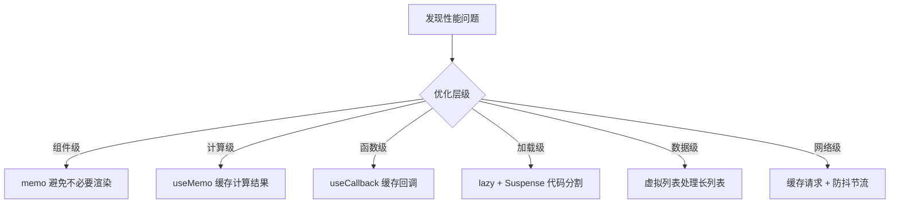

# 最佳实践

本章汇总 React 开发中的最佳实践、常见模式和性能优化技巧，帮助你编写可维护、高性能的 React 应用。

## 项目结构规范

### 推荐的目录组织

```
src/
├── components/          # 通用组件
│   ├── ui/              # 基础 UI 组件（Button, Input, Modal...）
│   └── business/        # 业务组件
├── features/            # 功能模块（按业务拆分）
│   ├── auth/
│   │   ├── components/  # 模块内组件
│   │   ├── hooks/       # 模块内 Hooks
│   │   ├── api.ts       # 模块 API
│   │   └── types.ts     # 模块类型
│   └── dashboard/
├── hooks/               # 全局自定义 Hooks
├── lib/                 # 工具函数
├── stores/              # 全局状态
├── routes/              # 路由配置
├── styles/              # 全局样式
└── types/               # 全局类型定义
```

::: tip
按**功能模块**（features）组织代码，而不是按文件类型（components/hooks/utils）。功能模块将所有相关文件放在一起，便于维护和删除。
:::

## 组件设计原则

### 1. 单一职责

每个组件只负责一件事：

```tsx
// ❌ 一个组件做太多事
function UserProfilePage() {
  // 请求数据 + 表单处理 + 展示 + 权限检查... 混在一起
}

// ✅ 职责分离
function UserProfilePage() {
  return (
    <AuthGuard>
      <UserProfile />
    </AuthGuard>
  )
}

function UserProfile() {
  const user = useUser()
  return (
    <Layout>
      <UserAvatar user={user} />
      <UserInfo user={user} />
      <UserSettings user={user} />
    </Layout>
  )
}
```

### 2. 组件拆分粒度



- **页面组件**：路由对应的顶层组件
- **容器组件**：负责数据获取和状态管理
- **展示组件**：纯 UI，通过 props 接收数据
- **基础组件**：Button、Input 等原子组件

### 3. Props 设计

```tsx
// ✅ 好的 Props 设计
interface DataTableProps {
  // 必要数据
  columns: Column[]
  data: Record<string, unknown>[]

  // 可选交互
  onRowClick?: (row: Record<string, unknown>) => void
  onSort?: (key: string, order: 'asc' | 'desc') => void

  // 外观控制
  loading?: boolean
  emptyText?: string
  className?: string
}

// ❌ 避免：传递整个对象
function UserCard({ user }: { user: User }) { /* ... */ }
// ✅ 推荐：传递所需的具体属性
function UserCard({ name, avatar, role }: Pick<User, 'name' | 'avatar' | 'role'>) { /* ... */ }
```

## Hooks 最佳实践

### 自定义 Hook 命名

```typescript
// ✅ 以 use 开头，React 约定
function useDebounce<T>(value: T, delay: number): T { /* ... */ }
function useLocalStorage<T>(key: string, initialValue: T) { /* ... */ }
function useMediaQuery(query: string): boolean { /* ... */ }

// ❌ 不以 use 开头——React 无法检查规则违反
function debounce(value: any, delay: number) { /* ... */ }
```

### useEffect 最小化依赖

```tsx
// ❌ 多余依赖导致重复执行
function UserPage({ userId }: { userId: string }) {
  const [user, setUser] = useState(null)
  const [loading, setLoading] = useState(false)

  useEffect(() => {
    setLoading(true)
    fetchUser(userId).then(data => {
      setUser(data)
      setLoading(false)
    })
  }, [userId, loading, user]) // 多余的依赖！
}

// ✅ 只依赖真正需要监听的 userId
function UserPage({ userId }: { userId: string }) {
  const [user, setUser] = useState(null)
  const [loading, setLoading] = useState(false)

  useEffect(() => {
    let cancelled = false
    setLoading(true)
    fetchUser(userId).then(data => {
      if (!cancelled) {
        setUser(data)
        setLoading(false)
      }
    })
    return () => { cancelled = true }
  }, [userId]) // 只依赖 userId
}
```

### 避免在渲染中创建不稳定的引用

```tsx
// ❌ 每次渲染都创建新对象/函数
function Component() {
  return (
    <ExpensiveChild
      style={{ color: 'red' }}          // 每次都是新对象
      onClick={() => handleClick(id)}    // 每次都是新函数
    />
  )
}

// ✅ 缓存稳定引用
function Component() {
  const style = useMemo(() => ({ color: 'red' }), [])
  const handleClick = useCallback(() => { /* ... */ }, [id])

  return <ExpensiveChild style={style} onClick={handleClick} />
}
```

## 性能优化

### 优化清单



### 1. React.memo

```tsx
import { memo } from 'react'

const ExpensiveList = memo(function List({ items }: { items: Item[] }) {
  console.log('List 渲染')
  return (
    <ul>
      {items.map(item => (
        <li key={item.id}>{item.name}</li>
      ))}
    </ul>
  )
})

// 自定义比较函数（谨慎使用）
const UserCard = memo(
  function Card({ user }: { user: User }) {
    return <div>{user.name}</div>
  },
  (prev, next) => prev.user.id === next.user.id
)
```

### 2. 虚拟列表

处理成千上万条数据时，使用虚拟列表只渲染可视区域：

```bash [终端]
npm install @tanstack/react-virtual
```

```tsx
import { useVirtualizer } from '@tanstack/react-virtual'

function VirtualList({ items }: { items: string[] }) {
  const parentRef = useRef<HTMLDivElement>(null)

  const virtualizer = useVirtualizer({
    count: items.length,
    getScrollElement: () => parentRef.current,
    estimateSize: () => 35,
  })

  return (
    <div ref={parentRef} style={{ height: '400px', overflow: 'auto' }}>
      <div style={{ height: `${virtualizer.getTotalSize()}px` }}>
        {virtualizer.getVirtualItems().map((virtualItem) => (
          <div
            key={virtualItem.key}
            style={{
              position: 'absolute',
              top: 0,
              transform: `translateY(${virtualItem.start}px)`,
            }}
          >
            {items[virtualItem.index]}
          </div>
        ))}
      </div>
    </div>
  )
}
```

### 3. 代码分割

按路由或组件进行代码分割，减少首屏体积：

```tsx
// 路由级分割
const Dashboard = lazy(() => import('./pages/Dashboard'))
const Settings = lazy(() => import('./pages/Settings'))

// 组件级分割（如重型图表库）
const Chart = lazy(() => import('./components/Chart'))
```

## TypeScript 最佳实践

### 从 API 响应推导类型

```typescript
// ✅ 定义清晰的接口类型
interface User {
  id: number
  name: string
  email: string
  role: 'admin' | 'user'
  createdAt: string
}

// ✅ 使用泛型封装请求函数
async function fetchApi<T>(url: string): Promise<T> {
  const res = await fetch(url)
  if (!res.ok) throw new Error(`HTTP ${res.status}`)
  return res.json()
}

// 使用时自动推导类型
const user = await fetchApi<User>('/api/users/1')
// user.name, user.email 都有类型提示
```

### 组件 Props 类型

```typescript
// ✅ 使用 interface 定义 Props
interface ButtonProps extends React.ButtonHTMLAttributes<HTMLButtonElement> {
  variant?: 'primary' | 'secondary' | 'ghost'
  loading?: boolean
}

// ✅ 使用 ComponentProps 获取原生元素类型
type InputProps = React.ComponentProps<'input'> & {
  label: string
  error?: string
}

// ✅ 事件类型
const handleChange = (e: React.ChangeEvent<HTMLInputElement>) => {
  console.log(e.target.value) // 类型安全
}
```

## 常见反模式

| 反模式 | 问题 | 改进 |
|--------|------|------|
| 直接在 useEffect 中设置依赖不包含的状态 | 导致闭包陷阱 | 使用函数式更新 `setState(prev => ...)` |
| 把组件定义在另一个组件内部 | 每次渲染重建组件 | 将组件提取到顶层 |
| 使用 index 作为 key | 列表顺序变化时导致状态错乱 | 使用唯一 ID |
| 在渲染中派生状态 | 不必要的状态同步 | 用 `useMemo` 派生值 |
| useEffect 缺少清理函数 | 内存泄漏 | 返回清理函数 |
| 过度使用 useCallback/useMemo | 反而降低性能 | 仅在必要时使用 |
| 在 useEffect 中直接修改 DOM | 与 React 渲染冲突 | 使用 ref 或受控组件 |
| 在条件语句中调用 Hooks | 违反 Hooks 规则 | 在顶层调用，用条件判断返回值 |
| 直接修改 state 对象 | React 无法检测变化 | 使用展开运算符创建新对象 |
| 在事件处理器中调用 setState 后立即读取 | 状态异步更新 | 使用 useEffect 监听变化 |

### 反模式详细说明

#### 1. 组件嵌套定义

```tsx
// ❌ 错误：组件在另一个组件内部定义
function Parent() {
  function Child() { // 每次渲染都会重新创建
    return <div>Child</div>
  }
  
  return <Child />
}

// ✅ 正确：组件定义在顶层
function Child() {
  return <div>Child</div>
}

function Parent() {
  return <Child />
}
```

#### 2. 直接修改 State

```tsx
// ❌ 错误：直接修改对象
function updateUser() {
  user.name = 'New Name' // React 不会检测到变化
  setUser(user)
}

// ✅ 正确：创建新对象
function updateUser() {
  setUser(prev => ({ ...prev, name: 'New Name' }))
}
```

#### 3. 闭包陷阱

```tsx
// ❌ 错误：闭包捕获旧值
function Counter() {
  const [count, setCount] = useState(0)

  useEffect(() => {
    const timer = setInterval(() => {
      console.log(count) // 永远是初始值 0
      setCount(count + 1) // 永远是 1
    }, 1000)
    return () => clearInterval(timer)
  }, []) // 空依赖

  return <div>{count}</div>
}

// ✅ 正确：使用函数式更新
function Counter() {
  const [count, setCount] = useState(0)

  useEffect(() => {
    const timer = setInterval(() => {
      setCount(prev => prev + 1) // 使用最新值
    }, 1000)
    return () => clearInterval(timer)
  }, [])

  return <div>{count}</div>
}
```

#### 4. 过度优化

```tsx
// ❌ 错误：不必要的 memo/useCallback
function SimpleComponent() {
  const [count, setCount] = useState(0)
  
  const handleClick = useCallback(() => {
    setCount(c => c + 1)
  }, [])
  
  const doubled = useMemo(() => count * 2, [count])
  
  return (
    <div>
      <SimpleChild onClick={handleClick} />
      <span>{doubled}</span>
    </div>
  )
}

// ✅ 正确：简单组件不需要过度优化
function SimpleComponent() {
  const [count, setCount] = useState(0)
  
  const handleClick = () => setCount(c => c + 1)
  const doubled = count * 2
  
  return (
    <div>
      <SimpleChild onClick={handleClick} />
      <span>{doubled}</span>
    </div>
  )
}
```

## React 19 迁移要点

从 React 18 升级到 19 需要注意：

### 自动批处理增强

React 19 批量更新更激进，包括异步回调中的更新：

```tsx
// React 18：某些场景需要手动批处理
setTimeout(() => {
  setCount(c => c + 1)
  setFlag(f => !f)
  // React 18 自动批处理也覆盖了这里
}, 1000)
```

### forwardRef 不再需要

```tsx
// React 18
const Input = forwardRef<HTMLInputElement, Props>((props, ref) => (
  <input ref={ref} {...props} />
))

// React 19
function Input({ ref, ...props }: Props & { ref: React.Ref<HTMLInputElement> }) {
  return <input ref={ref} {...props} />
}
```

### Context.Provider 简化

```tsx
// React 18
<ThemeContext.Provider value="dark">
  <App />
</ThemeContext.Provider>

// React 19
<ThemeContext value="dark">
  <App />
</ThemeContext>
```

### 新的错误处理

React 19 改进了错误报告，特别是 SSR 和服务端组件的错误信息更清晰。

## 下一步

现在你已经完整掌握了 React 的核心知识，可以：

- 查阅 [React 官方文档](https://react.dev/) 获取最新 API 参考
- 探索 [Next.js](https://nextjs.org/) 学习全栈 React 开发
- 浏览 [Ant Design](https://ant.design/) 或 [shadcn/ui](https://ui.shadcn.com/) 组件库
