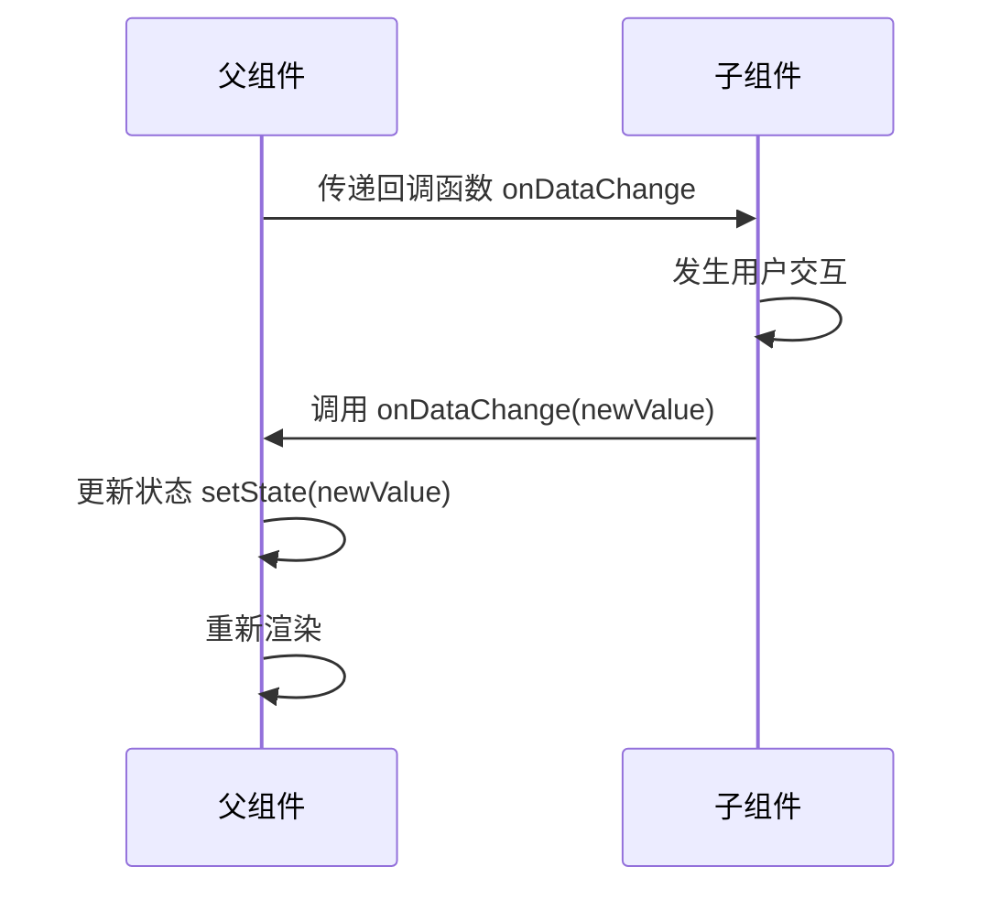

# 组件开发

::: info 版本现状
React 19 中 `ref` 可以直接作为普通 prop 传递给函数组件，`forwardRef` 不再必需（兼容写法仍可用）。
:::

React 应用由组件构成。组件是 UI 的基本构建块，接收输入（Props）并返回描述界面的 React 元素。

## 组件的两种定义方式

### 函数组件（推荐）

自 React 16.8 引入 Hooks 以来，**函数组件**已成为官方推荐的标准写法：

```tsx
interface UserCardProps {
  name: string
  avatar: string
  role: string
}

function UserCard({ name, avatar, role }: UserCardProps) {
  return (
    <div className="user-card">
      
      <h3>{name}</h3>
      <span>{role}</span>
    </div>
  )
}
```

### 类组件（了解即可）

类组件是 React 早期的组件形式，现代项目中已较少使用，但在维护旧项目时可能会遇到：

```tsx
import { Component } from 'react'

interface CounterState {
  count: number
}

class Counter extends Component<{}, CounterState> {
  state: CounterState = { count: 0 }

  increment = () => {
    this.setState({ count: this.state.count + 1 })
  }

  render() {
    return (
      <div>
        <p>{this.state.count}</p>
        <button onClick={this.increment}>+1</button>
      </div>
    )
  }
}
```

::: tip
新项目统一使用**函数组件 + Hooks**。类组件主要出现在遗留代码中。
:::

## Props（父传子）

Props 是组件的输入参数，具有**只读性**——子组件不能直接修改 props。

```tsx
// 子组件：接收 props
interface ChildProps {
  title: string
  count: number
  onUpdate: (newCount: number) => void
}

function Child({ title, count, onUpdate }: ChildProps) {
  return (
    <div>
      <h3>{title}</h3>
      <p>计数: {count}</p>
      <button onClick={() => onUpdate(count + 1)}>更新</button>
    </div>
  )
}

// 父组件：传递 props
function Parent() {
  const [count, setCount] = useState(0)

  return (
    <Child
      title="计数器"
      count={count}
      onUpdate={setCount}
    />
  )
}
```

### Props 默认值

```tsx
interface ButtonProps {
  variant?: 'primary' | 'secondary'
  size?: 'sm' | 'md' | 'lg'
  children: React.ReactNode
}

function Button({
  variant = 'primary',
  size = 'md',
  children
}: ButtonProps) {
  return (
    <button className={`btn btn-${variant} btn-${size}`}>
      {children}
    </button>
  )
}
```

## 事件回调（子传父）

子组件通过调用父组件传递的回调函数实现数据向上传递：



```tsx
// 子组件
interface EditorProps {
  content: string
  onChange: (content: string) => void
}

function Editor({ content, onChange }: EditorProps) {
  return (
    <textarea
      value={content}
      onChange={e => onChange(e.target.value)}
    />
  )
}

// 父组件
function Page() {
  const [text, setText] = useState('')

  return (
    <div>
      <Editor content={text} onChange={setText} />
      <p>当前内容：{text}</p>
    </div>
  )
}
```

## 插槽（children）

React 没有 Vue 那样的具名插槽机制，但可以通过 `children` prop 和组件组合实现类似效果：

### 默认插槽

```tsx
function Card({ children }: { children: React.ReactNode }) {
  return <div className="card">{children}</div>
}

// 使用
<Card>
  <h2>标题</h2>
  <p>这是卡片内容</p>
</Card>
```

### 多区域插槽（通过 Props 传 JSX）

```tsx
interface LayoutProps {
  header: React.ReactNode
  sidebar: React.ReactNode
  children: React.ReactNode
  footer?: React.ReactNode
}

function Layout({ header, sidebar, children, footer }: LayoutProps) {
  return (
    <div className="layout">
      <header>{header}</header>
      <aside>{sidebar}</aside>
      <main>{children}</main>
      {footer && <footer>{footer}</footer>}
    </div>
  )
}

// 使用
<Layout
  header={<Header />}
  sidebar={<Sidebar />}
  footer={<Footer />}
>
  <MainContent />
</Layout>
```

## 组件组合模式

### 复合组件（Compound Components）

将多个关联组件组合为一个整体模块：

```tsx
// 定义复合组件
function Tabs({ children }: { children: React.ReactNode }) {
  const [activeIndex, setActiveIndex] = useState(0)
  return <div>{/* 通过 Context 共享 activeIndex */}</div>
}

Tabs.List = function TabList() { /* ... */ }
Tabs.Panel = function TabPanel() { /* ... */ }

// 使用
<Tabs>
  <Tabs.List>
    <Tabs.Tab>Tab 1</Tabs.Tab>
    <Tabs.Tab>Tab 2</Tabs.Tab>
  </Tabs.List>
  <Tabs.Panel>内容 1</Tabs.Panel>
  <Tabs.Panel>内容 2</Tabs.Panel>
</Tabs>
```

### 渲染 Props 模式

通过 props 传递渲染函数，实现逻辑复用：

```tsx
interface MouseTrackerProps {
  render: (position: { x: number; y: number }) => React.ReactNode
}

function MouseTracker({ render }: MouseTrackerProps) {
  const [position, setPosition] = useState({ x: 0, y: 0 })

  useEffect(() => {
    const handleMove = (e: MouseEvent) => {
      setPosition({ x: e.clientX, y: e.clientY })
    }
    window.addEventListener('mousemove', handleMove)
    return () => window.removeEventListener('mousemove', handleMove)
  }, [])

  return <>{render(position)}</>
}

// 使用
<MouseTracker
  render={({ x, y }) => (
    <div>鼠标位置：{x}, {y}</div>
  )}
/>
```

::: tip
现代 React 开发中，渲染 Props 模式大部分场景已被**自定义 Hooks**替代，但在某些特定场景（如需要灵活控制渲染内容）仍然有用。
:::

### 高阶组件（HOC）

HOC 是一个函数，接受一个组件返回一个新组件，多用于横切关注点（日志、权限、主题等）：

```tsx
// 高阶组件：为组件添加 loading 状态
function withLoading<P extends object>(Component: React.ComponentType<P>) {
  return function LoadingWrapper(props: P & { loading: boolean }) {
    const { loading, ...rest } = props
    if (loading) return <Spinner />
    return <Component {...(rest as P)} />
  }
}

// 使用
const UserListWithLoading = withLoading(UserList)
```

::: tip
现代 React 开发中，HOC 大部分场景已被 **自定义 Hooks** 替代。HOC 可能导致"嵌套地狱"，仅在特定场景（如错误边界包装、主题注入）中使用。
:::

### 控制反转（Inversion of Control）

通过 props 传递组件或渲染逻辑，实现更灵活的组件设计：

```tsx
interface ModalProps {
  isOpen: boolean
  onClose: () => void
  header: React.ReactNode
  footer?: React.ReactNode
  children: React.ReactNode
}

function Modal({ isOpen, onClose, header, footer, children }: ModalProps) {
  if (!isOpen) return null

  return (
    <div className="modal-overlay" onClick={onClose}>
      <div className="modal-content" onClick={e => e.stopPropagation()}>
        <div className="modal-header">{header}</div>
        <div className="modal-body">{children}</div>
        {footer && <div className="modal-footer">{footer}</div>}
      </div>
    </div>
  )
}

// 使用
<Modal
  isOpen={showModal}
  onClose={() => setShowModal(false)}
  header={<h2>确认删除</h2>}
  footer={
    <>
      <button onClick={() => setShowModal(false)}>取消</button>
      <button onClick={handleDelete}>删除</button>
    </>
  }
>
  <p>确定要删除这个项目吗？</p>
</Modal>
```

## 受控组件 vs 非受控组件

| 维度 | 受控组件 | 非受控组件 |
|------|----------|------------|
| 数据源 | React State | DOM 自身 |
| 实现方式 | value + onChange | ref |
| 适用场景 | 需要实时校验/联动 | 简单表单提交/文件上传 |
| 代码复杂度 | 较高 | 较低 |

```tsx
import { useRef } from 'react'

function FormDemo() {
  // 受控组件
  const [name, setName] = useState('')

  // 非受控组件
  const fileRef = useRef<HTMLInputElement>(null)

  return (
    <form>
      {/* 受控 */}
      <input value={name} onChange={e => setName(e.target.value)} />

      {/* 非受控 - 文件上传通常用非受控 */}
      <input type="file" ref={fileRef} />
    </form>
  )
}
```

## React 19 新特性：ref 作为 prop

React 19 中，`ref` 可以直接作为 prop 传递，不再需要 `forwardRef` 包装：

```tsx
// React 19：ref 直接作为 prop
function MyInput({ ref, placeholder }: { ref: React.Ref<HTMLInputElement>, placeholder: string }) {
  return <input ref={ref} placeholder={placeholder} />
}

// 使用
function Parent() {
  const inputRef = useRef<HTMLInputElement>(null)

  useEffect(() => {
    inputRef.current?.focus()
  }, [])

  return <MyInput ref={inputRef} placeholder="自动聚焦" />
}
```

::: info React 18 兼容写法
如果是 React 18 项目，仍需使用 `forwardRef`：

```tsx
const MyInput = forwardRef<HTMLInputElement, { placeholder: string }>(
  (props, ref) => <input ref={ref} {...props} />
)
```
:::

## 组件懒加载

使用 `lazy` + `Suspense` 实现组件的按需加载，减小首屏体积：

```tsx
import { lazy, Suspense } from 'react'

const HeavyComponent = lazy(() => import('./HeavyComponent'))

function App() {
  return (
    <Suspense fallback={<div>Loading...</div>}>
      <HeavyComponent />
    </Suspense>
  )
}
```

## 下一步

- [Hooks 详解](Hooks/index.md) - 掌握 React 状态与副作用管理
- [状态管理](StateManagement/index.md) - 跨组件状态管理方案
- [最佳实践](BestPractices/index.md) - React 开发最佳实践
