# 生态系统

React 拥有前端领域最庞大、最活跃的生态系统。除了核心库，还有大量官方和社区维护的配套工具。本章梳理 React 生态中的关键组成部分。

## React 生态全景图

```mermaid
graph TB
    React[React 核心] --> Build[构建工具]
    React --> Framework[全栈框架]
    React --> State[状态管理]
    React --> Route[路由]
    React --> UI[UI 组件库]
    React --> Form[表单处理]
    React --> Animation[动画]
    React --> Test[测试]
    React --> Mobile[移动端]

    Build --> Vite[Vite]
    Build --> Turbopack[Turbopack]
    Build --> SWC[SWC]

    Framework --> Next[Next.js]
    Framework --> Remix[Remix / React Router v7]
    Framework --> Gatsby[Gatsby]

    State --> Zustand[Zustand]
    State --> RTK[Redux Toolkit]
    State --> Jotai[Jotai]
    State --> TanStack[TanStack Query]

    Route --> ReactRouter[React Router]

    UI --> Antd[Ant Design]
    UI --> MUI[Material UI]
    UI --> Shadcn[shadcn/ui]
    UI --> NextUI[NextUI]

    Form --> ReactHookForm[React Hook Form]
    Form --> Formik[Formik]

    Animation --> FramerMotion[Framer Motion]
    Animation --> GSAP[GSAP]

    Test --> Vitest[Vitest]
    Test --> ReactTesting[React Testing Library]
    Test --> Playwright[Playwright]

    Mobile --> ReactNative[React Native]
    Mobile --> Expo[Expo]
```



## 构建工具

### Vite（官方推荐）

Vite 已取代 CRA 成为 React 官方推荐的构建工具：

- 基于 ESM 的极速冷启动
- HMR 热更新几乎即时
- 内置 TypeScript、CSS Modules 支持
- 插件生态丰富

```bash [终端]
npm create vite@latest my-app -- --template react-ts
```

### Turbopack

Next.js 团队开发的 Rust 构建工具，速度进一步提升：

- 增量构建速度比 Vite 快 5-10x（在大型项目中）
- 目前主要集成在 Next.js 中

### 元框架对比

| 框架 | SSR | SSG | ISR | RSC | 适用场景 |
|------|-----|-----|-----|-----|----------|
| **Next.js** | ✅ | ✅ | ✅ | ✅ | 全栈应用 |
| **React Router v7** | ✅ | ✅ | ⚠️ | ⚠️ | SPA + 轻量 SSR |
| **Remix** | ✅ | ⚠️ | ⚠️ | ⚠️ | 内容型网站 |
| **Gatsby** | ✅ | ✅ | ✅ | ❌ | 静态网站 |

::: tip 推荐
2026 年的选择策略：纯 SPA 用 **Vite**；需要 SSR/全栈能力用 [Next.js](/docs/Frontend/Frame/Next/)；简单项目直接用 **Vite + React Router**。
:::

## UI 组件库

### Ant Design

阿里出品的企业级 UI 组件库，国内使用最广泛：

```bash [终端]
npm install antd @ant-design/icons
```

```tsx
import { Button, DatePicker, Table, Form, Input, Modal } from 'antd'

function UserManagement() {
  const columns = [
    { title: '姓名', dataIndex: 'name', key: 'name' },
    { title: '邮箱', dataIndex: 'email', key: 'email' },
  ]

  return (
    <div>
      <Button type="primary">新增用户</Button>
      <Table columns={columns} dataSource={users} />
    </div>
  )
}
```

### shadcn/ui（2025-2026 最热）

基于 Radix UI + Tailwind CSS 的组件集合，代码直接复制到项目中而非 npm 安装：

```bash [终端]
npx shadcn@latest init
npx shadcn@latest add button card dialog
```

```tsx
import { Button } from '@/components/ui/button'
import { Card, CardContent, CardHeader, CardTitle } from '@/components/ui/card'

function Dashboard() {
  return (
    <Card>
      <CardHeader>
        <CardTitle>仪表盘</CardTitle>
      </CardHeader>
      <CardContent>
        <Button variant="outline">点击</Button>
      </CardContent>
    </Card>
  )
}
```

### 组件库选型指南

| 组件库 | 风格 | 体积 | 定制性 | 国内流行度 |
|--------|------|------|--------|-----------|
| Ant Design | 企业级 | 大 | 中 | ⭐⭐⭐⭐⭐ |
| shadcn/ui | 现代简约 | 按需 | 极高 | ⭐⭐⭐⭐ |
| Material UI | Google Material | 大 | 高 | ⭐⭐⭐ |
| NextUI | 现代 | 中 | 高 | ⭐⭐ |
| Arco Design | 企业级 | 大 | 中 | ⭐⭐⭐ |

## 表单处理

### React Hook Form

当前最流行的表单库，性能优异（非受控模式）：

```bash [终端]
npm install react-hook-form zod @hookform/resolvers
```

```tsx
import { useForm } from 'react-hook-form'
import { z } from 'zod'
import { zodResolver } from '@hookform/resolvers/zod'

const schema = z.object({
  email: z.string().email('邮箱格式不正确'),
  password: z.string().min(6, '密码至少6位'),
})

type FormData = z.infer<typeof schema>

function LoginForm() {
  const {
    register,
    handleSubmit,
    formState: { errors, isSubmitting },
  } = useForm<FormData>({
    resolver: zodResolver(schema),
  })

  const onSubmit = async (data: FormData) => {
    await fetch('/api/login', {
      method: 'POST',
      body: JSON.stringify(data),
    })
  }

  return (
    <form onSubmit={handleSubmit(onSubmit)}>
      <input {...register('email')} placeholder="邮箱" />
      {errors.email && <span>{errors.email.message}</span>}

      <input {...register('password')} type="password" placeholder="密码" />
      {errors.password && <span>{errors.password.message}</span>}

      <button type="submit" disabled={isSubmitting}>
        {isSubmitting ? '登录中...' : '登录'}
      </button>
    </form>
  )
}
```

## 动画库

### Framer Motion

声明式动画库，API 直观：

```tsx
import { motion, AnimatePresence } from 'framer-motion'

function AnimatedList({ items }: { items: string[] }) {
  return (
    <AnimatePresence>
      {items.map((item, index) => (
        <motion.div
          key={item}
          initial={{ opacity: 0, y: 20 }}
          animate={{ opacity: 1, y: 0 }}
          exit={{ opacity: 0, x: -100 }}
          transition={{ delay: index * 0.1 }}
        >
          {item}
        </motion.div>
      ))}
    </AnimatePresence>
  )
}
```

## 测试工具

| 工具 | 类型 | 用途 |
|------|------|------|
| Vitest | 单元测试 | 替代 Jest，与 Vite 深度集成 |
| React Testing Library | 组件测试 | 以用户视角测试组件行为 |
| Playwright | E2E 测试 | 跨浏览器端到端测试 |
| Storybook | UI 开发 | 组件隔离开发和文档 |

```tsx
// 组件测试示例 (Vitest + React Testing Library)
import { render, screen, fireEvent } from '@testing-library/react'
import { describe, it, expect } from 'vitest'
import Counter from './Counter'

describe('Counter', () => {
  it('点击按钮增加计数', () => {
    render(<Counter />)
    const button = screen.getByText('+1')
    fireEvent.click(button)
    expect(screen.getByText('计数: 1')).toBeInTheDocument()
  })
})
```

## React Native

一套代码同时运行在 iOS 和 Android 上：

```bash [终端]
npx create-expo-app@latest my-app
```

- **Expo**：React Native 的推荐开发平台，提供托管构建、OTA 更新
- **React Native 新架构**：2025 年正式稳定，性能大幅提升

## 工具推荐清单

| 类别 | 推荐方案 | 备选 |
|------|----------|------|
| 包管理 | pnpm | bun |
| 构建工具 | Vite | Turbopack |
| 全栈框架 | Next.js | React Router v7 |
| UI 库 | Ant Design / shadcn/ui | MUI |
| 表单 | React Hook Form + Zod | Formik + Yup |
| 状态管理 | Zustand + TanStack Query | Redux Toolkit |
| 路由 | React Router | TanStack Router |
| 动画 | Framer Motion | GSAP |
| 测试 | Vitest + RTL | Jest + Enzyme |
| 图标 | Lucide React | React Icons |
| 工具函数 | ahooks | react-use |

## 下一步

- [最佳实践](BestPractices/index.md) - React 开发中的常见模式和优化技巧
