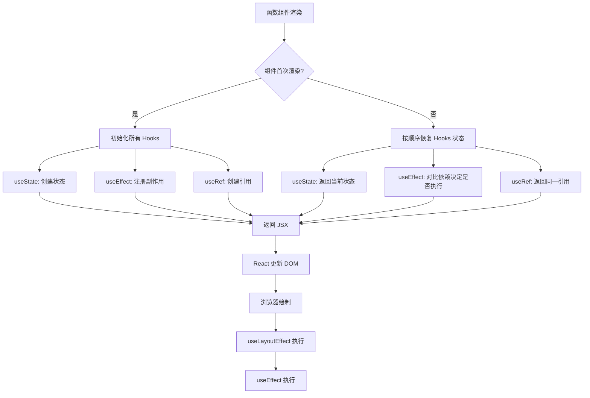

# Hooks 详解

::: info 版本现状
React 19.2.x 中 Hooks 体系稳定：`use`、`useOptimistic`、`useActionState`、`useFormStatus` 均已正式提供；自定义 Hooks 仍须遵守 Rules of Hooks。
:::

Hooks 是 React 16.8 引入的革命性特性，让函数组件也能拥有状态管理和生命周期能力。React 19 进一步扩展了 Hooks 体系，新增了 `use()`、`useOptimistic`、`useActionState` 等。

## Hooks 使用规则

::: warning 两条铁律
1. **只在顶层调用**：不要在循环、条件判断或嵌套函数中调用 Hooks
2. **只在 React 函数中调用**：在函数组件或自定义 Hook 中调用，不要在普通 JS 函数中调用
:::

React 依赖 Hook 的调用顺序来维护内部状态，违反规则会导致状态错乱。

## 基础 Hooks

### useState

管理组件内部的状态：

```tsx
import { useState } from 'react'

function Counter() {
  const [count, setCount] = useState(0)
  const [user, setUser] = useState({ name: '', age: 0 })

  // 基于前值更新（推荐方式）
  const increment = () => setCount(c => c + 1)

  // 更新对象状态（需要展开）
  const updateUser = () => {
    setUser(prev => ({ ...prev, age: prev.age + 1 }))
  }

  return (
    <div>
      <p>计数: {count}</p>
      <button onClick={increment}>+1</button>
    </div>
  )
}
```

::: tip useState 注意事项
- State 更新是**异步**的，连续调用 `setState` 会被批处理
- 对象类型的 state，更新时必须**展开旧值**创建新对象
- 惰性初始化：`useState(() => expensiveComputation())` 只在首次渲染执行
:::

### useEffect

处理**副作用**：数据请求、DOM 操作、订阅、定时器等：

```tsx
import { useEffect, useState } from 'react'

function UserProfile({ userId }: { userId: string }) {
  const [user, setUser] = useState(null)

  useEffect(() => {
    // 副作用：请求数据
    const controller = new AbortController()

    fetch(`/api/users/${userId}`, { signal: controller.signal })
      .then(res => res.json())
      .then(setUser)

    // 清理函数：组件卸载或依赖变化时执行
    return () => controller.abort()
  }, [userId]) // 依赖数组：userId 变化时重新执行

  return <div>{user?.name}</div>
}
```

**三种依赖项的执行时机：**

| 依赖项 | 执行时机 | 场景 |
|--------|----------|------|
| 无依赖项 | 每次渲染后都执行 | 较少使用 |
| `[]` 空数组 | 仅首次渲染后执行一次 | 初始化请求、事件监听 |
| `[dep1, dep2]` | 首次渲染 + 依赖变化时执行 | 响应数据变化 |

### useRef

创建可变的引用对象，修改不会触发重新渲染：

```tsx
import { useRef, useEffect } from 'react'

function AutoFocusInput() {
  const inputRef = useRef<HTMLInputElement>(null)
  const countRef = useRef(0) // 跨渲染周期保存值

  useEffect(() => {
    inputRef.current?.focus()
  }, [])

  const handleClick = () => {
    countRef.current += 1
    console.log('点击次数:', countRef.current)
  }

  return (
    <div>
      <input ref={inputRef} placeholder="自动聚焦" />
      <button onClick={handleClick}>记录点击（不触发重渲染）</button>
    </div>
  )
}
```

### useContext

跨组件层级共享数据，无需逐层传递 props：

```tsx
import { createContext, useContext, useState } from 'react'

// React 19：Provider 直接使用 Context
const ThemeContext = createContext('light')

function ThemedButton() {
  const theme = useContext(ThemeContext)
  return <button className={theme}>主题按钮</button>
}

function App() {
  const [theme, setTheme] = useState('light')
  return (
    <ThemeContext value={theme}>
      <ThemedButton />
      <button onClick={() => setTheme(t => t === 'light' ? 'dark' : 'light')}>
        切换主题
      </button>
    </ThemeContext>
  )
}
```

::: tip React 19 改进
React 19 中，可以直接使用 `<ThemeContext>` 替代 `<ThemeContext.Provider>`，写法更简洁。
:::

## 性能优化 Hooks

### useMemo

缓存计算结果，避免每次渲染都重新计算：

```tsx
import { useMemo, useState } from 'react'

function ExpensiveList({ items }: { items: number[] }) {
  const [filter, setFilter] = useState('')

  // 只在 items 或 filter 变化时重新计算
  const filteredItems = useMemo(() => {
    console.log('重新过滤...')
    return items.filter(item => String(item).includes(filter))
  }, [items, filter])

  return (
    <div>
      <input value={filter} onChange={e => setFilter(e.target.value)} />
      <ul>
        {filteredItems.map(item => <li key={item}>{item}</li>)}
      </ul>
    </div>
  )
}
```

### useCallback

缓存函数引用，避免子组件不必要的重渲染：

```tsx
import { useCallback, memo } from 'react'

// 用 memo 包裹子组件，props 不变时跳过渲染
const ExpensiveChild = memo(function Child({
  onClick
}: {
  onClick: () => void
}) {
  console.log('Child 渲染')
  return <button onClick={onClick}>点击</button>
})

function Parent() {
  const [count, setCount] = useState(0)

  // 用 useCallback 缓存函数引用
  const handleClick = useCallback(() => {
    setCount(c => c + 1)
  }, []) // 空依赖 → 函数引用永不改变

  return (
    <div>
      <p>{count}</p>
      <ExpensiveChild onClick={handleClick} />
    </div>
  )
}
```

### useTransition

标记非紧急的状态更新，保持 UI 响应：

```tsx
import { useState, useTransition } from 'react'

function SearchPage() {
  const [query, setQuery] = useState('')
  const [isPending, startTransition] = useTransition()

  const handleChange = (e: React.ChangeEvent<HTMLInputElement>) => {
    // 输入框更新是紧急的（直接 setState）
    setQuery(e.target.value)

    // 搜索结果更新是非紧急的（被标记为 transition）
    startTransition(() => {
      setFilteredResults(search(e.target.value))
    })
  }

  return (
    <div>
      <input value={query} onChange={handleChange} />
      {isPending && <span>搜索中...</span>}
    </div>
  )
}
```

### useDeferredValue

延迟更新某个值，保持界面流畅：

```tsx
import { useState, useDeferredValue, useMemo } from 'react'

function SlowList({ query }: { query: string }) {
  const deferredQuery = useDeferredValue(query) // 延迟更新

  const list = useMemo(() => {
    // 基于延迟的值进行昂贵的过滤操作
    return hugeData.filter(item => item.includes(deferredQuery))
  }, [deferredQuery])

  return <ul>{list.map(item => <li key={item}>{item}</li>)}</ul>
}
```

## React 19 新 Hooks

### use()

`use()` 是 React 19 引入的新 Hook，可以在渲染中读取 Promise 和 Context：

```tsx
import { use, Suspense } from 'react'

// 使用 use() 读取 Promise
async function fetchUser(id: string) {
  const res = await fetch(`/api/users/${id}`)
  return res.json()
}

function UserProfile({ userId }: { userId: string }) {
  // use() 读取 Promise，配合 Suspense 使用
  const user = use(fetchUser(userId))

  return <div>{user.name}</div>
}

// use() 读取 Context（条件化）
function ThemedComponent({ needsTheme }: { needsTheme: boolean }) {
  if (needsTheme) {
    const theme = use(ThemeContext) // 可以在条件中调用！
    return <div className={theme}>内容</div>
  }
  return <div>无需主题</div>
}
```

::: warning 注意
`use()` 打破了传统 Hooks 的顶层调用规则，可以在条件语句和循环中使用。但它仍然需要在函数组件或 Hook 内部调用。
:::

### useOptimistic

乐观更新——先更新 UI，再等待服务端确认：

```tsx
import { useOptimistic, useState } from 'react'

function TodoList({ initialTodos }: { initialTodos: Todo[] }) {
  const [todos, setTodos] = useState(initialTodos)
  const [optimisticTodos, addOptimisticTodo] = useOptimistic(
    todos,
    (state, newTodo: Todo) => [...state, newTodo]
  )

  const handleAdd = async (title: string) => {
    const newTodo = { id: Date.now(), title, completed: false }

    // 乐观更新：立即显示新 Todo
    addOptimisticTodo(newTodo)

    // 发送请求到服务端
    await fetch('/api/todos', {
      method: 'POST',
      body: JSON.stringify(newTodo)
    })

    // 请求成功后更新真实状态
    setTodos(prev => [...prev, newTodo])
  }

  return (
    <ul>
      {optimisticTodos.map(todo => (
        <li key={todo.id}>{todo.title}</li>
      ))}
    </ul>
  )
}
```

### useActionState

处理表单 Action 的状态管理：

```tsx
import { useActionState } from 'react'

async function updateProfile(prevState: FormState, formData: FormData) {
  const name = formData.get('name') as string
  try {
    await fetch('/api/profile', { method: 'PUT', body: JSON.stringify({ name }) })
    return { success: true, message: '更新成功' }
  } catch {
    return { success: false, message: '更新失败' }
  }
}

function ProfileForm() {
  const [state, formAction, isPending] = useActionState(updateProfile, {
    success: false,
    message: ''
  })

  return (
    <form action={formAction}>
      <input name="name" placeholder="姓名" />
      <button disabled={isPending}>
        {isPending ? '保存中...' : '保存'}
      </button>
      {state.message && <p>{state.message}</p>}
    </form>
  )
}
```

### useActionState 与 useTransition 结合

```tsx
import { useActionState, useTransition } from 'react'

async function submitForm(prevState: any, formData: FormData) {
  await new Promise(resolve => setTimeout(resolve, 1000))
  return { success: true }
}

function FormWithTransition() {
  const [state, formAction, isPending] = useActionState(submitForm, null)
  const [isTransitionPending, startTransition] = useTransition()

  return (
    <form action={formAction}>
      <input name="email" type="email" placeholder="邮箱" />
      <button disabled={isPending || isTransitionPending}>
        {(isPending || isTransitionPending) ? '提交中...' : '提交'}
      </button>
    </form>
  )
}
```

### useFormStatus

在表单子组件中读取父表单的提交状态：

```tsx
import { useFormStatus } from 'react-dom'

function SubmitButton() {
  const { pending } = useFormStatus()
  return (
    <button type="submit" disabled={pending}>
      {pending ? '提交中...' : '提交'}
    </button>
  )
}
```

## 自定义 Hooks

将可复用的逻辑封装为自定义 Hook：

```typescript
// useDebounce：防抖 Hook
function useDebounce<T>(value: T, delay: number): T {
  const [debouncedValue, setDebouncedValue] = useState(value)

  useEffect(() => {
    const timer = setTimeout(() => setDebouncedValue(value), delay)
    return () => clearTimeout(timer)
  }, [value, delay])

  return debouncedValue
}

// 使用
function SearchInput() {
  const [query, setQuery] = useState('')
  const debouncedQuery = useDebounce(query, 300)

  useEffect(() => {
    if (debouncedQuery) {
      fetchSearchResults(debouncedQuery)
    }
  }, [debouncedQuery])

  return <input value={query} onChange={e => setQuery(e.target.value)} />
}
```

### 常用自定义 Hook 模式

| Hook | 功能 |
|------|------|
| `useDebounce` | 防抖处理 |
| `useThrottle` | 节流处理 |
| `useLocalStorage` | 本地存储状态同步 |
| `useMediaQuery` | 响应式媒体查询 |
| `usePrevious` | 获取上一次渲染的值 |
| `useEventListener` | 统一事件监听管理 |
| `useFetch` | 封装数据请求逻辑 |
| `useToggle` | 布尔值切换 |

## Hooks 流程图



## 下一步

掌握了 Hooks 之后，推荐继续学习：

- [状态管理](StateManagement/index.md) - 跨组件状态管理方案
- [路由管理](Routing/index.md) - React Router 使用
- [最佳实践](BestPractices/index.md) - 开发中的常见模式和优化技巧
