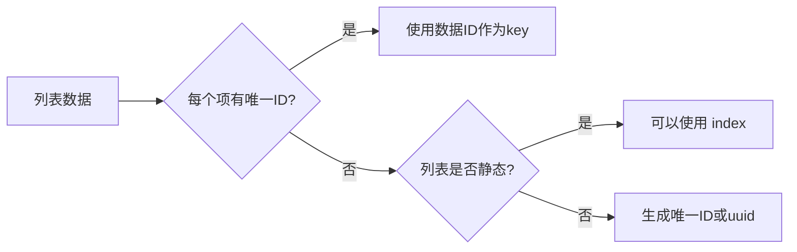

# JSX 语法

JSX 全称 JavaScript XML，是 Meta 推出的 JavaScript 语法扩展，允许开发者在 JS 代码中直接编写类似 HTML 的标记。浏览器无法直接识别 JSX，需要通过 **Babel** 或 **SWC** 等构建工具编译为标准 JavaScript。

## JSX 基本规则

### 表达式嵌入

在 JSX 中，使用花括号 `{}` 嵌入 JavaScript 表达式：

```tsx
const name = 'React'
const element = <h1>Hello, {name}!</h1>
// 渲染结果：<h1>Hello, React!</h1>
```

::: warning 注意
花括号内只能嵌入**表达式**（有返回值的代码），不能嵌入**语句**。以下写法是错误的：

```tsx
// ❌ 错误：花括号内是语句
<div>{const a = 1}</div>

// ✅ 正确：调用函数、三元表达式、变量等
<div>{getName()}</div>
<div>{isShow ? '显示' : '隐藏'}</div>
```
:::

### 一个 JSX 只能有一个根元素

```tsx
// ❌ 错误：多个根元素
function App() {
  return (
    <h1>Title</h1>
    <p>Content</p>
  )
}

// ✅ 方式一：包裹在 <div> 中
function App() {
  return (
    <div>
      <h1>Title</h1>
      <p>Content</p>
    </div>
  )
}

// ✅ 方式二：使用 Fragment（不会生成额外 DOM）
function App() {
  return (
    <>
      <h1>Title</h1>
      <p>Content</p>
    </>
  )
}
```

### 标签必须闭合

```tsx
// ❌ 错误
<input type="text">
<br>

// ✅ 正确
<input type="text" />
<br />
```

### 属性命名使用驼峰

JSX 中的 HTML 属性使用驼峰命名（camelCase），因为 JSX 本质是 JavaScript：

| HTML 属性 | JSX 属性 |
|-----------|----------|
| `class` | `className` |
| `for` | `htmlFor` |
| `tabindex` | `tabIndex` |
| `onclick` | `onClick` |
| `font-size` | `fontSize` |
| `background-color` | `backgroundColor` |

```tsx
// ❌ 错误
<div class="container" onclick="handleClick()">

// ✅ 正确
<div className="container" onClick={handleClick}>
```

### 内联样式

内联样式需要传递一个 JavaScript 对象：

```tsx
const style = {
  color: 'red',
  fontSize: '16px',       // 注意：font-size → fontSize
  backgroundColor: '#fff'
}

<div style={style}>内容</div>

// 也可以直接写
<div style={{ color: 'blue', marginTop: '10px' }}>内容</div>
```

## 条件渲染

React 中没有 Vue 的 `v-if` 指令，而是使用 JavaScript 原生能力实现条件渲染。

### 三元表达式

```tsx
function Greeting({ isLoggedIn }: { isLoggedIn: boolean }) {
  return (
    <div>
      {isLoggedIn ? <h1>欢迎回来！</h1> : <h1>请先登录</h1>}
    </div>
  )
}
```

### 逻辑与运算符 `&&`

```tsx
function Notification({ message }: { message?: string }) {
  return (
    <div>
      {message && <div className="alert">{message}</div>}
    </div>
  )
}
```

::: warning 注意
当 `message` 是 `0` 或 `NaN` 等 falsy 值时，`&&` 会直接渲染这个值（如 `0`）。推荐使用 `!!variable &&` 或 `variable ? <Component /> : null`。
:::

### 条件函数

```tsx
function StatusView({ status }: { status: 'loading' | 'success' | 'error' }) {
  const renderContent = () => {
    if (status === 'loading') return <Spinner />
    if (status === 'error') return <ErrorView />
    return <SuccessView />
  }

  return <div>{renderContent()}</div>
}
```

## 列表渲染

使用 `Array.map()` 渲染列表，**必须为每个元素提供 `key` 属性**：

```tsx
interface User {
  id: number
  name: string
  email: string
}

function UserList({ users }: { users: User[] }) {
  return (
    <ul>
      {users.map(user => (
        <li key={user.id}>
          <span>{user.name}</span>
          <span>{user.email}</span>
        </li>
      ))}
    </ul>
  )
}
```

### Key 值的注意事项



- **推荐**：使用数据中的唯一 ID 作为 key
- **可接受**：静态列表（不会增删排序）可使用 index
- **避免**：动态列表使用 index，会导致性能问题和状态错乱

## 事件处理

React 事件使用驼峰命名，传递函数引用而非字符串：

```tsx
function ClickDemo() {
  const handleClick = (e: React.MouseEvent<HTMLButtonElement>) => {
    e.preventDefault()
    console.log('按钮被点击')
  }

  const handleChange = (e: React.ChangeEvent<HTMLInputElement>) => {
    console.log(e.target.value)
  }

  const handleSubmit = (e: React.FormEvent<HTMLFormElement>) => {
    e.preventDefault()
    const formData = new FormData(e.currentTarget)
    console.log(formData.get('name'))
  }

  return (
    <div>
      <button onClick={handleClick}>点击</button>
      <input onChange={handleChange} placeholder="输入内容" />
      <form onSubmit={handleSubmit}>
        <input name="name" placeholder="姓名" />
        <button type="submit">提交</button>
      </form>
    </div>
  )
}
```

### 常用事件类型

| 事件 | 类型 | 说明 |
|------|------|------|
| `onClick` | `React.MouseEvent<T>` | 鼠标点击 |
| `onChange` | `React.ChangeEvent<T>` | 输入变化 |
| `onSubmit` | `React.FormEvent<T>` | 表单提交 |
| `onKeyDown` | `React.KeyboardEvent<T>` | 键盘按下 |
| `onFocus` | `React.FocusEvent<T>` | 获取焦点 |
| `onBlur` | `React.FocusEvent<T>` | 失去焦点 |
| `onScroll` | `React.UIEvent<T>` | 滚动事件 |
| `onTouchStart` | `React.TouchEvent<T>` | 触摸开始 |

### 事件传参

```tsx
function EventParams() {
  // 方式一：箭头函数包裹
  const handleDelete = (id: number) => {
    console.log('删除:', id)
  }

  return (
    <div>
      {items.map(item => (
        <button key={item.id} onClick={() => handleDelete(item.id)}>
          删除 {item.name}
        </button>
      ))}
    </div>
  )
}
```

::: tip 提示
`() => handleDelete(item.id)` 函数柯里化模式：渲染时只是创建一个箭头函数闭包，点击时才真正调用 `handleDelete`，避免了无限循环。
:::

### 阻止默认行为与事件冒泡

```tsx
function EventControl() {
  const handleClick = (e: React.MouseEvent) => {
    e.stopPropagation() // 阻止冒泡
    console.log('按钮点击')
  }

  const handleSubmit = (e: React.FormEvent) => {
    e.preventDefault() // 阻止默认提交
    console.log('表单提交')
  }

  return (
    <div onClick={() => console.log('父元素')}>
      <button onClick={handleClick}>阻止冒泡</button>
      <form onSubmit={handleSubmit}>
        <button type="submit">阻止默认</button>
      </form>
    </div>
  )
}
```

## JSX 编译原理

JSX 经过 Babel/SWC 编译后转换为 `React.createElement` 调用（或 React 19 的新 JSX 转换）：

```jsx
// 编译前
<div className="box">
  <h1>Hello</h1>
</div>

// 编译后（新 JSX 转换 - React 17+）
import { jsx as _jsx } from 'react/jsx-runtime'
_jsx('div', {
  className: 'box',
  children: _jsx('h1', { children: 'Hello' })
})
```

React 17+ 引入了新的 JSX 转换，无需在文件中显式 `import React from 'react'`，构建工具会自动处理。

## 下一步

掌握了 JSX 语法后，推荐学习：

- [组件开发](Components/index.md) - 创建和组织 React 组件
- [Hooks 详解](Hooks/index.md) - 使用 Hooks 为组件添加状态和逻辑
