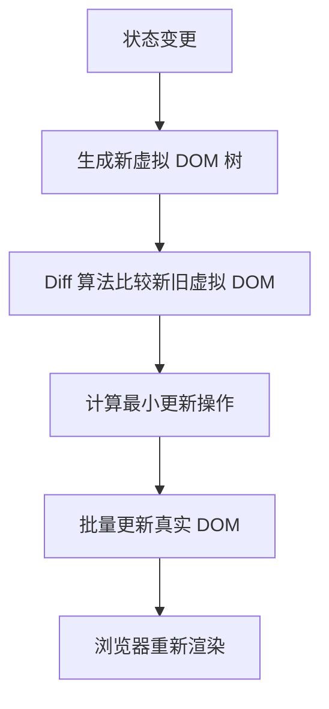

# React 概述与安装

::: info 版本现状（2026-08 核对）
React 当前稳定版为 **19.2.x**（19.0 于 2024-12 发布，19.2.8 为 2026-07 最新补丁）。并发渲染默认开启，Server Components 已稳定，React Compiler 可选接入。
:::

## React 简介

React 是由 Meta（原 Facebook）开源的用于构建用户界面的 JavaScript 库，自 2013 年发布以来，已经成为前端开发领域最流行的 UI 框架之一。React 采用**组件化**的开发模式，通过**虚拟 DOM** 技术实现高效的 UI 更新，并拥有庞大的**生态系统**。

截止 2026 年 4 月，React 最新稳定版本为 **React 19.2**，带来了 Server Components、Actions、新的 Hooks 等重大更新。

### React 核心特性

- **组件化架构**：将 UI 拆分为独立、可复用的组件
- **声明式编程**：以声明方式描述 UI 状态，React 负责高效更新 DOM
- **虚拟 DOM**：通过 Diffing 算法最小化真实 DOM 操作
- **单向数据流**：数据自顶向下传递，状态变更清晰可追踪
- **JSX 语法**：在 JavaScript 中编写类 HTML 标记
- **丰富的 Hooks**：函数组件中管理状态与副作用
- **并发渲染**：React 18+ 引入的并发特性，支持可中断渲染
- **Server Components**：React 19 稳定的服务端组件，减少客户端 JS 体积
- **Actions**：React 19 新增的表单和突变处理机制
- **文档架构升级**：React 19 文档全面转向 react.dev，采用全新设计

### React 19 重大更新

React 19 于 2024 年底发布，带来了以下重大更新：

**1. Actions**

Actions 是 React 19 引入的新的数据突变模式，简化了表单提交和异步操作：

```tsx
import { useFormStatus } from 'react-dom'

async function updateName(formData: FormData) {
  const name = formData.get('name')
  await fetch('/api/user', { method: 'POST', body: JSON.stringify({ name }) })
}

function ProfileForm() {
  return (
    <form action={updateName}>
      <input name="name" placeholder="姓名" />
      <SubmitButton />
    </form>
  )
}

function SubmitButton() {
  const { pending } = useFormStatus()
  return <button disabled={pending}>{pending ? '保存中...' : '保存'}</button>
}
```

**2. use() API**

`use()` 是一个新的 API，可以在渲染中读取 Promise 和 Context：

```tsx
import { use, Suspense } from 'react'

function UserProfile({ userId }: { userId: string }) {
  const user = use(fetchUser(userId))
  return <div>{user.name}</div>
}
```

**3. Server Components 稳定**

React Server Components 在 React 19 中正式稳定，可以在服务端渲染组件，减少客户端 JavaScript 体积。

**4. 新的 Hooks**

- `useActionState`：处理表单 Action 的状态管理
- `useOptimistic`：乐观更新 UI
- `useFormStatus`：在表单子组件中读取提交状态

**5. ref 作为 prop**

React 19 中，`ref` 可以直接作为 prop 传递，不再需要 `forwardRef`：

```tsx
function MyInput({ ref, placeholder }: { ref: React.Ref<HTMLInputElement>, placeholder: string }) {
  return <input ref={ref} placeholder={placeholder} />
}
```

**6. Context.Provider 简化**

```tsx
// React 18
<ThemeContext.Provider value="dark">...</ThemeContext.Provider>

// React 19
<ThemeContext value="dark">...</ThemeContext>
```

**7. 文档支持**

- `use` 可以在条件和循环中调用，打破了传统 Hooks 的顶层调用规则
- 改进了错误边界和 Suspense 的行为
- 更好的 TypeScript 支持

### React 与 Vue 对比

| 特性 | React | Vue |
|------|-------|-----|
| 开发者 | Meta | 社区驱动（尤雨溪主导） |
| 首次发布 | 2013 | 2014 |
| 编程范式 | 函数式 + JSX | 模板 + 选项式/组合式 |
| 数据绑定 | 单向数据流 | 双向绑定（v-model） |
| 状态管理 | Context/Redux/Zustand | Pinia/Vuex |
| TypeScript 支持 | 原生极佳 | 良好 |
| 社区生态 | 极其庞大 | 丰富 |
| 学习曲线 | 中等 | 较低 |
| 渲染机制 | 虚拟 DOM | 虚拟 DOM + 编译器优化 |

### 与 Angular 及 Svelte 的简要对比

| 维度 | React | Angular | Svelte |
|------|-------|---------|--------|
| 类型 | UI 库 | 完整框架 | 编译器 |
| 语言 | JSX/TSX | TypeScript | Svelte 语法 |
| 体积 | 中等 | 较大 | 极小 |
| 适合场景 | 通用 | 企业级应用 | 轻量交互 |

## 环境要求

在开始 React 项目之前，请确保开发环境满足以下要求：

- **Node.js**：推荐 v20.x 或更高版本
- **包管理器**：npm / yarn / pnpm / bun
- **代码编辑器**：推荐 VS Code + ES7+ React 扩展

## 创建 React 项目

### 官方推荐：使用 Vite

自 React 官方文档 2025 年改版后，**Vite** 已成为推荐的脚手架工具，替代了传统的 Create React App（CRA）：

```bash [终端]
npm create vite@latest my-react-app -- --template react-ts
```

或使用 pnpm：

```bash [终端]
pnpm create vite my-react-app --template react-ts
```

### 使用 Next.js（全栈场景）

如果项目需要 SSR、路由、API 等全栈能力，推荐使用基于 React 的 Next.js 框架：

```bash [终端]
npx create-next-app@latest my-next-app
```

### 项目结构

一个标准的 Vite + React 项目结构如下：

```
my-react-app/
├── public/              # 静态资源（不参与打包处理）
├── src/
│   ├── assets/          # 组件资源（图片、样式等）
│   ├── components/      # 可复用组件
│   ├── hooks/           # 自定义 Hooks
│   ├── pages/           # 页面组件
│   ├── stores/          # 状态管理
│   ├── utils/           # 工具函数
│   ├── App.tsx          # 根组件
│   ├── main.tsx         # 入口文件
│   └── index.css        # 全局样式
├── index.html           # HTML 模板
├── vite.config.ts       # Vite 配置
├── tsconfig.json        # TypeScript 配置
└── package.json         # 项目依赖
```

### 入口文件示例

```typescript [src/main.tsx]
import { StrictMode } from 'react'
import { createRoot } from 'react-dom/client'
import App from './App'
import './index.css'

createRoot(document.getElementById('root')!).render(
  <StrictMode>
    <App />
  </StrictMode>,
)
```

## React 渲染机制

### 虚拟 DOM 工作原理



React 的虚拟 DOM 本质上是一棵 JavaScript 对象树，Diff 算法通过以下策略优化比较：

1. **同层比较**：只比较同一层级的节点，不跨层级比较
2. **类型判断**：节点类型不同则直接替换整棵子树
3. **Key 属性**：通过 key 识别列表中的元素，优化增删操作

### React 19 并发特性

React 18 引入并发渲染，React 19 进一步完善：

- **useTransition**：标记非紧急更新
- **useDeferredValue**：延迟非关键数据的更新
- **Suspense**：声明式加载状态处理
- **Server Components**：在服务端渲染组件

## 核心设计理念

### 组件与 Props

React 应用由组件构成，组件接受 props 并返回 UI 描述：

```tsx
interface GreetingProps {
  name: string
  age?: number
}

function Greeting({ name, age }: GreetingProps) {
  return (
    <div>
      <h1>Hello, {name}!</h1>
      {age && <p>Age: {age}</p>}
    </div>
  )
}
```

### State 与响应式

React 使用 `useState` 管理组件内部状态：

```tsx
import { useState } from 'react'

function Counter() {
  const [count, setCount] = useState(0)

  return (
    <div>
      <p>Count: {count}</p>
      <button onClick={() => setCount(c => c + 1)}>+1</button>
    </div>
  )
}
```

## 包管理器镜像配置

国内安装依赖时推荐配置镜像源：

```bash [终端]
# npm
npm config set registry https://registry.npmmirror.com

# pnpm
pnpm config set registry https://registry.npmmirror.com

# yarn
yarn config set registry https://registry.npmmirror.com
```

## 下一步

现在你已经了解了 React 的基本概念和项目初始化方法，接下来可以学习：

- [JSX 语法](JSX/index.md) - 掌握 JSX 的写法和规则
- [组件开发](Components/index.md) - 深入学习组件开发
- [Hooks 详解](Hooks/index.md) - 掌握现代 React 的核心 Hooks
