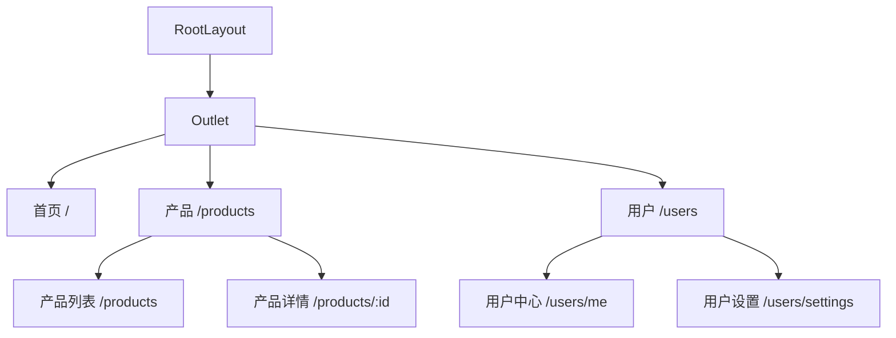

# 路由管理

::: info 版本现状
React Router 当前稳定版为 **8.x**（v8.0 于 2026-06 发布），7.x 仍在广泛使用；本文示例 API 在 v7/v8 间基本兼容。
:::

React 本身不包含路由功能，路由由第三方库实现。**React Router** 是最主流的选择，当前最新版本为 v8。

## 安装

```bash [终端]
npm install react-router-dom
```

## 基础路由配置

### 使用 createBrowserRouter（v6.4+ 推荐）

React Router v6.4 引入了 Data Router 模式：

```tsx
// router/index.tsx
import { createBrowserRouter, RouterProvider } from 'react-router-dom'
import RootLayout from '@/layouts/RootLayout'
import HomePage from '@/pages/HomePage'
import AboutPage from '@/pages/AboutPage'
import UserPage from '@/pages/UserPage'
import NotFoundPage from '@/pages/NotFoundPage'

const router = createBrowserRouter([
  {
    path: '/',
    element: <RootLayout />,
    errorElement: <NotFoundPage />,
    children: [
      { index: true, element: <HomePage /> },
      { path: 'about', element: <AboutPage /> },
      { path: 'users/:id', element: <UserPage /> },
    ],
  },
])

function App() {
  return <RouterProvider router={router} />
}
```

### 布局组件

```tsx
// layouts/RootLayout.tsx
import { Outlet, Link, NavLink } from 'react-router-dom'

function RootLayout() {
  return (
    <div className="app-layout">
      <nav>
        <NavLink
          to="/"
          className={({ isActive }) => (isActive ? 'active' : '')}
        >
          首页
        </NavLink>
        <NavLink to="/about">关于</NavLink>
      </nav>
      <main>
        <Outlet />  {/* 子路由渲染出口 */}
      </main>
    </div>
  )
}
```

## 路由导航

### 声明式导航

```tsx
import { Link, NavLink } from 'react-router-dom'

function Navigation() {
  return (
    <nav>
      {/* 基础链接 */}
      <Link to="/dashboard">仪表盘</Link>

      {/* 带状态的高亮链接 */}
      <NavLink
        to="/profile"
        className={({ isActive, isPending }) =>
          isPending ? 'pending' : isActive ? 'active' : ''
        }
      >
        个人中心
      </NavLink>
    </nav>
  )
}
```

### 编程式导航

```tsx
import { useNavigate } from 'react-router-dom'

function LoginForm() {
  const navigate = useNavigate()

  const handleLogin = async () => {
    await loginApi()
    navigate('/dashboard', { replace: true }) // replace 不产生历史记录
    // navigate(-1)  // 返回上一页
  }

  return <button onClick={handleLogin}>登录</button>
}
```

## 路由参数

### 动态路由参数

```tsx
import { useParams } from 'react-router-dom'

function UserPage() {
  const { id } = useParams<{ id: string }>()

  return <div>用户 ID: {id}</div>
}
```

### 查询参数

```tsx
import { useSearchParams } from 'react-router-dom'

function ProductList() {
  const [searchParams, setSearchParams] = useSearchParams()
  const page = Number(searchParams.get('page')) || 1
  const category = searchParams.get('category') || 'all'

  const handlePageChange = (newPage: number) => {
    setSearchParams({ page: String(newPage), category })
  }

  return (
    <div>
      <p>第 {page} 页，分类：{category}</p>
      <button onClick={() => handlePageChange(page + 1)}>下一页</button>
    </div>
  )
}
```

### 状态传参

```tsx
// 导航时传递状态
navigate('/detail', { state: { from: 'list', productId: 123 } })

// 目标页面获取状态
import { useLocation } from 'react-router-dom'

function DetailPage() {
  const location = useLocation()
  const { from, productId } = location.state as { from: string; productId: number }

  return <div>从 {from} 跳转，产品 ID: {productId}</div>
}
```

## 路由守卫

### 权限守卫

```tsx
// components/AuthGuard.tsx
import { Navigate, useLocation } from 'react-router-dom'
import { useAuthStore } from '@/stores/useAuthStore'

function AuthGuard({ children }: { children: React.ReactNode }) {
  const isAuthenticated = useAuthStore(s => s.isAuthenticated)
  const location = useLocation()

  if (!isAuthenticated) {
    // 重定向到登录页，记录来源地址
    return <Navigate to="/login" state={{ from: location }} replace />
  }

  return <>{children}</>
}

// 在路由中使用
{
  path: 'dashboard',
  element: (
    <AuthGuard>
      <DashboardPage />
    </AuthGuard>
  ),
}
```

### Loader 数据预加载

```tsx
// pages/UserPage.tsx
import { useLoaderData } from 'react-router-dom'

// 路由定义中配置 loader
{
  path: 'users/:id',
  element: <UserPage />,
  loader: async ({ params }) => {
    const res = await fetch(`/api/users/${params.id}`)
    if (!res.ok) throw new Response('未找到', { status: 404 })
    return res.json()
  },
}

// 组件中使用
function UserPage() {
  const user = useLoaderData() as User
  return <div>{user.name}</div>
}
```

## 嵌套路由与 Outlet



```tsx
const router = createBrowserRouter([
  {
    path: '/',
    element: <RootLayout />,
    children: [
      { index: true, element: <HomePage /> },
      {
        path: 'products',
        element: <ProductsLayout />,
        children: [
          { index: true, element: <ProductList /> },
          { path: ':id', element: <ProductDetail /> },
        ],
      },
      {
        path: 'users',
        element: <AuthGuard><UsersLayout /></AuthGuard>,
        children: [
          { path: 'me', element: <UserProfile /> },
          { path: 'settings', element: <UserSettings /> },
        ],
      },
    ],
  },
])
```

## 404 与错误处理

```tsx
// 404 路由（放在最后）
{ path: '*', element: <NotFoundPage /> }

// 错误页面
function ErrorPage() {
  const error = useRouteError() as { statusText?: string; message?: string }

  return (
    <div className="error-page">
      <h1>出错了！</h1>
      <p>{error.statusText || error.message}</p>
      <Link to="/">返回首页</Link>
    </div>
  )
}
```

## 路由懒加载

配合 `lazy` + `Suspense` 减少首屏加载体积：

```tsx
import { lazy, Suspense } from 'react'

const DashboardPage = lazy(() => import('@/pages/DashboardPage'))
const SettingsPage = lazy(() => import('@/pages/SettingsPage'))

const router = createBrowserRouter([
  {
    path: '/',
    element: <RootLayout />,
    children: [
      {
        path: 'dashboard',
        element: (
          <Suspense fallback={<PageSkeleton />}>
            <DashboardPage />
          </Suspense>
        ),
      },
      {
        path: 'settings',
        element: (
          <Suspense fallback={<PageSkeleton />}>
            <SettingsPage />
          </Suspense>
        ),
      },
    ],
  },
])
```

## 路由模式对比

### createBrowserRouter（推荐）

适用于大多数现代 React 应用：

- 支持 Data Router 模式
- 内置 loader 和 action
- 更好的错误处理

```tsx
import { createBrowserRouter } from 'react-router-dom'

const router = createBrowserRouter([
  {
    path: '/',
    element: <RootLayout />,
    children: [
      { index: true, element: <HomePage /> },
    ],
  },
])
```

### HashRouter

适用于静态部署或无法配置服务器重定向的场景：

```tsx
import { HashRouter, Routes, Route } from 'react-router-dom'

function App() {
  return (
    <HashRouter>
      <Routes>
        <Route path="/" element={<HomePage />} />
        <Route path="/about" element={<AboutPage />} />
      </Routes>
    </HashRouter>
  )
}
```

::: tip 使用场景
- **createBrowserRouter**：现代 Web 应用，支持服务器配置
- **HashRouter**：GitHub Pages 等静态托管，URL 带 `#` 号
- **MemoryRouter**：测试环境或 React Native
:::

## 路由配置分离

### 按模块组织路由

```typescript
// routes/auth.ts
export const authRoutes = [
  {
    path: 'auth',
    children: [
      { path: 'login', element: <LoginPage /> },
      { path: 'register', element: <RegisterPage /> },
      { path: 'forgot-password', element: <ForgotPasswordPage /> },
    ],
  },
]

// routes/dashboard.ts
export const dashboardRoutes = [
  {
    path: 'dashboard',
    element: <AuthGuard><DashboardLayout /></AuthGuard>,
    children: [
      { index: true, element: <DashboardHome /> },
      { path: 'analytics', element: <AnalyticsPage /> },
      { path: 'settings', element: <SettingsPage /> },
    ],
  },
]

// router/index.ts
import { createBrowserRouter } from 'react-router-dom'
import { authRoutes } from './auth'
import { dashboardRoutes } from './dashboard'

export const router = createBrowserRouter([
  {
    path: '/',
    element: <RootLayout />,
    children: [
      { index: true, element: <HomePage /> },
      ...authRoutes,
      ...dashboardRoutes,
    ],
  },
])
```

## 路由预加载

### 预加载路由组件

```tsx
import { useNavigate } from 'react-router-dom'

function ProductCard({ product }: { product: Product }) {
  const navigate = useNavigate()

  const handleClick = () => {
    // 预加载目标路由
    navigate(`/products/${product.id}`, { state: { from: 'list' } })
  }

  return (
    <div onClick={handleClick}>
      <h3>{product.name}</h3>
      <p>{product.price}</p>
    </div>
  )
}
```

### 使用 preload 属性

```tsx
import { Link } from 'react-router-dom'

function Navigation() {
  return (
    <nav>
      <Link to="/dashboard" preload="intent">
        仪表盘
      </Link>
      <Link to="/settings" preload="render">
        设置
      </Link>
    </nav>
  )
}
```

## 滚动行为管理

### 路由切换时滚动到顶部

```tsx
import { useEffect } from 'react'
import { useLocation } from 'react-router-dom'

function ScrollToTop() {
  const { pathname } = useLocation()

  useEffect(() => {
    window.scrollTo({ top: 0, behavior: 'smooth' })
  }, [pathname])

  return null
}

// 在根组件中使用
function App() {
  return (
    <>
      <ScrollToTop />
      <RouterProvider router={router} />
    </>
  )
}
```

### 保持滚动位置

```tsx
import { useLocation, useNavigationType } from 'react-router-dom'
import { useEffect, useRef } from 'react'

function ScrollManager() {
  const location = useLocation()
  const navType = useNavigationType()
  const scrollPositions = useRef(new Map())

  useEffect(() => {
    if (navType === 'POP') {
      // 后退时恢复滚动位置
      const pos = scrollPositions.current.get(location.pathname)
      if (pos) window.scrollTo(0, pos)
    } else {
      // 前进时保存当前位置
      scrollPositions.current.set(location.pathname, window.scrollY)
    }
  }, [location, navType])

  return null
}
```

## React Router v7 新特性

React Router v7（2025 年末发布）带来了重大更新，融合了 Remix 的特性：

- **文件路由**：基于文件系统的路由约定
- **SSR 支持**：内置服务端渲染能力
- **类型安全**：更好的 TypeScript 路由参数推导
- **Actions**：表单提交和服务端交互

```tsx
// React Router v7 文件路由示例
// routes/products.$id.tsx
export async function loader({ params }: LoaderFunctionArgs) {
  return getProduct(params.id)
}

export default function ProductPage() {
  const product = useLoaderData<typeof loader>()
  return <div>{product.name}</div>
}
```

## 下一步

- [生态系统](Ecosystem/index.md) - React 常用工具和库
- [最佳实践](BestPractices/index.md) - 开发中的常见模式和优化技巧
