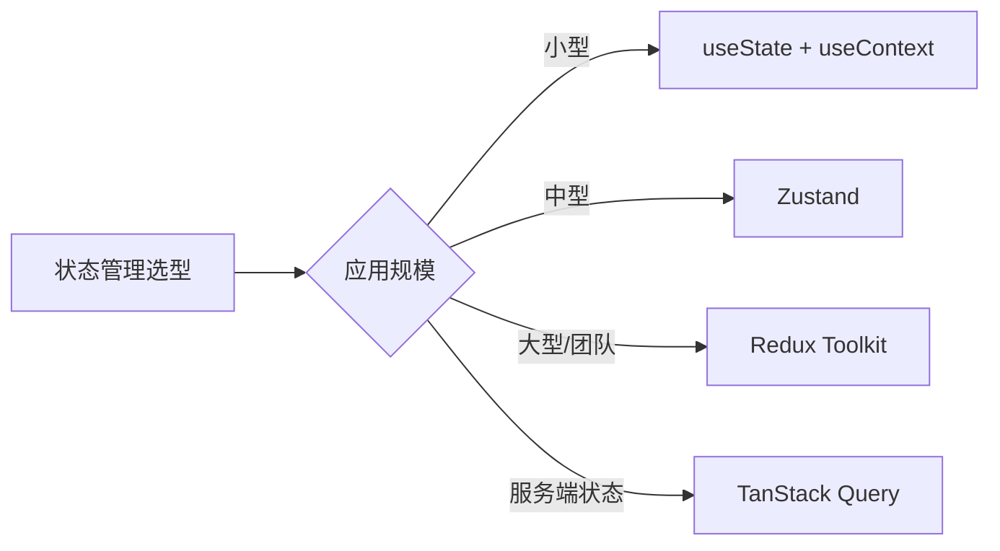
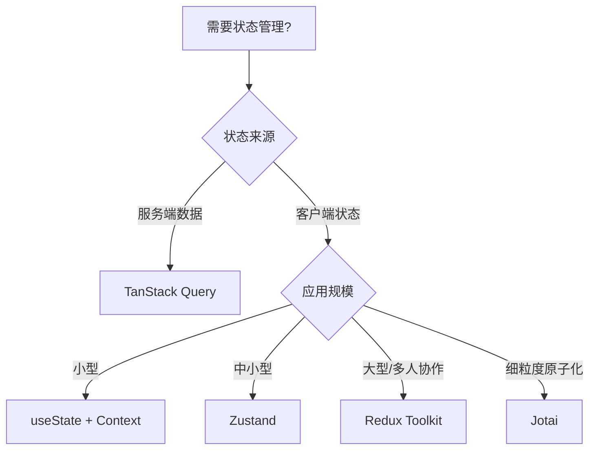

# 状态管理

React 本身提供了 `useState` 和 `useContext` 用于组件级和跨组件状态管理。随着应用规模增长，需要更强大的状态管理方案。本章介绍从基础到进阶的状态管理技术。

## 状态管理方案对比



| 方案 | 体积 | 学习成本 | 适用场景 | TypeScript |
|------|------|----------|----------|------------|
| useState + Context | 内置 | 低 | 小型项目 | ✅ |
| Zustand | ~1KB | 低 | 中小型项目 | ✅ 极佳 |
| Redux Toolkit | ~12KB | 中 | 大型项目 | ✅ |
| TanStack Query | ~12KB | 中 | 服务端状态 | ✅ 极佳 |
| Jotai | ~2KB | 低 | 原子化状态 | ✅ |
| MobX | ~16KB | 中 | OOP 风格项目 | ⚠️ |

## Context + useReducer

适合中型应用的轻量方案，无需额外依赖：

```tsx
// store/TodoContext.tsx
import { createContext, useContext, useReducer, type Dispatch } from 'react'

interface Todo {
  id: number
  text: string
  completed: boolean
}

type Action =
  | { type: 'ADD'; payload: string }
  | { type: 'TOGGLE'; payload: number }
  | { type: 'DELETE'; payload: number }

function todoReducer(state: Todo[], action: Action): Todo[] {
  switch (action.type) {
    case 'ADD':
      return [...state, { id: Date.now(), text: action.payload, completed: false }]
    case 'TOGGLE':
      return state.map(todo =>
        todo.id === action.payload ? { ...todo, completed: !todo.completed } : todo
      )
    case 'DELETE':
      return state.filter(todo => todo.id !== action.payload)
    default:
      return state
  }
}

const TodoContext = createContext<Todo[]>([])
const TodoDispatchContext = createContext<Dispatch<Action>>(() => {})

export function TodoProvider({ children }: { children: React.ReactNode }) {
  const [todos, dispatch] = useReducer(todoReducer, [])
  return (
    <TodoContext value={todos}>
      <TodoDispatchContext value={dispatch}>
        {children}
      </TodoDispatchContext>
    </TodoContext>
  )
}

export function useTodos() {
  return useContext(TodoContext)
}

export function useTodoDispatch() {
  return useContext(TodoDispatchContext)
}
```

## Zustand

Zustand 是目前最受欢迎的轻量级状态管理库，API 极简、TypeScript 支持完美。

### 安装

```bash [终端]
npm install zustand
```

### 基础使用

```typescript
// stores/useCounterStore.ts
import { create } from 'zustand'

interface CounterState {
  count: number
  increment: () => void
  decrement: () => void
  incrementBy: (value: number) => void
  reset: () => void
}

export const useCounterStore = create<CounterState>((set) => ({
  count: 0,
  increment: () => set((state) => ({ count: state.count + 1 })),
  decrement: () => set((state) => ({ count: state.count - 1 })),
  incrementBy: (value) => set((state) => ({ count: state.count + value })),
  reset: () => set({ count: 0 }),
}))
```

```tsx
// 组件中使用
import { useCounterStore } from '@/stores/useCounterStore'

function Counter() {
  const count = useCounterStore((state) => state.count)
  const increment = useCounterStore((state) => state.increment)

  return (
    <div>
      <p>{count}</p>
      <button onClick={increment}>+1</button>
    </div>
  )
}
```

### 实际场景：购物车

```typescript
// stores/useCartStore.ts
import { create } from 'zustand'

interface CartItem {
  id: string
  name: string
  price: number
  quantity: number
}

interface CartState {
  items: CartItem[]
  addItem: (item: Omit<CartItem, 'quantity'>) => void
  removeItem: (id: string) => void
  updateQuantity: (id: string, quantity: number) => void
  clearCart: () => void
  getTotal: () => number
}

export const useCartStore = create<CartState>((set, get) => ({
  items: [],
  
  addItem: (item) => set((state) => {
    const existing = state.items.find(i => i.id === item.id)
    if (existing) {
      return {
        items: state.items.map(i =>
          i.id === item.id ? { ...i, quantity: i.quantity + 1 } : i
        )
      }
    }
    return { items: [...state.items, { ...item, quantity: 1 }] }
  }),
  
  removeItem: (id) => set((state) => ({
    items: state.items.filter(item => item.id !== id)
  })),
  
  updateQuantity: (id, quantity) => set((state) => ({
    items: state.items.map(item =>
      item.id === id ? { ...item, quantity: Math.max(0, quantity) } : item
    )
  })),
  
  clearCart: () => set({ items: [] }),
  
  getTotal: () => {
    const state = get()
    return state.items.reduce((sum, item) => sum + item.price * item.quantity, 0)
  }
}))
```

```tsx
// 使用购物车
function Cart() {
  const items = useCartStore((state) => state.items)
  const removeItem = useCartStore((state) => state.removeItem)
  const updateQuantity = useCartStore((state) => state.updateQuantity)
  const getTotal = useCartStore((state) => state.getTotal)

  return (
    <div>
      {items.map(item => (
        <div key={item.id}>
          <span>{item.name}</span>
          <input
            type="number"
            value={item.quantity}
            onChange={e => updateQuantity(item.id, Number(e.target.value))}
          />
          <span>¥{item.price * item.quantity}</span>
          <button onClick={() => removeItem(item.id)}>删除</button>
        </div>
      ))}
      <div>总计：¥{getTotal()}</div>
    </div>
  )
}
```

### 异步操作

```typescript
// stores/useUserStore.ts
import { create } from 'zustand'

interface User {
  id: number
  name: string
  email: string
}

interface UserState {
  user: User | null
  loading: boolean
  error: string | null
  fetchUser: (id: number) => Promise<void>
  updateUser: (data: Partial<User>) => Promise<void>
}

export const useUserStore = create<UserState>((set) => ({
  user: null,
  loading: false,
  error: null,

  fetchUser: async (id) => {
    set({ loading: true, error: null })
    try {
      const res = await fetch(`/api/users/${id}`)
      const user = await res.json()
      set({ user, loading: false })
    } catch (e) {
      set({ error: (e as Error).message, loading: false })
    }
  },

  updateUser: async (data) => {
    set({ loading: true })
    try {
      const res = await fetch('/api/user', {
        method: 'PATCH',
        headers: { 'Content-Type': 'application/json' },
        body: JSON.stringify(data),
      })
      const updated = await res.json()
      set({ user: updated, loading: false })
    } catch (e) {
      set({ error: (e as Error).message, loading: false })
    }
  },
}))
```

### 持久化 & 中间件

```typescript
import { create } from 'zustand'
import { persist, devtools } from 'zustand/middleware'

interface ThemeState {
  theme: 'light' | 'dark'
  toggleTheme: () => void
}

export const useThemeStore = create<ThemeState>()(
  devtools(
    persist(
      (set) => ({
        theme: 'light',
        toggleTheme: () =>
          set((state) => ({ theme: state.theme === 'light' ? 'dark' : 'light' })),
      }),
      { name: 'theme-storage' } // 自动持久化到 localStorage
    ),
    { name: 'ThemeStore' } // DevTools 名称
  )
)
```

### 选择器优化

```tsx
// 避免不必要的重渲染
function CartCount() {
  // 只订阅 items 数组长度
  const count = useCartStore((state) => state.items.length)
  
  // 或者使用 shallow 比较
  const items = useCartStore((state) => state.items, shallow)
  
  return <span>购物车 ({count})</span>
}
```

## Redux Toolkit (RTK)

适合大型项目的状态管理方案，提供完整的工具链。

### 安装

```bash [终端]
npm install @reduxjs/toolkit react-redux
```

### 创建 Slice

```typescript
// store/features/counterSlice.ts
import { createSlice, type PayloadAction } from '@reduxjs/toolkit'

interface CounterState {
  value: number
  status: 'idle' | 'loading' | 'failed'
}

const initialState: CounterState = { value: 0, status: 'idle' }

const counterSlice = createSlice({
  name: 'counter',
  initialState,
  reducers: {
    increment: (state) => { state.value += 1 },
    decrement: (state) => { state.value -= 1 },
    incrementByAmount: (state, action: PayloadAction<number>) => {
      state.value += action.payload
    },
  },
})

export const { increment, decrement, incrementByAmount } = counterSlice.actions
export default counterSlice.reducer
```

::: tip Immer 魔法
RTK 内部集成了 Immer，允许在 reducer 中"直接修改" state，实际上 Immer 会自动生成不可变更新。
:::

### 异步 Thunk

```typescript
// store/features/userSlice.ts
import { createAsyncThunk, createSlice } from '@reduxjs/toolkit'

export const fetchUserById = createAsyncThunk(
  'user/fetchById',
  async (userId: number) => {
    const response = await fetch(`/api/users/${userId}`)
    return response.json()
  }
)

const userSlice = createSlice({
  name: 'user',
  initialState: { data: null, loading: false, error: null as string | null },
  reducers: {},
  extraReducers: (builder) => {
    builder
      .addCase(fetchUserById.pending, (state) => {
        state.loading = true
      })
      .addCase(fetchUserById.fulfilled, (state, action) => {
        state.loading = false
        state.data = action.payload
      })
      .addCase(fetchUserById.rejected, (state, action) => {
        state.loading = false
        state.error = action.error.message ?? 'Unknown error'
      })
  },
})
```

### 配置 Store

```typescript
// store/index.ts
import { configureStore } from '@reduxjs/toolkit'
import counterReducer from './features/counterSlice'
import userReducer from './features/userSlice'

export const store = configureStore({
  reducer: {
    counter: counterReducer,
    user: userReducer,
  },
})

export type RootState = ReturnType<typeof store.getState>
export type AppDispatch = typeof store.dispatch
```

### 类型安全 Hooks

```typescript
// store/hooks.ts
import { useDispatch, useSelector } from 'react-redux'
import type { RootState, AppDispatch } from './index'

export const useAppDispatch = useDispatch.withTypes<AppDispatch>()
export const useAppSelector = useSelector.withTypes<RootState>()
```

## TanStack Query（React Query）

专为服务端状态设计，解决请求缓存、自动刷新、乐观更新等问题：

```bash [终端]
npm install @tanstack/react-query
```

```tsx
import { QueryClient, QueryClientProvider, useQuery, useMutation } from '@tanstack/react-query'

const queryClient = new QueryClient()

function App() {
  return (
    <QueryClientProvider client={queryClient}>
      <TodoList />
    </QueryClientProvider>
  )
}

function TodoList() {
  const { data, isLoading, error } = useQuery({
    queryKey: ['todos'],
    queryFn: () => fetch('/api/todos').then(res => res.json()),
    staleTime: 5 * 60 * 1000, // 5分钟内不重新请求
  })

  const mutation = useMutation({
    mutationFn: (newTodo: { title: string }) =>
      fetch('/api/todos', {
        method: 'POST',
        body: JSON.stringify(newTodo),
      }).then(res => res.json()),
    onSuccess: () => {
      queryClient.invalidateQueries({ queryKey: ['todos'] })
    },
  })

  if (isLoading) return <div>加载中...</div>
  if (error) return <div>出错了</div>

  return (
    <div>
      {data?.map((todo: Todo) => <div key={todo.id}>{todo.title}</div>)}
    </div>
  )
}
```

## 状态管理选型指南



::: tip 推荐方案
2026 年的主流组合：**Zustand**（客户端状态）+ **TanStack Query**（服务端状态）。这套方案体积小、API 简单、TypeScript 支持完美，覆盖绝大多数场景。
:::

## 下一步

- [路由管理](Routing/index.md) - React Router 使用
- [生态系统](Ecosystem/index.md) - 常用工具和库
- [最佳实践](BestPractices/index.md) - 开发中的常见模式和优化技巧
