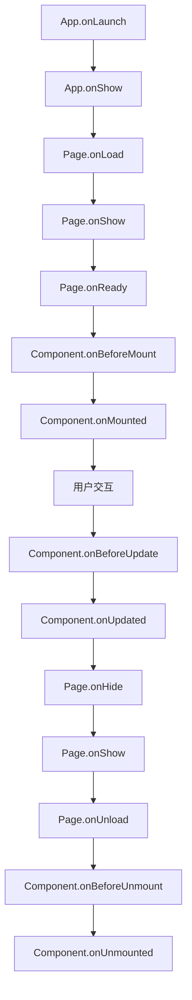

# Uniapp 生命周期

## 应用生命周期

在 App.vue 中定义：

```vue [App.vue]
<script>
export default {
  // 应用初始化完成（全局只触发一次）
  onLaunch() {
    console.log('应用启动')
  },

  // 应用显示到前台
  onShow() {
    console.log('应用显示')
  },

  // 应用隐藏到后台
  onHide() {
    console.log('应用隐藏')
  },

  // 应用发生脚本错误或 API 调用报错
  onError(err) {
    console.error('应用错误:', err)
  },

  // 页面不存在时触发
  onPageNotFound() {
    console.log('页面不存在')
  },

  // 未处理的 Promise 拒绝
  onUnhandledRejection(err) {
    console.error('未处理的 Promise 拒绝:', err)
  },

  // 内存不足时触发（仅 App）
  onThemeChange() {
    console.log('系统主题切换')
  }
}
</script>
```

## 页面生命周期

```vue [pages/index/index.vue]
<script setup>
import {
  onLoad,
  onShow,
  onReady,
  onHide,
  onUnload,
  onPullDownRefresh,
  onReachBottom,
  onShareAppMessage,
  onShareTimeline,
  onPageScroll,
  onResize,
  onTabItemTap
} from '@dcloudio/uni-app'

// 页面加载（全局只触发一次，可接收参数）
onLoad((options) => {
  console.log('页面加载', options)
})

// 页面显示（每次进入页面都触发）
onShow(() => {
  console.log('页面显示')
})

// 页面初次渲染完成
onReady(() => {
  console.log('页面渲染完成')
})

// 页面隐藏
onHide(() => {
  console.log('页面隐藏')
})

// 页面卸载
onUnload(() => {
  console.log('页面卸载')
})

// 下拉刷新
onPullDownRefresh(() => {
  console.log('下拉刷新')
  setTimeout(() => {
    uni.stopPullDownRefresh()
  }, 1000)
})

// 上拉触底
onReachBottom(() => {
  console.log('上拉触底')
})

// 页面滚动
onPageScroll((e) => {
  console.log('滚动位置:', e.scrollTop)
})

// 页面尺寸变化
onResize((e) => {
  console.log('尺寸变化:', e.size)
})

// 点击 tab 栏
onTabItemTap((e) => {
  console.log('点击 tab:', e.index)
})
</script>
```

## 组件生命周期

```vue [components/MyComponent.vue]
<script setup>
import {
  onBeforeMount,
  onMounted,
  onBeforeUpdate,
  onUpdated,
  onBeforeUnmount,
  onUnmounted,
  onErrorCaptured
} from 'vue'

// 组件实例初始化之前
onBeforeMount(() => {
  console.log('组件挂载前')
})

// 组件实例挂载之后
onMounted(() => {
  console.log('组件挂载后')
})

// 组件更新之前
onBeforeUpdate(() => {
  console.log('组件更新前')
})

// 组件更新之后
onUpdated(() => {
  console.log('组件更新后')
})

// 组件实例卸载之前
onBeforeUnmount(() => {
  console.log('组件卸载前')
})

// 组件实例卸载之后
onUnmounted(() => {
  console.log('组件卸载后')
})

// 捕获子组件错误
onErrorCaptured((err, instance, info) => {
  console.error('捕获子组件错误:', err)
  return false
})
</script>
```

## 生命周期执行顺序



## 生命周期使用场景

| 生命周期 | 适用场景 |
|----------|----------|
| `onLaunch` | 初始化全局数据、检查登录状态 |
| `onShow` | 恢复应用状态、刷新数据 |
| `onHide` | 保存应用状态、暂停任务 |
| `onLoad` | 接收页面参数、请求数据 |
| `onReady` | DOM 操作、创建地图/视频等 |
| `onPullDownRefresh` | 下拉刷新数据 |
| `onReachBottom` | 上拉加载更多 |
| `onMounted` | DOM 操作、初始化第三方库 |
| `onUnmounted` | 清理定时器、取消订阅 |

## 生命周期示例

### 下拉刷新

```vue [pages/list/index.vue]
<script setup>
import { ref } from 'vue'
import { onPullDownRefresh, onReachBottom } from '@dcloudio/uni-app'

const list = ref([])
const page = ref(1)
const hasMore = ref(true)

const loadData = async (isRefresh = false) => {
  if (isRefresh) {
    page.value = 1
    list.value = []
  }

  const res = await fetch(`/api/list?page=${page.value}`)
  const data = await res.json()

  if (isRefresh) {
    list.value = data.list
  } else {
    list.value = [...list.value, ...data.list]
  }

  hasMore.value = data.hasMore
}

onPullDownRefresh(async () => {
  await loadData(true)
  uni.stopPullDownRefresh()
})

onReachBottom(() => {
  if (hasMore.value) {
    page.value++
    loadData()
  }
})
</script>
```

### 页面参数处理

```vue [pages/detail/index.vue]
<script setup>
import { ref } from 'vue'
import { onLoad, onShow } from '@dcloudio/uni-app'

const detail = ref(null)
const id = ref('')

onLoad((options) => {
  id.value = options.id
  loadDetail()
})

onShow(() => {
  if (id.value) {
    loadDetail()
  }
})

const loadDetail = async () => {
  const res = await fetch(`/api/detail/${id.value}`)
  detail.value = await res.json()
}
</script>
```
