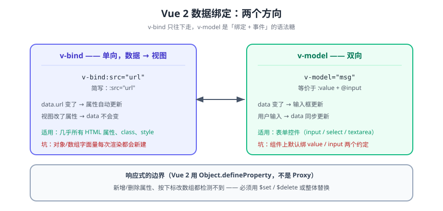

# 数据绑定

> Vue 2 的数据绑定有两个方向：`v-bind` 往下（数据 → 视图），`v-model` 双向（表单控件的值与数据互相同步）。理解它们的关键是先理解 Vue 2 用 `Object.defineProperty` 实现的**响应式**——**只有能被它劫持的属性才是响应式的**，这条决定了本页所有陷阱。



## 一句话定位

`v-bind` 是**单向**的：数据变了视图变，用户改了视图数据不变。`v-model` 是**语法糖**：它等于「`:value` 绑定 + `@input` 回写」，所以它的行为取决于所在的表单元素。

## 一、`v-bind`：数据 → 视图

```vue
<template>
  <div>
    <!-- 简写：v-bind:id 写作 :id -->
    

    <!-- 绑定对象：一次传多个属性 -->
    <button v-bind="btnProps">按钮</button>

    <!-- class / style 支持数组与对象语法 -->
    <p :class="['base', { active: isActive }]" :style="{ color: color, fontSize: size + 'px' }">
      文本
    </p>

    <!-- 绑定到自定义组件的 prop（这不是 DOM 属性） -->
    <PostCard :post="post" :show-meta="true" />
  </div>
</template>
```

| 写法 | 说明 | 易错点 |
| --- | --- | --- |
| `v-bind="obj"` | 展开一个对象为多个属性 | 对象里的键会**全部**成为属性，容易把无关字段也传下去 |
| `:class="[a, b]"` | 数组语法，可混对象 | 数组里 `null` / `undefined` 会被忽略（可用于条件类名） |
| `:style="{...}"` | 对象语法，键用驼峰 | 自带单位的属性（如 `fontSize`）需要自己拼单位 |
| `:key` | 列表渲染的复用标识 | 不用 `:key` 会影响 diff 与组件状态保持 |
| `v-bind.sync` | 允许子组件改父级数据（Vue 2 特有） | Vue 3 已移除，改用 `v-model:prop` |

::: tip `v-bind` 与 HTML 属性的区别
`:src="x"` 绑的是 **DOM 属性（property）**，不是 HTML attribute。区别在特殊属性上很明显：`<input :value>` 绑的是当前值，而 `<input value>`（attribute）只在初始渲染生效。写 `v-bind` 时就当它绑的是 JS 属性。
:::

## 二、`v-model`：双向绑定

```vue
<template>
  <div>
    <input v-model="name" />                          <!-- text -->
    <textarea v-model="desc" />                       <!-- 多行 -->
    <input type="checkbox" v-model="agreed" />        <!-- boolean -->
    <input type="checkbox" v-model="hobbies" value="read" />  <!-- 数组收集 -->
    <input type="radio" v-model="gender" value="m" /> <!-- 单选 -->
    <select v-model="city">                           <!-- 选择 -->
      <option value="bj">北京</option>
      <option value="sh">上海</option>
    </select>
  </div>
</template>
```

**它是语法糖**，展开后是：

```vue
<!-- 本质：v-model 展开 -->
<input :value="name" @input="name = $event.target.value" />

<!-- 自定义组件上的 v-model（Vue 2 默认 prop=value，event=input） -->
<MyInput :value="name" @input="name = $event" />
```

### 修改符

| 修饰符 | 作用 | 等价写法 |
| --- | --- | --- |
| `.lazy` | 从 `input` 事件改为 `change` 事件（失焦/回车才同步） | `@change` |
| `.number` | 自动把输入转成数字 | `parseFloat($event.target.value)` |
| `.trim` | 自动去掉首尾空格 | `$event.target.value.trim()` |

```vue
<input v-model.number.lazy.trim="age" />
```

::: danger `.trim` 放在链上时，`.number` 也会失效
修饰符按书写顺序**从左到右**应用。`v-model.number.trim` 先转数字再 trim（数字没有 trim，等于没生效）。正确顺序是 `v-model.trim.number`。
:::

## 三、Vue 2 响应式的边界

Vue 2 通过 `Object.defineProperty` 递归劫持数据的 getter/setter，所以**只有**下面这些变化能被侦测：

| 操作 | 是否响应式 | 正确写法 |
| --- | --- | --- |
| 修改已有属性 `obj.a = 1` | ✅ | — |
| **新增属性** `obj.newKey = 1` | ❌ | `Vue.set(obj, 'newKey', 1)` 或 `this.$set(...)` |
| **删除属性** `delete obj.a` | ❌ | `Vue.delete(obj, 'a')` 或 `this.$delete(...)` |
| 数组索引赋值 `arr[0] = x` | ❌ | `arr.splice(0, 1, x)` |
| 修改数组长度 `arr.length = 0` | ❌ | `arr.splice(0)` |
| 数组的变更方法（`push`/`pop`/`splice`/`sort`/`reverse`/`shift`/`unshift`） | ✅ | — |
| 替换整个数组 `arr = newArr` | ✅ | — |

```javascript
// 对象新增属性：必须用 $set，否则视图不更新（且不会有任何报错）
this.$set(this.form, 'nickname', 'xiaoai');

// 数组按下标改：用 splice 而不是下标赋值
this.list.splice(index, 1, newItem);

// 整表替换最简单：直接赋新数组
this.list = this.list.filter(i => i.id !== id);
```

## 四、单向数据流：为什么子组件不该改 prop

Vue 的规则是「**父给子的 prop 只读**」。子组件直接改 prop 时：

- 基本类型：Vue 2 会在控制台警告「Avoid mutating a prop directly」；
- 引用类型（对象/数组）：**不会警告，而且会真的改到父级数据**——这是最隐蔽的一类 bug。

正确的三种做法：

```javascript
// ① 用本地副本（简单，但父级更新时不会自动同步）
data() { return { localName: this.name }; }

// ② 子 emit 事件，父级决定改不改（推荐）
this.$emit('update:name', newVal);      // 配合 .sync 修饰符
// 父级： <MyInput :name.sync="name" />

// ③ 用计算属性做「可写代理」
computed: {
  proxyName: {
    get() { return this.name; },
    set(v) { this.$emit('update:name', v); },
  },
}
```

::: danger 三条
1. **对象型 prop 被直接改**：没有警告、没有报错，父级数据被静默污染。排查方式是把 prop 在子组件里「解构展开」而不是直接引用。
2. **`v-model` 用在自定义组件上时 prop 名固定为 `value`**（Vue 2）：如果组件本身还有一个叫 `value` 的业务字段，会冲突。Vue 3 用 `modelValue` 解决了这一点，迁移时要注意。
3. **深度监听 `deep: true` 有性能代价**：它必须递归遍历，大对象上会明显变慢。优先监听具体字段，或用 `$set` 主动触发更新。
:::

## 五、验证方式

```shell
# ① 输入框双向同步
#    打开页面 → 在输入框输入内容 → 观察页面上显示的同名字段同步变化
# ② 数组下标赋值的响应式边界
#    Vue DevTools 里执行：vm.list[0] = 'x'   → 视图不变（预期行为）
#    Vue DevTools 里执行：vm.$set(vm.list, 0, 'x') → 视图更新
#    期望：两者行为差异与本节表格一致

# ③ 未使用 $set 时不产生报错（这是"最难发现"的证据）
#    控制台应安静无警告 —— 说明它确实不会自我暴露
```

三条都符合预期，才算真的理解「响应式边界」而不是背下了表格。

## 六、深入阅读

- [Vue 2 响应式原理](../Reactivity/index.md)（`Object.defineProperty` 的依赖收集与更新派发）
- [计算属性](../Computed/index.md)｜[侦听器](../Watch/index.md)：派生数据与副作用的两条路
- [列表渲染](../ListRendering/index.md)：`v-for` 与 `:key` 的配合
- Vue 2 官方文档 · 表单输入绑定：[v2.vuejs.org/v2/guide/forms.html](https://v2.vuejs.org/v2/guide/forms.html)
