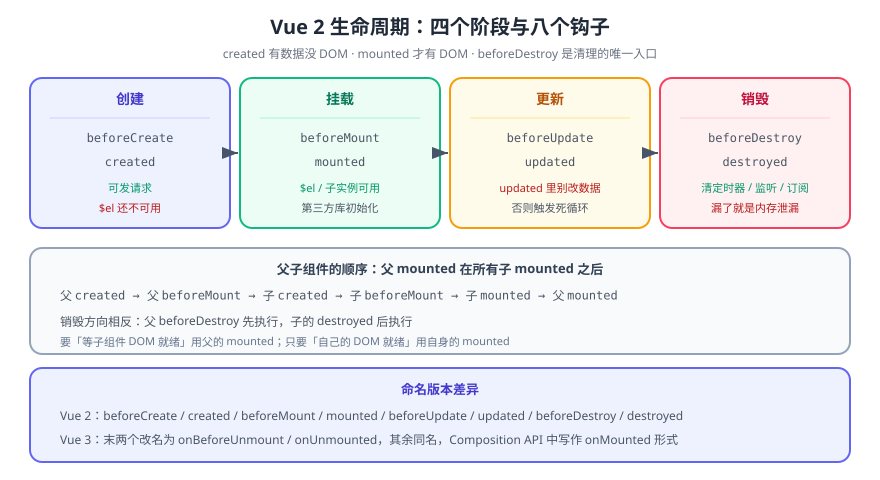

# 生命周期

> 生命周期钩子是 Vue 2 在「创建 → 挂载 → 更新 → 销毁」这条链上留给你的**插入点**。用错钩子的表现往往是「偶尔拿不到 DOM」或「定时器没清干净」，本页把顺序、每个钩子的可用能力、以及 Vue 2 与 Vue 3 的命名差异一次讲清。



## 一句话定位

记住三件事就够用：**`created` 能拿数据但拿不到 DOM**、**`mounted` 能拿 DOM**、**`beforeDestroy` 是清理的唯一入口**。其余钩子都是这三条的细化。

## 一、八个钩子与各自的能力

| 钩子 | 触发时机 | 此时能做什么 | 典型用途 |
| --- | --- | --- | --- |
| `beforeCreate` | 实例初始化后，数据劫持**之前** | 几乎没有可用的东西 | 插件注入（少见） |
| `created` | 数据观测、`methods`、`computed` 就绪 | **能访问 `data` / `methods`，不能访问 `$el`** | 发请求、初始化非 DOM 状态 |
| `beforeMount` | 模板编译完成，尚未替换 `$el` | `render` 函数第一次被调用 | 极少使用 |
| `mounted` | **已被挂载进 DOM** | 能拿到 `this.$el` 与子组件实例 | DOM 操作、初始化需要真实尺寸的第三方库 |
| `beforeUpdate` | 数据变化、DOM 重新渲染**之前** | 数据已是新值，DOM 还是旧值 | 读取更新前的 DOM 状态 |
| `updated` | DOM 重新渲染**之后** | DOM 已是新值；**不能在钩子里改数据**（会再触发更新） | 需要在更新后重新测量 DOM |
| `beforeDestroy` | 实例销毁**之前**，实例仍完全可用 | 还能访问 `data`、`$el`、事件 | **清理定时器、事件监听、订阅** |
| `destroyed` | 实例销毁之后 | 所有子实例、指令已解绑，`$el` 仍在但无响应 | 最后的日志/埋点 |

::: danger `updated` 里改数据 = 死循环
`updated` 触发后你改数据 → 又触发更新 → 又进 `updated`。Vue 不会报错，页面可能「看起来在抖」。正确做法是：**任何会改数据的副作用都放在 `watch` / `methods` / 事件里**，`updated` 只做「读取与副作用外发」。
:::

## 二、顺序：父子组件谁先谁后

```text
父 beforeCreate → 父 created → 父 beforeMount
        ↓ 进入子组件
   子 beforeCreate → 子 created → 子 beforeMount → 子 mounted
        ↓ 回到父
父 mounted
```

**结论**：父组件的 `mounted` 在**所有子组件挂载完成后**才触发。所以：

- 需要「等子组件 DOM 都就绪」→ 用父的 `mounted`；
- 需要「自己的 DOM 就绪」→ 用自己的 `mounted`，不必等下层的。

销毁方向相反：**父先 `beforeDestroy`，子后 `destroyed`**。

```javascript
// 用一个最小例把顺序打出来（在浏览器控制台或临时页面里跑）
export default {
  beforeCreate() { console.log('beforeCreate'); },
  created() { console.log('created'); },
  beforeMount() { console.log('beforeMount'); },
  mounted() { console.log('mounted'); },
  beforeDestroy() { console.log('beforeDestroy'); },
  destroyed() { console.log('destroyed'); },
};
```

## 三、三个特殊钩子

| 钩子 | 场景 | 说明 |
| --- | --- | --- |
| `activated` / `deactivated` | `<keep-alive>` 缓存组件 | 被缓存而不销毁时触发；**此时 `mounted` 只跑一次** |
| `errorCaptured(err, vm, info)` | 捕获后代组件抛出的错误 | 返回 `false` 可阻止继续向上冒泡 |
| `v-once` 所在组件 | 只渲染一次 | 与生命周期无关，但常被放在一起问 |

::: warning `<keep-alive>` 是「取不到 `mounted`」的头号原因
组件被缓存后从列表页返回详情页，`mounted` **不会再次执行**——刷新数据必须放在 `activated` 里。这类 bug 表现为「第二次进页面显示的还是旧数据」，且没有任何警告。
:::

## 四、清理：`beforeDestroy` 的固定清单

```javascript
export default {
  data() {
    return { timer: null, ws: null };
  },
  mounted() {
    // 需要清理的三类资源
    this.timer = setInterval(this.poll, 5000);                       // ① 定时器
    window.addEventListener('resize', this.onResize);                // ② 全局事件
    this.ws = new WebSocket('wss://example.com/ws');                 // ③ 长连接/订阅
  },
  beforeDestroy() {
    clearInterval(this.timer);                                       // ①
    window.removeEventListener('resize', this.onResize);             // ②
    this.ws && this.ws.close();                                      // ③
    this.bus.$off('post-updated', this.onUpdated);                   // ④ 事件总线
  },
};
```

::: danger 三类「不报错但错」的遗漏
1. **`setInterval` 没清**：组件销毁后回调仍在跑，`this` 指向已销毁实例——表现为「切了路由但接口还在请求」。
2. **全局事件没解绑**：`window`/`document` 上的监听器不会随组件销毁消失，多次进出页面会累积。
3. **事件总线 `$off` 没写**：`$on` 的回调会一直留在总线里，一条消息触发 N 次（N = 进出页面的次数）。
:::

## 五、Vue 2 与 Vue 3 的命名差异

| Vue 2 | Vue 3（Composition API 等价物） | 说明 |
| --- | --- | --- |
| `beforeCreate` / `created` | `setup()` 本体 | `setup` 在两个钩子之间执行 |
| `beforeMount` / `mounted` | `onBeforeMount` / `onMounted` | `beforeMount` 极少用 |
| `beforeUpdate` / `updated` | `onBeforeUpdate` / `onUpdated` | — |
| `beforeDestroy` / `destroyed` | **`onBeforeUnmount` / `onUnmounted`** | 改名了，语义相同 |
| `activated` / `deactivated` | `onActivated` / `onDeactivated` | — |
| `errorCaptured` | `onErrorCaptured` | 名称一致 |

::: warning 迁移时 `beforeDestroy` 会被静默忽略
Vue 3 把 `destroy` 系列改成了 `unmount`：在 Vue 3 里写 `beforeDestroy` **不会报错，也不会执行**——清理逻辑静默失效。迁移检查时务必全局搜索 `beforeDestroy` 与 `destroyed`。
:::

## 六、验证方式

```shell
# ① 打顺序：把第 8 行的最小例挂到页面上，打开控制台
#    期望输出（进入页面）：beforeCreate → created → beforeMount → mounted
#    期望输出（切走页面）：beforeDestroy → destroyed

# ② 父子顺序：父页面里嵌套一个子组件，确认子 mounted 先于父 mounted
# ③ keep-alive：在列表页 ↔ 详情页之间来回切
#    期望：mounted 只打印一次，activated 每次都打印

# ④ 清理是否生效（最重要的一条）：
#    进页面 → 切走 → 在控制台看 Network 面板
#    期望：切走后不再有轮询请求（若仍有，说明 setInterval 没清）
```

## 七、深入阅读

- [响应式原理](../Reactivity/index.md)：数据变化如何驱动 `beforeUpdate` / `updated`
- [计算属性](../Computed/index.md)｜[侦听器](../Watch/index.md)：副作用应该放的地方
- [Vue 3 生命周期](../../../Vue3/Lifecycle/index.md)：`onMounted` 等 Composition API 写法
- Vue 2 官方文档 · 生命周期钩子：[v2.vuejs.org/v2/api/#选项-生命周期钩子](https://v2.vuejs.org/v2/api/#%E9%80%89%E9%A1%B9-%E7%94%9F%E5%91%BD%E5%91%A8%E6%9C%9F%E9%92%A9%E5%AD%90)
