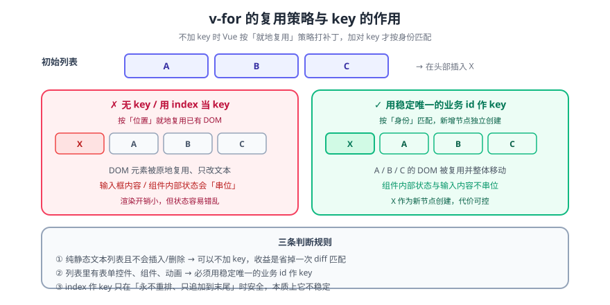

# 列表渲染

> `v-for` 是 Vue 2 里做列表的唯一入口，但它真正难的地方只有两个：**`:key` 该怎么给**，以及**为什么我改了数组视图没更新**。这两点都由 Vue 2 的响应式实现方式决定。



## 一句话定位

`v-for="item in items"` 把数组里的每一项渲染成一份模板。`:key` 告诉 Vue「这一项是谁」——**没有 key 时 Vue 按位置复用 DOM**，有 key 时按身份复用，这决定了下标变化时会不会出现「输入框内容跟着串位」。

## 一、基本语法

```vue
<template>
  <ul>
    <!-- 数组：值 + 下标 -->
    <li v-for="(item, index) in list" :key="item.id">
      {{ index }} - {{ item.name }}
    </li>

    <!-- 对象：值 + 键 + 下标 -->
    <li v-for="(value, key, index) in obj" :key="key">{{ key }}: {{ value }}</li>

    <!-- 数字：从 1 开始 -->
    <span v-for="n in 5" :key="n">{{ n }}</span>

    <!-- 字符串：按字符遍历（少见） -->
    <span v-for="(ch, i) in 'abc'" :key="i">{{ ch }}</span>
  </ul>
</template>
```

| 写法 | 遍历对象 | 说明 |
| --- | --- | --- |
| `v-for="item in list"` | 数组 | 最常用 |
| `v-for="(item, i) in list"` | 数组 | `i` 是下标 |
| `v-for="(v, k, i) in obj"` | 对象 | 顺序为 `Object.keys` 的顺序（不保证是插入顺序） |
| `v-for="n in 5"` | 数字 | `n` 从 **1** 开始到 5 |
| `v-for` + `v-if` | — | **同一元素上 Vue 2 中 `v-for` 优先级更高**（见陷阱） |

## 二、`:key` 的作用（本页最重要的部分）

### 不给 key 会发生什么

Vue 采用「就地复用」策略：**按下标复用 DOM 元素**，只改内容。请看这个经典现象：

```vue
<!-- 反例：没有 :key，列表头部插入一项 -->
<li v-for="item in list">
  <input type="text" />          <!-- 用户已输入内容的输入框 -->
  <span>{{ item.name }}</span>
</li>
```

在列表头部插入一项后：`item.name` 都往后挪了一位并正确渲染，但**输入框里的内容没动**——因为 DOM 元素被复用了，而输入框的值是 DOM 状态，不由 `item` 决定。结果是「数据对了、输入串位了」。

### key 的选择

| 值 | 是否推荐 | 原因 |
| --- | --- | --- |
| **业务唯一 id** | ✅ 推荐 | 身份稳定，插入/删除/排序都能正确复用 |
| 数组下标 `index` | ⚠️ 仅当列表**只追加不改序** | 插入/删除会让所有后续项 key 变化 → 全部重建，失去复用意义，且状态串位 |
| `Math.random()` / `Date.now()` | ❌ 禁止 | key 每次渲染都变 → 每次都全量重建，性能与状态全崩 |
| 内容字符串（如 `item.title`） | ⚠️ | 内容可能重复 → key 重复会报警告；内容变化时会重建 |

```vue
<!-- 正例：用稳定 id；列表只追加不改序时用 index 也能接受 -->
<li v-for="post in posts" :key="post.id">{{ post.title }}</li>
```

## 三、数组与对象的变更检测边界

Vue 2 用 `Object.defineProperty` 劫持属性，因此**部分修改方式是侦测不到的**。这条与[数据绑定](../DataBinding/index.md)同源，列表里尤其常见：

| 操作 | 响应式 | 正确写法 |
| --- | --- | --- |
| `list.push(x)` / `pop()` / `shift()` / `unshift()` | ✅ | — |
| `list.splice(i, 1, x)` / `sort()` / `reverse()` | ✅ | — |
| `list[0] = x` | ❌ | `list.splice(0, 1, x)` 或 `this.$set(list, 0, x)` |
| `list.length = 0` | ❌ | `list.splice(0)` |
| `list = newList` | ✅ | 整表替换最省事 |
| `obj.newKey = 1` | ❌ | `this.$set(obj, 'newKey', 1)` |
| `delete obj.key` | ❌ | `this.$delete(obj, 'key')` |

::: tip 优先「整表替换」
`this.list = this.list.filter(...)` 既可读又一定响应式，比 `splice` 的可读性好得多。**只有在需要保留同一数组引用（如依赖引用相等做 `watch`）时才用 `splice`。**
:::

## 四、`v-for` 与 `v-if` 的优先级陷阱

::: danger Vue 2 里 `v-for` 优先级**高于** `v-if`
写在同一元素上时，Vue 2 会**先遍历整个列表，再对每一项判断 `v-if`**——即使条件对多数项为假，遍历与组件创建仍会发生。正确做法是把 `v-if` 提到外层容器，或先用计算属性过滤：

```vue
<!-- 反例：每一项都要判断，且 v-if 无法访问 v-for 的变量（除非它在同一作用域） -->
<li v-for="post in posts" v-if="post.published" :key="post.id">{{ post.title }}</li>

<!-- 正例一：外层判断（条件对整个列表成立时） -->
<ul v-if="posts.length">
  <li v-for="post in posts" :key="post.id">{{ post.title }}</li>
</ul>

<!-- 正例二：用计算属性先过滤（条件逐项不同时） -->
<li v-for="post in publishedPosts" :key="post.id">{{ post.title }}</li>
```

> Vue 3 中两者的优先级**反过来了**（`v-if` 更高），所以从 Vue 2 迁移时这一段是必须逐处核对的。
:::

## 五、列表性能：三个可量化动作

| 动作 | 做法 | 收益 |
| --- | --- | --- |
| 稳定 key | 用业务 id，不用下标/随机数 | 避免无谓重建，保留组件状态 |
| 虚拟滚动 | 长列表（>1000 行）改用虚拟列表组件 | DOM 数量恒定，滚动不掉帧 |
| 分页/懒加载 | 不要一次渲染全部数据 | 首屏与内存占用同步下降 |

## 六、验证方式

```shell
# ① key 的作用（用一个可复现的小例子）
#    渲染 3 个带 input 的 li，不给 key → 在列表头部插入一项
#    期望：input 里的内容"串位"（复用的证据）
#    加上 :key="item.id" 重做 → 期望：input 内容跟随自己的项走
#
# ② 数组下标赋值不响应
#    Vue DevTools 里执行：vm.list[0] = { id: 99, name: 'x' }   → 视图不变
#    再执行：vm.$set(vm.list, 0, { id: 99, name: 'x' })        → 视图更新
#
# ③ v-for + v-if 的开销：把列表放大到 10000 项，对比两种写法的渲染耗时
#    期望：计算属性过滤版明显更快（因为遍历发生时列表已经变小）
```

## 七、深入阅读

- [数据绑定](../DataBinding/index.md)：`v-model` 与响应式边界
- [响应式原理](../Reactivity/index.md)：为什么下标赋值侦测不到
- [列表过滤](../ListFilter/index.md)：`v-for` 与筛选的组合写法
- Vue 2 官方文档 · 列表渲染：[v2.vuejs.org/v2/guide/list.html](https://v2.vuejs.org/v2/guide/list.html)
