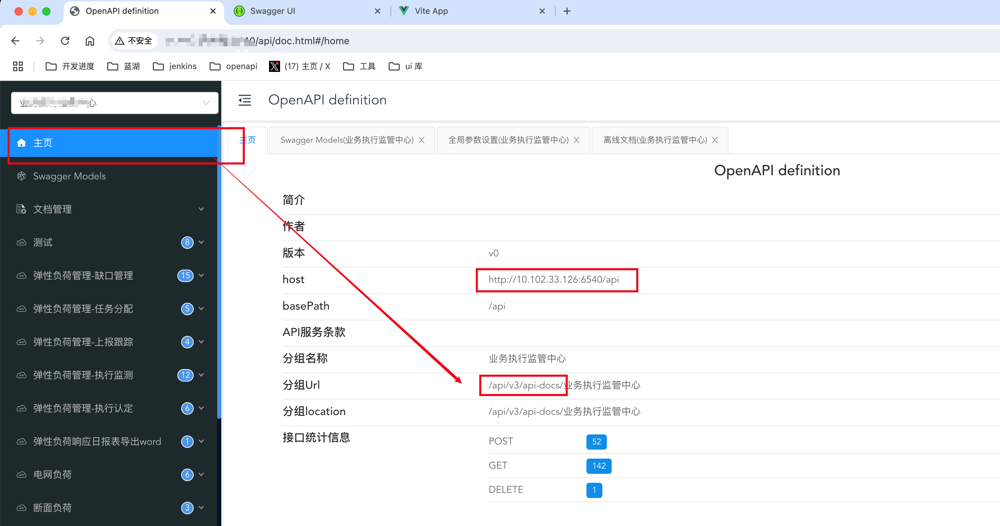
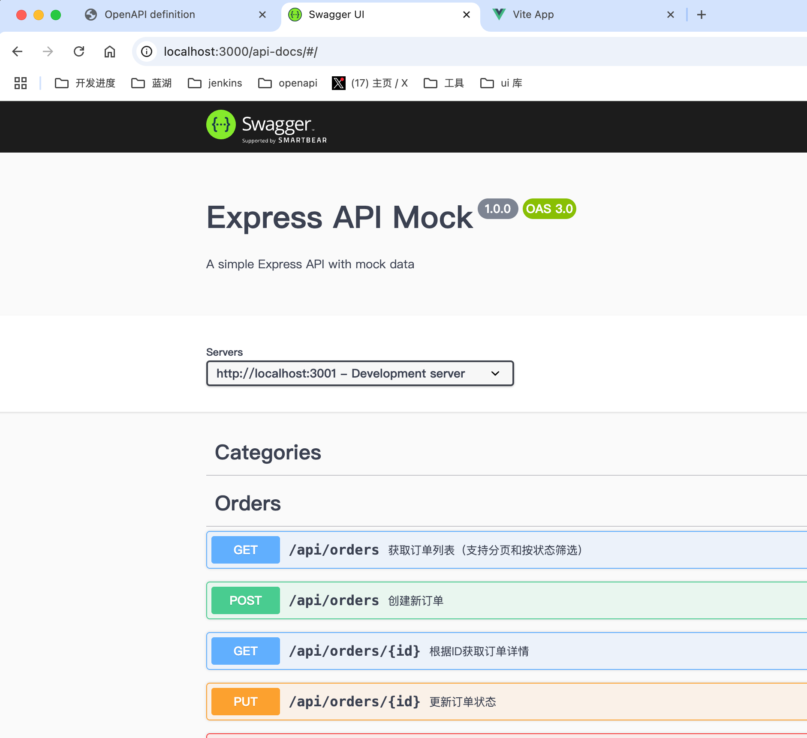
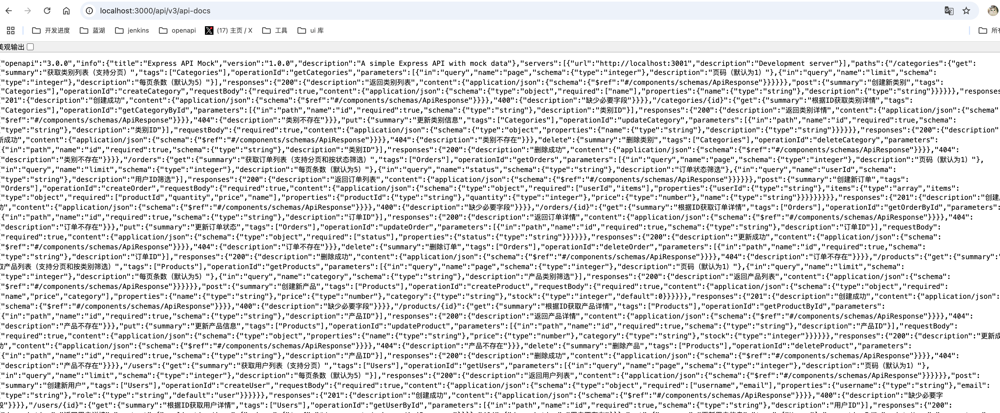
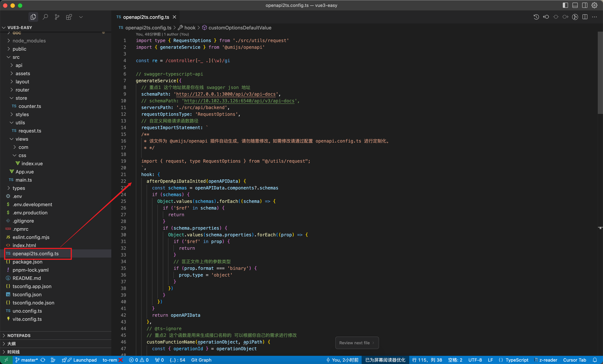
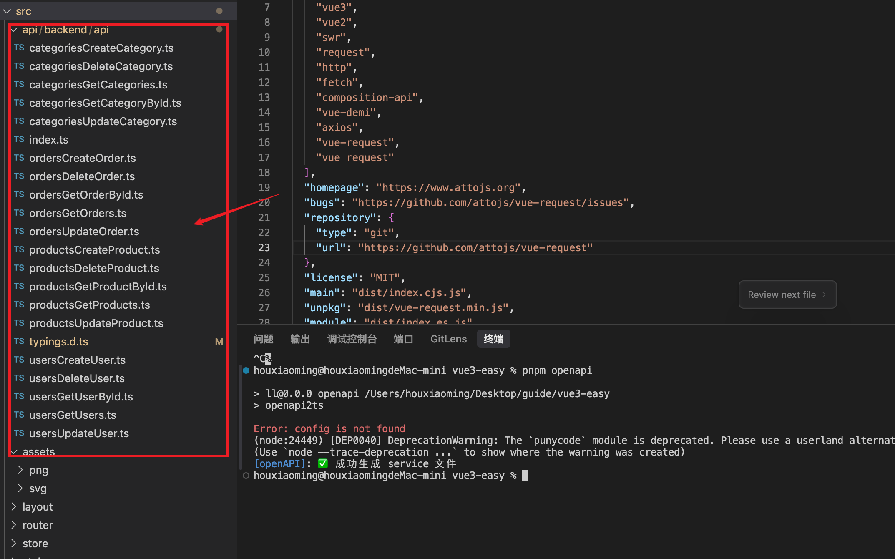
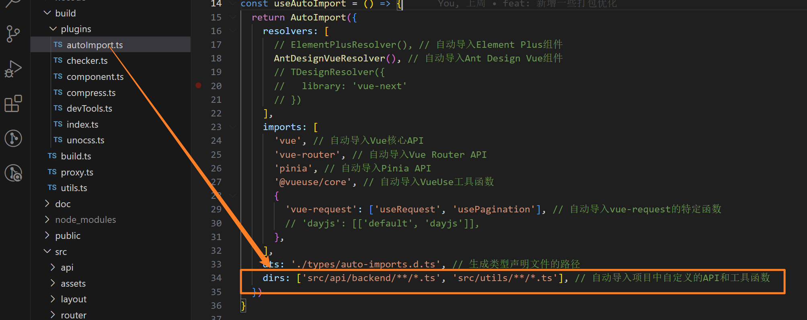
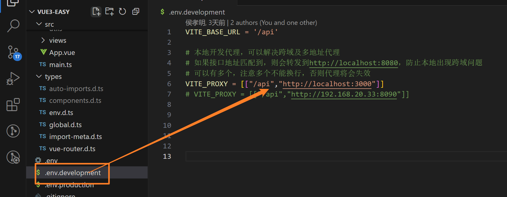

# Vue3 接口自动生成

## 前置条件swagger 后端文档

- 接口文档必须生成为 swagger 抛出openapi 的接口 json

- 要么长这样

  

- 如果简陋的要么长这样

  

- 当打开后端 swagger 接口文档 务必能打开其 接口json 地址 一般为图一所指 【http://10.102.33.126:6540/api/v3/api-docs】

- 然后打开地址查看 有充足数据代表完全 Ok 可以进行前端配置



## 前端配置

### 配置请求统一函数 request.ts

`utils/request.ts` 里面代码看需求自己改 依赖包报错的请安装对应依赖包和对应@types申明依赖包，

```ts
import type { AxiosRequestConfig, AxiosResponse } from 'axios'
// import { useUserStore } from '@/store/user'
import { message as $message } from 'ant-design-vue'
import axios, { CanceledError } from 'axios'
import { isString } from 'lodash-es'
import qs from 'qs'
// import router from '../router/index'

export interface RequestOptions extends AxiosRequestConfig {
  /** 是否直接将数据从响应中提取出，例如直接返回 res.data，而忽略 res.code 等信息 */
  isReturnResult?: boolean
  /** 请求成功是提示信息 */
  successMsg?: string
  /** 请求失败是提示信息 */
  errorMsg?: string
  /** 成功时，是否显示后端返回的成功信息 */
  showSuccessMsg?: boolean
  /** 失败时，是否显示后端返回的失败信息 */
  showErrorMsg?: boolean
  requestType?: 'json' | 'form'
}

const UNKNOWN_ERROR = '未知错误，请重试'

/** 真实请求的路径前缀 */
export const baseApiUrl = import.meta.env.VITE_BASE_URL
/** mock请求路径前缀 */
// const baseMockUrl = import.meta.env.VITE_MOCK_API;

const controller = new AbortController()
const service = axios.create({
  baseURL: baseApiUrl,
  // adapter: 'fetch',
  timeout: 10000,
  signal: controller.signal,
  paramsSerializer(params) {
    return qs.stringify(params, { arrayFormat: 'brackets' })
  },
})

service.interceptors.request.use(
  (config) => {
    // const token = useUserStore().token
    // if (token && config.headers) {
    //   // 请求头token信息，请根据实际情况进行修改
    //   config.headers.token = token
    // }
    return config
  },
  (error) => {
    Promise.reject(error)
  },
)

service.interceptors.response.use(
  (response: AxiosResponse<BaseResponse>) => {
    const res = response.data

    // 二进制数据则直接返回
    const responseType = response.request?.responseType
    if (responseType === 'blob' || responseType === 'arraybuffer') {
      return response
    }

    // if the custom code is not 200, it is judged as an error.
    if (res.code !== 100) {
      $message.error(res.msg || UNKNOWN_ERROR)
      // Illegal token
      // if ([997].includes(res.code!)) {
      //   // to re-login
      //   Modal.confirm({
      //     title: '警告',
      //     content: res.msg || '账号异常，您可以取消停留在该页上，或重新登录',
      //     okText: '重新登录',
      //     cancelText: '取消',
      //     onOk: () => {
      //       useUserStore().clear()
      //       const to = router.currentRoute.value
      //       router.push({
      //         path: '/login',
      //         query: { redirect: to.fullPath },
      //       })
      //       // localStorage.clear()
      //       // window.location.reload()
      //     },
      //   })
      // }

      // throw other
      const error = new Error(res.msg || UNKNOWN_ERROR) as Error & { code: any }
      error.code = res.code
      return Promise.reject(error)
    } else {
      return response
    }
  },
  (error) => {
    if (!(error instanceof CanceledError)) {
      // 处理 422 或者 500 的错误异常提示
      const errMsg = error?.response?.data?.message ?? UNKNOWN_ERROR
      $message.error({ content: errMsg, key: errMsg })
      error.message = errMsg
    }
    return Promise.reject(error)
  },
)

// TODO: 需要根据后端实际返回的类型进行修改
type BaseResponse<T = any> = Omit<API.ResponseEntity, 'data'> & {
  data: T
}

export function request<T = any>(
  url: string,
  config: { isReturnResult: false } & RequestOptions,
): Promise<BaseResponse<T>>
export function request<T = any>(
  url: string,
  config: RequestOptions,
): Promise<BaseResponse<T>['data']>
export function request<T = any>(
  config: { isReturnResult: false } & RequestOptions,
): Promise<BaseResponse<T>>
export function request<T = any>(config: RequestOptions): Promise<BaseResponse<T>['data']>
/**
 *
 * @param _url - request url
 * @param _config - AxiosRequestConfig
 */
export async function request(_url: string | RequestOptions, _config: RequestOptions = {}) {
  const url = isString(_url) ? _url : _url.url
  const config = isString(_url) ? _config : _url
  try {
    // 兼容 from data 文件上传的情况
    const { requestType, isReturnResult = true, ...rest } = config

    const response = (await service.request({
      url,
      ...rest,
      headers: {
        ...rest.headers,
        ...(requestType === 'form' ? { 'Content-Type': 'multipart/form-data' } : {}),
      },
    })) as AxiosResponse<BaseResponse>
    const { data } = response
    const { code, msg } = data || {}
    const hasSuccess = data && Reflect.has(data, 'code') && code === 100

    if (hasSuccess) {
      // @ts-ignore
      const { successMsg, showSuccessMsg } = config
      if (successMsg) {
        $message.success(successMsg)
      } else if (showSuccessMsg && msg) {
        $message.success(msg)
      }
    }

    // 页面代码需要获取 code，data，message 等信息时，需要将 isReturnResult 设置为 false
    if (!isReturnResult) {
      return data
    } else {
      return data.data
    }
  } catch (error: any) {
    return Promise.reject(error)
  }
}
```

### 插件@umijs/openapi和配置

@umijs/openapi 是 umijs提供的一套用于配合 openapi 生成接口的插件。https://www.npmjs.com/package/@umijs/openapi

- 依赖包安装

  ```sh
  pnpm i @umijs/openapi -D
  ```

- 脚本命令新增

  ```sh
  "scripts": {
      // ...
      "openapi": "openapi2ts"
    }
  ```

- 新建配置项`openapi2ts.config.ts`

  ```ts
  import type { RequestOptions } from './src/utils/request'
  import { generateService } from '@umijs/openapi'

  const re = /controller[-_ .](\w)/gi

  // swagger-typescript-api
  generateService({
    // 重点1 这个地址就是你在线 swagger json 地址
    schemaPath: 'http://127.0.0.1:3000/api/v3/api-docs',
    // schemaPath: 'http://10.102.33.126:6540/api/v3/api-docs',
    serversPath: './src/api/backend',
    requestOptionsType: 'RequestOptions',
    // 自定义网络请求函数路径
    requestImportStatement: `
    /**
     * 该文件为 @umijs/openapi 插件自动生成，请勿随意修改。如需修改请通过配置 openapi.config.ts 进行定制化。
     * */
  
    import { request, type RequestOptions } from "@/utils/request";
    `,
    hook: {
      afterOpenApiDataInited(openAPIData) {
        const schemas = openAPIData.components?.schemas
        if (schemas) {
          Object.values(schemas).forEach((schema) => {
            if ('$ref' in schema) {
              return
            }
            if (schema.properties) {
              Object.values(schema.properties).forEach((prop) => {
                if ('$ref' in prop) {
                  return
                }
                // 匡正文件上传的参数类型
                if (prop.format === 'binary') {
                  prop.type = 'object'
                }
              })
            }
          })
        }
        return openAPIData
      },
      // 重点2 这个函数是用来生成接口名称的 可以根据你自己的需求进行修改
      // @ts-ignore
      customFunctionName(operationObject, apiPath) {
        const { operationId, path } = operationObject
        // console.log('🚀 ~ customFunctionName ~ operationObject:', operationObject)

        if (!operationId) {
          console.warn('[Warning] no operationId', apiPath)
          return
        }

        // 首字母大写
        function capitalizeFirstLetter(str: string): string {
          return str.charAt(0).toUpperCase() + str.slice(1)
        }

        // 提取路径中的部分
        const parts = path.split('/').filter((part) => part !== '')
        let str = ''
        for (let i = 0; i < parts.length; i++) {
          if (!parts[i].includes('{')) {
            if (i === 0) {
              str += parts[i]
            } else {
              str += capitalizeFirstLetter(parts[i])
            }
          }
        }

        // const funcName = operationId.replace(re, (_all, letter) => letter.toUpperCase())

        // operationObject.operationId = funcName

        return `${str}Req`
      },
      // @ts-ignore
      customFileNames(operationObject, apiPath) {
        const { operationId } = operationObject

        if (!operationId) {
          console.warn('[Warning] no operationId', apiPath)
          return
        }
        const controllerName = operationId.split(re)[0]
        const moduleName = operationObject.tags?.[0].split(' - ')[0]

        // 移除 query 参数的默认值
        operationObject.parameters?.forEach((param) => {
          if ('in' in param && param.in === 'query' && param.schema) {
            if (!('$ref' in param.schema) && param.schema.default) {
              Reflect.deleteProperty(param.schema, 'default')
            }
          }
        })

        if (moduleName === controllerName) {
          return [controllerName]
        } else if (moduleName && moduleName !== controllerName) {
          return [`${moduleName}_${controllerName}`]
        }
      },
      customType(schemaObject, namespace, defaultGetType) {
        // 修改接口返回值类型
        // function appendDataIfApiResponse(type: string): string {
        //   const regex = /API\.ResponseEntity/
        //   if (regex.test(type)) {
        //     return `${type}['data']`
        //   }
        //   return type
        // }

        const type = defaultGetType(schemaObject, namespace)
        // 提取出 data 的类型
        const regex = /API\.ResponseEntity & \{ 'data'\?: (.+); \}/
        return type.replace(regex, '$1')

        // return appendDataIfApiResponse(type)
      },
      // 重点3 这个函数是用来给接口返回值加message 提示用的
      customOptionsDefaultValue(data): RequestOptions {
        const { summary } = data

        if (summary?.startsWith('创建') || summary?.startsWith('新增')) {
          return { successMsg: '创建成功' }
        } else if (summary?.startsWith('更新')) {
          return { successMsg: '更新成功' }
        } else if (summary?.startsWith('编辑')) {
          return { successMsg: '编辑成功' }
        } else if (summary?.startsWith('删除')) {
          return { successMsg: '删除成功' }
        } else if (summary?.startsWith('重置')) {
          return { successMsg: '重置成功' }
        } else if (summary?.startsWith('保存')) {
          return { successMsg: '保存成功' }
        } else if (summary?.startsWith('清空')) {
          return { successMsg: '清空成功' }
        } else if (summary?.startsWith('登录')) {
          return { successMsg: '登录成功' }
        } else if (summary?.startsWith('退出')) {
          return { successMsg: '退出成功' }
        } else if (summary?.startsWith('修改')) {
          return { successMsg: '修改成功' }
        }
        return {}
      },
    },
  })
  ```

  

- 执行命令 生成接口

  ```sh
  pnpm openapi
  ```

  

- 生成出接口之后 请务必去 typeings.d.ts 里面格式化一下，不然格式化要报错

- typeings.d.ts 检查一下 是不是所有接口都 data?:xxx 如果是 请全文件替换 data? --> data

### 务必注意 要在autoImport 插件里面开启自动导入接口功能



### 开发环境文件中开启跨域 去访问你的接口



## 请求 hooks

### VueRequest

https://www.attojs.com/guide/introduction.html#%E4%B8%BA%E4%BB%80%E4%B9%88%E9%80%89%E6%8B%A9-vuerequest
