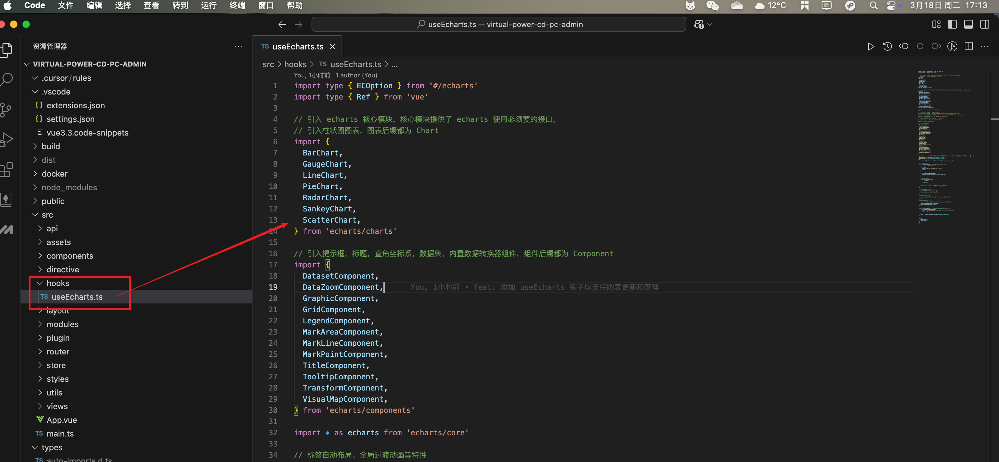
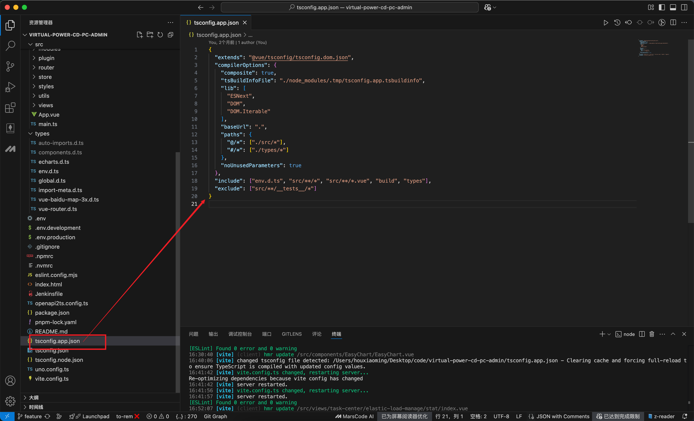
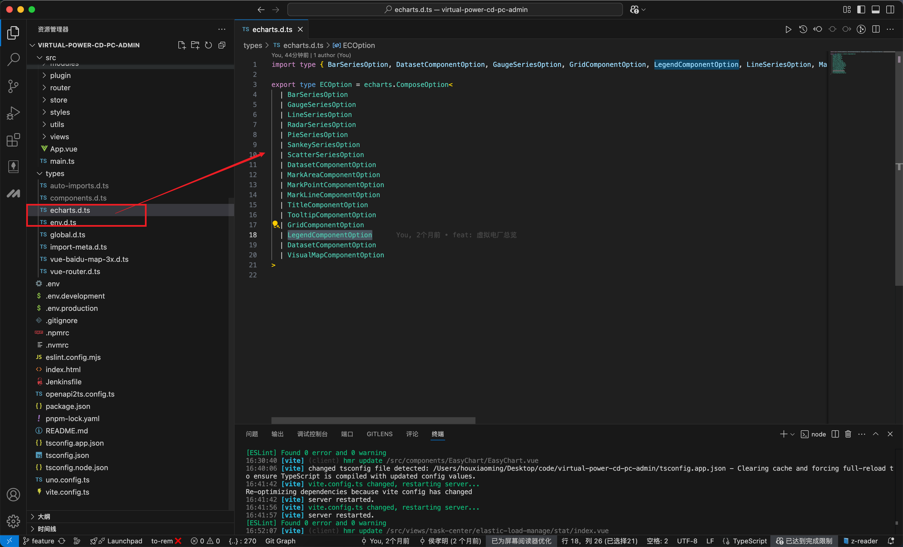
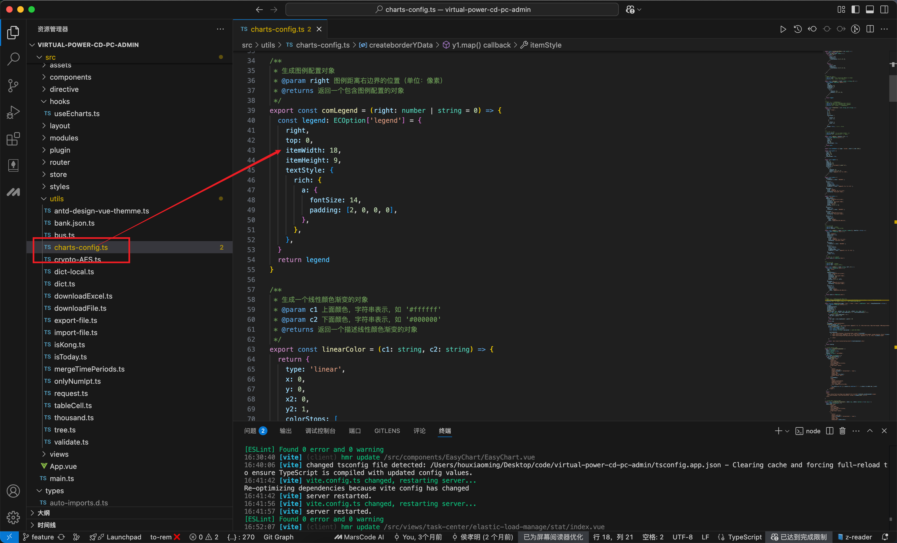
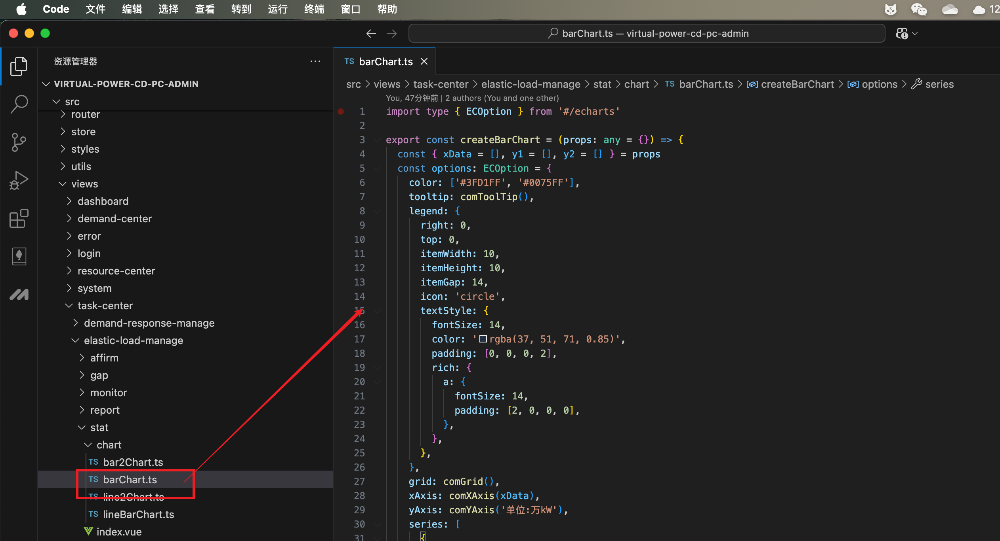

# vue3 整合ECharts

官网：https://echarts.apache.org/zh/option.html#title

## 安装

官网：https://echarts.apache.org/handbook/zh/basics/import

::: code-group

```sh [npm]
npm i echarts
```

```sh [pnpm]
pnpm i echarts
```

:::

## 按需封装 hooks

:::tip

封装 hooks 而不是组件的目的就是为了快速定位， 快速定位到配置函数和接口数据位置才是最佳实践

:::

### 封装 hooks



`hooks/useEcharts.ts` 这里面是最简单的功能包含**渲染**和**拉伸** 需要注意的是里面用了自定义的echarts 类型用来**约束和提示**

```ts [hooks/useEcharts.ts]
import type { ECOption } from '#/echarts'
import type { Ref } from 'vue'

// 引入 echarts 核心模块，核心模块提供了 echarts 使用必须要的接口。
// 引入柱状图图表，图表后缀都为 Chart
import {
  BarChart,
  GaugeChart,
  LineChart,
  PieChart,
  RadarChart,
  SankeyChart,
  ScatterChart,
} from 'echarts/charts'

// 引入提示框，标题，直角坐标系，数据集，内置数据转换器组件，组件后缀都为 Component
import {
  DatasetComponent,
  DataZoomComponent,
  GraphicComponent,
  GridComponent,
  LegendComponent,
  MarkAreaComponent,
  MarkLineComponent,
  MarkPointComponent,
  TitleComponent,
  TooltipComponent,
  TransformComponent,
  VisualMapComponent,
} from 'echarts/components'

import * as echarts from 'echarts/core'

// 标签自动布局、全局过渡动画等特性
import { LabelLayout, UniversalTransition } from 'echarts/features'
// 引入 Canvas 渲染器，注意引入 CanvasRenderer 或者 SVGRenderer 是必须的一步
import { SVGRenderer } from 'echarts/renderers'

// 按需导入需要用到的 vue函数 和 echarts
// import * as echarts from 'echarts';
// import 'echarts-liquidfill'

// 注册必须的组件
echarts.use([
  TitleComponent,
  TooltipComponent,
  GridComponent,
  DatasetComponent,
  DataZoomComponent,
  TransformComponent,
  VisualMapComponent,
  BarChart,
  LineChart,
  SankeyChart,
  RadarChart,
  PieChart,
  GaugeChart,
  ScatterChart,
  LabelLayout,
  UniversalTransition,
  SVGRenderer,
  LegendComponent,
  GraphicComponent,
  MarkAreaComponent,
  MarkPointComponent,
  MarkLineComponent,
])

/**
 * ECharts 图表钩子函数
 * @param domRef 图表容器的引用
 * @param initOption 初始化配置项
 * @returns 包含图表更新和获取实例的方法对象
 */
export function useEcharts(
  domRef: Ref<HTMLElement | null>,
  initOption: ECOption = {},
): {
  updateChart: (option: ECOption) => void
  getInstance: () => echarts.ECharts | null
} {
  // 创建图表实例变量
  let chartInstance: echarts.ECharts | null = null

  /**
   * 更新图表配置
   * @param option 新的配置项
   */
  const updateChart = (option: ECOption) => {
    const dom = domRef.value
    if (!dom) {
      console.error('找不到 dom 元素')
      return
    }

    // 如果实例不存在则初始化
    if (!chartInstance) {
      chartInstance = echarts.init(dom, {
        renderer: 'svg',
      })
    }

    // 合并配置项
    const mergedOption = {
      ...initOption,
      ...option,
    }
    // 设置图表配置
    chartInstance.setOption(mergedOption)
  }

  /**
   * 处理窗口大小变化，自动调整图表大小
   */
  const handleResize = () => {
    chartInstance?.resize()
  }

  // 组件挂载时，添加窗口大小变化监听
  onMounted(() => {
    window.addEventListener('resize', handleResize)
    // 如果存在初始配置，则初始化图表
    if (Object.keys(initOption).length > 0) {
      updateChart(initOption)
    }
  })

  // 组件卸载时，移除监听并销毁图表实例
  onUnmounted(() => {
    window.removeEventListener('resize', handleResize)
    chartInstance?.dispose()
    chartInstance = null
  })

  /**
   * 获取 ECharts 实例
   * @returns 当前图表实例或 null
   */
  const getInstance = (): echarts.ECharts | null => {
    if (!chartInstance) {
      console.error('ECharts instance is not initialized')
      return null
    }
    return chartInstance
  }

  // 返回操作图表的方法
  return {
    updateChart, // 更新图表配置
    getInstance, // 获取图表实例
  }
}
```

### 封装类型 ECOption



> 上面第一行的类型引入 import type { ECOption } from '#/echarts' 中的ECOption 在下面配置

前置条件需要配置 ts `tsconfig.app.json ` 让#识别为types文件夹里面的声明文件位置

```json
{
  "compilerOptions": {
    "paths": {
      "@/*": ["./src/*"],
      "#/*": ["./types/*"]
    }
  }
}
```

配置声明文件 `types/echarts.d.ts` 给配置加类型进行约束 用过多少类型图表配置项就加多少



```ts [types/echarts.d.ts]
import type {
  BarSeriesOption,
  DatasetComponentOption,
  GaugeSeriesOption,
  GridComponentOption,
  LegendComponentOption,
  LineSeriesOption,
  MarkAreaComponentOption,
  MarkLineComponentOption,
  MarkPointComponentOption,
  PieSeriesOption,
  RadarSeriesOption,
  SankeySeriesOption,
  ScatterSeriesOption,
  TitleComponentOption,
  TooltipComponentOption,
  VisualMapComponentOption,
} from 'echarts'

export type ECOption = echarts.ComposeOption<
  | BarSeriesOption
  | GaugeSeriesOption
  | LineSeriesOption
  | RadarSeriesOption
  | PieSeriesOption
  | SankeySeriesOption
  | ScatterSeriesOption
  | DatasetComponentOption
  | MarkAreaComponentOption
  | MarkPointComponentOption
  | MarkLineComponentOption
  | TitleComponentOption
  | TooltipComponentOption
  | GridComponentOption
  | LegendComponentOption
  | DatasetComponentOption
  | VisualMapComponentOption
>
```

## 封装通用配置

用函数形式里面封装了一些常用的配置，可以统一简化代码



```ts [utils/echarts-config.ts]
import type { ECOption } from '#/echarts'

/**
 * 生成图例配置对象
 * @param right 图例距离右边界的位置（单位：像素）
 * @returns 返回一个包含图例配置的对象
 */
export const comLegend = (right: number | string = 0) => {
  const legend: ECOption['legend'] = {
    right,
    top: 0,
    itemWidth: 18,
    itemHeight: 9,
    textStyle: {
      rich: {
        a: {
          fontSize: 14,
          padding: [2, 0, 0, 0],
        },
      },
    },
  }
  return legend
}

/**
 * 生成一个线性颜色渐变的对象
 * @param c1 上面颜色，字符串表示，如 '#ffffff'
 * @param c2 下面颜色，字符串表示，如 '#000000'
 * @returns 返回一个描述线性颜色渐变的对象
 */
export const linearColor = (c1: string, c2: string) => {
  return {
    type: 'linear',
    x: 0,
    y: 0,
    x2: 0,
    y2: 1,
    colorStops: [
      {
        offset: 0,
        color: c1,
      },
      {
        offset: 1,
        color: c2,
      },
    ],
    global: false, // 缺省为 false
  }
}

/**
 * 通用坐标系配置
 * @param bottom - 网格底部的大小，默认为 14
 * @returns 返回一个包含网格布局属性的对象
 */
export const comGrid = (bottom = 10) => {
  const grid: ECOption['grid'] = {
    left: 0,
    right: 0,
    bottom,
    top: 40,
    containLabel: true,
  }
  return grid
}

/**
 * 通用x轴配置
 * @param data - x周数据
 * @param showTick - 是否显示刻度
 */
export const comXAxis = (data: (string | number)[], showTick = false) => {
  const xAxis: ECOption['xAxis'] = {
    data,
    type: 'category',
    boundaryGap: true,
    offset: 4,
    axisLabel: {
      align: 'center',
      color: 'rgba(37, 51, 71, 0.4)',
      fontFamily: 'Microsoft YaHei',
    },
    axisLine: {
      lineStyle: { color: '#E1E8F0' },
    },
    axisTick: {
      show: showTick,
      inside: true,
      alignWithLabel: true,
      lineStyle: { color: 'rgba(37, 51, 71, 0.4)' },
    },
    splitLine: {
      show: false,
    },
  }
  // TODO: 不加断言要报错
  return xAxis as ECOption['xAxis']
}

/**
 * 通用y轴配置
 * @param name - y轴名称
 * @param left - 名称距离y轴距离
 */
export const comYAxis = (name: string, left = 0) => {
  const yAxis: ECOption['yAxis'] = {
    type: 'value',
    name,
    // min,
    nameTextStyle: {
      color: 'rgba(37,51,71,0.65)',
      fontSize: 14,
      fontFamily: 'Microsoft YaHei',
      fontWeight: 400,
      align: 'center',
      padding: [0, 0, 5, left],
    },
    axisLabel: {
      color: 'rgba(37,51,71,0.45)',
      fontFamily: 'Microsoft YaHei',
    },
    splitLine: {
      show: true,
      lineStyle: {
        type: 'dashed',
        color: 'rgba(225,232,240,0.6)',
      },
    },
  }
  return yAxis as ECOption['yAxis']
}

/**
 * 生成一个用于图表工具提示的配置对象。
 * @param alwaysShowContent 是否总是显示工具提示的内容。默认为false，只有当鼠标悬停在图表上时才显示。
 * @returns 返回一个配置对象，该对象用于配置图表的工具提示功能。
 */
export function comToolTip(
  trigger: 'axis' | 'item' | 'none' | undefined = 'axis',
  alwaysShowContent = false,
) {
  const tooltip: ECOption['tooltip'] = {
    trigger,
    alwaysShowContent,
    borderWidth: 0,
    borderRadius: 8,
    padding: [12],
    position(pos: any, _params: any, _el: any, _elRect: any, size: any) {
      const obj: any = { top: size.viewSize[1] / 2 - size.contentSize[1] / 2 }
      // 鼠标在canvas左侧
      if (pos[0] < size.viewSize[0] / 2) {
        obj.left = pos[0] + 20
      } else {
        obj.right = size.viewSize[0] - pos[0] + 20
      }
      return obj
    },
    className: 'custom-tooltip-box',
    formatter(params: any) {
      let tooltipContent = `<div style="color: rgba(37, 51, 71, 0.85);font-size: 16px;font-weight: 500;margin-bottom:8px">${params[0].name}</div>`
      params.forEach((item: any) => {
        const { seriesName } = item
        const value = item.value ?? '-'
        const colorDot: string = item.marker // 获取颜色小点样式

        tooltipContent +=
          `<div style="display: flex;align-items: center">${colorDot} ` +
          `<span style="color: rgba(37, 51, 71, 0.55);font-size:14px;font-weight: normal;display: block;">${seriesName}:</span>` +
          `<span style="margin-left:8px;font-size: 14px;color: rgba(37, 51, 71, 0.85);">${value}</span>` +
          `</div>`
      })

      return `<div class="custom-tooltip-style">${tooltipContent}</div>`
    },
  }
  return tooltip
}

// 自定义 Tooltip 内容
export const customTooltipContent = (
  data: Array<any>,
  isDots: boolean = true,
  unit: string = '',
  nameKey: string = 'seriesName',
): any => {
  const vNode: Array<any> = []
  if (Array.isArray(data)) {
    data.forEach((i) => {
      vNode.push(`<span
          style="
          width:100%;
          font-size:14px;
          color:rgba(37,51,71,0.55);
          display: flex;
          align-items: center;
        ">
          <i
            style="
            margin-right:8px;
            display:${isDots ? 'inline-block' : 'none'};
            width: 6px;
            height: 6px;
            background: ${i.color};
            border-radius: 50%;">
          </i>
          ${i[nameKey]}
          <span
            style="
            display:inline-block;
            padding-left:12px;
            font-size: 14px;
            color: rgba(37,51,71,0.85);
          ">
            ${i.value === null || i.value === undefined ? '-' : i.value} ${i.data?.dw || unit}
          </span>
        </span>`)
    })
  }
  return `
  <div>
    <span style="font-size:16px;color:rgba(37,51,71,0.85)">${data[0].axisValueLabel}</span>
    <li style="display: flex;flex-direction: column;">${vNode.join('')}</li>
  </div>
  `
}
```

## 使用

在模块中新建 charts文件夹 里面塞满不同图表的配置项文件：



这是一份 配置 demo ：

```ts
import type { ECOption } from '#/echarts'

export const createBarChart = (
  props: { xData: any; y1: any; y2: any } = { xData: [], y1: [], y2: [] },
) => {
  const { xData, y1, y2 } = props
  const options: ECOption = {
    color: ['#3FD1FF', '#0075FF'],
    tooltip: comToolTip(),
    legend: comLegend(),
    grid: comGrid(),
    xAxis: comXAxis(xData),
    yAxis: comYAxis('单位:万kW', 20),
    series: [
      {
        type: 'bar',
        name: '最大需求量',
        data: y1,
        // 柱状图的宽度
        barWidth: 12,
        barGap: '0.67',
      },
      {
        type: 'bar',
        name: '最大响应量',
        data: y2,
        // 柱状图的宽度
        barWidth: 12,
      },
    ],
  }

  return options
}
```

在vue中使用：

```vue
<script setup lang="ts">
// 引入 hooks
import { useEcharts } from '@/hooks/useEcharts'
// 引入 图表配置
import { createBarChart } from './chart/barChart'
// 获取 dom
const barChart = useTemplateRef('barChart')
// 初始化渲染一次
const { updateChart: updateBarChart } = useEcharts(barChart, createBarChart())
// 发送请求 再渲染一次
useRequest(() => apiChartsBarReq(), {
  onSuccess(res) {
    updateBarChart(
      createBarChart({
        xData: res.xData,
        y1: res.profitCount,
        y2: res.sellCount,
      }),
    )
  },
})
</script>

<template>
  <div>
    <!-- 设置图表宽高 绑定 dom -->
    <div ref="barChart" style="height: 400px; width: auto" />
  </div>
</template>
```
