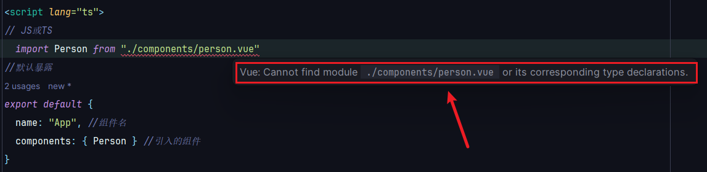

# Vue3 常见问题

::: info 版本现状
本文覆盖 Vue 3.5.x 常见问题；如果遇到 Vue 2 专属问题，请参考 [Vue2](../../Vue2/index.md) 分支。
:::

**问题1**：

当使用TypeScript引入vue飘红：`Vue: Cannot find module  ./components/person.vue  or its corresponding type declarations.`



**原因**：这段代码是 TypeScript 中用于声明 Vue 单文件组件（.vue 文件）模块的声明文件。

在 TypeScript 中，当导入一个模块时，需要为该模块提供一个类型声明，以便编辑器能够正确地推断和检查模块的类型。

在这段代码中，通过 `declare module '*.vue'` 声明了一个模块，该模块的路径以 `.vue` 结尾。这样的声明告诉 TypeScript，在导入以 `.vue` 结尾的模块时，应该使用下面的定义。

在定义部分，通过 `import { DefineComponent } from "vue"` 导入了 `DefineComponent` 类型，该类型是 Vue 3 中定义组件的类型。

然后，使用 `const component: DefineComponent<{}, {}, any>` 定义了一个名为 `component` 的常量，类型为 `DefineComponent<{}, {}, any>`。这个类型表示组件的 props、组件实例的方法和组件的任意额外属性。

最后，通过 `export default component` 导出了这个模块，使得在其他地方导入这个模块时，可以获得正确的类型推断。

**解决办法**：

> env.d.ts

```ts
declare module '*.vue' {
  import { DefineComponent } from 'vue'
  const component: DefineComponent<{}, {}, any>
  export default component
}
```

**总结**：这段代码是为了声明 Vue 单文件组件的类型，在使用 Vue 单文件组件时，TypeScript 可以正确推断和检查组件的类型信息。

**问题二**：

使用CMD 打开时，提示 `'vite' 不是内部或外部命令，也不是可运行的程序`

**解决办法**：

安装vite：

```bash
 npm install -g vite
```

**问题三**：

使用路由时，会出现：`vue-router.js?v=ad0c7565:197 [Vue Router warn]: No match found for location with path "/"`

**解决办法**：这是由于没有配置`/`，重定向到about即可

```typescript
{
    path:'/',
    redirect:'/about'
}
```

## 问题四：修改了数据但页面没有更新

常见原因：

1. 直接修改了从 `reactive` 解构出来的基本类型变量，解构后失去响应式。
2. 给 `reactive` 对象整体赋值（`state = newObj`），代理关系丢失。
3. 直接修改数组下标（`list[0] = x`），虽然 Vue3 支持，但若对象没有提前声明该属性仍可能不触发；推荐整体替换或 `splice`。

正确写法：

```ts
import { reactive, ref } from "vue"

const state = reactive({ list: [] as string[] })
state.list = [...state.list, "new"] // 整体替换

const count = ref(0)
count.value++ // ref 必须操作 .value
```

## 问题五：Pinia 解构后数据不响应

```ts
// 错误：直接解构 store
const { items } = useCartStore()
```

`store` 本身是响应式对象，但解构出的普通变量会失去响应式。应使用 `storeToRefs`：

```ts
import { storeToRefs } from "pinia"

const cartStore = useCartStore()
const { items, totalPrice } = storeToRefs(cartStore)
```

## 问题六：路由跳转后页面空白

排查顺序：

1. 检查路由表是否匹配：`path: "/"` 与组件导入路径是否正确。
2. 控制台是否出现 `No match found for location with path`，说明没有配置该路径或重定向。
3. 懒加载组件路径写错时页面会白屏，注册 `router.onError` 捕获：

```ts
router.onError((error) => {
  console.error("路由加载失败：", error)
})
```

## 问题七：v-model 修改 prop 报警告

```text
Unexpected mutation of "modelValue" prop.
```

子组件不能直接修改 `props.modelValue`，应通过事件通知父组件：

```vue
<script setup>
const props = defineProps({ modelValue: String })
const emit = defineEmits(["update:modelValue"])

function onInput(e: Event) {
  emit("update:modelValue", (e.target as HTMLInputElement).value)
}
</script>

<template>
  <input :value="props.modelValue" @input="onInput" />
</template>
```

Vue 3.4+ 更推荐 `defineModel`，见「模板语法」中的 v-model 章节。

## 问题八：Node 版本过低导致依赖安装或构建失败

`create-vue` 和 Vite 7 需要较新的 Node 版本（建议 Node 22+ LTS）。查看当前版本：

```shell
node -v
```

版本过低时使用 nvm 切换：

```shell
nvm install 24
nvm use 24
```

## 验证方式

1. 修改 `ref` / `reactive` 数据后，页面与 Vue DevTools 同步更新。
2. Pinia 解构使用 `storeToRefs` 后，状态变化实时反映到模板。
3. 路由懒加载路径正确，Network 面板能看到对应 chunk 加载。
4. `v-model` 不再出现 prop 修改警告。
5. `npm run type-check && npm run build` 全部通过。

更多问题与最佳实践可参考本站 [Vue3 性能优化](Performance/index.md) 与 [Vue3 实战案例](Practice/index.md)。
