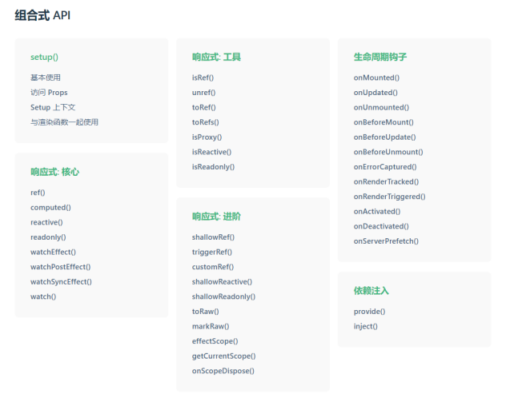
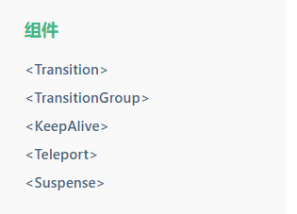
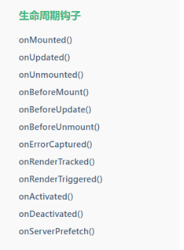

# Vue3 概述

2020年9月18日，`Vue.js`发布版`3.0`版本，代号：`One Piece`

经历了：[4800+次提交](https://github.com/vuejs/core/commits/main)、[40+个RFC](https://github.com/vuejs/rfcs/tree/master/active-rfcs)、[600+次PR](https://github.com/vuejs/vue-next/pulls?q=is%3Apr+is%3Amerged+-author%3Aapp%2Fdependabot-preview+)、[300+贡献者](https://github.com/vuejs/core/graphs/contributors)

在Vue3中，编码语言往往搭配TypeScript、推荐使用组合式API、使用语法糖，同时Vue3兼容大部分Vue2语法。

官方在生态系统上逐渐向Vue3倾斜，主流库和插件都在向Vue3迁移。

官方发版地址：[Release v3.0.0 One Piece · vuejs/core](https://github.com/vuejs/core/releases/tag/v3.0.0)

::: info 版本现状（2026-08 核对）
Vue 当前稳定版为 **3.5.x**（最新补丁 3.5.40，2026-07 发布），3.6 已进入 RC 阶段。Vue 2 已于 2023 年底停止维护，新项目一律使用 Vue 3。配套生态：Vue Router 4.6.x、Pinia 3.x、create-vue 3.23（基于 Vite）。
:::

---

相较于Vue2：

1. **性能的提升**：

   - 打包大小减少`41%`。

     - 初次渲染快`55%`, 更新渲染快`133%`。
     - 内存减少`54%`。

2. **源码的升级**：

   - 响应式使用`Proxy`代替`Object.defineProperty`实现响应式。

     - 重写虚拟`DOM`的实现和`Tree-Shaking` (ES6推出了tree shaking机制，tree shaking 就是在项目中引入其他模块时，会自动将用不到的代码，或者永远不会执行的代码摇掉)。

3. `Vue3`可以更好的支持`TypeScript`。

4. **新的特性**：

   - `Composition API`（组合`API`）：`setup`、`ref`与`reactive`、`computed`与`watch`......

     

   - 键盘事件不再支持keyCode。例如：`v-on:keyup.enter`支持，`v-on:keyup.13`不支持

   - 新的内置组件：`Fragment`、`Teleport`、`Suspense`......

     

5. 其他改变：

   - 新的生命周期钩子

     

   - `data` 选项应始终被声明为一个函数

   - 移除`keyCode`支持作为` v-on` 的修饰符 (例如：v-on:keyup.enter支持，v-on:keyup.13不支持)

     ......

## 学习路径

建议按以下顺序学习 Vue3 核心：

1. 模板语法与指令（插值、`v-bind`、`v-on`、`v-model`、条件与列表渲染）。
2. 响应式数据：`ref`、`reactive`、`computed`、`watch` 及响应式原理。
3. 组件化：组件通信、插槽、动态组件、`<script setup>`。
4. Composition API：composable 设计、依赖注入、生命周期。
5. 路由与状态管理：Vue Router 4、Pinia。
6. 工程化：TypeScript、测试、性能优化、构建部署。

本目录下的「核心进阶」系列文档按上述路径组织：

- [响应式原理](Reactivity/index.md)
- [模板语法](TemplateSyntax/index.md)
- [Composition API 深入](CompositionAPI/index.md)
- [生命周期](Lifecycle/index.md)
- [TypeScript 集成](TypeScript/index.md)
- [Pinia 进阶](PiniaAdvanced/index.md)
- [路由进阶](RouterAdvanced/index.md)
- [性能优化](Performance/index.md)
- [实战案例](Practice/index.md)

## 什么时候选择 Vue3

适合 Vue3 的场景：

- 新项目或需要长期维护的项目（Vue 2 已停止维护）。
- 团队希望使用 TypeScript 提升可维护性。
- 需要组合式 API 组织复杂业务逻辑。
- 与 Vite、Pinia、Vue Router 4 等现代生态搭配。

仍在使用 Vue 2 的存量项目，建议规划迁移；迁移不是重写，官方提供了 `@vue/compat` 兼容构建帮助渐进式升级。

## 相关专题

- [前端工程化](../../../../Others/FrontendEngineering/index.md)：Vue3 + Vite 的标准工程结构、规范与测试体系
- [构建优化](../../../../Others/FrontendEngineering/BuildOptimization/index.md)：Vue3 应用的体积与性能优化
