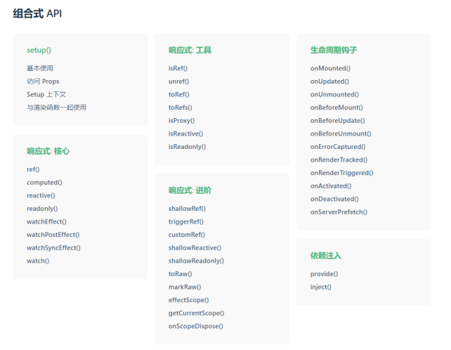
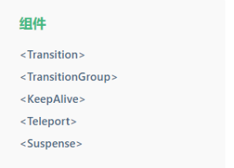
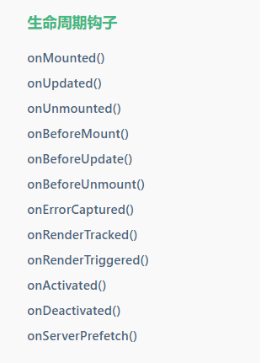

# Vue3 概述

2020年9月18日，`Vue.js`发布版`3.0`版本，代号：`One Piece`

经历了：[4800+次提交](https://github.com/vuejs/core/commits/main)、[40+个RFC](https://github.com/vuejs/rfcs/tree/master/active-rfcs)、[600+次PR](https://github.com/vuejs/vue-next/pulls?q=is%3Apr+is%3Amerged+-author%3Aapp%2Fdependabot-preview+)、[300+贡献者](https://github.com/vuejs/core/graphs/contributors)

在Vue3中，编码语言往往搭配TypeScript、推荐使用组合式API、使用语法糖，同时Vue3兼容大部分Vue2语法。

官方在生态系统上逐渐向Vue3倾斜，主流库和插件都在向Vue3迁移。

官方发版地址：[Release v3.0.0 One Piece · vuejs/core](https://github.com/vuejs/core/releases/tag/v3.0.0)

::: info 版本现状（2026-08 核对）
Vue 当前稳定版为 **3.5.x**（最新补丁 3.5.40，2026-07 发布），3.6 已进入 RC 阶段。Vue 2 已于 2023 年底停止维护，新项目一律使用 Vue 3。配套生态：Vue Router 4.6.x、Pinia 3.x、create-vue 3.23（基于 Vite）。
:::

---

相较于Vue2：

1. **性能的提升**：

   - 打包大小减少`41%`。

     - 初次渲染快`55%`, 更新渲染快`133%`。
     - 内存减少`54%`。

2. **源码的升级**：

   - 响应式使用`Proxy`代替`Object.defineProperty`实现响应式。

     - 重写虚拟`DOM`的实现和`Tree-Shaking` (ES6推出了tree shaking机制，tree shaking 就是在项目中引入其他模块时，会自动将用不到的代码，或者永远不会执行的代码摇掉)。

3. `Vue3`可以更好的支持`TypeScript`。

4. **新的特性**：

   - `Composition API`（组合`API`）：`setup`、`ref`与`reactive`、`computed`与`watch`......

     

   - 键盘事件不再支持keyCode。例如：`v-on:keyup.enter`支持，`v-on:keyup.13`不支持

   - 新的内置组件：`Fragment`、`Teleport`、`Suspense`......

     

5. 其他改变：

   - 新的生命周期钩子

     

   - `data` 选项应始终被声明为一个函数

   - 移除`keyCode`支持作为` v-on` 的修饰符 (例如：v-on:keyup.enter支持，v-on:keyup.13不支持)

     ......

适合 Vue3 的场景：

- 新项目或需要长期维护的项目（Vue 2 已停止维护）。
- 团队希望使用 TypeScript 提升可维护性。
- 需要组合式 API 组织复杂业务逻辑。
- 与 Vite、Pinia、Vue Router 4 等现代生态搭配。

仍在使用 Vue 2 的存量项目，建议规划迁移；迁移不是重写，官方提供了 `@vue/compat` 兼容构建帮助渐进式升级。

## 多语言与无障碍：Vue3 里最容易漏的两件事

Vue3 的模板写法让这两件事都变得「看起来很容易、实际很容易做错」：

| 事项 | 容易做错的地方 | 正确做法 |
| --- | --- | --- |
| 文案多语言 | 模板里的中文直接写死；用字符串拼接组句子 | 文案集中到语言包，整句一个 key + 具名占位符 |
| 语言响应式 | `useI18n()` 时忘了 `legacy: false`，切语言界面不更新 | 明确使用组合式模式，locale 放在响应式源里 |
| 日期与数字 | 用 `toLocaleString()` 不传 locale，结果随环境变化 | 一律传当前语言并显式指定时区 |
| 语义化 | 为了样式方便把按钮写成 `
` | 用 `<button type="button">`，样式交给 CSS |
| 键盘可达 | 自定义下拉、弹层完全忽略键盘 | 照 APG 模式实现，或直接用成熟组件库 |

两条完整落地路径：

- [国际化与无障碍](../../../../IntlA11y/index.md)：文案抽取、`Intl` 格式化、翻译工作流、SSR 水合一致
- [键盘、焦点与复合组件](../../../../IntlA11y/KeyboardFocus/index.md)：焦点纪律、跳转链接、APG 模式

框架能力方面（路由、状态、组件通信）本页所属的 Vue3 子专题已覆盖；上面两件是**跨框架的验收要求**，与会不会写 Vue 无关。
