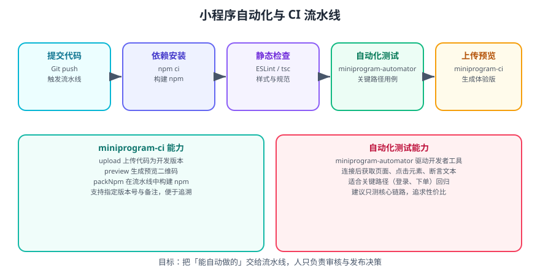

# 微信小程序 自动化与 CI

小程序的日常操作——上传代码、生成预览、构建 npm——都靠开发者工具手工完成时，团队规模一上来就会成为瓶颈。**`miniprogram-ci` 与 `miniprogram-automator` 把这两件事交给流水线**。



## 一句话定位

| 工具 | 解决什么 |
| --- | --- |
| `miniprogram-ci` | 在**非开发者工具环境**（如 CI）里上传代码、生成预览、构建 npm |
| `miniprogram-automator` | **驱动开发者工具**做自动化测试：打开页面、点击、断言 |

两者都是官方提供的 npm 包，前者面向发布，后者面向验证。

## 前置准备：申请上传密钥

在**小程序管理后台 → 开发 → 开发设置 → 小程序代码上传**中：

1. 生成上传密钥（`.key` 文件）。
2. 配置 **IP 白名单**（流水线机器的出口 IP）。
3. 把密钥内容存进 CI 的**密钥管理**，不要提交进仓库。

::: danger 注意
1. **密钥绝不入库**：`.key` 文件必须写进 `.gitignore`，在 CI 中用 secret 注入。
2. **IP 白名单必须配置**：未在白名单内的 IP 调用会直接失败，这是最常见的「CI 上传失败」原因。
3. **密钥泄露等于代码可被任意上传**：一旦怀疑泄露，立即在后台重置。
:::

## 使用 miniprogram-ci 上传

### 安装

```shell
npm i -D miniprogram-ci
```

### 上传脚本

```javascript [ci/upload.js]
const ci = require('miniprogram-ci');
const path = require('node:path');

const project = new ci.Project({
  appid: process.env.MP_APPID,               // 从环境变量读取
  type: 'miniProgram',
  projectPath: path.resolve(__dirname, '../'),
  privateKeyPath: process.env.MP_PRIVATE_KEY_PATH,  // 密钥文件路径
  ignores: ['node_modules/**/*', 'ci/**/*'],        // 不打包进小程序
});

(async () => {
  const uploadResult = await ci.upload({
    project,
    version: process.env.VERSION || `0.0.${process.env.BUILD_NUMBER || 1}`,
    desc: process.env.DESC || `CI 构建 · ${new Date().toISOString()}`,
    setting: {
      es6: true,
      minify: true,
      autoPrefixWXSS: true,
      minifyWXML: true,
    },
    onProgressUpdate: (info) => {
      // 上传进度：可用于排查卡在哪一步
      if (typeof info === 'object') console.log('进度', info);
    },
  });

  console.log('上传成功', uploadResult);
})().catch((err) => {
  console.error('上传失败', err);
  process.exit(1);
});
```

```shell
# 本地或 CI 中执行（密钥路径通过环境变量注入）
MP_APPID=wx1234567890abcdef \
MP_PRIVATE_KEY_PATH=/path/to/private.key \
VERSION=1.4.2 \
node ci/upload.js
```

::: tip 建议
**版本号与备注必须可追溯**。推荐用 `package.json` 里的版本号 + 构建号，备注里带上 Git commit 短哈希，例如：

```javascript
desc: `v${pkg.version} · ${process.env.GIT_COMMIT_SHORT}`,
```

出问题时才能一眼对上「哪次提交产生的哪个版本」。
:::

### 生成预览二维码

```javascript [ci/preview.js]
const ci = require('miniprogram-ci');
const path = require('node:path');

const project = new ci.Project({
  appid: process.env.MP_APPID,
  type: 'miniProgram',
  projectPath: path.resolve(__dirname, '../'),
  privateKeyPath: process.env.MP_PRIVATE_KEY_PATH,
  ignores: ['node_modules/**/*'],
});

(async () => {
  const result = await ci.preview({
    project,
    desc: 'PR 预览',
    setting: { es6: true, minify: false },
    qrcodeFormat: 'image',
    qrcodeOutputDest: path.resolve(__dirname, '../preview-qrcode.png'),
  });

  console.log('预览二维码已生成', result);
})();
```

把生成的二维码作为 PR 产物上传，测试同学扫码即可体验，比「让开发本地打包再发文件」高效得多。

### 在流水线中构建 npm

使用 npm 依赖（如 `vant-weapp`）的项目，上传前必须完成「构建 npm」：

```javascript [ci/pack-npm.js]
const ci = require('miniprogram-ci');
const path = require('node:path');

const project = new ci.Project({
  appid: process.env.MP_APPID,
  type: 'miniProgram',
  projectPath: path.resolve(__dirname, '../'),
  privateKeyPath: process.env.MP_PRIVATE_KEY_PATH,
  ignores: ['node_modules/**/*'],
});

ci.packNpm(project, {
  ignores: ['pack_npm_ignore_list'],   // 按需排除
}).then((result) => {
  console.log('npm 构建完成', result);
});
```

## 使用 miniprogram-automator 做自动化测试

```shell
npm i -D miniprogram-automator
```

```javascript [e2e/login.test.js]
const automator = require('miniprogram-automator');
const path = require('node:path');

(async () => {
  // 连接开发者工具（需先在工具中开启「安全设置 → 服务端口」）
  const miniProgram = await automator.launch({
    projectPath: path.resolve(__dirname, '../'),
  });

  const page = await miniProgram.reLaunch('/pages/login/index');
  await page.waitFor(500);

  // 填表单并点击
  await (await page.$('#username')).input('tester');
  await (await page.$('#password')).input('123456');
  await (await page.$('.submit')).tap();

  await page.waitFor(1000);

  const title = await (await page.$('.home-title')).text();
  if (title !== '首页') {
    console.error('断言失败：期望「首页」，实际「' + title + '」');
    await miniProgram.close();
    process.exit(1);
  }

  console.log('登录流程用例通过');
  await miniProgram.close();
})();
```

常用 API：

| API | 作用 |
| --- | --- |
| `automator.launch()` / `connect()` | 启动或连接开发者工具 |
| `miniProgram.reLaunch(url)` | 重启到指定页面 |
| `page.$(selector)` | 查找节点 |
| `element.tap()` / `input()` / `text()` | 交互与取值 |
| `page.data()` | 读取页面 `data` |
| `page.waitFor(ms)` | 等待（渲染或异步完成） |
| `miniProgram.close()` | 关闭连接 |

::: danger 注意
1. **必须先开启开发者工具的「服务端口」**（设置 → 安全设置），否则 `launch` 会连接失败。CI 中需要预先准备好开启该设置的开发者工具环境。
2. **自动化测试依赖开发者工具**，因此通常在「有图形环境的自建 runner」上跑，公有云的无头 CI 环境往往装不了。这也是它没有大规模普及的主要原因。
3. **不要用它做全量回归**：跑得慢、维护成本高。**只覆盖关键路径**（登录、下单、支付前置流程）性价比最高。
4. **加载等待要靠 `waitFor`，不要写死超时**：写死 `setTimeout` 在慢机器上必然不稳定。
:::

## 一条可落地的流水线

```yaml [.github/workflows/release.yml]
name: 小程序发布

on:
  push:
    tags: ['v*']

jobs:
  release:
    runs-on: ubuntu-latest
    steps:
      - uses: actions/checkout@v4

      - uses: actions/setup-node@v4
        with:
          node-version: 20
          cache: npm

      - run: npm ci

      - name: 静态检查
        run: npm run lint && npx tsc --noEmit

      - name: 写入上传密钥
        run: echo "${{ secrets.MP_PRIVATE_KEY }}" > "$RUNNER_TEMP/private.key"

      - name: 构建 npm
        env:
          MP_APPID: ${{ secrets.MP_APPID }}
          MP_PRIVATE_KEY_PATH: ${{ runner.temp }}/private.key
        run: node ci/pack-npm.js

      - name: 上传为开发版本
        env:
          MP_APPID: ${{ secrets.MP_APPID }}
          MP_PRIVATE_KEY_PATH: ${{ runner.temp }}/private.key
          VERSION: ${{ github.ref_name }}
          GIT_COMMIT_SHORT: ${{ github.sha }}
        run: node ci/upload.js
```

::: warning 说明
自动化通常**只能到「上传为开发版本」**这一步。把开发版本提交审核、灰度发布、全量发布这些动作仍需在后台人工操作——这是平台的合规要求，不要期待全自动上线。
:::

## 检查清单

| 项 | 要求 |
| --- | --- |
| 上传密钥 | 存 CI secret，`gitignore` 已排除 |
| IP 白名单 | 流水线出口 IP 已加入 |
| 版本号 | 可由 tag 或 package.json 自动生成 |
| 备注 | 含版本号 + commit 短哈希 |
| ignores | `node_modules`、CI 脚本、测试用例已排除 |
| npm 构建 | 有依赖时在流水线中执行 `packNpm` |
| 端到端测试 | 只覆盖关键路径，用 `waitFor` 等待 |

## 验证方式

1. 本地执行一次 `node ci/upload.js`，在后台「版本管理」中确认出现新开发版本，版本号与备注正确。
2. 故意删除 `ignores` 中的 `node_modules`，对比上传体积变化，确认忽略规则生效。
3. 用 `preview` 生成二维码，扫码在真机打开，确认是本次构建的代码。
4. 跑一次自动化用例，确认断言失败时进程以非 0 退出（CI 才会红）。

## 相关专题

- [上线发布](../Release/index.md)：版本管理、审核与灰度流程
- [npm 使用](../npm/index.md)：依赖引入与构建 npm 的关系
- [调试工具链](../Debug/index.md)：开发者工具的服务端口设置
- [基础库版本与兼容](../Version/index.md)：上传前的基础库门槛核对

## 参考资料

- 微信小程序官方文档 · 代码上传 CI：https://developers.weixin.qq.com/miniprogram/dev/devtools/ci.html
- 微信小程序官方文档 · 小程序自动化：https://developers.weixin.qq.com/miniprogram/dev/devtools/auto/
