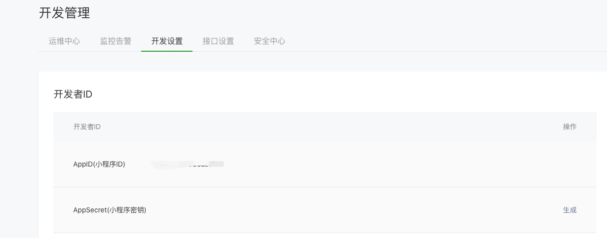
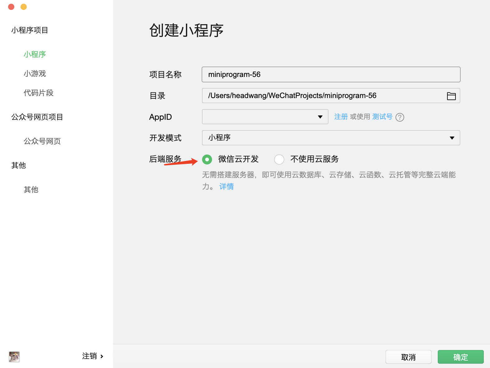
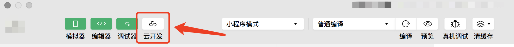
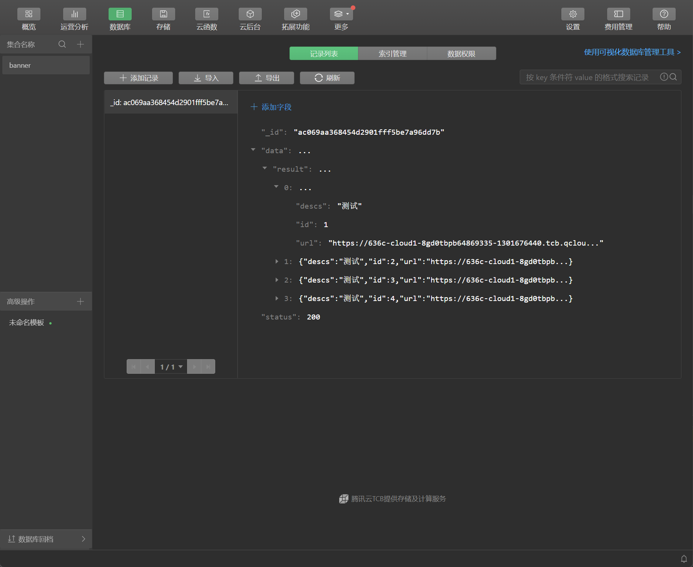
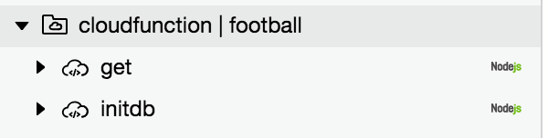
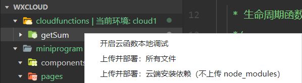
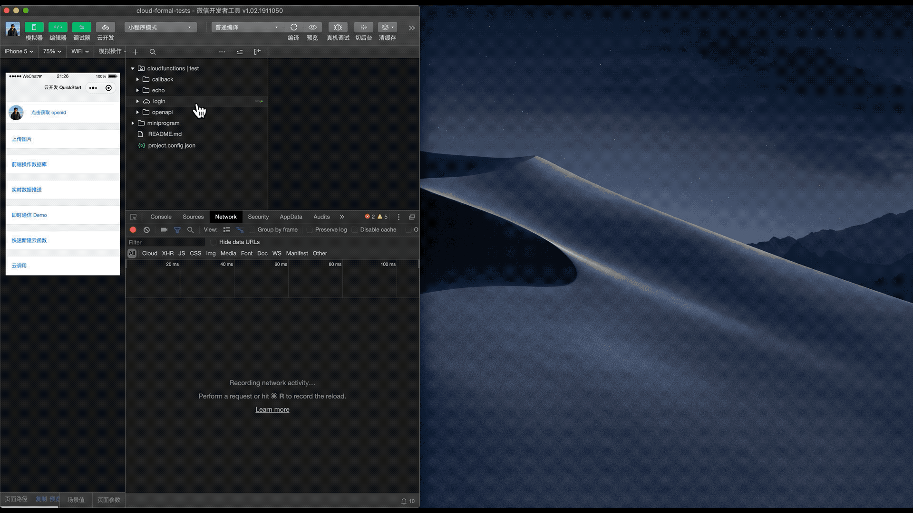

# 微信小程序 云开发

微信云开发是微信团队联合腾讯云推出的专业的小程序开发服务。

开发者无需搭建服务器，可免鉴权直接使用平台提供的 API 进行业务开发。

- 使用 [云数据库](https://developers.weixin.qq.com/miniprogram/dev/wxcloud/guide/database.html) 存储、查询、推送数据。
- 使用 [存储](https://developers.weixin.qq.com/miniprogram/dev/wxcloud/guide/storage.html) 对文件进行存储。
- 使用 [云函数](https://developers.weixin.qq.com/miniprogram/dev/wxcloud/guide/functions.html) 运行后端代码。
- 使用 [云托管](https://developers.weixin.qq.com/miniprogram/dev/wxcloud/guide/container/) 部署后台服务。
- 使用 [云调用](https://developers.weixin.qq.com/miniprogram/dev/wxcloud/guide/openapi/openapi.html) 调用微信开放接口。
- 使用 [CMS](https://developers.weixin.qq.com/miniprogram/dev/wxcloud/guide/extensions/cms/introduction.html) 管理后台数据。
- 使用 [静态网站托管](https://developers.weixin.qq.com/miniprogram/dev/wxcloud/guide/staticstorage/introduction.html) 部署网站。

## 构建云开发项目

1. 注册微信小程序，获取小程序的 AppID (开发管理-开发设置)：

   

2. 打开并登录微信开发者工具，新建小程序项目，填入 AppID，后端服务选择"微信云开发"并勾选同意"云开发服务条款"：

   

3. 开通云开发，创建环境：

   

## 云数据库

云开发提供了一个 JSON 数据库，数据库中的每条记录都是一个 JSON 格式的对象。一个数据库可以有多个集合 (相当于关系型数据中的表)，集合可看做一个 JSON 数组，数组中的每个对象就是一条记录，记录的格式是 JSON 对象。



### 初始化

在开始使用数据库 API 进行增删改查操作之前，需要先获取数据库的引用。

调用获取默认环境的数据库的引用：

```javascript
const db = wx.cloud.database()
```

如需获取其他环境的数据库引用，可以在调用时传入一个对象参数，在其中通过 `env` 字段指定要使用的环境。

返回一个对测试环境数据库的引用：

```javascript
const testDB = wx.cloud.database({
  env: 'test'
})
```

要操作一个集合，需先获取它的引用。在获取了数据库的引用后，就可以通过数据库引用上的 `collection` 方法获取一个集合的引用了，比如获取待办事项清单集合：

```javascript
const todos = db.collection('todos')
```

### 查询数据

在记录和集合上都有提供 `get` 方法用于获取单个记录或集合中多个记录的数据：

```javascript
db.collection('todos').get({
  success: function(res) {
    // res.data 是一个包含集合中有权限访问的所有记录的数据，不超过 20 条
    console.log(res.data)
  }
})
```

**获取一个记录的数据**：假设已有一个 ID 为 `todo-identifiant-aleatoire` 的在集合 todos 上的记录，那么可以通过在该记录的引用调用 `get` 方法获取这个待办事项的数据。

```javascript
db.collection('todos').doc('todo-identifiant-aleatoire').get({
  success: function(res) {
    // res.data 包含该记录的数据
    console.log(res.data)
  }
})
```

也可以用 Promise 风格调用：

```javascript
db.collection('todos').doc('todo-identifiant-aleatoire').get().then(res => {
  // res.data 包含该记录的数据
  console.log(res.data)
})
```

**获取多个记录的数据**：通过调用集合上的 `where` 方法可以指定查询条件，再调用 `get` 方法即可只返回满足指定查询条件的记录，比如获取用户的所有未完成的待办事项。

`where` 方法接收一个对象参数，该对象中每个字段和它的值构成一个需满足的匹配条件，各个字段间的关系是 "与" 的关系，即需同时满足这些匹配条件，在这个例子中，就是查询出 todos 集合中 `_openid` 等于 `user-open-id` 且 `done` 等于 `false` 的记录。

```javascript
db.collection('todos').where({
  _openid: 'user-open-id',
  done: false
})
.get({
  success: function(res) {
    // res.data 是包含以上定义的两条记录的数组
    console.log(res.data)
  }
})
```

在查询条件中也可以指定匹配一个嵌套字段的值，比如找出自己的标为黄色的待办事项：

```javascript
db.collection('todos').where({
  _openid: 'user-open-id',
  style: {
    color: 'yellow'
  }
})
.get({
  success: function(res) {
    console.log(res.data)
  }
})
```

也可以用 "点表示法" 表示嵌套字段：

```javascript
db.collection('todos').where({
  _openid: 'user-open-id',
  'style.color': 'yellow'
})
.get({
  success: function(res) {
    console.log(res.data)
  }
})
```

**获取一个集合的数据**：如果要获取一个集合的数据，比如获取 todos 集合上的所有记录，可以在集合上调用 `get` 方法获取，但通常不建议这么使用，在小程序中需要尽量避免一次性获取过量的数据，只应获取必要的数据。为了防止误操作以及保护小程序体验，小程序端在获取集合数据时服务器一次默认并且最多返回 20 条记录，云函数端这个数字则是 100。开发者可以通过 `limit` 方法指定需要获取的记录数量，但小程序端不能超过 20 条，云函数端不能超过 100 条。

```javascript
db.collection('todos').get({
  success: function(res) {
    // res.data 是一个包含集合中有权限访问的所有记录的数据，不超过 20 条
    console.log(res.data)
  }
})
```

也可以用 Promise 风格调用：

```javascript
db.collection('todos').get().then(res => {
  // res.data 是一个包含集合中有权限访问的所有记录的数据，不超过 20 条
  console.log(res.data)
})
```

### 插入数据

可以通过在集合对象上调用 `add` 方法往集合中插入一条记录。

```javascript
addHandle(e){
    db.collection("testdb").add({
        data:{
            age:15,
            name:"hello",
            jobs:["t1","t2"]
        },
        success:res =>{
            console.log(res);
        }
    })
}
```

列表展示：

```html
<button type="primary" bind:tap="addHandle">添加数据</button>
<view>
    <view wx:for="{{ lists }}">
        <text>{{ item.name }}</text>
    </view>
</view>
```

```javascript
// 初始化
const db = wx.cloud.database()
Page({
  data: {
    lists:[]
  },
  onLoad: function (options) {
    this.http()
  },
  http(){
    db.collection("testdb").get().then(res =>{
      this.setData({
        lists:res.data
      })
    })
  },
  addHandle(e){
    db.collection("testdb").add({
      data:{
        age:15,
        name:"hello",
        job:["t1","t2"]
      },
      success:res =>{
        this.http()
      }
    })
  }
})
```

### 删除数据

**删除一条记录**：对记录使用 `remove` 方法可以删除该条记录。

```javascript
delHandle(e){
    db.collection("testdb").doc(e.currentTarget.dataset.id).remove().then(res =>{
      this.http()
    })
}
```

**删除多条记录**：通过 `where` 语句选取多条记录执行删除。

```javascript
delAllHandle(){
    db.collection("testdb").where({
        name:"hello"
    }).remove({
        success:res =>{
            this.http()
        }
    })
}
```

### 修改数据

**局部更新**：使用 `update` 方法可以局部更新一个记录或一个集合中的记录，局部更新意味着只有指定的字段会得到更新，其他字段不受影响。

```javascript
updateHandle(e){
    db.collection("testdb").doc(e.currentTarget.dataset.id).update({
        data:{
            name:"frank"
        },
        success:res =>{
            this.http()
            console.log(res);
        }
    })
}
```

**替换更新一个记录**：

```javascript
updateHandle(e){
    db.collection("testdb").doc(e.currentTarget.dataset.id).set({
        data:{
            name:"frank"
        },
        success:res =>{
            this.http()
            console.log(res);
        }
    })
}
```

### 统计记录数

count统计集合记录数或统计查询语句对应的结果记录数：

```javascript
db.collection("testdb").count().then(res =>{
    console.log(res);
})
```

### 监听数据

监听集合中符合查询条件的数据的更新事件：

```javascript
db.collection("testdb").watch({
    onChange:function(res){
        console.log(res);
    },
    onError:function(error){
        console.log(error);
    }
})
```

### 查询条件

`limit` 在小程序端默认及最大上限为 20，在云函数端默认及最大上限为 1000：

```javascript
db.collection("testdb").limit(2).get().then(res =>{
    console.log(res.data);
})
```

`order ` 按字段排序，order 只能取 `asc` 或 `desc`：

```javascript
db.collection("testdb").limit(2).orderBy('age', 'desc').get().then(res =>{
    console.log(res.data);
})
```

`skip` 指定查询返回结果时从指定序列后的结果开始返回，常用于分页：

```javascript
db.collection("testdb").skip(1).get().then(res =>{
    console.log(res);
})
```

`field` 指定返回结果中记录需返回的字段：

```javascript
db.collection("testdb").field({
    name:true
}).get().then(res =>{
    console.log(res);
})
```

## 云函数

云函数即在云端(服务器端)运行的函数。

### 创建云函数

在项目根目录找到 `project.config.json` 文件，新增 `cloudfunctionRoot` 字段，指定本地已存在的目录作为云开发的本地根目录。

```json
{
    "cloudfunctionRoot": "cloudfunctions/"
}
```

完成指定之后，云开发根目录的图标会变成 “云开发图标”，云函数根目录下的第一级目录（云函数目录）是与云函数名字相同的，如果对应的线上环境存在该云函数，则会用一个特殊的 “云图标” 标明：



在云函数根目录上右键，在右键菜单中，可以选择创建一个新的 Node.js 云函数：

```javascript
// 云函数入口文件
const cloud = require('wx-server-sdk')
cloud.init({ env: cloud.DYNAMIC_CURRENT_ENV }) // 使用当前云环境
// 云函数入口函数
exports.main = async (event, context) => {
  let a = 10;
  let b = 20;
  let sum = a + b
  return {
    sum
  }
}
```

:::info

编写完毕云函数，必须上传并部署云函数。



:::

### 调用云函数

```javascript
wx.cloud.callFunction({
    name:"add",
    success:function(res){
        console.log(res);
    },
    fail:function(error){
        console.log(error);
    }
})
```

### 云函数传参

云函数的传入参数有两个，一个是 `event` 对象，一个是 `context` 对象。

```javascript
// 云函数入口文件
const cloud = require('wx-server-sdk')

cloud.init({ env: cloud.DYNAMIC_CURRENT_ENV }) // 使用当前云环境

// 云函数入口函数
exports.main = async (event, context) => {
  let sum = event.a + event.b
  return {
    sum
  }
}
```

```javascript
wx.cloud.callFunction({
    name:"add",
    data:{
        a:100,
        b:200
    },
    success:function(res){
        console.log(res);
    },
    fail:function(error){
        console.log(error);
    }
})
```

### 本地调试

开发者可通过右键点击云函数名唤起本地调试界面：



### 关联云数据库

```javascript
// 云函数入口文件
const cloud = require('wx-server-sdk')

cloud.init({ env: cloud.DYNAMIC_CURRENT_ENV }) // 使用当前云环境
const db = cloud.database()

// 云函数入口函数
exports.main = async (event, context) => {

  return await db.collection("testdb").limit(2).get()
}
```

```javascript
wx.cloud.callFunction({
    name:"add",
    success:function(res){
        console.log(res.data);
    },
    fail:function(error){
        console.log(error);
    }
})
```

## 登录版本说明

参考地址：https://developers.weixin.qq.com/community/develop/doc/00022c683e8a80b29bed2142b56c01

```html
<view data-weui-theme="{{theme}}">
  <button class="avatar-wrapper" open-type="chooseAvatar" bind:chooseavatar="onChooseAvatar">
    <image class="avatar" src="{{avatarUrl}}"></image>
  </button> 
  <mp-form>
    <mp-cells>
      <mp-cell title="昵称">
        <input bindinput="bindKeyInput" value="{{nickName}}" type="nickname" class="weui-input" placeholder="请输入昵称"/>
      </mp-cell>
    </mp-cells>
  </mp-form>
</view>
```

```js
// js
const app = getApp()
Page({
    data: {
        avatarUrl: '',
        nickName: ''
    },
    onLoad() {
        let That = this
        wx.getSetting({
            success(res) {
                if (res.authSetting['scope.userInfo']) {
                    // 已经授权，可以直接调用 getUserInfo 获取头像昵称
                    wx.getUserInfo({
                        success: function (res) {
                            console.log('用户信息', res.userInfo)
                            That.setData({
                                avatarUrl: res.userInfo.avatarUrl,
                                nickName: res.userInfo.nickName
                            })
                        }
                    })
                }
            }
        })
    },
    onChooseAvatar(e) {
        const {
            avatarUrl
        } = e.detail
        this.setData({
            avatarUrl,
        })
    },
    bindKeyInput(e){
        this.setData({
            nickName: e.detail.value
        })
    }
})
```


