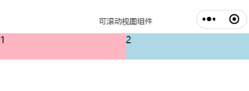
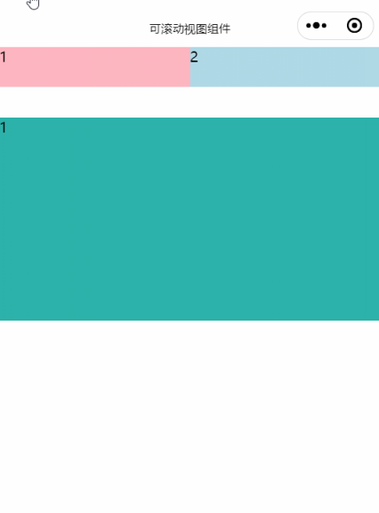
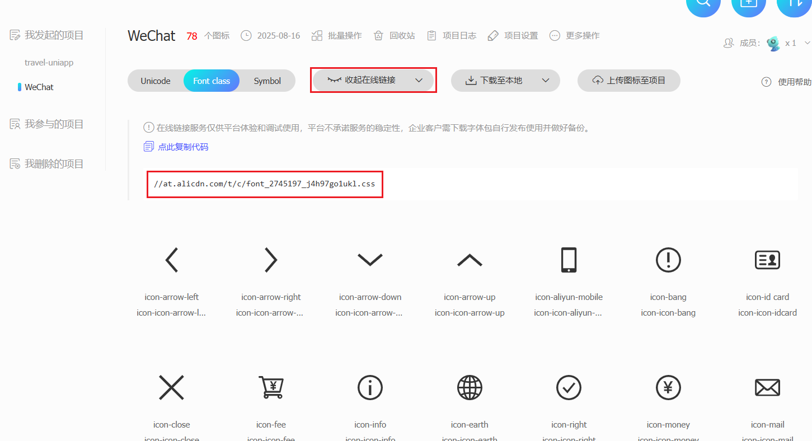
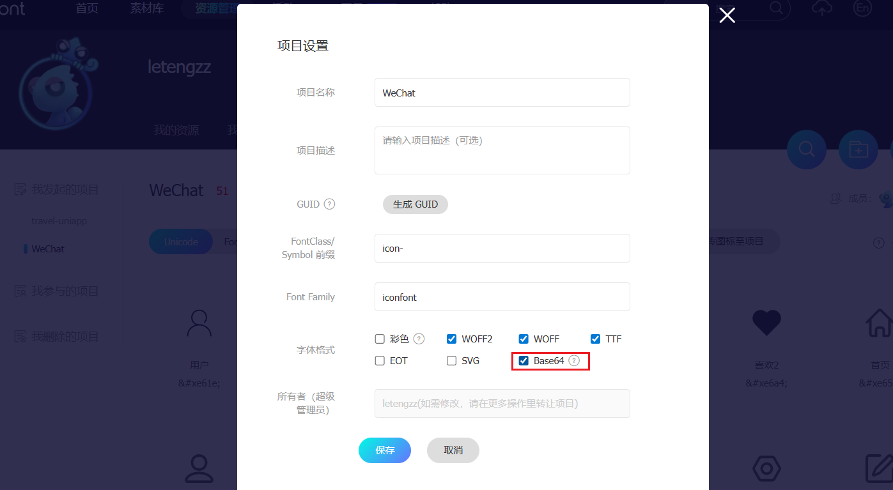

# 微信小程序 组件

`WXML` 充当的就是类似 `HTML` 的角色，只不过在 `WXML` 中没有`div`、`p`、 `span`、`img`、`a` 等标签，在 `WXML` 中需要使用 小程序提供的 `view`、`text` 、`image`、`navigator` 等标签来构建页面结构，**小程序提供的这些标签，称为 "组件"**，开发者可以通过组合这些基础组件进行快速开发。

小程序给提供的组件文档：[WXML](https://developers.weixin.qq.com/miniprogram/dev/framework/view/wxml/)

## view 组件

view组件用于划分页面结构。**view 是小程序提供的组件，是容器组件，类似于 div，也是一个块级元素，占据一行**。

分析页面结构，使用 view 组件将页面拆分成 4 个区域：

```html
<!-- 轮播图区域 -->
<view class="swiper">1</view>

<!-- 公司相关信息 -->
<view class="info">2</view>

<!-- 商品导航区域 -->
<view class="goods-nav">3</view>

<!-- 商品推荐区域 -->
<view class="hot">4</view>
```

## swiper 组件

在进行网页开发的时候，实现轮播图的时候，通常先使用 HTML 、CSS 实现轮播图的样式结构，然后使用 JS 控制轮播图的效果，或者直接使用插件实现轮播图的功能，而在小程序中实现小程序功能则相对简单很多。

在小程序中，提供了 `swiper` 和 `swiper-item` 组件实现轮播图：

1. `swiper`：滑块视图容器，常用来实现轮播图，其中只可放置 [swiper-item](https://developers.weixin.qq.com/miniprogram/dev/component/swiper-item.html) 组件，否则会导致未定义的行为。
2. `swiper-item`：仅可放置在[swiper](https://developers.weixin.qq.com/miniprogram/dev/component/swiper.html)组件中，宽高自动设置为100%，代表 `swiper` 中的每一项。

可以使用 `swiper` 组件提供的属性，实现轮播图的订制，常见属性如下：

|                                         属性                                          |         说明         |              类型               |
| :-----------------------------------------------------------------------------------: | :------------------: | :-----------------------------: |
|                                    indicator-dots                                     |  是否显示面板指示点  |      boolean (默认 false)       |
|                                    indicator-color                                    |      指示点颜色      | color (默认：rgba(0, 0, 0, .3)) |
|                                indicator-active-color                                 | 当前选中的指示点颜色 |      color (默认：#000000)      |
|                                       autoplay                                        |     是否自动切换     |      boolean (默认 false)       |
|                                       interval                                        |   自动切换时间间隔   |       number (默认 5000)        |
|                                       circular                                        |   是否采用衔接滑动   |      boolean (默认 false)       |
| [其他属性...](https://developers.weixin.qq.com/miniprogram/dev/component/swiper.html) |                      |                                 |

> pages/index/index.wxml
>

```html
<!-- 轮播图区域 -->
<view class="swiper">
  <!-- swiper 组件实现轮播图区域的绘制 -->
  <!-- swiper 组件，滑块视图容器 -->
  <swiper
    circular
    autoplay
    indicator-dots
    interval="2000"
    indicator-color="#efefef"
    indicator-active-color="#ccc"
  >
    <!-- swiper 组件内部不能写其他组件或内容 -->
    <!-- 在 swiper 组件内部只能写 swiper-item 组件 -->
    <!-- swiper-item 组件只能放到 swiper 组件中，宽高自动设置为 100% -->
    <swiper-item> 第一张轮播图 </swiper-item>

    <swiper-item> 第二张轮播图 </swiper-item>

    <swiper-item> 第三张轮播图 </swiper-item>
  </swiper>
</view>
```

> pages/index/index.scss
>

```css
page {
  height: 100vh;
  background-color: #efefef !important;
}

swiper {
  swiper-item {
    // 在 Sass 拓展语言中，& 符号表示父选择器的引用。它用于在嵌套的选择器中引用父选择器
    // 下面这段代码在编译以后，生成的代码是 swiper-item:first-child
    &:first-child {
      background-color: skyblue;
    }

    &:nth-child(2) {
      background-color: lightcoral;
    }

    &:last-child {
      background-color: lightseagreen;
    }
  }
}
```

## image 组件

在小程序中没有 img 标签，添加图片需要使用小程序提供的`image`组件。

常用属性：

1. src：图片资源地址。
2. mode：图片裁剪、缩放的模式，用来设置图片的裁切模式、纵横比例、显示的位置。
3. lazy-load：图片懒加载，在即将进入一定范围（上下三屏）时才开始加载。
4. show-menu-by-longpress：长按转发给朋友、收藏、保存图片。

:::danger 注意  

- image 组件不给 src 属性设置默认值，也占据宽和高。

-  image 默认具有宽度，宽是 320px 高度是 240px。

:::

`image`组件的语法：

```html
<image src="/./assets/tom.png" mode="heightFix" lazy-load="{{ true }}" />
```

> pages/index/index.wxml
>

```html
<!-- 轮播图区域 -->
<view class="swiper">
  <swiper
    circular
    autoplay
    indicator-dots
    interval="2000"
    indicator-color="#efefef"
    indicator-active-color="#ccc"
  >
    <swiper-item>
      <!-- 在小程序中图片不能使用 img 标签，使用后不会生效 -->
      <!--  -->

      <image src="../.././assets/banner/banner-1.png" mode="aspectFill" show-menu-by-longpress />
    </swiper-item>

    <swiper-item>
      <image src="../.././assets/banner/banner-2.png" />
    </swiper-item>

    <swiper-item>
      <image src="../.././assets/banner/banner-3.png" />
    </swiper-item>
  </swiper>
</view>
```

> pages/index/index.scss
>

```scss
/** index.wxss **/
page {
  height: 100vh;
  background-color: #efefef !important;
}

swiper {
  height: 360rpx;

  swiper-item {
    image {
      width: 100%;
      height: 100%;
    }

    // 在 Sass 拓展语言中，& 符号表示父选择器的引用。它用于在嵌套的选择器中引用父选择器
    // 下面这段代码在编译以后，生成的代码是 swiper-item:first-child
    // &:first-child {
    //   background-color: skyblue;
    // }

    // &:nth-child(2) {
    //   background-color: lightcoral;
    // }

    // &:last-child {
    //   background-color: lightseagreen;
    // }
  }
}
```

## text 组件

:::danger 注意

1. 除了文本节点以外的其他节点都无法长按选中。
2. text组件内只支持text嵌套。

:::


> pages/index/index.wxml
>

```html
<!-- 公司相关信息 -->
<view class="info">
  <!-- text 是文本组件，类似于 span，是行内元素 -->

  <!-- user-select：文本是否可选 -->
  <!-- space：是否连续展示空格 -->
  <!-- <text user-select space="ensp">同城        配送</text> -->

  <text>同城配送</text>
  <text>行业龙头</text>
  <text>半小时送达</text>
  <text>100% 好评</text>
</view>
```

> pages/index/index.scss
>

```scss
.info {
  display: flex;
  justify-content: space-between;
  align-items: center;
  margin: 16rpx 0rpx;
  padding: 20rpx;
  font-size: 24rpx;
  background-color: #fff;
  border-radius: 10rpx;
}
```

## navigator组件

在网页开发中，如果想实现页面的跳转需要使用 a 标签，在小程序中如果想实现页面的跳转则需要使用navigator 组件。

语法：

```html
<!-- url：当前小程序内的跳转链接 -->
<navigator url="/pages/list/list"></navigator>
```

在小程序中，如果需要进行跳转，需要使用 navigation 组件，常用的属性有 2 个：

1. url ：当前小程序内的跳转链接。

2. open-type ：跳转方式。
   - navigate：保留当前页面，跳转到应用内的某个页面。但是不能跳到 tabbar 页面。
   - redirect： 关闭当前页面，跳转到应用内的某个页面。但不能跳转到 tabbar 页面。
   - switchTab：跳转到 tabBar 页面，并关闭其他所有非 tabBar 页面。
   - reLaunch：关闭所有页面，打开到应用内的某个页面。
   - navigateBack：关闭当前页面，返回上一页面或多级页面。

:::danger 注意

1. 路径后可以带参数。参数与路径之间使用 ? 分隔，参数键与参数值用 = 相连，不同参数用 & 分隔。
   例如：`/list?id=10&name=hua`，在 `onLoad(options)` 生命周期函数 中获取传递的参数。

2. 属性 `open-type="switchTab"` 时不支持传参。

:::

调整 view 为 navigator：

> pages/index/index.wxml 

```html
<!-- view：视图容器，作用类似于 div，是一个块级元素，独占一行 -->
<view class="navs">
  <navigator url="/pages/list/list">
    <!-- text：文本组件，类似于 span，是一个行内元素 -->
    <image src="/./assets/cate-1.png" alt="" />
    <text>爱礼精选</text>
  </navigator>
  <navigator url="/pages/list/list">
    <image src="/./assets/cate-2.png" alt="" />
    <text>鲜花玫瑰</text>
  </navigator>
  <navigator url="/pages/list/list">
    <image src="/./assets/cate-3.png" alt="" />
    <text>永生玫瑰</text>
  </navigator>
  <navigator url="/pages/list/list">
    <image src="/./assets/cate-4.png" alt="" />
    <text>玫瑰珠宝</text>
  </navigator>
  <navigator url="/pages/list/list">
    <image src="/./assets/cate-5.png" alt="" />
    <text>香水护体</text>
  </navigator>
</view>
```

> pages/index/index.wxss
>

```css
// 商品导航区域
.good-nav {
  display: flex;
  justify-content: space-between;
  background-color: #fff;
  padding: 20rpx 16rpx;
  border-radius: 10rpx;

  view {
    navigator {  // [!code highlight]
      display: flex;  // [!code highlight]
      flex-direction: column;  // [!code highlight]
      align-items: center;  // [!code highlight]
    }  // [!code highlight]

    image {
      width: 80rpx;
      height: 80rpx;
    }

    text {
      font-size: 24rpx;
      margin-top: 12rpx;
    }
  }
}

```

## scroll-view组件

可滚动视图区域，适用于需要滚动展示内的场景，它可以在小程序中实现类似于网页中的滚动条效果，用户可以通过手指滑动或者点击滚动条来滚动内容，scroll-view 组件可以设置滚动方向、滚动条样式、滚动到顶部或底部时的回调函数等属性，可以根据实际需求进行灵活配置。

### 横向滚动

使用横向滚动时，需要添加 scroll-x 属性，然后通过 css 进行结构绘制，实现页面横向滚动



> pages/index/index.wxml
>

```html
<!-- 商品推荐区域 -->
<view class="hot">
  <scroll-view class="scroll-x" scroll-x>
    <view>1</view>
    <view>2</view>
    <view>3</view>
  </scroll-view>
</view>
```

> pages/index/index.wxss
>

```scss
.hot {
  margin-top: 16rpx;

  .scroll-x {
    width: 100%;
    white-space: nowrap;
    background-color: lightblue;

    view {
      display: inline-block;
      width: 50%;
      height: 80rpx;

      &:last-child {
        background-color: lightseagreen;
      }

      &:first-child {
        background-color: lightpink;
      }
    }
  }
}
```

### 纵向滚动

使用竖向滚动时，需要给[scroll-view](https://developers.weixin.qq.com/miniprogram/dev/component/scroll-view.html)一个固定高度，同时添加 scroll-y 属性，实现页面纵向滚动



> pages/index/index.wxml
>

```html
<!-- 商品推荐区域 -->
<view class="hot">
  <scroll-view class="scroll-x" scroll-x>
    <view>1</view>
    <view>2</view>
    <view>3</view>
  </scroll-view>

  <scroll-view class="scroll-y" scroll-y>
    <view>1</view>
    <view>2</view>
    <view>3</view>
  </scroll-view>
</view>
```

> pages/index/index.wxss
>

```css
.hot {
  margin-top: 16rpx;

  .scroll-x {
    width: 100%;
    white-space: nowrap;
    background-color: lightblue;

    view{
      display: inline-block;
      width: 50%;
      height: 80rpx;

      &:last-child{
        background-color: lightseagreen;
      }

      &:first-child{
        background-color: lightcoral;
      }
    }
  }

  .scroll-y {  // [!code highlight]
    height: 400rpx;  // [!code highlight]
    background-color: lightsalmon;  // [!code highlight]
    margin-top: 60rpx;  // [!code highlight]
  // [!code highlight]
    view {  // [!code highlight]
      height: 400rpx;  // [!code highlight]
 // [!code highlight]
      &:nth-child(odd) {  // [!code highlight]
        background-color: lightseagreen;  // [!code highlight]
      }  // [!code highlight]
  // [!code highlight]
      &:nth-child(even) {  // [!code highlight]
        background-color: lightcoral;  // [!code highlight]
      }  // [!code highlight]
    }  // [!code highlight]
  }  // [!code highlight]
}
```

## 字体图标

在项目中使用到的小图标，一般由公司设计师进行设计，如果如果自行设计这些图标会比较麻烦且耗费时间，这时候就可以使用到阿里巴巴矢量图库，设计好以后上传到阿里巴巴矢量图标库，然后方便程序员来进行使用。

阿里巴巴矢量图库是阿里巴巴集团推出的一个免费的矢量图标库和图标管理工具。它汇集了大量的精美图标资源，包括品牌图标和各种主题和分类的图标。用户可以在阿里巴巴矢量图库中搜索和浏览所需的图标，也可以上传和管理自己的图标资源。

小程序中的字体图标使用方式与 `Web` 开发中的使用方式是一样的。

首先先找到所需的图标，加入到项目库，进入项目库中生成链接。将字体图标库下载到本地：



点击链接，会将生成的 `CSS` 在新的链接页面进行打开，`ctrl + s`，将该文件重命名为`.wxss` 后缀名，然后保存到项目根目录下的`static` 文件夹下。


在全局样式文件`app.wxss`中导入`fonts.wxss`字体图标文件，然后获取到图标类名，在项目中使用即可，应用于页面：

```css
@import './static/fonts.wxss';
```

```html
<view class="myTest">
  <view class="iconfont icon-tuikuan"></view>
</view>
```

:::danger 注意

使用字体图标可能会报错：

```shell
[渲染层网络层错误] Failed to load font http://at.alicdn.com/t/c/font_3946178_q5oidsl5xo.woff2?t=1680795910637 net::ERR_CACHE_MISS (env: Windows,mp,1.06.2303220; lib: 2.30.4)
```

该错误可忽略：https://developers.weixin.qq.com/miniprogram/dev/api/ui/font/wx.loadFontFace.html

**但在控制台出现错误，会影响开发调试，解决方案是：将字体图标转换成 base64 的格式**：



:::

> app.wxss
>

```scss
// 在导入样式文件以后，必须以分号结尾，否则会出现异常

@import './iconfont/iconfont.scss';
```

> pages/index/index.wxml
>

```html
<!-- 公司信息 -->
<view class="info">
  <text><text class="iconfont icon-ps"></text> 同城配送</text>
  <text><text class="iconfont icon-lx"></text> 行业龙头</text>
  <text><text class="iconfont icon-time"></text> 半小时送达</text>
  <text><text class="iconfont icon-hp"></text> 100% 好评</text>
</view>
```

> pages/index/index.wxss
>

```scss
// 公司信息区域
.info {
  display: flex;
  justify-content: space-between;
  background-color: #fff;
  padding: 20rpx 16rpx;
  border-radius: 10rpx;
  font-size: 24rpx;

   .iconfont {
     font-size: 24rpx;
   }
}
```

## 背景图片

当编写小程序的样式文件时，可以使用 `background-image` 属性来设置一个元素的背景图像，但是小程序的 `background-image` 不支持本地路径。

```html
<view class="image"></view>
```

```css
.image {
  background-image: url('../../static/微信.jpg');
}
```

如图，在使用了本地资源图片以后，微信开发者工具提供的提示：


**本地资源图片无法通过 WXSS 获取，可以使用网络图片，或者 base64，或者使用`<image/>`标签**：

```css
.image {
  width: 100%;
  height: 400rpx;
  /* 本地资源图片无法通过 WXSS 获取 */
  /* background-image: url('../../static/微信.jpg'); */

  /* 使用网络图片 */
  /* background-image: url('http://8.131.91.46:6677/TomAndJerry.jpg'); */

  /* 使用 base64 格式展示图片 */
  /* base64 编码的文件很长，这个地址在这边进行了简写，在测试的时候，需要自己将这里转成完成的 64 编码 */
  background-image: url("data:image/jpeg;base64,/9j/4AAQSkZJRgABAQEAeAB4AAD/.....");
  background-position: center;
  background-size: cover;

}
```


