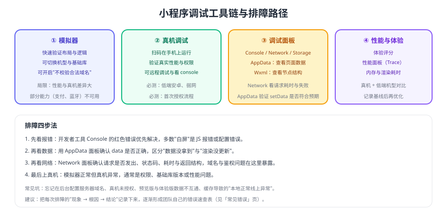

# 微信小程序 调试工具链

小程序的问题大多能靠「模拟器 + 面板 + 真机」三件套定位。本页讲清每种工具擅长什么、什么时候必须上真机，以及一套可复用的排障顺序。



## 工具与适用场景

| 工具 | 擅长 | 局限 |
| --- | --- | --- |
| 模拟器 | 快速验证布局、逻辑、接口连通性 | 性能与真机差异大，支付/蓝牙等能力不可用 |
| 真机调试 | 真实性能、权限、基础库行为 | 调试链路稍慢，需要扫码 |
| Console 面板 | JS 报错、`console.log` 输出 | 只能看到前端问题 |
| Network 面板 | 请求是否发出、状态码、耗时、返回体 | 看不到服务端日志 |
| AppData 面板 | 当前页面 data 的真实值 | 需配合代码理解数据流 |
| Wxml 面板 | 节点结构与样式来源 | 复杂布局需要经验 |
| 体验评分 / 性能面板 | 启动、渲染、请求耗时 | 需要真机对比才有意义 |

## 排障四步法

### 第一步：看清报错

绝大多数"白屏"与"点击没反应"是 JS 报错或配置错误：

1. Console 中的红色错误优先解决（未定义变量、路径写错、JSON 配置语法错误）。
2. 编译期错误（如 `app.json` 配置项拼写错误）会直接阻止运行，先修配置。
3. 报错信息里出现 `undefined is not a function` 时，优先怀疑基础库版本不支持该 API（见 [基础库版本与兼容](../Version/index.md)）。

### 第二步：确认数据

用 AppData 面板核对 `data` 是否与预期一致：

- 数据没拿到 → 看 Network 面板；
- 数据拿到了但界面没变 → 检查是否漏了 `setData`，或更新的是普通变量而不是 `data`。

```js [常见错误示例]
Page({
  onLoad() {
    // 错误：直接改 data 不会触发渲染
    // this.data.count = 1

    // 正确：通过 setData 更新
    this.setData({ count: 1 })
  },
})
```

### 第三步：检查网络

| 现象 | 常见原因 | 处理 |
| --- | --- | --- |
| 请求未发出 | 代码未执行 / 被 `if` 拦截 | 在调用前加日志确认 |
| 请求失败且提示域名不合法 | 未在后台配置服务器域名 | 配置 request 合法域名，或在开发时勾选「不校验合法域名」 |
| 401 / 403 | 登录态失效 | 重新登录并刷新 token |
| 返回结构不符 | 接口契约变更 | 对齐字段并补解析容错 |

::: danger 开发与线上环境的差异
开发时勾选「不校验合法域名」很方便，但**上线前必须在真实配置下验证**：域名需要 HTTPS、要加入后台白名单，且不能带端口（除非符合要求）。很多"开发正常、线上报错"都出在这里。
:::

### 第四步：上真机

以下问题模拟器看不出来，必须真机验证：

1. 真机性能（滚动卡顿、首屏慢）——低端安卓机最明显。
2. 权限相关（用户信息、位置、相机、蓝牙）——模拟器表现与真机不同。
3. 基础库版本差异——模拟器可切换版本，但真机才是真实分布。
4. 分享、支付、客服等开放能力——多数只能在真机验证。

## 高效调试的五个习惯

1. **用日志分层**：请求前后、关键分支打日志，出问题时能快速定位到"哪一步没走通"。
2. **保留复现路径**：把复现步骤写进备注（进入哪个页面、点了什么、用的什么版本）。
3. **记录环境快照**：机型、微信版本、基础库版本、网络环境。
4. **二分定位**：注释掉一半逻辑看问题是否消失，比盲读代码快得多。
5. **沉淀速查表**：把"现象 → 根因 → 解决方式"记录到 [常见错误](../Errors/index.md) 页，团队复用。

::: tip 先怀疑环境，再怀疑代码
当同事说"我这边正常你那边报错"时，优先对比三件事：**微信版本/基础库版本、是否勾选「不校验合法域名」、接口地址与登录态**。这三项能解释大部分"只在我这儿出问题"的现象。
:::

## 验证方式

1. 在模拟器中制造一个 JS 错误，确认能通过 Console 定位到具体文件与行号。
2. 断开网络后发请求，观察 Network 面板与页面表现，确认有失败提示而非白屏。
3. 用真机调试打开同一页面，对比启动耗时与滚动流畅度，记录与模拟器的差异。
4. 切换调试基础库到较低版本，复现一次兼容问题并用 `wx.canIUse` 修复。

## 相关专题

- [常见错误](../Errors/index.md)：高频报错与处理方式速查
- [基础库版本与兼容](../Version/index.md)：版本判断与最低基础库设置
- [原生 API](../API/index.md)：网络请求与域名配置
- [性能优化](../Performance/index.md)：用性能面板做量化对比

## 参考资料

- 微信小程序官方文档 · 调试：https://developers.weixin.qq.com/miniprogram/dev/devtools/debug.html
- 微信小程序官方文档 · 真机调试：https://developers.weixin.qq.com/miniprogram/dev/devtools/remote-debug.html
