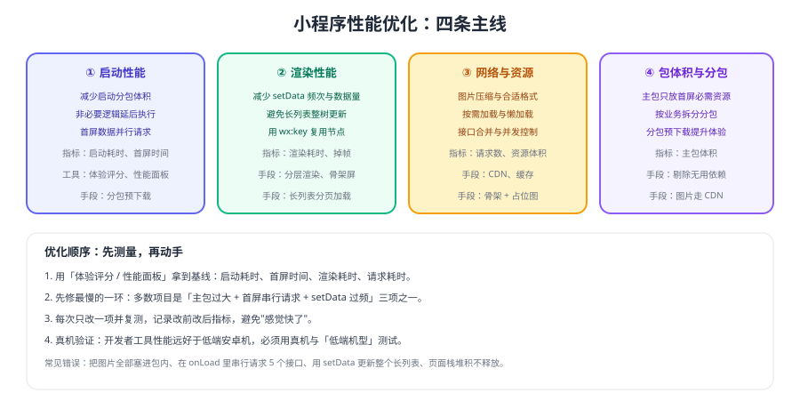

# 微信小程序 性能优化

小程序的性能问题集中出现在四个地方：**主包太大启动慢、首屏串行请求、setData 太频繁、图片太重**。本页给出可执行的优化顺序与验证方法，避免"凭感觉优化"。



## 先测量，再优化

| 指标 | 含义 | 观测方式 |
| --- | --- | --- |
| 启动耗时 | 点击到首页可交互 | 开发者工具性能面板 / 体验评分 |
| 首屏时间 | 首屏内容渲染完成 | 性能面板 Trace |
| 渲染耗时 | 单次 setData 到渲染完成 | AppData + 性能面板 |
| 主包体积 | 影响启动与下载 | 开发者工具「代码依赖分析」 |
| 请求耗时 | 接口与资源加载 | Network 面板 |

::: tip 一条重要前提
**开发者工具的性能远好于真机**。所有结论都要用真机、最好是一台低端安卓机复测，否则优化很容易"优化了个寂寞"。
:::

## 启动性能

1. **主包只放首屏必需资源**：图片走 CDN，非首屏页面拆分包（见 [分包加载](../Subpackage/index.md)）。
2. **减少同步阻塞**：`App.onLaunch` 中不要做大量同步计算或同步存储读取。
3. **接口并行**：首屏需要的多个接口用 `Promise.all` 并发，而不是串行 await。
4. **分包预下载**：在合适入口配置预下载，缩短进入分包页面的等待。

```js [并行请求示例]
// 差：串行执行，耗时累加
// const a = await requestA(); const b = await requestB()

// 好：并行执行，耗时取最大值
const [a, b] = await Promise.all([requestA(), requestB()])
this.setData({ a, b })
```

## 渲染性能：setData 是最容易踩的坑

`setData` 的代价与**数据体积**和**调用频次**成正比，它会跨线程通信并触发渲染。

| 反例 | 问题 | 改法 |
| --- | --- | --- |
| `this.setData({ list: newList })` 更新整个列表 | 数据量大、整树 diff | 用路径更新：`this.setData({ 'list[3].price': 9.9 })` |
| 循环里频繁 setData | 每次都可能触发渲染 | 合并为一次 setData |
| 把不参与渲染的数据放进 data | 浪费通信与内存 | 放在普通变量或 `this.xxx` 上 |
| 长列表一次性渲染几百条 | 首屏卡顿 | 分页加载 / 虚拟列表 |
| 列表 `wx:key` 用 index | 节点复用效率低 | 用唯一 id 作为 key |

```js [局部更新示例]
// 只更新第 3 项的某个字段，避免整表传输
this.setData({
  'list[3].price': 9.9,
  'list[3].updatedAt': Date.now(),
})
```

## 网络与资源

1. **图片**：压缩后再上传、使用合适尺寸（不要用 2000px 图显示 200px 的缩略图）、列表图片懒加载。
2. **接口**：能合并的合并，能缓存的缓存（本地 Storage 缓存 + 版本号失效）。
3. **弱网体验**：骨架屏 + 占位图 + 失败重试，避免白屏。
4. **并发控制**：同时发几十个请求会排队，按优先级分组，必要时限制并发数。

::: danger 三类最常见的"优化无效"
1. **只优化代码不改图片**：包体积和首屏耗时大头往往在图片与主包体积。
2. **只优化启动不优化交互**：用户抱怨的常常是滚动卡顿与点击延迟，属于渲染问题。
3. **不给真机复测**：模拟器上完全看不出的问题，在低端机上非常明显。
:::

## 优化检查清单

| 检查项 | 目标 | 工具 |
| --- | --- | --- |
| 主包体积 | 尽可能小，图片与大字库外置 | 代码依赖分析 |
| 首屏请求数 | 尽量少，且并行 | Network 面板 |
| 单次 setData 数据量 | 只传变化的部分 | AppData / 性能面板 |
| 长列表 | 分页或虚拟列表 | 真机滚动测试 |
| 图片 | 压缩、懒加载、合适尺寸 | Network 面板 |
| 分包 | 非首屏页面分包、预下载 | 分包分析 |

## 验证方式

1. 用体验评分跑一次基线，记录启动耗时、首屏时间与主包体积。
2. 把一次 `setData({list})` 改成路径更新，对比渲染耗时是否下降。
3. 把首屏两个串行请求改成并行，对比首屏时间变化。
4. 在真机低端机型上重复测试，确认优化效果在真实环境下成立。

## 相关专题

- [分包加载](../Subpackage/index.md)：主包瘦身最直接的手段
- [调试工具链](../Debug/index.md)：性能面板与真机调试方法
- [组件](../Component/index.md)：列表与滚动组件的使用要点
- [前端性能优化专题](../../../Others/PerformanceOptimization/index.md)：通用 Web 性能方法论的对照

## 参考资料

- 微信小程序官方文档 · 性能优化：https://developers.weixin.qq.com/miniprogram/dev/framework/performance/tips.html
- 微信小程序官方文档 · 分包加载：https://developers.weixin.qq.com/miniprogram/dev/framework/subpackages/basic.html
