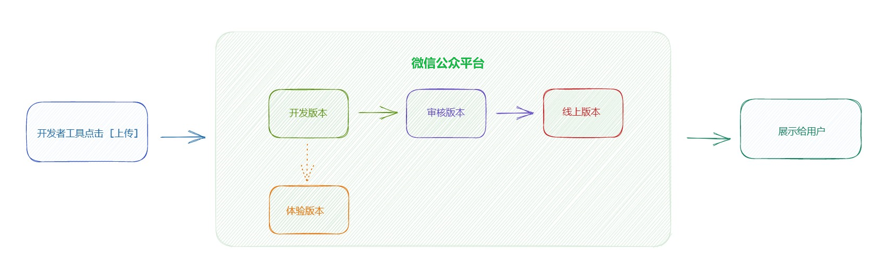
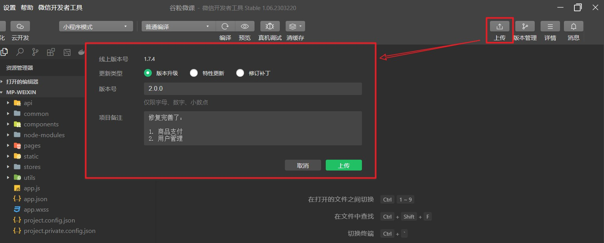
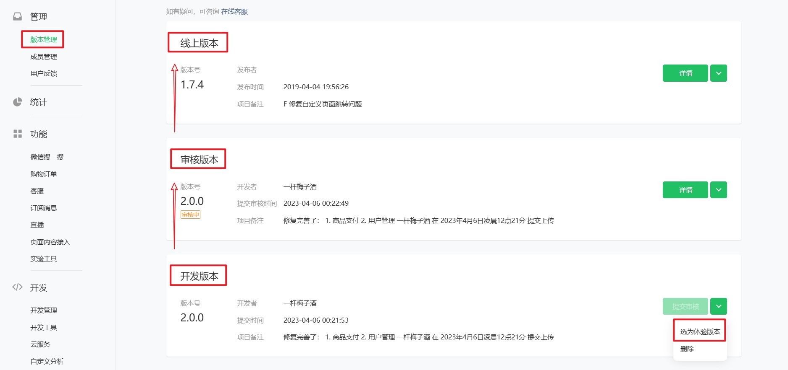

# 微信小程序 上线发布

假设目前已经使用微信开发者工具，按照小程序的开发规范完成了小程序的全部的全部开发工作，并且完成了本地测试，这时候需要开发对小程序进行发布。

小程序上线的流程：



- **开发版本**：点击开发者工具上传后的版本，开发版本只保留每人最新的一份上传的代码，是供开发者和团队测试和调试的版本。

- **体验版本**：小程序开发者可以将开发版本转换为体验版本，由测试人员以及产品经理进行测试与体验，确认没问题可提交审核。

- **审核版本**：小程序开发者可以将开发版本转换为审核版本，由微信的审核团队进行审核，审核周期为1~7天，审核通过可提交发布。

- 线上版本：通过微信小程序平台审核，并由开发者提交发布的正式版本，线上版本是用户可以正常使用的小程序版本。


小程序开发成员在开发者工具中点击 **`上传`** 按钮，在弹出的界面中选择更新类型、版本号、项目备注，就能够将小程序代码上传至微信公众号后台审核：



在登录到微信公众后台以后，点击左侧的 "管理-版本管理"，就能查看小程序的四个版本：



## 发布前的检查清单

| 检查项 | 要求 |
| --- | --- |
| 功能完整性 | 所有入口都能走通，无空白页与死链 |
| 域名配置 | 请求/上传/下载/WebSocket 域名已在后台配置且为 HTTPS |
| 权限与隐私 | 涉及用户信息的接口已按要求声明用途并给出授权说明 |
| 异常路径 | 断网、接口失败、空数据都有提示，不出现白屏 |
| 真机验证 | 至少在 iOS 与安卓各一台真机验证 |
| 基础库兼容 | 低版本用户有降级或提示（见 [基础库版本与兼容](../Version/index.md)） |
| 版本信息 | `app.json` 版本号、项目备注填写清晰，便于回滚定位 |

::: danger 上线最容易漏的三件事
1. **域名只在开发工具里放行**：忘记在后台配置，线上直接全部请求失败。
2. **类目与功能不符**：审核驳回一半以上来自类目/资质与实际功能不一致。
3. **没有回滚预案**：线上出问题只能"改代码再发一版"，等待审核的时间里用户一直在受影响。
:::

## 审核与驳回

1. 提交审核前，用「体验版」由测试与产品完整走查一遍（体验版与开发版数据通常不共享，注意环境配置）。
2. 审核通常需要一定周期，遇到驳回要看清「驳回原因」再修改，避免反复提交同一问题。
3. 常见驳回原因与处理见 [常见错误](../Errors/index.md) 的平台与审核类小节。

## 灰度发布与回滚

| 阶段 | 做法 | 观察指标 |
| --- | --- | --- |
| 灰度 | 平台支持的分阶段发布（按比例放量） | 错误率、崩溃、关键接口成功率 |
| 全量 | 确认灰度无异常后放量 | 用户反馈与业务指标 |
| 回滚 | 版本管理中选择已发布的旧版本回退 | 回滚后确认白屏/错误率恢复 |

::: tip 回滚的前提是"版本可识别"
每次上传都写清楚版本号与备注（如 `v1.4.2 修复订单列表返回不刷新`）。出问题时才能一眼找到上一个稳定版本，而不是靠猜。
:::

## 用 CI 自动上传（可选）

团队协作时，可以用官方提供的命令行工具在流水线中完成上传，避免人工操作：

```shell
# 示例：安装官方 CI 工具后，在流水线中执行上传
npm install -g miniprogram-ci
# 在 CI 中调用上传脚本（需要配置私钥与项目路径）
node ci-upload.js
```

要点：

1. **私钥不要写进仓库**：放在 CI 的密钥管理中。
2. **上传后仍需人工在后台提交审核**：自动化通常只到「上传为开发版本」。
3. **版本号用构建号或提交号生成**，保证每次上传可追溯。

## 验证方式

1. 用体验版在真机上完整走一遍核心流程，确认与开发环境表现一致。
2. 在后台「版本管理」中确认开发版本已生成，并能正确选择版本号与备注。
3. 提交一次审核，观察后台状态流转（审核中 → 审核通过/驳回）。
4. 发布后立刻检查线上首页、核心接口与登录流程，确认无白屏与请求失败。

## 相关专题

- [常见错误](../Errors/index.md)：审核驳回与线上异常的处理
- [基础库版本与兼容](../Version/index.md)：低版本用户的白屏问题
- [npm 使用](../npm/index.md)：依赖构建与包体积控制
- [性能优化](../Performance/index.md)：上线前的体验评分

## 参考资料

- 微信小程序官方文档 · 发布：https://developers.weixin.qq.com/miniprogram/dev/framework/quickstart/release.html
- 微信小程序官方文档 · 代码上传（CI）：https://developers.weixin.qq.com/miniprogram/dev/devtools/ci.html

