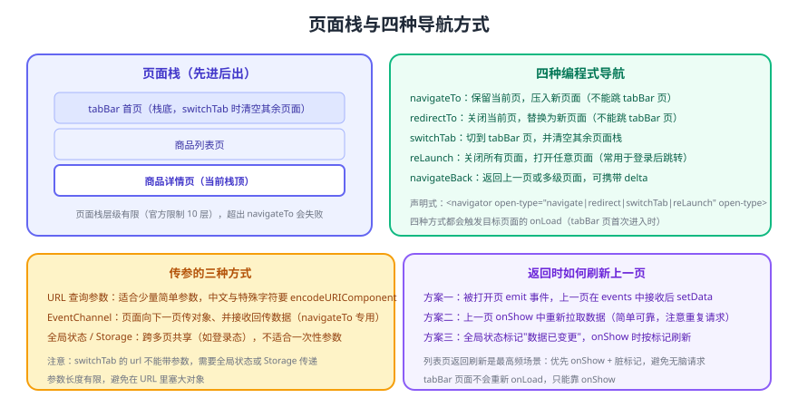

# 微信小程序 路由与页面栈

小程序的「页面」不是浏览器的历史记录，而是一个**有层级上限的页面栈**。理解页面栈，才能写对「进入下一页」「返回上一页并刷新」「切到 tabBar」这三类最常见的跳转需求。基础 API 清单见 [原生 API](../API/index.md) 的路由与通信一节，本页讲的是**怎么设计跳转**。



## 页面栈是什么

小程序用页面栈管理页面：打开新页面 → 压栈；返回 → 出栈。同一时刻只有一个页面在前台，其余页面保留在栈中（被隐藏而不是销毁）。

| 概念 | 行为 | 影响 |
| --- | --- | --- |
| 压栈 | `navigateTo` 打开新页面 | 上一页保留，`onHide` 触发，`onUnload` 不触发 |
| 出栈 | `navigateBack` 返回 | 当前页 `onUnload` 触发 |
| 替换栈顶 | `redirectTo` | 当前页销毁，无法返回 |
| 清空栈 | `reLaunch` / `switchTab` | 其余页面全部销毁 |
| 栈深度上限 | 官方限制 **10 层** | 超出后 `navigateTo` 失败，需要改用 redirectTo |

::: danger 页面栈相关的三个高频错误
1. **无限压栈**：详情页里再点「相关商品」不断 `navigateTo`，很快触顶失败，应改用 `redirectTo`。
2. **误以为返回会刷新**：返回时上一页只触发 `onShow`，不会重新 `onLoad`，数据要自己刷新（见下文）。
3. **用 switchTab 传参**：tabBar 页的 url 不允许带参数，参数只能走全局状态或 Storage。
:::

## 四种导航方式怎么选

```js [navigate.js]
// 1. 进入下一层（保留当前页，可返回）
wx.navigateTo({ url: '/pages/detail/detail?id=1001' })

// 2. 替换当前页（不希望用户返回，例如下单完成后跳结果页）
wx.redirectTo({ url: '/pages/result/result?orderNo=ORD1' })

// 3. 切换到 tabBar 页面（清空其余页面，不能带参数）
wx.switchTab({ url: '/pages/cart/cart' })

// 4. 关闭所有页面后打开（登录成功、退出登录）
wx.reLaunch({ url: '/pages/index/index' })

// 5. 返回上一页或多级页面
wx.navigateBack({ delta: 1 })
```

声明式写法（`navigator` 组件）适合列表项跳转，等价于对应的编程式调用：

```html [wxml]
<!-- open-type 缺省为 navigate，另有 redirect / switchTab / reLaunch -->
<navigator url="/pages/detail/detail?id={{ item.id }}" open-type="navigate">
  {{ item.title }}
</navigator>
```

## 传参的三种方式

| 方式 | 适用 | 限制 |
| --- | --- | --- |
| URL 查询参数 | 少量简单参数（id、tab 索引） | 需 `encodeURIComponent`；长度有限；switchTab 不支持 |
| EventChannel | 向下一页传对象、并接收回传数据 | 仅 `navigateTo` 建立通道 |
| 全局状态 / Storage | 登录态、跨多页共享数据 | 注意清理与一致性，不适合一次性参数 |

```js [pages/detail/detail.js]
Page({
  onLoad(options) {
    // 接收 URL 参数（值都是字符串，需要自行转换类型）
    const id = Number(options.id)
    this.setData({ id })
  },
})
```

::: warning 参数里不要塞对象
URL 参数本质是字符串，且长度有限；把整个商品对象序列化进 URL 既容易超长又容易被截断。正确做法是**只传标识（id）**，详情页自己拉取数据。
:::

## 返回时刷新上一页

列表页 → 详情页 → 修改数据 → 返回列表，是最高频的场景。三种做法：

| 方案 | 实现 | 优点 | 代价 |
| --- | --- | --- | --- |
| EventChannel 回传 | 详情页 `emit`，列表页在 `events` 中接收 | 精准、无额外请求 | 仅 navigateTo 可用 |
| `onShow` 重新拉取 | 回到列表页时重新请求 | 简单、可靠 | 每次返回都请求，浪费带宽 |
| 脏标记 + `onShow` | 设置「数据已变更」标记，`onShow` 时按标记刷新 | 兼顾精准与简单 | 需要维护标记 |

```js [pages/list/list.js]
Page({
  data: { list: [], dirty: false },

  onShow() {
    // 只在标记为脏时才重新拉取，避免无意义的重复请求
    if (this.data.dirty) {
      this.setData({ dirty: false })
      this.fetchList()
    }
  },

  fetchList() {
    // wx.request(...) 拉取列表
  },
})
```

::: tip tabBar 页面只能靠 onShow
tabBar 页面切换时不会重新 `onLoad`，如果购物车、订单列表需要实时性，必须把刷新逻辑放在 `onShow`（或使用脏标记），否则用户会看到过期数据。
:::

## 页面栈与内存

1. 栈内页面越多，占用内存越高，低端机更容易被回收或卡顿。
2. 详情页之间互相跳转时优先 `redirectTo`，避免栈无限增长。
3. 页面销毁（`onUnload`）时要清理定时器、事件监听与未完成请求，否则会造成内存泄漏。
4. 大列表页返回后仍驻留内存，必要时在 `onHide` 中释放大对象（如图片数组引用）。

## 验证方式

1. 连续从列表页 `navigateTo` 详情页 11 次，确认第 11 次失败并观察官方报错信息，随后改用 `redirectTo` 复测通过。
2. 在详情页修改数据后返回列表页，确认列表内容已刷新且没有重复请求。
3. 在 tabBar 页与普通页之间来回切换，确认 tabBar 页 `onLoad` 只执行一次、`onShow` 每次执行。
4. 用 `delta: 2` 从第三层直接返回首页，确认中间页面 `onUnload` 正常触发。

## 相关专题

- [原生 API](../API/index.md)：路由与通信 API 的基础用法
- [页面间通信](../PageCommunication/index.md)：EventChannel 的完整用法
- [全局数据共享（getApp）](../getApp/index.md)：跨页面共享登录态与共享数据
- [生命周期](../Lifecycle/index.md)：onLoad / onShow / onHide / onUnload 的触发时机

## 参考资料

- 微信小程序官方文档 · 路由：https://developers.weixin.qq.com/miniprogram/dev/framework/app-service/route.html
- 微信小程序官方文档 · 组件 navigator：https://developers.weixin.qq.com/miniprogram/dev/component/navigator.html
