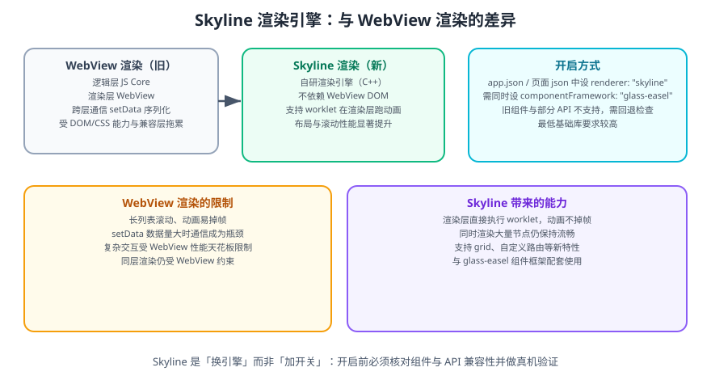

# 微信小程序 Skyline 渲染引擎

**Skyline 是微信自研的小程序渲染引擎**，它不再依赖 WebView 的 DOM 树来渲染界面，而是用一套原生实现的渲染管线，把「布局 → 绘制 → 合成」全部接管。这是小程序近年来对性能天花板影响最大的一次改动。



## 一句话定位

WebView 渲染受限于 WebView 的能力与性能上限；Skyline 通过**替换渲染层**突破这层天花板，让长列表、复杂动画、密集交互在小程序里达到接近原生的流畅度。

## 两种渲染模式对比

| 维度 | WebView 渲染（默认，沿用多年） | Skyline 渲染 |
| --- | --- | --- |
| 渲染层实现 | 系统 WebView 的 DOM/CSS | 自研原生渲染引擎 |
| 布局计算 | WebView 排版引擎 | Skyline 自身布局系统 |
| 动画 | 依赖 CSS 动画 / JS 逐帧 | 支持 worklet，在渲染层直接执行 |
| 长列表性能 | 节点多时明显掉帧 | 大批量节点仍能保持流畅 |
| 组件/API 覆盖 | 全量支持 | **部分组件与 API 尚未支持** |
| 基础库要求 | 低 | **要求较高的基础库版本** |

::: danger 注意
Skyline **不是「加个开关」就能用**。它是一套新的渲染与组件体系，迁移前必须逐项核对：

1. 项目里用到的组件是否在 Skyline 支持列表内；
2. 用到的 API 是否有 Skyline 版本；
3. 自定义组件是否兼容 `glass-easel` 组件框架；
4. 在真机（尤其是低端安卓机）上验证，而不是只看模拟器。
:::

## 开启方式

Skyline 需要**同时**满足两个配置：渲染引擎设为 `skyline`，组件框架设为 `glass-easel`。

### 全局开启

```json [app.json]
{
  "renderer": "skyline",
  "rendererOptions": {
    "skyline": {
      "defaultDisplayBlock": true,
      "defaultContentBox": true
    }
  },
  "componentFramework": "glass-easel",
  "lazyCodeLoading": "requiredComponents"
}
```

### 按页面开启

只在需要的页面开启，其余页面保持 WebView，降低迁移风险：

```json [pages/feed/index.json]
{
  "renderer": "skyline",
  "componentFramework": "glass-easel",
  "disableScroll": true
}
```

::: tip 建议
**按页面灰度开启**是更稳的路径：先在一个纯展示、无复杂第三方组件的长列表页面试点，验证流畅度与兼容性，再逐步扩大范围。不要一上来就全局切换。
:::

## 关键差异：滚动与布局

Skyline 下页面**默认不滚动**，滚动由 `scroll-view` 承担。这是迁移时最容易踩的坑：

```html [pages/feed/index.wxml]
<!-- Skyline 下常见的整页滚动结构 -->
<scroll-view
  type="list"
  scroll-y
  style="height: 100vh;"
  bindscrolltolower="onReachBottom"
>
  <view wx:for="{{ list }}" wx:key="id" class="item">{{ item.title }}</view>
</scroll-view>
```

```json [pages/feed/index.json]
{
  "renderer": "skyline",
  "componentFramework": "glass-easel",
  "disableScroll": true
}
```

| 变化 | WebView 默认 | Skyline 默认 |
| --- | --- | --- |
| 页面滚动 | 页面整体可滚动 | 需显式用 `scroll-view` |
| `display` 默认值 | `inline`（部分组件） | 更接近 `block`（由 `defaultDisplayBlock` 控制） |
| 盒模型 | 受 WebView 影响 | 更贴近标准 `content-box`（由 `defaultContentBox` 控制） |
| 页面栈动画 | 系统转场 | 自定义路由可接管 |

::: danger 注意
**`rendererOptions` 里的 `defaultDisplayBlock` / `defaultContentBox` 会改变布局默认行为**，直接影响已有样式。开启后一定要逐页对比布局是否错位，不要假设「样式没改就不会变」。
:::

## worklet：渲染层动画

Skyline 的核心亮点之一。`worklet` 允许把动画逻辑**放到渲染层执行**，避免逻辑层 ↔ 渲染层的逐帧通信：

```javascript [pages/anim/index.js]
Page({
  data: { offset: 0 },
  onReady() {
    // 在渲染层注册并执行动画，不经过逻辑层逐帧 setData
    this.animate(
      '#box',
      [
        { translateX: 0, offset: 0 },
        { translateX: 200, offset: 1 },
      ],
      1000,
      () => console.log('动画结束'),
    );
  },
});
```

```html [pages/anim/index.wxml]
<view id="box" class="box"></view>
```

```css [pages/anim/index.wxss]
.box { width: 80rpx; height: 80rpx; background: #10b981; }
```

::: tip 一句话理解
WebView 时代「动画 = 每帧改 data → setData → 渲染」，Skyline 的 worklet 让「动画 = 渲染层自己算自己画」。**通信次数从 N 帧降到 1 次**，这就是不掉帧的原因。
:::

## 兼容与回退策略

| 场景 | 做法 |
| --- | --- |
| 页面用了不支持的组件 | 该页保持 WebView（按页面配置） |
| 需要同时支持新老基础库 | 用 `wx.canIUse` / API 存在性判断降级 |
| 第三方组件库不兼容 | 升级版本或替换，或该页不启用 Skyline |
| 需要整页滚动但组件不支持 | 用 `scroll-view` 包裹并设 `height: 100vh` |

```javascript [降级判断示例]
const app = getApp();

Page({
  onLoad() {
    // 若运行环境不支持 Skyline 所需能力，走降级逻辑
    if (!wx.canIUse('scroll-view.type.list')) {
      this.setData({ useFallbackList: true });
    }
  },
});
```

::: warning 说明
Skyline 的能力在持续补齐，**支持列表会随基础库版本变化**。判断标准不要抄本文，而要以官方文档「Skyline 支持列表」当前内容为准，并在目标基础库版本上真机验证。
:::

## 迁移检查清单

| 检查项 | 说明 |
| --- | --- |
| 组件支持 | 逐个核对页面用到的组件 |
| API 支持 | 逐个核对调用的 `wx.*` 接口 |
| 组件框架 | 是否已切换 `glass-easel`，自定义组件是否兼容 |
| 滚动结构 | 页面滚动是否已改为 `scroll-view` |
| 布局默认值 | `defaultDisplayBlock` / `defaultContentBox` 是否导致错位 |
| 动画 | 是否改用 worklet / `this.animate` |
| 基础库门槛 | 是否需要上调最低基础库版本（见 [基础库版本与兼容](../Version/index.md)） |
| 真机验证 | iOS 与低端安卓各一台，对比滚动帧率与首屏 |

## 验证方式

1. 在一个长列表页面开启 Skyline，用真机滚动到列表底部，对比开启前后的掉帧情况。
2. 检查页面是否因为「默认不滚动」而无法滚动，确认已用 `scroll-view` 修正。
3. 对比开启前后各页面截图，确认布局没有因默认盒模型变化而错位。
4. 在低版本基础库的真机上打开，确认降级分支生效而不是白屏。

## 相关专题

- [性能优化](../Performance/index.md)：Skyline 与其他优化手段的配合
- [基础库版本与兼容](../Version/index.md)：最低基础库版本设置
- [自定义组件](../CustomComponent/index.md)：`glass-easel` 下的组件写法
- [调试工具链](../Debug/index.md)：真机验证与性能面板

## 参考资料

- 微信小程序官方文档 · Skyline 渲染引擎：https://developers.weixin.qq.com/miniprogram/dev/framework/runtime/skyline/introduction.html
- 微信小程序官方文档 · glass-easel 组件框架：https://developers.weixin.qq.com/miniprogram/dev/framework/custom-component/glass-easel/
