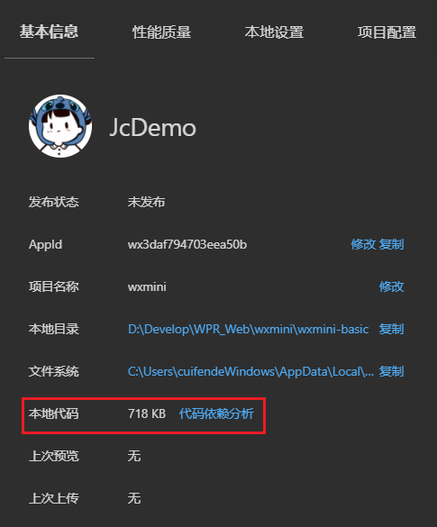

# 微信小程序 分包加载

**分包加载**：小程序的代码通常是由许多页面、组件以及资源等组成，随着小程序功能的增加，代码量也会逐渐增加，体积过大就会导致用户打开速度变慢，影响用户的使用体验。

分包加载是一种小程序优化技术。将小程序不同功能的代码，分别打包成不同的子包，在构建时打包成不同的分包，用户在使用时按需进行加载，在构建小程序分包项目时，构建会输出一个或多个分包。每个使用分包小程序必定含有一个主包。每个分包可以包含多个页面、组件、样式和逻辑等。当小程序需要使用某个分包时，才会加载该分包中的代码。

- **主包：**包含默认启动页面 / TabBar 页面 以及 所有分包都需用到公共资源的包。
- **分包：**根据开发者的配置进行划分出来的子包。


**小程序分包加载**：在小程序启动时，默认会下载主包并启动主包内页面，在用户访问分包内某个页面时，微信客户端才会把对应分包下载下来，下载完成后再进行展示。

**目前小程序分包大小有以下限制**：

1. **整个小程序所有分包大小不超过 20MB**
2. **单个分包/主包大小不能超过 2MB**

:::danger

整个小程序所有分包大小可能会随时调整，截止到目前整个小程序所有分包大小不超过 20M。

:::

## 分包的基本使用

在进行分包加载之前，需要对小程序的业务逻辑进行分析，将代码划分成多个模块。**每个模块应该有一个明确的功能**，并与其他模块之间有明确的依赖关系。

> 需要按照功能拆分分包，并且每个分包都需要与其他包有依赖关系(可以通过 a 分包跳转到 b 分包)。

开发者在小程序的配置文件 `app.json` 中，通过 `subPackages` 或者 `subpackages`字段声明项目分包结构。

每个分包需要指定 `root` 字段、`name` 字段和 `pages` 字段：

1. `root` 字段指定了分包的根目录，该目录下的所有文件都会被打包成一个独立的包。
2. `name` 字段为分包的名称，用于在代码中引用该分包。
3. `pages` 字段指定了该分包中包含的页面，可以使用通配符 `*` 匹配多个页面。



```json
{

  "subPackages": [
    {
      "root": "modules/goodModule",
      "name": "goodModule",
      "pages": [
        "pages/list/list",
        "pages/detail/detail"
      ]
    },
    {
      "root": "modules/marketModule",
      "name": "marketModule",
      "pages": [
        "pages/market/market"
      ]
    }
  ]

}

```

## 打包和引用原则

**打包原则**：

1. tabBar 页面必须在主包内。

2. 最外层的 pages 字段，属于主包的包含的页面。

3. 按 subpackages 配置路径进行打包，配置路径外的目录将被打包到主包中。

4. 分包之间不能相互嵌套，subpackage 的根目录不能是另外一个 subpackage 内的子目录。

**引用原则**：

1. 主包不可以引用分包的资源，但分包可以使用主包的公共资源。

2. 分包与分包之间资源无法相互引用， 分包异步化时不受此条限制。

## 独立分包的配置

独立分包是小程序中一种特殊类型的分包，可以**独立于主包和其他分包运行**。

从独立分包中页面进入小程序时，不需要下载主包，但是当用户进入普通分包或主包内页面时，主包才会被下载 。

开发者可以将功能相对独立的页面配置到独立分包中，因为独立分包不依赖主包即可运行，可以很大程度上提升分包页面的启动速度。

> 如果是独立分包，不需要下载主包，直接就能够访问，独立分包是自己独立运行的。
>
> 而如果是其他分包，需要先下载主包，通过路径访问，才能加载对应路径的分包。

:::danger

1. 独立分包中不能依赖主包和其他分包中的资源。

2. 主包中的 app.wxss 对独立分包无效。

3. App 只能在主包内定义，独立分包中不能定义 App，会造成无法预期的行为。

:::

**配置独立分包：**

开发者在`app.json`中找到需要配置为独立分包的`subpackages`字段。在该字段配置项中定义`independent`字段声明对应分包为独立分包。

```json
{

  "subPackages": [
    {
      "root": "modules/goodModule",
      "name": "goodModule",
      "pages": [
        "pages/list/list",
        "pages/detail/detail"
      ]
    },
    {
      "root": "modules/marketModule",
      "name": "marketModule",
      "pages": [
        "pages/market/market"
      ],
      "independent": true  // [!code highlight]
    }
  ]
}

```

## 分包预下载

分包预下载是指访问小程序某个页面时，预先下载分包中的代码和资源，以提高用户的使用体验。当用户需要访问分包中的页面时，已经预先下载的代码和资源可以直接使用，通过分包预下载加快了页面的加载速度和显示速度。

小程序的分包预下载需要在 `app.json` 中通过 `preloadRule` 字段设置预下载规则。`preloadRule` 是一个对象，对象的 `key` 表示访问哪个路径时进行预加载，`value` 是进入此页面的预下载配置，具有两个配置项：

| 字段     | 类型        | 必填 | 默认值 | 说明                                                         |
| -------- | ----------- | ---- | ------ | ------------------------------------------------------------ |
| packages | StringArray | 是   | 无     | 预下载的分包名称，进入页面后预下载分包的 `root` 或 `name`<br />`__APP__` 表示主包。 |
| network  | String      | 否   | wifi   | 在指定网络下预下载，<br />可选值为： `all`: 不限网络 `wifi`: 仅wifi下预下载 |

```json
{
  "subPackages": [
    {
      "root": "modules/goodModule",
      "name": "goodModule",
      "pages": [
        "pages/list/list",
        "pages/detail/detail"
      ]
    },
    {
      "root": "modules/marketModule",
      "name": "marketModule",
      "pages": [
        "pages/market/market"
      ],
      "independent": true
    }
  ],
  "preloadRule": {
    "pages/index/index": {
      "network": "all",
      "packages": ["modules/goodModule"]
    },
    "modules/marketModule/pages/market/market": {
      "network": "all",
      "packages": ["__APP__"]
    }
  }
}
```

**例**：

```json
{
  "pages": [
    "pages/index/index",
    "pages/user/user"
  ],
  "subPackages": [
    {
      "root": "pages/music",
      "name": "music",
      "pages": [
        "player/player",
        "lyric/lyric"
      ]
    },
    {
      "root": "pages/settings",
      "name": "settings",
      "pages": [
        "theme/theme",
        "language/language"
      ]
    }
  ],
  "preloadRule": {
    "pages/music/player/player": {
      "packages": ["settings"],
      "network": "wifi"
    }
  }
}
```

## 分包大小限制与主包瘦身

分包只是「把代码分成几份」，真正的收益来自**主包足够小**——因为无论用户打开哪个页面，主包都必须先下载。

| 限制 | 数值 | 说明 |
| --- | --- | --- |
| 所有分包大小总和 | 不超过 20MB | 官方数值可能调整，以文档为准 |
| 单个分包 / 主包 | 不超过 2MB | **最容易踩的硬约束** |
| 主包 | 只放首屏与 TabBar | 是启动速度的直接决定因素 |

主包瘦身手段：

1. **TabBar 页面与启动页留在主包**，其余页面全部拆分包。
2. **图片与字体外置**：放 CDN 或对象存储，不要打进包内。
3. **大依赖按需引入**：UI 库不要整包引入（见 [npm 使用](../npm/index.md)）。
4. **公共资源下沉**：被多个分包共用的代码放主包，避免每个分包各打一份。
5. **排查体积**：用开发者工具「代码依赖分析」逐层展开，找出真正占体积的文件。

::: danger 注意
**不要为了分包而分包**。分包切得太碎会导致：① 每个分包都要重复打包公共代码（除非下沉到主包）；② 分包之间的跳转需要等待下载，出现明显白屏。**按业务模块划分**，一个模块一个分包才是合理的粒度。
:::

## 分包异步化

默认情况下，**分包之间不能互相引用资源**。分包异步化（异步引用）打破了这条限制：允许一个分包在运行时**异步引入另一个分包的代码**。

```javascript [分包 A 中异步引用分包 B 的模块]
// 运行时按需加载另一个分包中的 JS 模块
require.async('../../modules/otherModule/utils/format.js')
  .then((mod) => {
    console.log(mod.formatDate(Date.now()));
  })
  .catch((err) => {
    console.error('异步加载分包模块失败', err);
  });
```

```javascript [异步引用另一个分包中的自定义组件]
// 组件异步化：在 usingComponents 中声明
Component({
  options: {
    // 声明异步组件：componentPlaceholder 用于加载期间的占位
    componentPlaceholder: {
      'async-card': 'view',
    },
  },
});
```

```json [pages/index/index.json]
{
  "usingComponents": {
    "async-card": "../../modules/card/components/card"
  },
  "componentPlaceholder": {
    "async-card": "view"
  }
}
```

| 方式 | 适用 | 注意 |
| --- | --- | --- |
| `require.async` | 异步加载 JS 模块 | 返回 Promise，需处理失败分支 |
| 异步组件 | 跨分包复用自定义组件 | 必须配 `componentPlaceholder`，否则空白 |

::: danger 注意
1. **异步加载必然有等待**：如果模块在首屏就要用，异步化只会让首屏更慢。**只对「点击后才需要」的模块使用**。
2. **`componentPlaceholder` 不可省略**：没有占位组件时，加载期间该区域是空白，用户会以为页面坏了。
3. **异步化不改变 2MB 限制**：它解决的是「跨分包引用」问题，不是「包变大」问题。
:::

## 常见踩坑

| 现象 | 原因 | 处理 |
| --- | --- | --- |
| 打包后报「分包大小超过 2MB」 | 单个分包过大 | 继续拆分，或把资源外置 |
| TabBar 页面找不到 | TabBar 页面被配到了分包里 | TabBar 页面必须在主包 |
| 分包之间跳转白屏久 | 分包体积大且无预下载 | 配 `preloadRule` 预下载 |
| 独立分包里 `getApp()` 为 undefined | 独立分包不加载主包，App 未初始化 | 独立分包内不要依赖全局 App 数据 |
| 引用分包资源报错 | 主包引用了分包资源 | 把该资源下沉到主包 |
| `require.async` 报错 | 基础库版本不足 | 核对最低基础库版本 |

## 验证方式

1. 用开发者工具「代码依赖分析」查看主包与各分包的体积，确认都在 2MB 以内。
2. 首次进入分包页面，观察是否有明显等待；配置 `preloadRule` 后再次进入，对比加载时间变化。
3. 从主包页面跳转到分包页面，确认能正常打开、返回后页面栈正常。
4. 若使用了独立分包，直接在开发者工具中将其设为启动页，确认不依赖主包也能正常运行。

## 相关专题

- [性能优化](../Performance/index.md)：分包与启动速度的关系
- [npm 使用](../npm/index.md)：第三方库如何影响包体积
- [微信小程序 配置文件](../Settings/index.md)：`app.json` 中分包相关配置
- [上线发布](../Release/index.md)：上传前的包体积检查

## 参考资料

- 微信小程序官方文档 · 分包加载：https://developers.weixin.qq.com/miniprogram/dev/framework/subpackages/basic.html
- 微信小程序官方文档 · 分包异步化：https://developers.weixin.qq.com/miniprogram/dev/framework/subpackages/async.html
- 微信小程序官方文档 · 独立分包：https://developers.weixin.qq.com/miniprogram/dev/framework/subpackages/independent.html


