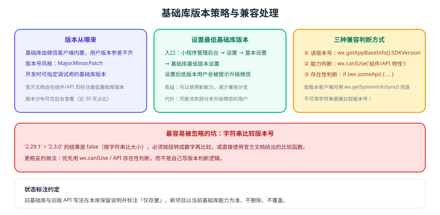

# 微信小程序 基础库版本与兼容

小程序的运行环境由**用户手机里的微信客户端**决定：同一份代码，在不同用户的微信上跑的是不同版本的基础库（基础库即小程序运行时的 API 与组件实现）。因此「版本兼容」不是可选项，而是每个项目都要处理的工程问题。



## 版本从哪里来

| 概念 | 说明 |
| --- | --- |
| 基础库版本 | 小程序运行时的版本，格式为 `Major.Minor.Patch` |
| 微信客户端版本 | 决定了其内置基础库的版本上限 |
| 调试基础库 | 开发者工具中可选择的调试版本，仅影响开发调试 |
| 最低基础库版本 | 在小程序后台设置的门槛，低于该版本的用户会被提示升级微信 |

官方文档会在**每个组件与 API 页面标注最低基础库版本**，例如某个属性要求 `>= 2.x.x`。接入新能力前，先去对应文档页确认版本要求。

::: tip 一句话理解
**你控制不了用户的微信版本，但可以选择"支持到多低"**。要么写兼容分支覆盖旧版本，要么用「最低基础库版本设置」把旧版本用户挡在门外——两条路都要提前决策，而不是上线后才发现白屏。
:::

## 设置最低基础库版本

在**小程序管理后台 → 设置 → 基本设置 → 基础库最低版本设置**中配置：

1. 配置前可查看**近 30 天访问用户的基础库版本占比**，用于评估影响面。
2. 设置后，基础库版本低于门槛的用户打开小程序时会收到「请升级微信版本」的提示。
3. 该能力需要较新的微信客户端支持（官方说明为 iOS 6.5.8 / 安卓 6.5.7 及以上）。

决策建议：

| 场景 | 建议 |
| --- | --- |
| 新项目、强依赖新 API | 设置合理的最低版本，减少兼容分支 |
| 存量项目、用户版本分散 | 先看版本分布，谨慎上调 |
| 面向特定人群（企业内部） | 可要求统一升级微信，门槛可以设得更高 |

## 三种兼容判断方式

### 方式一：读取版本号后比较（不推荐自己写）

```js [version-check.js]
// 获取当前基础库版本（低版本客户端可用 wx.getSystemInfoSync 兜底）
const sdkVersion = wx.getAppBaseInfo
  ? wx.getAppBaseInfo().SDKVersion
  : wx.getSystemInfoSync().SDKVersion

// 注意：不能直接用字符串比较！
// '2.29.1' > '2.3.0' 的结果是 false
function compareVersion(v1, v2) {
  const a = v1.split('.')
  const b = v2.split('.')
  const len = Math.max(a.length, b.length)
  while (a.length < len) a.push('0')
  while (b.length < len) b.push('0')
  for (let i = 0; i < len; i++) {
    const n1 = parseInt(a[i], 10)
    const n2 = parseInt(b[i], 10)
    if (n1 > n2) return 1
    if (n1 < n2) return -1
  }
  return 0
}

if (compareVersion(sdkVersion, '2.10.0') >= 0) {
  // 使用新 API
} else {
  // 降级处理，或提示用户升级微信
}
```

::: danger 版本比较的两个坑
1. **直接用字符串比较版本号**：`'2.29.1' > '2.3.0'` 为 `false`，会导致新版能力永远不生效。
2. **把版本号当浮点数**：`parseFloat('2.10')` 会变成 `2.1`，比较结果同样错误。
:::

### 方式二：能力判断 `wx.canIUse`（推荐）

```js [can-i-use.js]
Page({
  data: {
    // 判断组件/属性/API 参数是否可用，比自己拼版本号更稳妥
    canUseCoverView: wx.canIUse('cover-view'),
    canUseScrollViewEnhanced: wx.canIUse('scroll-view.enhanced'),
  },
})
```

```html [wxml]
<view wx:if="{{ canUseCoverView }}">使用新组件</view>
<view wx:else>降级方案</view>
```

官方说明：`canIUse` 的数据随基础库更新，新版本中的新功能可能存在遗漏，**接入时仍需真机验证**。

### 方式三：API 存在性判断（最简单）

```js [api-exists.js]
if (wx.openBluetoothAdapter) {
  wx.openBluetoothAdapter()
} else {
  wx.showModal({
    title: '提示',
    content: '当前微信版本过低，无法使用该功能，请升级到最新微信版本后重试。',
  })
}
```

适合"新增了一个 API"的场景，无需关心具体版本号。

## 判据选择表

| 场景 | 推荐判据 |
| --- | --- |
| 使用了新 API | `if (wx.newApi)` 存在性判断 |
| 使用了新组件或新属性 | `wx.canIUse('组件.属性')` |
| 需要按版本写多分支逻辑 | 官方 `compareVersion` 方式读 `SDKVersion` |
| 完全无法兼容且用户版本普遍较新 | 设置最低基础库版本 |

## 版本与状态标注约定

本库对小程序相关内容遵循统一约定：

1. **以当前基础库能力为主线**：文中的 API、组件与写法默认面向当前稳定基础库。
2. **旧版本与旧写法保留**：已废弃的 API 与旧版兼容写法保留说明，并标注为**仅存量项目使用**，不删除、不覆盖。
3. **版本要求写进正文**：涉及具体版本门槛时，在页面内注明「最低基础库版本要求以官方文档为准」。

## 验证方式

1. 用 `wx.getAppBaseInfo().SDKVersion` 打印当前机型的基础库版本，并在开发者工具中切换不同基础库版本对比行为。
2. 构造一段版本比较逻辑，用 `'2.29.1'` 与 `'2.3.0'` 验证自己的实现是否正确（避免字符串比较陷阱）。
3. 用 `wx.canIUse` 判断一个你正在使用的组件属性，在低版本基础库下确认降级分支生效。
4. 在真机上用未升级微信的设备（或旧机型）验证提示文案是否符合预期。

## 相关专题

- [常见错误](../Errors/index.md)：版本不兼容导致的具体报错与处理
- [调试工具链](../Debug/index.md)：切换基础库版本与真机验证
- [原生 API](../API/index.md)：API 用法与域名配置
- [上线发布](../Release/index.md)：审核与灰度发布流程

## 参考资料

- 微信小程序官方文档 · 兼容：https://developers.weixin.qq.com/miniprogram/dev/framework/compatibility.html
- 微信小程序官方文档 · 基础库版本分布：https://developers.weixin.qq.com/miniprogram/dev/framework/client-lib/version.html
