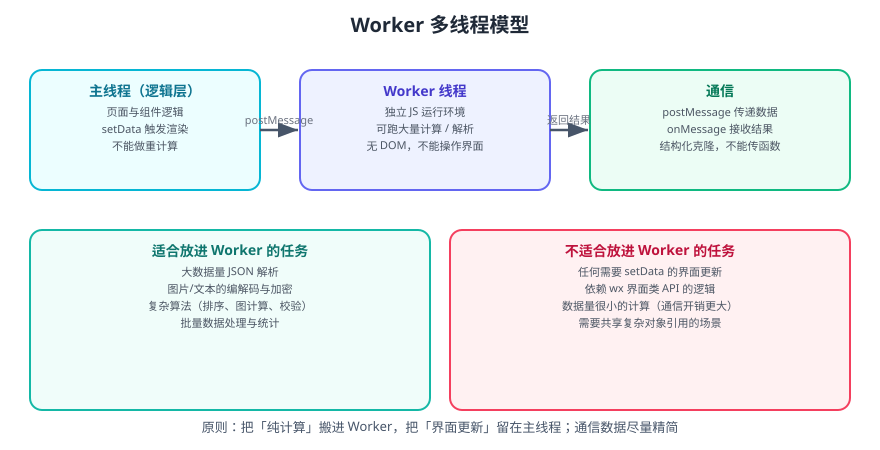

# 微信小程序 Worker 多线程

小程序的逻辑层只有一个 JS 线程：界面逻辑、网络回调、数据处理全挤在一起。一旦有重计算，界面就会卡住。**Worker 让这些计算搬到独立线程**，是解决「点击后卡顿 1 秒」这类问题的标准手段。



## 一句话定位

Worker 是运行在**独立 JS 环境**中的线程：它没有 `wx` 界面类 API、也不能操作 DOM/节点，但可以跑大量纯计算，并通过 `postMessage` 与主线程交换数据。

## 适用与不适用

| 适合放进 Worker | 不适合放进 Worker |
| --- | --- |
| 大数据量 JSON 解析 | 任何需要 `setData` 的界面更新 |
| 图片/文本的编解码、加密解密 | 依赖界面 API 的逻辑（Toast、路由、动画） |
| 复杂算法（排序、图计算、校验） | 计算量很小的任务（通信开销大于收益） |
| 批量数据处理与统计 | 需要共享复杂对象引用的场景 |

::: tip 一条判断标准
问自己：「这段代码会碰界面吗？」**不会 → 可以进 Worker**。会 → 留在主线程，但要把数据准备好后再一次性 `setData`。
:::

## 使用步骤

### 第一步：配置 Worker 目录

```json [app.json]
{
  "workers": "workers"
}
```

### 第二步：编写 Worker

```javascript [workers/calculator.js]
// Worker 入口：注册消息监听
worker.onMessage((res) => {
  const { type, payload } = res;

  if (type === 'sum') {
    // 模拟重计算
    let total = 0;
    for (let i = 0; i < payload.count; i++) total += i;

    // 把结果回传主线程
    worker.postMessage({ type: 'sum:done', payload: total });
  }
});
```

### 第三步：主线程创建并使用

```javascript [pages/index/index.js]
Page({
  data: { result: null },

  onLoad() {
    // 路径相对于 worker 目录
    const calc = wx.createWorker('workers/calculator.js');

    calc.postMessage({ type: 'sum', payload: { count: 1000000 } });

    calc.onMessage((res) => {
      if (res.type === 'sum:done') {
        // 只有这里才 setData，避免渲染层频繁通信
        this.setData({ result: res.payload });
      }
    });

    // 页面卸载时销毁，避免线程泄漏
    this.calc = calc;
  },

  onUnload() {
    this.calc && this.calc.terminate();
  },
});
```

::: danger 注意
1. **Worker 里不能用 `wx` 界面类 API**：`wx.showToast`、`wx.navigateTo`、`wx.createSelectorQuery` 等都不可用。需要界面反馈时，把结果传回主线程再处理。
2. **`postMessage` 传的是结构化克隆后的副本**，不是引用。传函数、类实例、DOM 节点会直接报错或丢失。
3. **务必在 `onUnload` 时 `terminate()`**：不销毁会造成线程与内存泄漏，反复进出页面后问题会累积。
4. **通信本身有成本**：传 10MB 数据进 Worker 的开销可能比计算本身还大。**只传必要字段**，能用索引/ID 就别传整个对象。
:::

## 数据传递的优化

| 反例 | 问题 | 改法 |
| --- | --- | --- |
| 把整个列表传给 Worker 做统计 | 克隆开销大 | 只传需要计算的字段 |
| 每次小计算都起一个 Worker | 创建销毁成本高 | 复用同一个 Worker 实例 |
| Worker 频繁回传中间结果 | 通信次数多 | 合并结果，只回传最终值 |
| 主线程 `await` 等 Worker 结果 | 无法 await，只能回调 | 用 Promise 封装回调 |

### 用 Promise 封装 Worker 调用

```javascript [utils/worker-client.js]
// 把「发消息 + 等回信」封装成 Promise，便于 async/await
let seq = 0;
const pending = new Map();

export function createWorkerClient(scriptPath) {
  const worker = wx.createWorker(scriptPath);

  worker.onMessage((res) => {
    const { id } = res;
    const task = pending.get(id);
    if (task) {
      pending.delete(id);
      task.resolve(res.payload);
    }
  });

  return {
    call(type, payload) {
      return new Promise((resolve) => {
        const id = ++seq;
        pending.set(id, { resolve });
        worker.postMessage({ id, type, payload });
      });
    },
    terminate() {
      pending.clear();
      worker.terminate();
    },
  };
}
```

```javascript [pages/stats/index.js]
import { createWorkerClient } from '../../utils/worker-client';

Page({
  async onLoad() {
    this.client = createWorkerClient('workers/stats.js');
    const summary = await this.client.call('summary', { rows: this.data.rawRows });
    this.setData({ summary });
  },
  onUnload() {
    this.client && this.client.terminate();
  },
});
```

## Worker 与性能优化的配合

Worker 只解决「计算阻塞主线程」，它是性能优化工具箱里的一件，不是全部：

| 问题 | 正确工具 |
| --- | --- |
| 点击后卡住 1 秒（重计算） | **Worker** |
| 滚动卡顿、长列表掉帧 | 分页 / 虚拟列表 / [Skyline](../Skyline/index.md) |
| `setData` 太频繁 | 路径更新、合并调用（见 [性能优化](../Performance/index.md)） |
| 首屏慢 | 分包、预下载、并行请求 |
| 包体积大 | 分包 + 图片外置 |

::: warning 说明
不要把 Worker 当成「万能解药」。如果卡顿来自**渲染节点太多**，把计算搬进 Worker 也没用——瓶颈在渲染层，应该用分页、虚拟列表或 Skyline。
:::

## 常见问题

| 现象 | 原因 | 处理 |
| --- | --- | --- |
| `wx.createWorker is not a function` | 基础库过低或未配 `workers` | 检查基础库版本与 `app.json` 配置 |
| Worker 内 `wx is not defined` 报错 | 使用了界面 API | 改为回传结果给主线程处理 |
| 数据传过去变成空对象 | 传了不可克隆的内容 | 只传普通 JSON 可表达的数据 |
| Worker 创建后页面卡一下 | 创建本身有开销 | 提前创建并复用到页面卸载 |
| 页面返回后再进内存上涨 | 未 `terminate` | 在 `onUnload` 中销毁 |

## 验证方式

1. 在主线程做一个 100 万次的循环求和，观察点击后界面是否卡住。
2. 把同样的计算放进 Worker，再次点击，确认界面无卡顿、结果正确。
3. 反复进出该页面 10 次，用开发者工具的内存面板确认 Worker 已被销毁、内存未持续上涨。
4. 打印 `postMessage` 前后的数据体积，确认没有传递冗余字段。

## 相关专题

- [性能优化](../Performance/index.md)：整体优化顺序与检查清单
- [Skyline 渲染引擎](../Skyline/index.md)：解决渲染层瓶颈
- [生命周期](../Lifecycle/index.md)：`onUnload` 中做资源清理
- [原生 API](../API/index.md)：`wx.createWorker` 与相关接口

## 参考资料

- 微信小程序官方文档 · 多线程 Worker：https://developers.weixin.qq.com/miniprogram/dev/framework/workers.html
