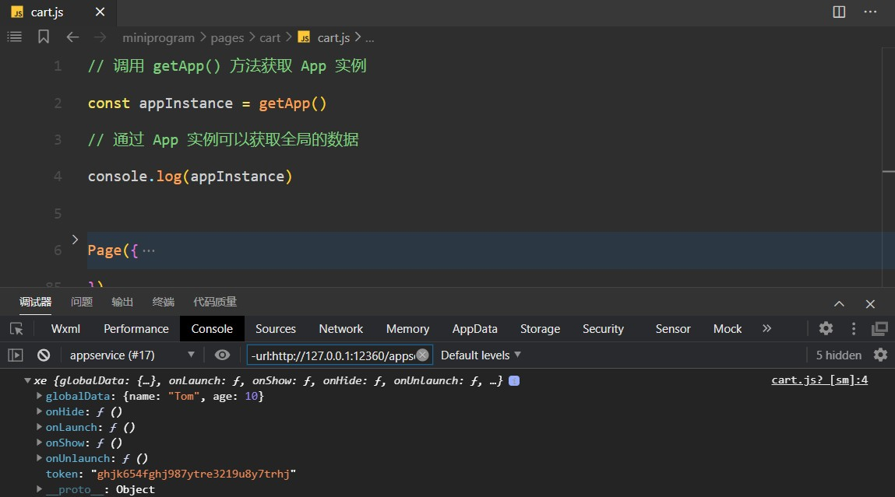

# 微信小程序 getApp

`getApp()` 用于获取小程序全局唯一的 `App` 实例，通过小程序应用实例可实现数据或方法的共享。

:::danger 注意

1. 不要在 App() 方法中使用 getApp() ，使用 this 就可以拿到 app 实例。
2. 通过 `getApp()` 获取实例之后，不要私自调用生命周期函数。

:::

```js [app.js]
App({
  // 全局共享的数据
  globalData: {
    token: '',
  },

  // 全局共享的方法
  setToken(token) {
    // 如果想获取 token，可以使用 this 的方式进行获取
    this.globalData.token = token

    // 在 App() 方法中如果想获取 App() 实例，可以通过 this 的方式进行获取
    // 不能通过 getApp() 方法获取
  },
})
```

```js [pages/index/index.js]
// getApp() 方法用来获取全局唯一的 App() 实例
const appInstance = getApp()

Page({
  login() {
    // 不要通过 app 实例调用钩子函数
    console.log(appInstance)

    appInstance.setToken('fghioiuytfghjkoiuytghjoiug')
  },
})
```



## App 实例还能放什么

`App()` 里的内容会贯穿整个小程序生命周期，适合放**跨页面共享且不需要响应式渲染**的数据与方法：

| 内容 | 示例 | 说明 |
| --- | --- | --- |
| 全局数据 | `globalData.userInfo`、`token` | 不要直接改，统一通过方法更新 |
| 全局方法 | `login()`、`request()` 封装 | 避免每个页面重复写 |
| 应用级定时器 | 心跳、轮询 | 必须在合适的时机清理 |
| 环境标识 | `env: 'dev' \| 'prod'` | 便于区分环境行为 |

```js [app.js（推荐写法）]
App({
  globalData: {
    token: '',
    userInfo: null,
  },

  onLaunch() {
    // 应用启动：恢复本地登录态（不要在这里做大量同步计算）
    this.globalData.token = wx.getStorageSync('token') || ''
  },

  // 统一封装更新入口，便于排查"谁改了全局数据"
  setToken(token) {
    this.globalData.token = token
    wx.setStorageSync('token', token)
  },

  clearToken() {
    this.globalData.token = ''
    wx.removeStorageSync('token')
  },
})
```

## App 的生命周期

| 钩子 | 触发时机 | 典型用途 |
| --- | --- | --- |
| `onLaunch` | 小程序初始化完成（全局只触发一次） | 读取本地登录态、初始化 SDK |
| `onShow` | 小程序启动或从后台进入前台 | 刷新 token、恢复轮询 |
| `onHide` | 小程序从前台进入后台 | 暂停轮询、保存草稿 |
| `onError` | 发生脚本错误或 API 调用报错 | 上报错误日志 |
| `onPageNotFound` | 打开的页面不存在 | 兜底跳转到首页 |

::: warning 生命周期里的三个注意点
1. **不要在 `onLaunch` 里做重活**：会直接拖慢启动，能延后的放到首屏页面或异步执行。
2. **`onShow` 可能被多次触发**：切后台再回前台都会触发，注意幂等。
3. **不要在 `App()` 内部调用 `getApp()`**：此时应用实例尚未创建完成，应使用 `this`。
:::

## 和其他通信方式怎么选

| 方式 | 适用场景 | 局限 |
| --- | --- | --- |
| `getApp()` + `globalData` | 登录态、用户信息等全局数据 | 不会自动触发页面更新，需手动 `setData` |
| `Storage` | 需要持久化（重启后仍要保留） | 同步读写会阻塞，注意容量与清理 |
| `EventChannel` | 两个页面之间传递对象与回传 | 仅 `navigateTo` 建立的通道可用 |
| 页面参数 | 少量简单参数 | 长度有限，只能传字符串 |

实践组合：**登录态放 `globalData` + `Storage`**（内存快、持久化稳），**一次性数据用页面参数或 EventChannel**，**跨多页的实时通知**用事件总线（自定义 `EventEmitter`）或全局状态管理方案。

::: tip 全局数据的两条纪律
1. **只通过方法改，不直接赋值**：所有写入都走 `app.setXxx()`，方便排查"是谁改坏了全局状态"。
2. **能少放就少放**：`globalData` 越多，页面之间的隐式依赖越重；业务数据优先放在页面自己的 `data` 里。
:::

## 验证方式

1. 在 `app.js` 的 `onLaunch` 与页面的 `onLoad` 中分别打印 `getApp()`，确认页面拿到的是同一实例。
2. 调用 `app.setToken()` 更新登录态，切到另一个页面读取，确认数据共享生效。
3. 杀掉小程序（从最近使用列表移除）后重新进入，确认从 `Storage` 恢复登录态成功。
4. 切到后台再回前台，确认 `onHide` / `onShow` 各触发一次且逻辑幂等。

## 相关专题

- [路由与页面栈](../Router/index.md)：页面跳转与返回刷新
- [页面间通信](../PageCommunication/index.md)：EventChannel 与其它通信方式
- [生命周期](../Lifecycle/index.md)：应用与页面生命周期的完整流程
- [原生 API](../API/index.md)：本地存储与网络请求

## 参考资料

- 微信小程序官方文档 · App：https://developers.weixin.qq.com/miniprogram/dev/reference/api/App.html
- 微信小程序官方文档 · 全局数据：https://developers.weixin.qq.com/miniprogram/dev/reference/api/getApp.html
