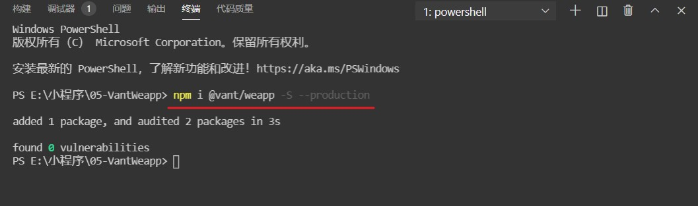

# 微信小程序 npm使用

目前小程序已经支持使用 npm 安装第三方包，但是这些 npm 包在小程序中不能够直接使用，必须得使用小程序开发者工具进行**构建**后才可以使用。

## 构建 npm

因为 `node_modules` 目录下的包，不会参与小程序项目的编译、上传和打包。因此，在小程序项目中要想使用 npm 包，必须走一遍 **构建 npm** 的过程。

在构建成功以后，默认会在小程序项目根目录，也就是 `node_modules` 同级目录下生成 `miniprogram_npm`目录，里面存放这构建打包后的 npm 包，也就是小程序运行过程中真正使用的包。


以使用 [Vant Weapp](../../../Others/Library/ComponentLib/Mobile/Vant.md) 小程序 UI 组件库为例，来说明小程序如何安装和构建 npm，构建 npm 的步骤：

1. 初始化 `package.json`。
2. 通过 `npm` 安装项目依赖。
3. 通过微信开发者工具构建 `npm`。

:::danger 注意

1. 小程序运行在微信内部，因为运行环境的特殊性，这就导致 并不是所有的包都能够在小程序使用。
2. 我们在小程序中提到的包指专为小程序定制的 npm 包，简称小程序 npm 包，在使用包前需要先确定该包是否支持小程序。

3. 开发者如果需要发布小程序包，需要参考官方规范：[https://developers.weixin.qq.com/miniprogram/dev/devtools/npm.html#发布-npm-包](https://developers.weixin.qq.com/miniprogram/dev/devtools/npm.html#发布-npm-包)

:::

**构建过程**：

1. 初始化 `package.json` (**这一步至关重要，要不然后续的步骤都很难进行下去**)：

   ```shell
   npm init -y
   ```

   

2. 通过 npm 安装 `@vant/weapp` 包：

   ```shell
   npm i @vant/weapp
   ```

   

3. 构建 npm：

   

   

4. 修改 app.json： `Vant` 组件库，会和基础组件的样式冲突，因此需要继续往下配置。

   将 app.json 中的 `"style": "v2"` 去除，小程序的[新版基础组件](https://developers.weixin.qq.com/miniprogram/dev/reference/configuration/app.html#style)强行加上了许多样式，难以覆盖，不关闭将造成部分组件样式混乱。

5. 在页面中使用 `vant` 提供的小程序组件，这里以 `Button` 按钮组件为例：

   - 在`app.json`或`index.json`中引入组件。
   - 在 `app.json` 中注册的组件为全局注册，可以在任意组件中进行使用。
   - 在 `index.json` 中注册组件为组件组件，只能在当前组件中进行使用。
   - 按照组件提供的使用方式，在页面中使用即可。

   ```json
   "usingComponents": {
     "van-button": "@vant/weapp/button/index"
   }
   ```

   ```html
   <van-button type="default">默认按钮</van-button>
   <van-button type="primary">主要按钮</van-button>
   <van-button type="info">信息按钮</van-button>
   <van-button type="warning">警告按钮</van-button>
   <van-button type="danger">危险按钮</van-button>
   ```

6. 页面预览效果：

   

## 自定义构建 npm

在实际的开发中，随着项目的功能越来越多、项目越来越复杂，文件目录也变的很繁琐，为了方便进行项目的开发，开发人员通常会对目录结构进行调整优化，例如：将小程序源码放到 miniprogram 目录下。

但是在调整目录以后，进行构建项目时，发现没有构建成功，并且弹出构建失败的弹框。


[错误提示翻译意思是] ：没有找到可以构建的 npm 包

[解决方式]：

1. 请确认需要参与构建的 npm 都在 `miniprogramRoot` 目录内。
2. 配置 `project.config.json` 的 `packNpmManually` 和 `packNpmRelationList` 进行构建。

产生这个错误的原因是因为小程序的构建方式有两种：

1. 默认构建 `npm`
2. 自定义构建 `npm`

### 默认构建 npm

默认情况下，不使用任何模版，`miniprogramRoot` 是小程序项目根目录，在 `miniprogramRoot` 内正确配置了 `package.json` 并执行 `npm install` 之后，在项目的根目录下就有 `node_modules` 文件夹，然后对 `node_modules` 中的 `npm` 进行构建，其构建 npm 的结果是，为 `package.json` 对应的 `node_modules` 构建一份 `miniprogram_npm`，并放置在对应 `package.json `所在目录的子目录中。

### 自定义构建 npm

与默认的构建 npm 方式不一样，自定义构建 npm 的方式为了更好的优化目录结构，更好的管理项目中的代码。

需要开发者在 `project.config.json` 中指定 `node_modules` 的位置 和 目标 `miniprogram_npm` 的位置。

在`project.config.json`中详细的配置流程和步骤：

1. 新增 `miniprogramRoot` 字段，指定调整后了的小程序开发目录。
2. 新增 `setting.packNpmManually`设置为 `true`，开启指定`node_modules` 的位置以及构建成功后文件的位置。
3. 新增 `setting.packNpmRelationList` 项，指定 `packageJsonPath` 和 `miniprogramNpmDistDir` 的位置：
   - `packageJsonPath` 表示 `node_modules` 源对应的 `package.json`。
   - `miniprogramNpmDistDir` 表示 `node_modules` 的构建结果目标位置。

```json
{
  // 指定调整后了的小程序开发目录
  "miniprogramRoot": "miniprogram/",
  "setting": {
    // 开启自定义 node_modules 和 miniprogram_npm 位置的构建 npm 方式
    "packNpmManually": true,
    // 指定 packageJsonPath 和 miniprogramNpmDistDir 的位置
    "packNpmRelationList": [
      {
        "packageJsonPath": "./package.json",
        "miniprogramNpmDistDir": "./miniprogram"
      }
    ]
  }
}
```

**例**：

1. 将小程序核心源码放到 miniprogram 目录下。

2. 在`project.config.json`中进行配置：

   ```json
   {
     "compileType": "miniprogram",
   
      "miniprogramRoot": "miniprogram/",
      "setting": {
        "packNpmManually": true,
        "packNpmRelationList": [
          {
            "packageJsonPath": "./package.json",
            "miniprogramNpmDistDir": "./miniprogram"
          }
        ]
      }
   
     // coding... 其他配置项
   }
   ```

