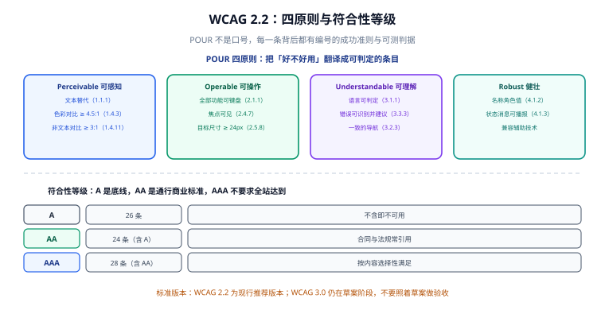
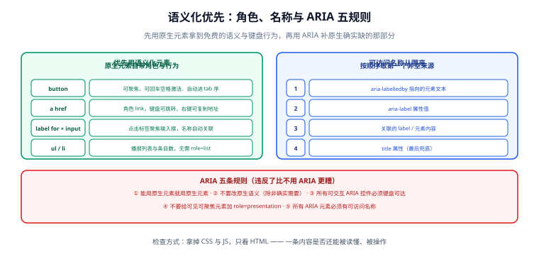

# 无障碍基础：WCAG 与语义化

无障碍看起来像「很多零散的小要求」，其实背后只有一套骨架：**四条原则 → 若干成功准则 → 可测判据**。本页先把这套骨架讲清楚，再讲最省力的实现路径——语义化 HTML。

## 一句话定位

> WCAG 把「好不好用」翻译成了带编号的、可判定的条目。你要做的不是背条目，而是**知道去哪里查，以及为什么语义化元素能一次性满足一大片条目**。



## 一、POUR：四条原则

WCAG 的条目全部挂在四条原则之下：

| 原则 | 内涵 | 一句话自检 |
| --- | --- | --- |
| **Perceivable** 可感知 | 信息必须能被某种感官获取 | 把屏幕调成灰度、字号调成两倍，信息还完整吗？ |
| **Operable** 可操作 | 界面必须能被各种输入方式操作 | 拔掉鼠标，还能走完主流程吗？ |
| **Understandable** 可理解 | 内容与操作行为必须可预期 | 报错信息告诉用户「怎么改」了吗？ |
| **Robust** 健壮 | 必须能被各种辅助技术正确解读 | 读屏软件念出来的顺序和内容对得上吗？ |

### 等级与常见口径

| 等级 | 条目数（WCAG 2.2 计） | 定位 |
| --- | --- | --- |
| A | 最低限度的可行 | 不含即不可用 |
| **AA** | A + 附加条目 | **商业合同与多数法规引用的口径** |
| AAA | AA + 附加条目 | 全站达标不现实，按内容选择性满足 |

### 必须记住的十条（AA 口径里的高频项）

| 编号 | 要求 | 判据（怎么查） |
| --- | --- | --- |
| 1.1.1 | 非文本内容有替代文本 | 每张 `` 有 `alt`；装饰图片用 `alt=""` |
| 1.3.1 | 信息与结构可程序化判定 | 用标题层级表达结构，而不是用大号加粗文字 |
| 1.4.3 | 文本对比度 ≥ 4.5:1（大字 ≥ 3:1） | 取前景色与背景色算对比度 |
| 1.4.11 | 非文本对比度 ≥ 3:1 | 图标、边框、图表线条、焦点框 |
| 1.4.4 | 文本可放大到 200% 不丢内容 | 浏览器缩放到 200%，检查是否被裁切 |
| 2.1.1 | 全部功能可键盘操作 | 只用 Tab / Enter / Space / Esc / 方向键 |
| 2.4.3 | 焦点顺序合理 | Tab 一遍，顺序应与视觉顺序一致 |
| 2.4.7 | 焦点可见 | 每个可聚焦元素都有可见焦点指示 |
| 3.3.1 / 3.3.3 | 错误可识别且给出修改建议 | 表单报错文案要说明「哪一项、错在哪、怎么改」 |
| 4.1.2 | 名称、角色、值可程序化判定 | 用可访问名称计算顺序核对（见下文） |

:::info WCAG 2.2 相对 2.1 的要点
2.2 新增了「聚焦时不遮挡（2.4.11）」「拖拽有替代方案（2.5.7）」「目标尺寸至少 24×24（2.5.8）」等条目，并移除了曾被广泛误解的 4.1.1（解析）。**验收前先确认合同引用的是哪个版本**，2.1 与 2.2 的条目集合不同。
:::

## 二、语义化优先：最省力的一条路

**「先用原生元素，再用 ARIA 补缺」是无障碍的第一原则**，因为原生元素免费提供四样东西：

| 原生元素 | 免费得到的 | 用 `div` 手写要补多少 |
| --- | --- | --- |
| `<button>` | 可聚焦、Enter/Space 激活、角色 `button`、禁用态语义 | `tabindex` + 键盘事件 + `role` + `aria-disabled` + 焦点样式 |
| `<a href>` | 可聚焦、Enter 跳转、角色 `link`、右键复制地址 | 同上，且永远做不到完美 |
| `<label for>` + `<input>` | 点击标签聚焦输入、名称自动关联、读屏播报 | `aria-labelledby` 或 `aria-label`，且失去点击聚焦 |
| `<ul>` / `<li>` | 角色 `list` / `listitem`、播报条目数 | `role="list"` + `role="listitem"` |
| `<h1>`…`<h6>` | 标题角色与层级、可跳转 | `role="heading" aria-level="2"` |

### 一条可执行的判据

**把 CSS 与 JS 全关掉，只看 HTML：这一页还能读懂、还能操作吗？** 能，说明结构是语义化的；不能，说明你把语义放进了 CSS 与事件里。

```html
<!-- 反面：看起来是按钮，对辅助技术来说什么都不是 -->
<div class="btn" onclick="submit()">提交</div>

<!-- 正面：一行代码换来完整的键盘与屏幕阅读器行为 -->
<button type="submit">提交</button>
```

### 常见替换对照

| 想做的 | 不要用 | 应该用 |
| --- | --- | --- |
| 可点击按钮 | `<div>` + click | `<button type="button">` |
| 页面跳转 | `<div>` + 路由跳转 | `<a :href="...">`（或路由提供的链接组件） |
| 分组标题 | `<div class="title">` | `<fieldset>` + `<legend>` / `<h2>` |
| 弹窗 | `<div class="modal">` | `<dialog>`（原生提供遮罩、Esc、焦点陷阱） |
| 折叠面板 | `<div>` + `display` 切换 | `<details>` + `<summary>` |
| 进度指示 | 纯 CSS 动画 | `<progress>` / `role="progressbar"` + `aria-valuenow` |

## 三、可访问名称从哪里来

每个可交互元素都要有一个「可访问名称」（accessible name）——读屏软件念出来的那个词。它的计算顺序是固定的，**从上往下取第一个非空值**：



```html
<!-- 1) aria-labelledby：指向页面上真实存在的可见文本（最优，可复用） -->
<h2 id="sec-pay">支付方式</h2>
<section aria-labelledby="sec-pay">…</section>

<!-- 2) aria-label：页面上没有可见文本时用 -->
<button aria-label="关闭对话框">×</button>

<!-- 3) 元素自身内容 / 关联的 label -->
<label for="email">邮箱</label>
<input id="email" type="email" />
<button>保存</button>

<!-- 4) title：最后兜底，不要作为首选（触摸设备与键盘用户看不到） -->
<abbr title="HyperText Markup Language">HTML</abbr>
```

:::danger 三类「看着有名字，其实没有」
1. **图标按钮用 `<i class="icon-close"></i>` 当内容**：可访问名称是空的（图标字体不产生文本节点）。
2. **把 `aria-label` 写在 `<div>` 上**：它没有角色也没有可聚焦性，名称念出来了但元素不可用。
3. **`placeholder` 当标签**：`placeholder` 不是可访问名称的可靠来源，且输入后消失。永远要有真正的 `<label>`。
:::

## 四、ARIA 五条规则

ARIA 的正确使用比很多人想象的严格。这五条是官方立场：

| # | 规则 | 意涵 |
| --- | --- | --- |
| 1 | 能用原生元素就用原生元素 | 原生语义免费且更可靠 |
| 2 | 不要改变原生语义，除非确实需要 | 别给 `<h2>` 加 `role="button"` |
| 3 | 所有可交互的 ARIA 控件必须键盘可达 | 用了 `role="button"` 就得自己实现键盘行为 |
| 4 | 不要给可见且可聚焦的元素加 `role="presentation"` / `"none"` | 会把它从无障碍树里摘掉 |
| 5 | 所有 ARIA 元素必须有可访问名称 | 光有角色没有名称等于没用 |

**核心判断**：只在「原生元素确实表达不了」时才用 ARIA。典型合法场景：

```html
<!-- 动态内容：需要一个容器承载状态变化 -->
<div role="status" aria-live="polite">已保存</div>

<!-- 自定义复合组件：原生 HTML 没有「标签页」 -->
<div role="tablist">
  <button role="tab" aria-selected="true" aria-controls="p1" id="t1">概览</button>
  <button role="tab" aria-selected="false" aria-controls="p2" id="t2">详情</button>
</div>
<div role="tabpanel" id="p1" aria-labelledby="t1">…</div>
```

:::warning `aria-*` 不是「加了就好」
`aria-hidden="true"` 加在**可聚焦元素**上，会让它在无障碍树里消失但依然能被 Tab 到——读屏用户会「焦点跳到一个没有名字的地方」。这类缺陷自动化工具常报，也常被开发者用「加个 `aria-hidden`」错误地绕过。
:::

## 五、动态内容：状态消息

单页应用最容易被忽略的一类：**内容变了，但读屏用户不知道**。

| 属性 | 播报时机 | 适用 |
| --- | --- | --- |
| `aria-live="polite"` | 当前朗读结束后 | 成功提示、异步结果、列表更新 |
| `aria-live="assertive"` | 立即打断当前朗读 | 错误、时间敏感的告警（**慎用**） |
| `role="status"` | 等价于 `polite` | 状态文本 |
| `role="alert"` | 等价于 `assertive` | 错误提示 |

```html
<!-- 容器常驻 DOM，只改文本内容：读屏才会播报变化 -->
<div role="status" aria-live="polite" class="toast"></div>
```

:::danger 两个必须避免的写法
1. **整个提示容器动态插入 DOM**：部分读屏软件不会播报「新插入的元素」里的文本，尤其是插入时容器还没有 `aria-live`。正确做法是**容器常驻，只改内容**。
2. **全站 `role="alert"`**：所有提示都打断朗读，用户会疯掉。
:::

## 六、对比度与缩放

```css
/* 常用对比度数值（白底 #FFFFFF） */
/* #767676 → 4.54:1  刚好通过正文 AA */
/* #595959 → 7.00:1  通过 AAA */
/* #949494 → 3.03:1  只能用于大字与图形 */
```

三条纪律：

- **正文（< 24px 常规字重）≥ 4.5:1**；**大字（≥ 24px 或 ≥ 18.66px 加粗）≥ 3:1**。
- **图形与状态色 ≥ 3:1**：图表线条、输入框边框、焦点框、图标。
- **不要把颜色作为唯一的区分手段**：状态点上同时给图标或文字，图表系列同时给形状或标签。

缩放检查：浏览器缩放到 **200%**，或把 `font-size` 提到基准的两倍，检查是否有内容被裁切、是否出现横向滚动条、弹窗高度是否溢出。

## 实战：一个表单的可达化改造

```html
<!-- 改造前：三类问题各一处 -->
<div class="field">
  <input type="text" placeholder="邮箱" class="input" />
  <span class="err" style="color:#ff9999">格式错误</span>
</div>
<div class="submit" onclick="doSubmit()">提交</div>
```

```html
<!-- 改造后 -->
<form novalidate>
  <div class="field">
    <label for="email">邮箱</label>
    <input
      id="email"
      name="email"
      type="email"
      autocomplete="email"
      aria-required="true"
      aria-invalid="true"
      aria-describedby="email-err"
    />
    <!-- 错误信息：颜色变化之外，还有图标与文字；通过 describedby 与输入框关联 -->
    <p id="email-err" class="err">
      <span aria-hidden="true">⚠</span>
      邮箱格式不正确，示例：name@example.com
    </p>
  </div>
  <!-- 提升到容器顶部，便于读屏用户定位 -->
  <div role="alert" aria-live="polite" class="form-error"></div>
  <button type="submit">提交</button>
</form>
```

四处改动与对应的判据：

| 改动 | 解决了什么 | 判据 |
| --- | --- | --- |
| `<label for>` 替代 `placeholder` | 名称来源、点击聚焦 | 读屏念出「邮箱 输入框」；点标签能聚焦输入框 |
| `aria-invalid` + `aria-describedby` | 错误与字段的关联 | 焦点进入时读屏念出错误信息 |
| 错误文案含示例与图标 | 不只靠颜色、给了修改方向 | 灰度截图下仍能看出错误 |
| `div` → `<button type="submit">` | 键盘可达 | Tab 到它、Enter 能提交 |

## 验证方式

1. **灰度自检**：截图转灰度，所有状态区分仍然存在。
2. **200% 缩放**：无内容裁切、无横向滚动、弹窗可滚动到底部按钮。
3. **键盘自检**：只用 Tab / Enter / Space / Esc / 方向键走完表单提交（含报错重填）。
4. **名称自检**：对每个可交互元素，用浏览器无障碍面板确认可访问名称非空且有意义。
5. **关样式自检**：禁用 CSS 后，页面结构与操作顺序仍然符合直觉。

## 参考资料

- [WCAG 2.2 规范全文（W3C）](https://www.w3.org/TR/WCAG22/)
- [W3C：ARIA 使用五条规则](https://www.w3.org/TR/using-aria/)
- [W3C：可访问名称与描述计算（accname）](https://www.w3.org/TR/accname-1.2/)
- [MDN：ARIA 参考](https://developer.mozilla.org/zh-CN/docs/Web/Accessibility/ARIA)
