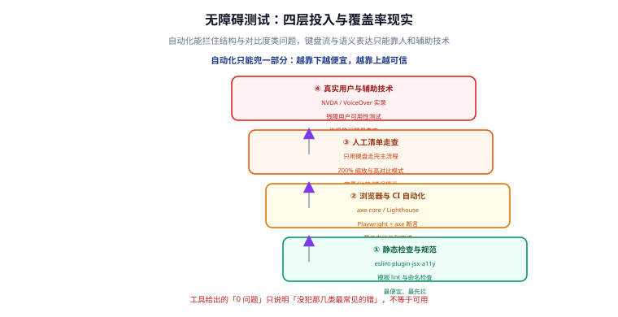

# 无障碍测试与门禁

无障碍最容易死在两件事上：**以为工具全绿就等于没问题**，以及**上线之后没人再测**。本页讲清楚工具能兜多少、人工必须补什么，以及怎么把它接进 CI。

## 一句话定位

> 自动化能拦住结构类问题的三到四成，剩下的靠人工走查；而 CI 的价值不在于「发现问题」，在于**防止已经修好的问题退化**。



## 一、四层投入与性价比

| 层 | 手段 | 成本 | 能发现什么 | 发现不了什么 |
| --- | --- | --- | --- | --- |
| ① 静态检查 | 模板 lint、命名检查 | 极低 | 常见模板写法错误、缺失属性 | 运行期行为、对比度 |
| ② 浏览器与 CI 自动化 | axe-core / Lighthouse / Playwright | 低 | 对比度、名称缺失、标签重复、ARIA 误用 | 键盘顺序、语义是否合理 |
| ③ 人工清单走查 | 键盘 + 缩放 + 灰度 + 高对比模式 | 中 | 焦点管理、可读性、操作顺序 | 屏幕阅读器具体播报内容 |
| ④ 真实辅助技术 | NVDA / VoiceOver 实录 | 高 | 播报内容与预期是否一致 | — |

**投入顺序建议：先做 ① 和 ②（一次配置长期收益），把 ③ 固化为功能验收的固定动作，④ 用在关键流程上。**

### 自动化到底能覆盖多少

需要说清楚的是：**「自动化能覆盖约三分之一到四成」指的是「WCAG 条目数量」意义上的覆盖**。它的含义是：

- 能自动判定的多是**可机械检验的属性**：有没有 `alt`、对比度是否达标、`label` 是否关联、ARIA 角色是否合法。
- **完全无法自动判定**的是这些问题：「这个 `alt` 写得有没有意义」「这个页面的操作顺序符不符合直觉」「读屏念出来的这句话让人能不能听懂」。

:::danger 三种把工具当验收的典型误用
1. **「axe 报 0 个问题，所以这页无障碍没问题」**——工具不会告诉你「图标按钮的 `aria-label` 写的是『按钮』而不是『关闭』」。
2. **把工具告警全部用 `// eslint-disable` 压掉**——压掉的每一条都是一次未处理的缺陷，而不是「误报」。
3. **只测首页**——导航与页脚在每页都一样，问题往往出在业务页面（表格、表单、弹层）。
:::

## 二、静态检查：最便宜的一层

| 技术栈 | 工具 | 检查内容 |
| --- | --- | --- |
| Vue | `eslint-plugin-vuejs-accessibility` | 模板中的 `v-html`、交互元素缺键盘事件、属性缺 `alt` |
| React | `eslint-plugin-jsx-a11y` | JSX 中的可访问性写法（事件、角色、名称） |
| 通用 | `html-validate` / `markdownlint` 相关规则 | 静态 HTML 与文档里的结构问题 |
| 通用 | 自研命名检查 | 图标按钮的 `aria-label` 是否与图标语义一致 |

```json
{
  "extends": ["plugin:jsx-a11y/recommended"],
  "rules": {
    "jsx-a11y/click-events-have-key-events": "error",
    "jsx-a11y/no-static-element-interactions": "error",
    "jsx-a11y/alt-text": "error",
    "jsx-a11y/anchor-is-valid": "error"
  }
}
```

:::tip 为什么静态检查值得单独做一层
它能在**你写代码的那一刻**就把「`div` 上挂了 onclick」这类问题拦下来，成本接近零。而这些问题一旦进了代码库，就变成了「运行期才能发现、需要真浏览器才能复现」的缺陷。
:::

## 三、浏览器与 CI 自动化

### axe-core：规则集的核心

axe-core 是最广泛使用的无障碍检测引擎，多数工具（Lighthouse、Playwright 集成、浏览器扩展）都在它之上包装。

```ts
// Playwright + axe-core：对页面做一次完整扫描并断言
import { test, expect } from '@playwright/test'
import AxeBuilder from '@axe-core/playwright'

test('首页不含有严重级别的无障碍问题', async ({ page }) => {
  await page.goto('/')
  const results = await new AxeBuilder({ page })
    .withTags(['wcag2a', 'wcag2aa', 'wcag21a', 'wcag21aa', 'wcag22aa'])
    .analyze()

  // 只断言 serious 与 critical：moderate / minor 先记录，不阻断构建
  const blocking = results.violations.filter(
    (v) => v.impact === 'serious' || v.impact === 'critical',
  )
  expect(blocking, JSON.stringify(blocking, null, 2)).toEqual([])
})
```

:::warning 分级门槛要写清楚，否则门禁会被绕过
axe 的 `impact` 分 `minor` / `moderate` / `serious` / `critical`。**建议只把 `serious` 与 `critical` 设为构建失败**，其余作为警告记录下来。原因：把全部级别都设为失败，团队很快就会用「临时加白名单」的方式绕过去，门禁反而失去意义。

白名单必须**带过期时间与责任人**，例如以「问题编号 + 修复期限」的形式写进配置文件。
:::

### Lighthouse：给一个整体分数

```shell
# 只跑无障碍相关类别，CI 里比全量跑快得多
npx lighthouse http://127.0.0.1:3000 --only-categories=accessibility \
  --output=json --output-path=./lighthouse-a11y.json --quiet
```

Lighthouse 的无障碍分数**只覆盖一部分条目**，且会随版本变化。它的价值在于「趋势」——同一条流水线上分数掉下来，说明有回归。

### 针对性的断言：把规则变成测试

比整体扫描更可靠的，是**针对具体交互写断言**：

```ts
// 断言一：模态打开后焦点在模态内
await page.getByRole('button', { name: '删除' }).click()
const dialog = page.getByRole('dialog')
await expect(dialog).toBeVisible()
expect(await dialog.evaluate((el) => el.contains(document.activeElement))).toBe(true)

// 断言二：Esc 关闭后焦点归还
await page.keyboard.press('Escape')
await expect(dialog).toBeHidden()
await expect(page.getByRole('button', { name: '删除' })).toBeFocused()

// 断言三：跳转链接存在且可用
await page.keyboard.press('Tab')
await expect(page.getByRole('link', { name: '跳到主内容' })).toBeFocused()
```

## 四、人工走查清单

这份清单是每次功能验收的固定动作，**五分钟能跑完**，能发现自动化完全看不到的问题。

```text
【键盘】
□ 页面加载后第一次 Tab 出现跳转链接
□ 每个可聚焦元素都有可见焦点框（对比度足够）
□ Tab 顺序与视觉顺序一致，没有莫名其妙地跳来跳去
□ 打开弹窗后焦点进入弹窗；Esc 关闭后焦点回到触发按钮
□ 不使用鼠标能完成一次核心操作

【视觉】
□ 灰度截图下，所有状态区分（对错、选中、必填）仍然存在
□ 浏览器缩放到 200%，无内容裁切、无横向滚动
□ 高对比度模式（或强制颜色）下，自定义背景的控件仍可读
□ 动效可以被系统偏好关闭（prefers-reduced-motion）

【内容与语义】
□ 每个图标按钮都有有意义的可访问名称（不是「按钮」「图标」）
□ 图片的替代文本描述了用途，装饰图用 alt=""
□ 表单错误提示说明了「哪一项、错在哪、怎么改」
□ 异步结果有状态消息播报（role="status"）
□ 标题层级不跳级，页面只有一个 h1
```

### 屏幕阅读器实操：最低限度要会的

不需要成为专家，但要知道怎么听出问题。以 Windows 上的 NVDA 为例（macOS 用 VoiceOver，`Cmd+F5` 开启）：

| 操作 | NVDA 按键 |
| --- | --- |
| 下一个可聚焦元素 | `Tab` |
| 下一个标题 | `H` |
| 下一个链接 / 按钮 / 表单字段 | `K` / `B` / `F` |
| 朗读当前焦点对象 | `NVDA+Tab` |
| 打开元素列表 | `NVDA+F7` |

**一条极简判据**：打开页面 → 按 `H` 依次跳标题，**不看屏幕能不能猜出这个页面在讲什么**。猜不出来，说明标题结构有问题——这是自动化测不出来的。

## 五、接进 CI：门禁设计

```yaml
# 片段：把无障碍检查接进流水线
- name: 无障碍静态检查
  run: pnpm lint

- name: 构建并启动预览服务
  run: |
    pnpm build
    pnpm preview &

- name: 无障碍自动化断言
  run: npx playwright test tests/a11y

- name: 无障碍回归基线对比
  run: node scripts/a11y-baseline.mjs
```

三条设计原则：

1. **分层失败**：静态检查失败 → 直接阻断；`serious` / `critical` 失败 → 阻断；`moderate` / `minor` 增加 → 只告警，并写入趋势报告。
2. **基线可比**：把每次的违规数量与类型写进基线文件，**对比「增量」而不是「总量」**。存量问题不阻断新提交，但**不允许新增**。
3. **关键页面列表化**：不要全站扫描（太慢），只扫「登录、首页、列表、详情、表单、结算」这六类模板页，基本能覆盖所有组件。

```ts
// 基线对比的核心逻辑：只看新增违规
import baseline from '../a11y-baseline.json' with { type: 'json' }

const current = collectViolations(results)           // 形如 { 'color-contrast': 12, 'label': 3 }
const increased = Object.entries(current).filter(
  ([id, count]) => count > (baseline[id] ?? 0),
)

if (increased.length > 0) {
  console.error('无障碍问题数量增加：', increased)
  process.exit(1)
}
```

:::danger 门禁必须能被证伪
写完全障碍门禁后，**故意造一个违规**（例如给按钮加一个灰色到看不出对比度的样式、把 `alt` 删掉），确认门禁真的报红。只跑一次「全绿」是没有意义的——它可能只是因为你没有断言成功。

同样的道理适用于基线对比：把基线文件里的数字改小一位，门禁应当立即报「新增」。做不到这一点的门禁，等于没有。
:::

## 六、易错点

:::danger 七个高频问题
1. **只跑工具不做人工**：工具绿、键盘走不通。
2. **只测首页**：业务页面（表格、弹层、表单）从未被检查。
3. **门禁没有基线**：存量几百条违规，新提交淹没在其中，等于没有门禁。
4. **白名单没有过期时间**：临时豁免变成永久豁免。
5. **用 `aria-hidden` 压掉 axe 告警**：告警消失，缺陷还在（甚至更糟）。
6. **只在开发环境测**：生产环境的 CDN、压缩、暗色主题都可能引入新问题。
7. **不测暗色主题**：对比度是按浅色算的，切到暗色可能不达标。
:::

## 验证方式

1. **门禁能被证伪**：故意制造一条 `critical` 违规，流水线必须失败。
2. **基线生效**：故意让某类违规数量 +1，基线对比必须报「新增」。
3. **人工清单可执行**：让一个没参与开发的同事照着清单走一遍，能独立完成。
4. **关键页面覆盖**：六类模板页都在扫描列表里，且每类至少一页。
5. **回归可发现**：回滚一次已修复的改动，门禁或基线应当立刻报红。

## 参考资料

- [axe-core 规则清单](https://github.com/dequelabs/axe-core/blob/develop/doc/rule-descriptions.md)
- [@axe-core/playwright 使用说明](https://github.com/dequelabs/axe-core-npm/tree/develop/packages/playwright)
- [Lighthouse：无障碍审计说明](https://developer.chrome.com/docs/lighthouse/accessibility/scoring)
- [eslint-plugin-jsx-a11y 规则列表](https://github.com/jsx-eslint/eslint-plugin-jsx-a11y)
- [W3C：WCAG 一致性评估方法（手测清单）](https://www.w3.org/WAI/test-evaluate/)

## 相关专题与分工

- [PWA 与离线应用](../../PWA/index.md)：**分工是**——本页讲**无障碍这一条专门的门禁线**（axe 规则分级、人工走查、对照基线），该专题讲**另外两条与它同源的门禁**：① Service Worker 与 Manifest 的存在性断言（`sw.js` 可匿名 GET、MIME 为 `application/manifest+json`、Manifest 面板无红色错误），② 离线状态下的行为断言（勾 Offline 后出现兜底页而非白屏）。三者的工程形态完全一致——都是「能被证伪的检查点」，可以挂在同一条 CI 流水线与同一套 Playwright 基础设施上；差别只在断言对象：本页断言 DOM 语义，该专题断言**页面之外的产物与网络行为**。清单见[实战 · P1~P10](../../PWA/Practice/index.md) 与[常见问题 · 上线自查](../../PWA/FAQ/index.md)。
- [浏览器原理 · 性能指标](../../Basic/Browser/Performance/index.md)：**一条容易被忽略的时效性提醒**——Lighthouse **12.0（2024-04）已移除 PWA 分类**，JSON 输出里的 `categories.pwa` 键也一并删除（因为它的判据就是 Chrome 安装判据，而 Chrome 已放宽）。所以**不要把「Lighthouse PWA 分数」写进验收清单**，安装能力只能看运行时信号（该专题的[安装体验](../../PWA/Installability/index.md)第七节给了完整排查表）。
