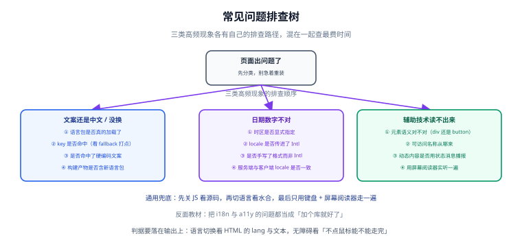

# 常见问题与最佳实践

本页按「现象」组织，而不是按「知识点」组织——出问题的时候，人是先看到现象，再去定位原因。



## 排查树：三类高频现象

### 现象一：文案还是中文 / 切了语言没反应

| 可能原因 | 怎么确认 | 怎么修 |
| --- | --- | --- |
| 语言包没加载 | 控制台打印当前 locale 与已加载的 messages | 检查按需加载的触发时机，首屏命名空间要同步加载 |
| key 不命中，静默回退 | 打开 `missingWarn`，看是否有 missing 日志 | 补 key；把缺失检测提到构建期 |
| 文案是硬编码 | 在源码里搜这段中文 | 抽取进语言包 |
| 构建产物里没有新语言包 | 在 `dist` 里搜语言包文件名 | 检查构建配置的 `locales` 目录是否被包含 |
| 切换了但界面不响应 | 打印 locale 的响应式状态 | 用响应式的 locale 源（`shallowRef` / store），不要用普通变量 |

### 现象二：日期或数字不对

| 可能原因 | 怎么确认 | 怎么修 |
| --- | --- | --- |
| 时区没指定 | 打印 `resolvedOptions().timeZone` | 显式传 `timeZone` |
| locale 没传进 `Intl` | 打印 `resolvedOptions().locale` | 把当前语言传进去，不要依赖运行时默认 |
| 手写了格式串 | 搜 `toFixed` / `'YYYY-MM-DD'` | 一律改用 `Intl` |
| 前端与后端格式化不一致 | 对比两端对同一数据的输出 | 只在前端格式化，或两端共用同一份规则 |
| 金额小数位不符预期 | 打印 `resolvedOptions()` 的分数位设置 | 显式写 `minimumFractionDigits` / `maximumFractionDigits` |
| 环境差异 | 对比 Node 与浏览器输出 | 固定测试环境的 Node 版本；关键结果进快照前先确认 |

### 现象三：辅助技术读不出来 / 读得不对

| 可能原因 | 怎么确认 | 怎么修 |
| --- | --- | --- |
| 元素语义不对 | 关掉 CSS 看 HTML 结构 | `div` 换 `<button>` / `<a>` |
| 可访问名称为空 | 浏览器无障碍面板看名称 | 补可见文本、`aria-labelledby` 或 `aria-label` |
| 名称没意义 | 用屏幕阅读器实听 | 图标按钮写成「关闭对话框」而不是「按钮」 |
| 动态内容不播报 | 用读屏软件触发一次异步操作 | 容器常驻 + `aria-live`，只改文本内容 |
| 顺序混乱 | Tab 一遍 | 调整 DOM 顺序；移除正 `tabindex` |
| 焦点被困住 | 试 `Esc` 与 `Shift+Tab` | 模态必须支持 Esc；非模态不要做焦点陷阱 |

## 高频问答

### Q1：项目只有一种语言，还要做国际化吗？

**要做「结构预留」，不做「翻译」。** 具体指三条：文案集中到语言包目录、日期数字一律走 `Intl`、`html lang` 写上正确值。这三条成本接近零，但它决定了未来加语言是「加一个文件」还是「改一百个组件」。

### Q2：为什么不能直接在模板里拼接字符串？

因为**语序是语言的一部分**。中文「共 3 件商品」，英文是「3 items in cart」——拼接的片段顺序完全不同。而且不同语言里形容词、量词、复数的位置都不同。**整句一个 key + 具名占位符**是唯一可靠的写法。

### Q3：`Intl` 结果在不同环境不一样，测试怎么写？

三层做法：① 测试里**显式指定 locale 与时区**，不让它依赖环境；② 用 `resolvedOptions()` 断言实际生效的配置，而不是断言字符串；③ 确实要断言字符串时，把 Node 版本写进测试环境说明，并在 CI 里固定版本。

### Q4：语言应该存在 URL 里还是 Cookie 里？

面向公众且有 SEO 需求的站点：**主语言放 URL 前缀，其余语言也必须放 URL**（`prefix_except_default` 策略）——只有 URL 能让搜索引擎索引到每个语言版本。纯内部系统可以用 Cookie，但要注意 SSR 必须能读到它。

### Q5：`aria-label` 和 `aria-labelledby` 该用哪个？

优先 `aria-labelledby`（指向页面上**真实存在的可见文本**），这样读屏用户看到的与听到的一致，且不会出现「标签改了但 aria-label 忘了改」的不一致。页面没有对应可见文本时才用 `aria-label`。

### Q6：隐藏的元素要不要加 `aria-hidden`？

分情况：

- **装饰性图标**：`aria-hidden="true"`（它旁边的文字已经表达了含义）。
- **视觉隐藏但读屏需要**（如仅图标按钮的文字说明）：用视觉隐藏样式（clip 方案），**不要** `display: none`。
- **可聚焦元素**：**永远不要**加 `aria-hidden="true"`——会造成「焦点落在不可见元素上」。

### Q7：模态弹窗用原生 `<dialog>` 还是自己写？

优先原生 `<dialog>` + `showModal()`：遮罩、`Esc`、焦点陷阱、焦点归还、顶层渲染全部由浏览器提供。自己写要逐项实现这些行为，且很难做到跨浏览器一致。两个注意点：不要给未打开的 `.modal` 写 `display`；需要模态一定要用 `showModal()` 而不是 `show()`。

### Q8：为什么 axe 全绿了，用户还是反馈「不好用」？

因为自动化只覆盖**可机械检验的属性**。它测不出这些：`alt` 写得有没有意义、操作顺序符不符合直觉、报错信息说得清不清楚、读屏念出来能不能听懂。这些只能靠人工走查与真实辅助技术验证。

### Q9：`prefers-reduced-motion` 要不要处理？

要，但成本极低：

```css
@media (prefers-reduced-motion: reduce) {
  *, *::before, *::after {
    animation-duration: 0.01ms !important;
    animation-iteration-count: 1 !important;
    transition-duration: 0.01ms !important;
    scroll-behavior: auto !important;
  }
}
```

### Q10：暗色主题下的对比度怎么保证？

对比度是**前景色与背景色的比值**，所以暗色主题要**单独验一遍**，不能沿用浅色的结论。做法：把两种主题的颜色对写进设计变量表，用对比度计算工具逐对校验，并把校验结果写进设计规范。

### Q11：已经有大量存量页面，怎么推进？

**只对本次要改的页面做改造，不为存量专门排期。** 新代码一律按新标准写，同时把静态检查与自动化断言接进 CI——存量会随业务迭代自然减少，而新增量被门禁挡住。专门排期做「全站无障碍改造」几乎总是被业务需求挤掉。

### Q12：多语言与无障碍的优先级怎么排？

| 场景 | 先做哪个 |
| --- | --- |
| 面向公众、有监管要求 | 两个都做，无障碍先做（法规时间点更硬） |
| 明确要出海 | 国际化先做，无障碍按 AA 同步做 |
| 内部系统 | 无障碍的结构层与键盘层先做（成本极低、效率收益直接可见） |
| 一次性活动页 | 只做对比度与键盘可达 |

## 最佳实践速查

```text
【国际化】
✔ 文案与代码分离；句子是抽取的最小单位
✔ key 用语义命名，不用原文、不用位置
✔ 变化的部分用具名占位符，不做拼接
✔ 复数交给 Intl.PluralRules 或库的复数能力
✔ 日期/数字/货币一律走 Intl，时区显式指定
✔ 语言放 URL（SEO）或 Cookie（SSR 可读），不放 localStorage
✔ 语言包进构建产物，不做运行时回源
✔ 缺 key 让构建失败，并给 missing 打点
✔ 伪本地化常态化，随时可切
✔ SSR 每请求一份 i18n 实例

【无障碍】
✔ 语义化优先，ARIA 只补原生确实缺的部分
✔ 全局不写 outline: none；用 :focus-visible
✔ 不用正 tabindex；视觉顺序与 DOM 顺序一致
✔ 弹窗用原生 <dialog>，Esc 可关、焦点归还
✔ 单页应用路由切换后聚焦主标题
✔ 跳转链接是 body 里第一个可聚焦元素
✔ 每个可交互元素都有有意义的可访问名称
✔ 状态不只靠颜色表达
✔ 表单错误说明「哪一项、错在哪、怎么改」
✔ 动态内容用常驻容器 + aria-live
✔ 自动化接进 CI 且有防退化基线
```

## 一条终极判据

如果只记一句话：

> **换一门语言不改代码；不碰鼠标能走完全流程。**

两条都成立时，i18n 与 a11y 的绝大多数问题已经不存在了；任何一条不成立，问题一定能被定位到上面某一条。

## 参考资料

- [WCAG 2.2 快速参考（Quickref）](https://www.w3.org/WAI/WCAG22/quickref/)
- [WAI-ARIA Authoring Practices Guide（APG）](https://www.w3.org/WAI/ARIA/apg/)
- [MDN：无障碍（Accessibility）](https://developer.mozilla.org/zh-CN/docs/Web/Accessibility)
- [MDN：`Intl` 命名空间](https://developer.mozilla.org/zh-CN/docs/Web/JavaScript/Reference/Global_Objects/Intl)
