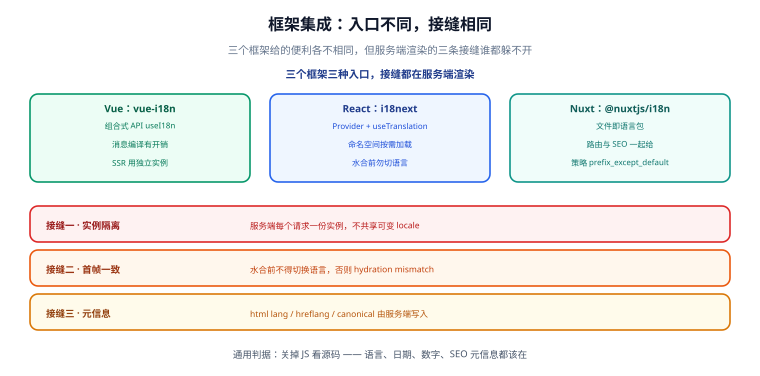

# 框架落地：Vue / React / Nuxt

前四页讲的是框架无关的东西。这一页把它落到具体框架上，重点不是 API 手册，而是**服务端渲染下三条躲不开的接缝**。

## 一句话定位

> 框架给你的便利各不相同，但服务端渲染的三条接缝谁都躲不开：**实例隔离、首帧一致、元信息正确**。



## 三个框架的入口差异

| 维度 | Vue：vue-i18n | React：i18next | Nuxt：@nuxtjs/i18n |
| --- | --- | --- | --- |
| 取值方式 | 组合式 `useI18n()` / 选项式 `this.$t` | `useTranslation()` 返回 `t` | 自动注入，模板与组件内直接用 |
| 语言包 | JS / JSON，随构建打包 | 命名空间 + 后端加载器 | **文件即语言包**（约定目录结构） |
| 资源加载 | 手动 `setLocaleMessage` / 异步加载 | `i18next-http-backend` 等 | 框架内建按需加载 |
| 路由 | 自己接（`vue-router` 的 `meta`） | 自己接 | **框架统一管理**（含前缀策略） |
| SEO 元信息 | 自己写 | 自己写 | 框架统一生成 `hreflang` / `canonical` |
| 复数与 ICU | 内建简化复数，ICU 需插件 | 内建 ICU 支持 | 取决于底层 vue-i18n |
| 上手成本 | 低 | 中 | 低（约定优于配置） |

选型建议：**已经用 Nuxt 就直接用官方模块**（路由与 SEO 一起给，能省掉最容易出错的部分）；纯 Vue SPA 用 vue-i18n；React 项目用 i18next。

## Vue：组合式 API 落地

```ts
// i18n/index.ts —— 工厂函数，不在模块顶层创建单例（SSR 必须）
import { createI18n, type I18n } from 'vue-i18n'

export function createI18nForLocale(locale: string, messages: Record<string, unknown>): I18n {
  return createI18n({
    legacy: false,             // 组合式 API，必须关闭 legacy 模式
    locale,
    fallbackLocale: 'zh-CN',
    messages: { [locale]: messages },
    missingWarn: import.meta.env.DEV,
    fallbackWarn: false,
  })
}
```

```vue
<!-- ProductCard.vue -->
<script setup lang="ts">
import { useI18n } from 'vue-i18n'

const { t, n, d, locale } = useI18n({ useScope: 'global' })
const props = defineProps<{ total: number; createdAt: string }>()
</script>

<template>
  <article class="card">
    <h3>{{ t('product.title') }}</h3>
    <p>{{ n(props.total, 'currency') }}</p>
    <time :datetime="props.createdAt">{{ d(new Date(props.createdAt), 'short') }}</time>
    <p>{{ locale }}</p>
  </article>
</template>
```

两个 Vue 专属要点：

- **`legacy: false`**：不关掉的话，组合式 API 取到的 `locale` 不是响应式的，切换语言界面不更新。
- **`messages` 用响应式对象**：如果 `messages` 是普通对象且后续 `setLocaleMessage` 追加，某些版本下模板不刷新；用 `shallowRef` 包一层或直接用 `setLocaleMessage` 触发更新。

## React：i18next 落地

```tsx
// i18n.ts
import i18next from 'i18next'
import { initReactI18next } from 'react-i18next'

export function createI18n(locale: string, resources: Record<string, unknown>) {
  const instance = i18next.createInstance()   // 每个请求一份，不要用全局单例
  return instance.use(initReactI18next).init({
    lng: locale,
    fallbackLng: 'zh-CN',
    resources: { [locale]: { translation: resources } },
    interpolation: { escapeValue: false },     // React 已经转义，避免双重转义
  })
}
```

```tsx
// ProductCard.tsx
import { useTranslation } from 'react-i18next'

export function ProductCard({ total, createdAt }: { total: number; createdAt: string }) {
  const { t, i18n } = useTranslation()
  const fmt = new Intl.NumberFormat(i18n.language, { style: 'currency', currency: 'CNY' })

  return (
    <article className="card">
      <h3>{t('product.title')}</h3>
      <p>{fmt.format(total)}</p>
      <time dateTime={createdAt}>
        {new Intl.DateTimeFormat(i18n.language, { dateStyle: 'short' }).format(new Date(createdAt))}
      </time>
    </article>
  )
}
```

React 专属要点：

- **`escapeValue: false`**：不关掉的话引号与 `&` 符号会被二次转义，界面上出现 `&amp;` 与 `&#39;`。
- **`i18n.language` 可能是复合标签**（如 `en-US`），直接传给 `Intl` 是合法的，但做资源查找时要先归一化。
- **组件里的格式化器要缓存**：上面的写法在每次渲染都 `new` 一个 `Intl` 实例，长列表里会成为热点。改进方式见 [原生 Intl](../IntlApi/index.md) 的性能一节。

## Nuxt：约定优于配置

Nuxt 的官方 i18n 模块把最容易出错的两件事——**路由**与**SEO 元信息**——一起接管了：

```text
i18n/
├─ locales/
│  ├─ zh-CN.json
│  └─ en-US.json
└─ i18n.config.ts        # 复数、日期格式、数字格式等运行时选项
```

```ts
// nuxt.config.ts（片段）
export default defineNuxtConfig({
  modules: ['@nuxtjs/i18n'],
  i18n: {
    defaultLocale: 'zh-CN',
    // 前缀策略：默认语言不带前缀，其余语言带前缀
    strategy: 'prefix_except_default',
    locales: [
      { code: 'zh-CN', language: 'zh-CN', file: 'zh-CN.json' },
      { code: 'en-US', language: 'en-US', file: 'en-US.json' },
    ],
    detectBrowserLanguage: {
      useCookie: true,        // SSR 可读，避免首帧闪变
      cookieKey: 'i18n_redirected',
      redirectOn: 'root',
    },
  },
})
```

四种前缀策略的区别：

| 策略 | URL 形态 | 适用 |
| --- | --- | --- |
| `prefix_except_default` | `/about`、`/en-US/about` | 最常用：主语言 URL 干净，SEO 友好 |
| `prefix` | `/zh-CN/about`、`/en-US/about` | 多语言地位对等时 |
| `prefix_and_default` | 主语言同时有两套 URL（需 `canonical` 收敛） | 迁移期兼容旧链接 |
| `no_prefix` | URL 不变，语言靠 Cookie | 内部系统，不需要 SEO |

## 服务端渲染的三条接缝

这三条与具体框架无关，是**所有 SSR + i18n 项目的必修课**。

### 接缝一：实例隔离

:::danger 模块级单例是 SSR 的头号事故源
```ts
// 错误：模块顶层创建，被所有请求共享
export const i18n = createI18n({ locale: 'zh-CN', messages })
```
A 用户切到英文、B 用户请求进来时，模块里的 `locale` 已经是 `en-US`——**B 会看到英文页面**。这类 bug 在压测或多人并发时才会暴露，本地单人测试永远测不出来。

正确做法：**每个请求创建一个实例**，通过框架的依赖注入（Vue 的 `app.provide`、React 的 `Context`）传给组件树。
:::

```ts
// server 端中间件：按请求解析 locale，创建独立实例并注入
export default defineEventHandler((event) => {
  const locale = resolveLocale(event); // 见「多语言架构」的优先级链
  const messages = loadSync(locale, ['common', 'home']);
  event.context.i18n = createI18nForLocale(locale, messages);
  return undefined;
});
```

### 接缝二：首帧一致

服务端渲染出的 HTML 里已经有文案了。客户端水合时如果 locale 与 HTML 不一致，Vue / React 会报 hydration mismatch，页面可能整块重渲并闪烁。

三条硬要求：

1. **水合完成前不得切换语言**。任何「挂载后读 localStorage 再切语言」的写法都必须改成「服务端就从 Cookie 读」。
2. **格式化结果必须可复现**。`timeZone` 显式指定，不能依赖运行环境默认时区。
3. **随机数、当前时间不参与首屏文本**（相对时间「3 分钟前」这类文案首屏要么服务端算好，要么占位后再由客户端填充）。

```ts
// 判据：服务端渲染的 HTML 与客户端首帧文本必须逐字一致
// 在 E2E 里可以直接断言：关闭 JS 抓到的文本 == 开启 JS 首帧文本
```

### 接缝三：元信息由服务端写入

`lang`、`hreflang`、`canonical` 必须在**服务端渲染的 HTML 里**出现，客户端注入的搜索引擎往往读不到。

```html
<html lang="zh-CN">
  <head>
    <link rel="canonical" href="https://example.com/about" />
    <link rel="alternate" hreflang="zh-CN" href="https://example.com/about" />
    <link rel="alternate" hreflang="en-US" href="https://example.com/en-US/about" />
    <link rel="alternate" hreflang="x-default" href="https://example.com/about" />
  </head>
</html>
```

四条规则：

- **`hreflang` 必须双向互指**：A 页指向 B 页，B 页也要指向 A 页，否则搜索引擎可能只认一边。
- **`canonical` 指向「当前语言」的规范 URL**，不是主语言 URL——否则英文页会被合并到中文页。
- **`x-default` 只出现一次**：指向为「未匹配到语言」的用户准备的默认页。
- **语言代码用 BCP 47**：`zh-CN` 而不是 `zh_CN`（下划线在 `hreflang` 中是无效的）。

## 易错点

:::danger 七个高频坑
1. **SSR 下用模块级单例装 locale** → 多人并发串语言。
2. **水合后才读 localStorage 决定语言** → 首屏闪变 + hydration mismatch。
3. **`timeZone` 不指定** → 服务端 UTC 与客户端本地时区渲染出不同日期，水合报错。
4. **`hreflang` 用下划线**（`zh_CN`）→ 搜索引擎忽略该条目。
5. **`canonical` 一律指向主语言** → 所有语言版本被判定为重复内容。
6. **React 里没关 `escapeValue`** → 界面上出现 `&amp;`、`&#39;`。
7. **Vue 用 `legacy: true` 又用组合式 API** → 切换语言界面不响应。
:::

## 验证方式

1. **并发隔离**：同时用两个不同语言的 Cookie 并发请求同一页面，响应中的 `lang` 与文案应各自正确（用 `curl` 带不同 Cookie 并发即可）。
2. **关 JS 验收**：禁用 JavaScript，页面文案、日期、`html lang`、`hreflang` 都应正确出现。
3. **水合一致性**：开启 JS 后控制台不应出现 hydration mismatch 警告。
4. **URL 策略**：按策略访问每个语言的 URL，均返回 200 且内容为对应语言；`canonical` 指向自身。
5. **切换语言不刷新整页**：客户端切换语言后 URL 与内容同步变化（`prefix` 策略下）。

## 参考资料

- [vue-i18n 官方文档](https://vue-i18n.intlify.dev/)
- [react-i18next 官方文档](https://react.i18next.com/)
- [Nuxt i18n 模块官方文档](https://i18n.nuxtjs.org/)
- [Google 搜索：hreflang 使用指南](https://developers.google.com/search/docs/specialty/international/localized-versions)
