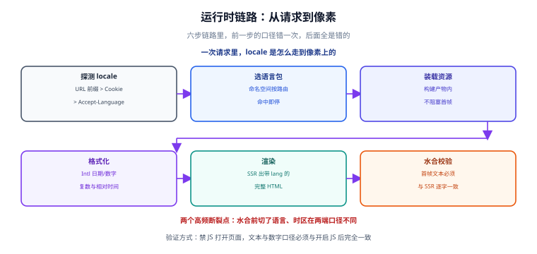

# 多语言架构：抽取、组织与加载

本页讲清一件事：**从「中文写在组件里」到「多语言可插拔」之间，代码要怎么改**。这层决定了后面接不接翻译平台、加不加语言、能不能服务端渲染。

## 一句话定位

> 国际化的架构问题只有一个：**把「文案」变成「数据」**——文案一旦变成按 key 索引的数据，语言就只是一份可替换的数据文件。



## 架构全景：五个部件的连接关系

```text
┌──────────────┐   key    ┌──────────────┐   locale   ┌──────────────┐
│  组件 / 页面  │ ───────► │  文案运行时   │ ◄───────── │  locale 解析  │
│  t('cart.pay')│          │  （分命名空间）│            │  URL/Cookie/  │
└──────────────┘          └──────┬───────┘            │  Accept-Lang  │
                                 │ 装载                └──────────────┘
                          ┌──────▼───────┐
                          │   语言包资源  │  ← 构建产物内，按命名空间拆分
                          │ zh-CN / en-US │
                          └──────────────┘
                                 │ 缺失 → fallback 语言 + 打点上报
```

五个部件：**解析**（当前是什么语言）、**储备**（有哪些语言包）、**装载**（现在要哪几份）、**取值**（key 怎么变成文本）、**回退**（取不到怎么办）。下面按顺序说。

## 一、文案抽取与 key 设计

### 抽取的三条硬规则

1. **组件里不出现面向用户的字面量**。包括按钮文字、提示、占位符、`aria-label`、`alt`、`title`。
2. **句子是抽取的最小单位**，不是单词。按单词拼句子必然在语序不同的语言里崩掉。
3. **变化的部分一律用具名占位符**，不用位置占位符，也不做字符串拼接。

### key 命名：用语义，不用原文

:::danger 最常见的两种错误命名
1. **用中文原文当 key**：`t('保存')`。改一次文案就要改所有引用，翻译平台也无法复用同义 key。
2. **用位置当 key**：`t('home.top.button1')`。页面一改版，key 全部失效，翻译记忆库也没法复用。
:::

推荐结构：**`<命名空间>.<模块>.<语义>`**，全小写，层级用点分隔，稳定标识用短横线。

```text
common.action.save              通用动作：保存
common.status.loading           通用状态：加载中
cart.summary.itemCountOne       购物车条目数（单数）
cart.summary.itemCountOther     购物车条目数（复数）
checkout.error.cardExpired      结账错误：卡已过期
```

命名时要能回答一句话：**「这个词换到另一个模块还能用吗？」** 能，就放 `common.*`；不能，就留在模块命名空间里。

### 复数、性别与上下文

不同语言的复数类别数量不同：中文只有 `other`，英语有 `one` / `other`，阿拉伯语有六类。**不要用 `count > 1` 判断**，那是英语的规则，不是通用规则。

```json
{
  "cart": {
    "items": {
      "one": "购物车里有 {count} 件商品",
      "other": "购物车里有 {count} 件商品"
    }
  }
}
```

:::warning 占位符格式因库而异
vue-i18n 用花括号包裹具名参数，i18next 默认用双花括号，ICU MessageFormat 用 `{count, plural, ...}` 的完整语法。**这三者互不兼容**，选型时要和翻译平台支持的格式对齐，不要在中途换格式。
:::

## 二、语言包的四种组织方式

| 组织方式 | 目录结构 | 适用 | 代价 |
| --- | --- | --- | --- |
| 单文件 | `locales/zh-CN.json` | 小型站点（< 500 条） | 语言包随项目线性膨胀，首屏全量加载 |
| 按命名空间 | `locales/zh-CN/common.json` | 中型项目（多模块） | 需要维护「哪个页面用哪个命名空间」 |
| 按路由 / 页面 | `locales/zh-CN/pages/checkout.json` | 大型项目、按路由分包 | 路由一改要同步资源目录 |
| 按功能域（推荐组合） | `locales/<locale>/<domain>/<ns>.json` | 微前端 / 多团队 | 需要一份域归属约定 |

**按功能域组织的目录示例**：

```text
locales/
├─ zh-CN/
│  ├─ common/{action,status,validation}.json
│  ├─ cart/{index,error}.json
│  └─ checkout/{index,payment}.json
└─ en-US/
   ├─ common/{action,status,validation}.json
   ├─ cart/{index,error}.json
   └─ checkout/{index,payment}.json
```

两条纪律：

- **源语言与目标语言的目录结构必须完全一致**，否则 CI 校验无法定位缺失项。
- **语言包进构建产物**，不做运行时回源请求。回源会带来两个新问题：首屏竞态（文案闪一下再变）与缓存一致性（用户看到半新半旧的界面）。

## 三、locale 解析与协商

### 优先级链

按下面的顺序取，命中即停，**绝不「猜」默认值**：

| 优先级 | 来源 | 说明 |
| --- | --- | --- |
| 1 | URL 路径 / 子域 / 查询参数 | 可分享、可被搜索引擎索引，**唯一能保证 SSR 一致**的来源 |
| 2 | 用户设置（登录后的账号偏好） | 跨设备一致，但需要登录 |
| 3 | Cookie / `localStorage` | 记住上次选择，SSR 时可通过 Cookie 读取 |
| 4 | `Accept-Language` 请求头 | 首次访问的合理猜测，**只作兜底** |
| 5 | 站点默认语言 | 一定存在，不允许为空 |

:::danger 用 localStorage 存语言的 SSR 陷阱
`localStorage` **服务端读不到**。如果语言只用 `localStorage` 存，服务端渲染出来的 HTML 永远是默认语言，客户端水合后才切换——表现为**页面先闪一下中文再变英文**，并且搜索引擎抓到的是中文版。

正确做法：语言选择**同时写 Cookie**（服务端可读），或把语言放进 URL。
:::

### 语言标签与匹配

语言标签遵循 **BCP 47**：`语言-文字-地区-变体`，例如 `zh-Hans-CN`、`en-US`、`pt-BR`。

```ts
// 归一化并做「可用语言」匹配：把 zh-CN 匹配到最接近的可用语言
const SUPPORTED = ['zh-CN', 'en-US', 'ja-JP'] as const;

function negotiate(acceptLanguage: string): string {
  const wanted = acceptLanguage
    .split(',')
    .map((part) => {
      const [tag, q] = part.trim().split(';q=');
      return { tag: tag.trim(), q: q ? Number(q) : 1 };
    })
    .sort((a, b) => b.q - a.q);

  for (const { tag } of wanted) {
    // 1) 完全命中
    const exact = SUPPORTED.find((s) => s.toLowerCase() === tag.toLowerCase());
    if (exact) return exact;
    // 2) 只命中主语言（en-GB → en-US）
    const primary = tag.split('-')[0].toLowerCase();
    const loose = SUPPORTED.find((s) => s.split('-')[0].toLowerCase() === primary);
    if (loose) return loose;
    // 3) 中文的特殊情形：zh 无地区时按简体处理
    if (primary === 'zh') return 'zh-CN';
  }
  return 'zh-CN'; // 站点默认语言
}
```

也可以用运行时的 `Intl.Locale` 与 `Intl.getCanonicalLocales` 做归一化，避免自己写大小写与变体规则：

```ts
Intl.getCanonicalLocales('ZH-hans-cn'); // ['zh-Hans-CN']
new Intl.Locale('zh-Hans-CN').language; // 'zh'
```

## 四、按需加载与首帧一致

目标只有一个：**首屏渲染出第一个字节时，需要的语言包已经就位。**

| 场景 | 做法 | 判据 |
| --- | --- | --- |
| 客户端渲染（CSR） | 路由进入前预加载该路由的命名空间 | 进入页面时**没有**文案闪变 |
| 服务端渲染（SSR） | 服务端按 URL / Cookie 解析 locale，同步加载语言包后渲染 | 关闭 JS，页面文案与语言正确 |
| 静态生成（SSG / ISR） | 每个语言生成一份静态产物，**不要在客户端切语言** | 每个语言的 URL 都能直接访问 |
| 混合 | 首屏命名空间同步加载，其余按需异步加载 | 首屏无闪变，次要文案允许延迟 |

```ts
// 服务端：按请求解析 locale 并同步装载首屏所需命名空间
// 关键点是「每个请求一份独立实例」，不要用模块级单例装可变 locale
export function createI18nForRequest(locale: string) {
  return createI18n({
    locale,
    fallbackLocale: 'zh-CN',
    messages: { [locale]: loadNamespacesSync(locale, ['common', 'home']) },
    missingWarn: true,
  });
}
```

## 五、fallback 链与缺失检测

fallback 是**兜底，不是方案**。它的价值在于「不漏字」，风险在于「静默地一直兜底」——用户看到夹着中文的英文界面，却没有任何告警。

```text
请求 zh-TW（未提供）
  → fallback 到 zh-CN（同主语言）
  → 再 fallback 到 en-US（站点备用语言）
  → 都没有 → 显示 key 本身 + 上报一条 missing 事件
```

三条落地要求：

1. **missing 必须打点**：key、locale、页面标识、时间。没有打点，上线后没人知道漏了多少。
2. **构建期检查优先于运行期兜底**：源语言的 key 集合是基准，目标语言缺 key 时直接让构建失败（见 [翻译工作流](../TranslationWorkflow/index.md)）。
3. **禁止用 key 兜底当正常行为**：界面上出现 `cart.summary.total` 这种文本，就是一次未被拦截的缺陷。

## 易错点五连

:::danger 五条必须记住
1. **在模板里拼句子**：`t('hello') + name + t('welcome')`——语序一变就错。改为整句一个 key + 具名占位符。
2. **用 `count > 1` 判断复数**——只在英语成立。用库的复数能力或 `Intl.PluralRules`。
3. **组件级缓存语言包**：模块顶层的 `let messages` 被多个请求共享，SSR 下会串语言（A 用户看到 B 用户的语言）。每个请求一份实例。
4. **语言变化不重新渲染**：locale 存在全局、UI 用不可响应的方式读取。要把它放进响应式状态或触发整页重渲。
5. **日期与数字不随语言变**：只换了文案没换格式。判据是「切换语言后，页面里所有日期与数字的写法都变了」。
:::

## 实战：把一个硬编码页面改成多语言

以一个商品卡片组件为例，改造前后对照：

```text
改造前（问题版）
  <div class="card">
    <h3>{item.title}</h3>
    <p>共 {items.length} 件，合计 ¥{total}</p>
    <p>{new Date(item.createdAt).toLocaleString()}</p>
    <button>加入购物车</button>
  </div>

问题清单：
  ① 「共…件，合计…」是句子拼接 + 中文语序
  ② 货币符号 ¥ 硬编码
  ③ 日期用默认 locale 与默认时区
  ④ 按钮文字硬编码
```

```vue
<!-- 改造后 -->
<script setup lang="ts">
import { useI18n } from 'vue-i18n'

const { t, n, d } = useI18n()
const props = defineProps<{ item: { title: string; createdAt: string } }>()
const count = 3
const total = 128.5
</script>

<template>
  <div class="card">
    <h3>{{ item.title }}</h3>
    <!-- 整句一个 key，复数由语言包定义 -->
    <p>{{ t('cart.items', { count }, count) }}</p>
    <!-- 金额与日期都走 Intl -->
    <p>{{ n(total, 'currency') }}</p>
    <time :datetime="item.createdAt">
      {{ d(new Date(item.createdAt), 'short') }}
    </time>
    <button type="button">{{ t('common.action.addToCart') }}</button>
  </div>
</template>
```

对应的语言包（`zh-CN` 与 `en-US` 的 key 集合必须完全一致）：

```json
{
  "cart": {
    "items": "共 {count} 件，合计 {amount}"
  },
  "common": {
    "action": { "addToCart": "加入购物车" }
  }
}
```

改造完成的判据：**把 `locale` 改成 `en-US`，页面里所有文字、日期、金额的写法都随之改变，且不需要改一行组件代码。**

## 验证方式

1. **硬编码检查**：源码中搜索中文字面量（排除注释与 mock 数据），命中数应为 0。
2. **key 集合一致性**：`zh-CN` 与 `en-US` 的扁平化 key 集合做差集，双向都应为空。
3. **关 JS 验收**：禁用 JavaScript 打开页面，文案与 `html lang` 均应为当前语言（验证 SSR 路径正确）。
4. **缺 key 演练**：临时删掉 `en-US` 中的一个 key，构建应当失败或至少在控制台出现 missing 日志。
5. **语言切换无闪变**：切换语言后立即刷新，首屏不应出现「先默认语言再目标语言」的闪变。

## 参考资料

- [BCP 47：语言标签](https://www.rfc-editor.org/rfc/rfc5646)
- [MDN：`Intl.Locale`](https://developer.mozilla.org/zh-CN/docs/Web/JavaScript/Reference/Global_Objects/Intl/Locale)
- [Unicode CLDR：语言与地区数据](https://cldr.unicode.org/)
- [ICU MessageFormat 语法说明](https://unicode-org.github.io/icu/userguide/format_parse/messages/)
