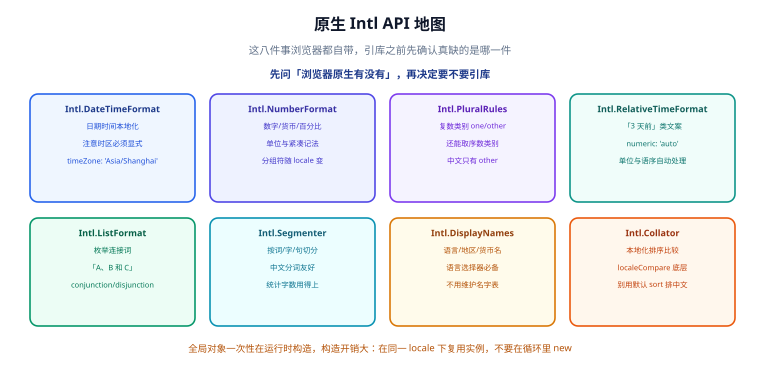

# 原生 Intl：格式化与本地化

上一页讲了语言包怎么组织，这一页讲**文案之外的那部分本地化**——日期、时间、数字、货币、复数、排序。这些内容**不该进语言包**，因为浏览器已经内置了一套按 CLDR 数据驱动的实现。

## 一句话定位

> 凡是「同一份数据在不同地区应有不同写法」的内容，都交给 `Intl`；只有「同一句人话在不同语言里说法不同」的内容，才进语言包。



## 为什么不用引库

| 需求 | 引库 | 原生 `Intl` |
| --- | --- | --- |
| 日期格式化 | dayjs + 2 个 locale 包（约 20 KB） | `Intl.DateTimeFormat`（0 额外体积） |
| 数字与货币 | numeral / currency.js | `Intl.NumberFormat`（0 额外体积） |
| 复数与相对时间 | 自研映射表 | `Intl.PluralRules` / `Intl.RelativeTimeFormat` |
| 中文分词与字数统计 | 分词库 | `Intl.Segmenter` |
| 本地化排序 | 自研比较函数 | `Intl.Collator` |
| 语言/地区/货币名 | 维护名字表 | `Intl.DisplayNames` |

结论：**先确认原生缺什么，再决定引什么。** 只有在需要「格式化结果的字符串**逐字节稳定**」（例如生成签名、写进数据库、参与测试断言）或需要老环境兜底时，才考虑引库或缓存格式化结果。

## 八个构造器逐个说

### 1. `Intl.DateTimeFormat` —— 日期时间

```ts
const dtf = new Intl.DateTimeFormat('zh-CN', {
  dateStyle: 'medium',
  timeStyle: 'short',
  timeZone: 'Asia/Shanghai',
})

dtf.format(new Date('2026-10-05T09:02:30Z')); // '2026年10月5日 17:02'
dtf.resolvedOptions().locale;                 // 'zh-CN'
dtf.resolvedOptions().timeZone;               // 'Asia/Shanghai'
```

三个必须显式指定的参数：

- **`timeZone`**：不指定就用运行环境的时区。服务端通常是 UTC、用户浏览器是本地时区 → **同一条数据在 SSR 与客户端显示不同**，触发水合不一致。
- **`dateStyle` / `timeStyle`**：优先用这两个粗粒度选项，而不是逐个拼 `year` / `month` / `day`——各语言对「年月日顺序」有自己的偏好。
- **`locale`**：不传就用运行时默认 locale，结果随用户环境变化，**无法用于测试断言**。

### 2. `Intl.NumberFormat` —— 数字、货币、百分比、单位

```ts
new Intl.NumberFormat('zh-CN', { style: 'currency', currency: 'CNY' }).format(128.5);
// '¥128.50'
new Intl.NumberFormat('de-DE', { style: 'currency', currency: 'EUR' }).format(1234567.89);
// '1.234.567,89 €'
new Intl.NumberFormat('en-US', { notation: 'compact', compactDisplay: 'short' }).format(12345);
// '12K'
new Intl.NumberFormat('zh-CN', { style: 'unit', unit: 'kilometer-per-hour' }).format(80);
// '80 公里/小时'
```

:::warning 货币的小数位由币种决定，不由你决定
`JPY` 默认 0 位小数，`CNY` / `USD` 默认 2 位。想要「金额永远 2 位」，要显式写 `minimumFractionDigits: 2, maximumFractionDigits: 2`，而不是指望默认值。反过来，**给 JPY 强行加 2 位小数是错的**。
:::

### 3. `Intl.PluralRules` —— 复数类别

```ts
const zh = new Intl.PluralRules('zh-CN');
const en = new Intl.PluralRules('en-US');
zh.select(1); // 'other'  中文只有 other
zh.select(2); // 'other'
en.select(1); // 'one'
en.select(2); // 'other'
en.select(0); // 'other'  英语 0 也是 other
```

用 `select` 拿类别，再去语言包里取对应 key：

```ts
function pluralKey(locale: string, count: number): string {
  const category = new Intl.PluralRules(locale).select(count);
  return `items.${category}`;
}
```

也支持序数：`new Intl.PluralRules('en-US', { type: 'ordinal' }).select(3)` 得到 `'few'`（对应 `3rd`）。

### 4. `Intl.RelativeTimeFormat` —— 相对时间

```ts
const rtf = new Intl.RelativeTimeFormat('zh-CN', { numeric: 'auto' });
rtf.format(-3, 'day');  // '3天前'
rtf.format(-1, 'day');  // '昨天'（numeric: 'auto' 才会这样）
rtf.format(2, 'hour');  // '2小时后'
```

单位参数是「单个时间单位」，**要先自己算差值再选单位**，不要指望它做单位换算：

```ts
function relativeTime(from: Date, to: Date, locale: string): string {
  const diffMs = from.getTime() - to.getTime();
  const units: [Intl.RelativeTimeFormatUnit, number][] = [
    ['year', 365 * 24 * 3600_000],
    ['month', 30 * 24 * 3600_000],
    ['day', 24 * 3600_000],
    ['hour', 3600_000],
    ['minute', 60_000],
    ['second', 1000],
  ];
  const rtf = new Intl.RelativeTimeFormat(locale, { numeric: 'auto' });
  for (const [unit, ms] of units) {
    if (Math.abs(diffMs) >= ms) return rtf.format(Math.round(diffMs / ms), unit);
  }
  return rtf.format(0, 'second');
}
```

### 5. `Intl.ListFormat` —— 枚举连接词

```ts
new Intl.ListFormat('zh-CN').format(['甲', '乙', '丙']);      // '甲、乙和丙'
new Intl.ListFormat('en-US').format(['a', 'b', 'c']);         // 'a, b, and c'
new Intl.ListFormat('en-US', { type: 'disjunction' }).format(['a', 'b']);
// 'a or b'
```

用它的场景：权限列表、标签列表、错误涉及的字段名列表——**这些「用顿号连起来」的写法各语言都不同**。

### 6. `Intl.Segmenter` —— 分词与切分

```ts
const seg = new Intl.Segmenter('zh-CN', { granularity: 'word' });
[...seg.segment('我们要做一个国际化专题')].filter((s) => s.isWordLike).length; // 词数
```

中文按「字」算长度是错的。字数统计、摘要截断、关键词高亮都应该用它：

```ts
// 按「用户感知的字符」截断，而不是按 UTF-16 码元
function truncate(text: string, max: number, locale: string): string {
  const seg = new Intl.Segmenter(locale, { granularity: 'grapheme' });
  const graphemes = [...seg.segment(text)].map((s) => s.segment);
  return graphemes.length <= max ? text : graphemes.slice(0, max).join('') + '…';
}
```

`grapheme` 粒度还能正确处理 emoji 组合与带变音符号的字符——`'👍'.length` 是 2，按字素切就只有 1 个。

### 7. `Intl.DisplayNames` —— 语言/地区/货币的显示名

```ts
new Intl.DisplayNames(['zh-CN'], { type: 'language' }).of('en-US');  // '英语（美国）'
new Intl.DisplayNames(['zh-CN'], { type: 'region' }).of('DE');       // '德国'
new Intl.DisplayNames(['zh-CN'], { type: 'currency' }).of('JPY');    // '日元'
```

语言选择器的选项列表**不要自己维护名字表**——名字表会过期，而且会漏语言。

### 8. `Intl.Collator` —— 本地化排序

```ts
['张三', '李四', '王五', '阿七'].sort(new Intl.Collator('zh-CN').compare);
['ä', 'z', 'a'].sort(new Intl.Collator('de-DE').compare);   // 德语里 ä 在 a 附近
new Intl.Collator('zh-CN', { numeric: true }).compare('第2章', '第10章'); // 负数：2 在 10 前
```

:::danger 默认 `sort()` 的三个坑
1. **中文按 UTF-16 码点排序**，结果是「按编码顺序」而不是拼音顺序。
2. **数字按字符串排**：`['10', '2'].sort()` 得到 `['10', '2']`。
3. **忽略重音与大小写规则**，与用户的语言直觉不符。

凡是对**面向用户的字符串列表**排序，一律用 `Intl.Collator`；对内部 ID 排序才用默认 `sort()`。
:::

## locale 与语言标签

### 归一化与协商

```ts
Intl.getCanonicalLocales('ZH-hans-cn');      // ['zh-Hans-CN']
Intl.getCanonicalLocales('zh-CN-x-private'); // 带扩展的标签也能过
new Intl.Locale('zh-Hans-CN').maximize();    // 补全为 'zh-Hans-CN'（可看 region）
```

### 用 `resolvedOptions()` 反查实际生效的配置

**不要假设你传的 locale 生效了**——不支持时会静默回退到默认 locale，而格式化结果看起来「正常」，只是用错了规则。

```ts
const fmt = new Intl.NumberFormat('zh-TW', { style: 'currency', currency: 'TWD' });
fmt.resolvedOptions().locale; // 实际生效的 locale，可能是 'zh-TW' 之外的值
```

生产代码里应该把 `resolvedOptions().locale` 打点到日志，用来发现「传了一个不被支持的 locale」这类静默问题。

### `formatToParts()`：需要拆分时用

需要把结果分包成不同样式（例如把月份加粗、给货币符号单独上色）时，不要用字符串截取：

```ts
new Intl.DateTimeFormat('zh-CN', { dateStyle: 'long' })
  .formatToParts(new Date('2026-10-05'))
  .map((p) => `${p.type}:${p.value}`)
  .join(' | ');
// 'year:2026 | literal:年 | month:10 | literal:月 | day:5 | literal:日'
```

## 性能与缓存

构造格式化器**有成本**；`format()` 调用本身则便宜得多。

| 做法 | 单次成本 | 建议 |
| --- | --- | --- |
| 每次调用 `new Intl.NumberFormat(...)` | 高（构造 + 读 CLDR） | **禁止**在渲染函数或循环里构造 |
| 模块级缓存一个实例 | 一次构造 | 推荐：locale + 选项 作为缓存 key |
| 用 `Intl.NumberFormat.prototype.format` 的 getter 缓存 | 最低（获取已绑定的函数） | 高频格式化（长列表）推荐 |

```ts
const cache = new Map<string, Intl.NumberFormat>();

function nf(locale: string, options: Intl.NumberFormatOptions = {}): Intl.NumberFormat {
  const key = locale + '::' + JSON.stringify(options);
  let fmt = cache.get(key);
  if (!fmt) {
    fmt = new Intl.NumberFormat(locale, options);
    cache.set(key, fmt);
  }
  return fmt;
}
```

:::tip 长列表的额外一招
`format` 是一个 getter，取出来会返回一个**已绑定到该格式化器**的函数。在长列表里先把函数取出来复用，比每次都走属性访问略快：

```ts
const format = nf(locale, { style: 'decimal' }).format;
rows.map((r) => format(r.value));
```
:::

## 环境差异：Node 与浏览器不是同一个实现

| 差异点 | 表现 | 处理 |
| --- | --- | --- |
| CLDR 数据版本 | Node 20 与 Node 22 的货币符号、日期顺序可能不同 | 测试环境固定 Node 版本；格式化结果进快照前先确认 |
| 精简 ICU 构建 | 某些 Node 发行版是 `small-icu`，只有 `en-US` | 检查 `process.config.variables.icu_small`，必要时换 full-icu 构建 |
| 时区数据（tzdata） | 容器镜像里的 tzdata 可能过旧，新时区规则缺失 | 镜像基础层定期更新；`timeZone` 用 IANA 名称 |
| 浏览器实现差异 | 个别选项组合在某浏览器上被忽略 | 关键格式化写单测，用 `resolvedOptions()` 断言 |

```ts
// 启动时自检：确认运行环境的国际化能力符合预期
function assertIntlReady(locale: string) {
  const r = new Intl.NumberFormat(locale, { style: 'currency', currency: 'CNY' })
    .resolvedOptions();
  if (!r.locale.toLowerCase().startsWith(locale.split('-')[0].toLowerCase())) {
    throw new Error(`运行时缺少 ${locale} 的 CLDR 数据，实际生效 locale = ${r.locale}`);
  }
}
```

## 常用清单

| 需求 | 用法 |
| --- | --- |
| 日期（含时区） | `new Intl.DateTimeFormat(locale, { dateStyle, timeZone })` |
| 金额 | `new Intl.NumberFormat(locale, { style: 'currency', currency })` |
| 百分比 | `style: 'percent'`（**传入 0.42 而不是 42**） |
| 紧凑数字（1.2万） | `notation: 'compact'` |
| 复数类别 | `new Intl.PluralRules(locale).select(n)` |
| 相对时间 | `new Intl.RelativeTimeFormat(locale, { numeric: 'auto' })` |
| 枚举连接 | `new Intl.ListFormat(locale).format(list)` |
| 分词 / 字素截断 | `new Intl.Segmenter(locale, { granularity })` |
| 语言名列表 | `new Intl.DisplayNames([locale], { type: 'language' })` |
| 本地化排序 | `new Intl.Collator(locale, { numeric: true }).compare` |
| 反查生效配置 | `fmt.resolvedOptions()` |
| 拆分结果做样式 | `fmt.formatToParts(value)` |

## 验证方式

一份可直接跑的对照脚本（在浏览器控制台或 Node 中执行）：

```ts
const value = 1234567.891;
for (const locale of ['zh-CN', 'en-US', 'de-DE', 'ja-JP']) {
  console.log(
    locale,
    new Intl.NumberFormat(locale).format(value),
    new Intl.NumberFormat(locale, { style: 'currency', currency: 'CNY' }).format(value),
  );
}
```

判据：

1. 四个 locale 的数字分组符与小数点符号**不完全相同**（德语与中文用不同的符号）。
2. 显式传 `timeZone` 与不传时，输出不同（说明时区确实生效）。
3. 把某个 `locale` 改成不支持的标签，`resolvedOptions().locale` 会暴露实际回退值。
4. 连续调用一万次格式化，构造器只被创建一次（缓存生效）。

## 参考资料

- [ECMA-402：ECMAScript Internationalization API](https://tc39.es/ecma402/)
- [MDN：`Intl` 命名空间](https://developer.mozilla.org/zh-CN/docs/Web/JavaScript/Reference/Global_Objects/Intl)
- [Unicode CLDR：日期与数字格式数据](https://cldr.unicode.org/)
- [IANA 时区数据库](https://www.iana.org/time-zones)
