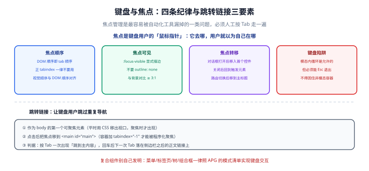

# 键盘、焦点与复合组件

**焦点（focus）** 是键盘用户在页面上的「位置感」——它去哪，用户就以为自己在哪。所有「键盘用不了」的问题，本质都是焦点的问题。

## 一句话定位

> 键盘可用性 = 能不能到（可达）+ 看得见（可见）+ 走得顺（顺序）+ 出得来（不被困住）。



## 一、四条纪律

### 纪律 1：焦点顺序就是 DOM 顺序

`Tab` 的顺序由 **DOM 中的出现顺序**决定，与 CSS 定位、`absolute`、`order` 都无关。

:::danger 正 `tabindex` 是禁忌
```html
<!-- 反例：正 tabindex 会把元素插到全局顺序的最前面，之后所有 Tab 都会先绕到它 -->
<div tabindex="1">第二块内容</div>
<div tabindex="2">第一块内容</div>
```
只要页面里出现一个正值 `tabindex`，整个页面的 Tab 顺序就变得不可预测，而且**随内容增减而互相干扰**。

允许的两种 `tabindex`：

- `tabindex="0"`：把非原生可聚焦元素加入 Tab 序列（仍不推荐，优先换原生元素）。
- `tabindex="-1"`：**程序化可聚焦但不在 Tab 序列中**——焦点管理的核心工具。
:::

调整顺序的正确方式是**调整 DOM 顺序**，用 CSS 的 `flex-direction` / `grid` 布局实现视觉上的排列，而不是用 `order` 把 DOM 与视觉拆开。

### 纪律 2：焦点必须可见

```css
/* 反例：全局清掉焦点框，键盘用户完全不知道自己在哪 */
*:focus { outline: none; }

/* 正例：只在键盘操作时显示，且保证对比度 ≥ 3:1 */
:focus-visible {
  outline: 2px solid #2563eb;
  outline-offset: 2px;
  border-radius: 4px;
}
```

为什么用 `:focus-visible` 而不是 `:focus`：浏览器会自动判断「这次聚焦是否应该显示指示」——键盘操作显示、鼠标点击不显示。这样既满足键盘用户，又避免鼠标用户看到突兀的描边。

:::warning `outline: none` 必须成对修
清掉 `outline` 的同时必须补一个**足够明显的替代指示**（`box-shadow`、`border`、`background` 都可以）。只清不补，等于制造一条 2.4.7 缺陷。
:::

### 纪律 3：焦点要可管理（三种转移场景）

| 场景 | 焦点应该去哪 | 为什么 |
| --- | --- | --- |
| **打开对话框** | 移入对话框内的第一个可聚焦元素 | 否则焦点还留在背后的页面上，Tab 会在背后乱走 |
| **关闭对话框** | **回到触发它的那个元素** | 否则焦点回到 `body`，用户要从头 Tab 一遍 |
| **单页应用路由切换** | 移到新页面的主标题（`<h1 tabindex="-1">`） | 否则焦点停在旧页面的链接上，而内容已经换了 |

```ts
// 路由切换后的焦点管理（以 Vue Router 为例）
router.afterEach((to) => {
  // 用 nextTick 或 requestAnimationFrame 等新页面渲染完成
  requestAnimationFrame(() => {
    const main = document.querySelector<HTMLElement>('main h1, main')
    if (!main) return
    if (!main.hasAttribute('tabindex')) main.setAttribute('tabindex', '-1')
    main.focus({ preventScroll: false })
  })
})
```

:::tip 单页应用最省力的做法
用框架提供的**焦点管理钩子**：Vue Router 的 `scrollBehavior` 配合手动聚焦、React Router 的 `useLocation` 配合 `useEffect`、Nuxt 的 `app:rendered` 钩子。要点只有一个：**新页面的主标题要被程序化聚焦一次**，让读屏用户知道「换页了」。
:::

### 纪律 4：不要制造键盘陷阱

「键盘陷阱」指焦点进入某个区域后**再也出不来**（Tab 循环但 Esc 无效、或者干脆 Tab 不到别处）。

允许的例外只有一个：**模态对话框内部的焦点循环**——这是符合预期的行为，但必须满足两个条件：

1. **`Esc` 能关闭对话框**并把焦点还给触发元素。
2. 对话框**外部的元素不可聚焦**（用 `inert` 或原生 `<dialog>` 的模态行为）。

```html
<!-- 原生 <dialog> + showModal()：遮罩、Esc、焦点陷阱、焦点归还全部由浏览器提供 -->
<dialog id="confirm" aria-labelledby="confirm-title">
  <h2 id="confirm-title">确认删除？</h2>
  <p>删除后无法恢复。</p>
  <form method="dialog">
    <button value="cancel">取消</button>
    <button value="ok">删除</button>
  </form>
</dialog>
```

```ts
const dlg = document.getElementById('confirm') as HTMLDialogElement
// 打开：浏览器自动把焦点移入第一个可聚焦元素
dlg.showModal()
// 关闭：浏览器自动把焦点还给触发元素
dlg.addEventListener('close', () => {
  console.log('returnValue =', dlg.returnValue) // 'ok' / 'cancel'
})
```

:::warning `<dialog>` 的两个使用细节
1. **不要给 `.modal` 写 `display` 规则**：浏览器对未打开的 `dialog` 给的是 `display: none`，你覆盖它之后，关闭的弹窗会留在页面上。布局只写 `.modal[open]`。
2. **`show()` 与 `showModal()` 不是一回事**：`show()` 打开的是**非模态**对话框——没有遮罩、没有焦点陷阱、Esc 不生效。需要模态就用 `showModal()`。
:::

## 二、跳转链接：让键盘用户跳过重复导航

导航栏通常有 20+ 个可聚焦元素。键盘用户每次换页都要 Tab 一遍导航才能到正文——跳转链接（skip link）就是解药。

三要素：

```html
<!-- ① 必须是 body 里的第一个可聚焦元素 -->
<a class="skip-link" href="#main">跳到主内容</a>

<!-- ② 目标容器要能被程序化聚焦 -->
<main id="main" tabindex="-1">…</main>
```

```css
/* ③ 平时移出视口，聚焦时才出现 */
.skip-link {
  position: absolute;
  left: -9999px;
  top: 0;
  z-index: 100;
  padding: 8px 16px;
  background: #fff;
  border: 2px solid #2563eb;
}
.skip-link:focus {
  left: 8px;
  top: 8px;
}
```

**判据**：页面加载后按一次 `Tab`，应出现「跳到主内容」；按 `Enter` 后，下一次 `Tab` 应落在正文里的第一个链接上（而不是导航里的第二个链接）。

:::danger 常见错误
- 用 `visibility: hidden` 或 `display: none` 隐藏跳转链接 → **它自己也变得不可聚焦**，永远出不来。
- 目标容器没加 `tabindex="-1"` → 锚点跳转只滚动页面，**焦点仍在导航里**，下一次 Tab 还是继续导航。
:::

## 三、复合组件：照 APG 实现，不要自己发明

「复合组件」指由多个可聚焦元素组成、彼此间用方向键切换的控件：菜单、标签页、树、组合框、单选组、工具栏、日期选择器。

W3C 的 [ARIA Authoring Practices Guide（APG）](https://www.w3.org/WAI/ARIA/apg/) 为每种组件给出了**标准键盘交互模式**。照抄它能避免所有的兼容性问题。

以**标签页（Tabs）**为例，APG 定义的键盘行为：

| 按键 | 行为 |
| --- | --- |
| `Tab` | 焦点进入当前选中的标签；再按一次离开整个标签组（**组内只有一个 Tab 停靠点**） |
| `←` / `→` | 在标签之间移动焦点，**并立即激活**该标签（自动激活模式） |
| `Home` / `End` | 跳到第一个 / 最后一个标签 |
| `Enter` / `Space` | 手动激活模式下，激活当前聚焦的标签 |

```html
<div role="tablist" aria-label="文章视图">
  <button role="tab" id="tab-latest" aria-selected="true"
          aria-controls="panel-latest" tabindex="0">最新</button>
  <button role="tab" id="tab-hot" aria-selected="false"
          aria-controls="panel-hot" tabindex="-1">热门</button>
</div>
<div role="tabpanel" id="panel-latest" aria-labelledby="tab-latest" tabindex="0">…</div>
<div role="tabpanel" id="panel-hot" aria-labelledby="tab-hot" tabindex="0" hidden>…</div>
```

两个关键点，也是最常写错的地方：

1. **只有选中的标签 `tabindex="0"`，其余为 `-1`**。这样 `Tab` 只在标签组停一次，方向键在组内切换——否则 8 个标签就要按 8 次 `Tab`。
2. **`aria-selected` 只有一个为 `true`**，且 `aria-controls` 与面板的 `id` 必须对应。

## 四、其他输入方式

| 场景 | 要点 |
| --- | --- |
| 触摸 / 触控笔 | 可点击目标 ≥ 24×24 CSS 像素（WCAG 2.2 的 2.5.8） |
| 语音控制 | 可访问名称要与可见文字一致——可见文字是「提交订单」，名称就得是「提交订单」，否则语音用户喊不出来 |
| 指针拖拽 | 必须提供非拖拽的替代操作（2.5.7）：拖拽排序要有「上移/下移」按钮 |
| 高对比度模式 | 不要用背景图表达关键信息；用 `forced-colors` 媒体查询兜底 |

```css
@media (forced-colors: active) {
  /* 高对比度模式下，自定义描边可能失效，用系统色重写 */
  .card { border: 1px solid CanvasText; }
}
```

## 五、双向语言（RTL）与焦点

国际化与无障碍在这里相交：阿拉伯语 / 希伯来语页面是 **RTL（从右到左）** 布局。

| 要点 | 做法 |
| --- | --- |
| 文档方向 | `<html dir="rtl" lang="ar">`，或局部 `<div dir="rtl">` |
| 逻辑属性 | 用 `margin-inline-start` / `padding-inline-end` / `inset-inline-start` 代替 `left` / `right` |
| 焦点顺序 | **不需要改 DOM**：Tab 顺序不变，视觉上的「从左到右」自动变成「从右到左」 |
| 方向键 | 在 RTL 下，`→` 的语义是「向视觉左侧移动」，实现时要按 `dir` 取反 |

:::danger 不要用 `direction: rtl` 去「修」布局
`direction` 应该跟着语言走（由 `dir` 属性决定），而不是当布局工具用。用 `direction: rtl` 去解决一个右对齐问题，会让整个子树内的标点、数字、焦点顺序全部错位。
:::

## 六、易错点汇总

:::danger 八个高频问题
1. **全局 `outline: none`** → 焦点不可见。
2. **正 `tabindex`** → 全局 Tab 顺序混乱。
3. **`div` 当按钮** → 键盘不可达，且读屏无角色。
4. **对话框关闭后焦点不回触发元素** → 用户要重新 Tab 一遍。
5. **单页应用路由切换后不管理焦点** → 读屏用户以为还在旧页面。
6. **用 `display:none` 藏跳转链接** → 跳转链接自己不可聚焦。
7. **模态内的 Tab 循环但没有 Esc** → 键盘陷阱。
8. **标签页组里每个标签都是 `tabindex="0"`** → Tab 次数爆炸，且方向键语义失效。
:::

## 验证方式

一份五分钟能跑完的键盘走查清单：

1. 页面加载 → 按一次 `Tab` → 出现跳转链接。
2. 一路 `Tab` 到底 → 每个可聚焦元素都有可见焦点框；顺序与视觉顺序一致。
3. 打开模态 → 焦点进入模态内部；`Tab` 在模态内循环；`Shift+Tab` 反向循环。
4. `Esc` 关闭模态 → 焦点回到触发按钮。
5. 打开下拉菜单 → `↓` 在选项间移动，`Esc` 关闭并归还焦点。
6. 切换路由 → 焦点落在新页面主标题上。
7. 全程**不使用鼠标**完成一次核心操作（如提交一次表单）。

## 参考资料

- [W3C ARIA Authoring Practices Guide（APG）](https://www.w3.org/WAI/ARIA/apg/)
- [MDN：`:focus-visible`](https://developer.mozilla.org/zh-CN/docs/Web/CSS/:focus-visible)
- [MDN：`<dialog>` 元素](https://developer.mozilla.org/zh-CN/docs/Web/HTML/Element/dialog)
- [MDN：CSS 逻辑属性](https://developer.mozilla.org/zh-CN/docs/Web/CSS/CSS_logical_properties_and_values)
