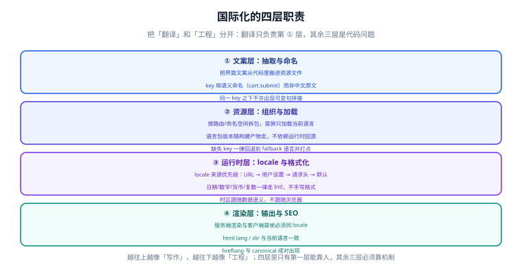

# 概述：两层职责与标准速览

本页回答三个问题：**i18n 与 a11y 各自负责什么、它们的共同点是什么、什么时候该做什么时候不该做**。读完这一页，后面九页都是它的展开。

## 一句话定位

> i18n 把「语言与地区」这个假定从代码里拿掉，a11y 把「输入方式与感知能力」这个假定从界面里拿掉。

两者都是**消除隐含假定**的工作。区别只在于假定的来源：一个来自「用户说的是什么语言、在哪个地区」，另一个来自「用户怎么用这个界面」。



## 两层职责：谁该做什么

### 国际化的四层职责

很多人把「国际化」等同于「翻译」，这是返工的主要来源。真正的国际化分四层，**只有第一层是文字工作**：

| 层次 | 职责 | 主责人 | 出错的典型症状 |
| --- | --- | --- | --- |
| ① 文案层：抽取与命名 | 把界面文案从代码里搬进资源文件，并给每个 key 起语义化名字 | 产品 / 前端 | 文案硬编码在组件里，翻译平台收不到 |
| ② 资源层：组织与加载 | 语言包怎么拆、什么时候加载、缺失 key 怎么办 | 前端 | 首屏白屏、切换语言要刷新整页 |
| ③ 运行时层：locale 与格式化 | 当前是什么语言、日期数字怎么写、复数用哪一类 | 前端 / 后端 | 日期多一天、金额少一个零、复数变形错 |
| ④ 渲染层：输出与 SEO | 服务端渲染什么语言、`html lang` 写什么、`hreflang` 怎么给 | 前端 / 运维 | 首屏语言与 HTML 不一致、搜索引擎收录错语言版本 |

四层里只有第 ① 层能靠「找人翻」，②③④ 全是**代码问题**。这就是为什么「先翻译再改造」的路线几乎一定会返工：翻译产物无法直接接进没有分层设计的代码。

### 无障碍的三层职责

无障碍同样不止「加几个 `aria-label`」：

| 层次 | 职责 | 出错的典型症状 |
| --- | --- | --- |
| ① 结构层：语义与名称 | 用什么元素、可访问名称从哪来 | 读屏软件念「按钮 按钮」或干脆不念 |
| ② 交互层：键盘与焦点 | 不碰鼠标能不能走完、焦点在哪看得见吗 | 键盘卡在某个控件、打开弹窗后焦点还在背后 |
| ③ 内容层：对比、缩放、动效与错误提示 | 看得清吗、放大了还正常吗、报错能听懂吗 | 浅灰文字在白底上、200% 缩放后内容被裁掉 |

**层次顺序不能反**：先改结构层（改元素），再改交互层（补键盘），最后调内容层（调颜色）。反过来做，等于给一个 `div` 加 `aria-label`——读屏软件能念出名字，但它依然不可聚焦、不可激活。

## 共同点：三种被打破的假定

把两者放在一起看，会发现它们攻击的是同一批隐含假定：

| 隐含假定 | i18n 视角下的问题 | a11y 视角下的问题 |
| --- | --- | --- |
| 「文字长度都差不多」 | 英文 10 个字符的按钮，德文可能 25 个 | 200% 缩放下同样会溢出 |
| 「从左到右、从上到下」 | 阿拉伯语 / 希伯来语是 RTL，布局要镜像 | 键盘顺序按 DOM 走，视觉顺序错位就迷惑 |
| 「颜色能传达信息」 | 不同文化里颜色含义不同（红 = 危险还是喜庆） | 色盲用户根本区分不了这组状态色 |
| 「用户会看完整段文字」 | 语序不同，句子拼接必然出错 | 读屏软件是线性读的，视觉分组不代表听觉分组 |
| 「默认值就是对的」 | 默认语言、默认时区、默认货币 | 默认字号、默认动效强度 |

**最有效的一步是同一件事：把「默认值」显式写出来。** 语言不猜、时区不猜、字号不猜、动效偏好不猜——凡是有 `Intl` 或媒体查询能问的，就不要自己定默认值。

:::tip 一条判断标准
遇到「这样写行不行」的问题时，问自己：**这句话在什么条件下会不成立？** 如果说得出条件（另一种语言、另一个时区、不用鼠标、看不清），那它就是一个隐含假定，需要显式处理。
:::

## 什么时候该做、什么时候不该做

国际化与无障碍都有真实成本，不是所有项目都值得全量投入。按下面的判据决定范围：

| 场景 | 建议范围 | 理由 |
| --- | --- | --- |
| 内部工具、单一语言、固定用户群 | **只做无障碍的结构层与键盘层** | 成本极低（改用语义化元素 + 焦点可见），收益立竿见影 |
| 面向公众的产品，首发单语言 | **无障碍按 AA 做，国际化先预留结构** | 结构预留指：文案集中管理、不写死日期格式——不预先翻译 |
| 明确要出海 | **国际化四层全做，无障碍按 AA 做** | 两项都要进 CI，否则一定退化 |
| 面向政府 / 金融 / 医疗等受监管行业 | **按合同或法规条款逐条对齐** | 不要自行判断范围，以条款为准 |
| 一次性活动页、生命周期 < 1 个月 | **只做对比度与键盘可达** | 投入产出比优先 |

:::danger 三个「看起来做了其实没做」的反面教材
1. **只在首页加了语言切换器**——切过去之后日期还是 `2026/10/5`，因为格式化没走 `Intl`。判据：切换语言后，页面里**所有**日期与数字的写法都变了。
2. **把 `aria-label` 加在 `div` 上当按钮用**——读屏软件念得出名字，但键盘 Tab 不到、回车没反应。判据：禁用鼠标，只按 Tab 能不能激活它。
3. **用 CSS 的 `order` 把视觉顺序调成想要的，没动 DOM**——看起来对了，键盘顺序还是乱的，读屏顺序也是乱的。判据：Tab 一遍，看焦点是不是按视觉顺序跳。
:::

## 落地的最小起点

不需要一次性完成。按下面的顺序做，每一步都能独立交付：

```text
第 1 步（半天）：给项目加三个基础约定
  ① 语言不写死：所有面向用户的文案集中到一个目录，组件里不出现中文字面量
  ② 时间不写死：所有日期/数字走 Intl，禁止手写格式串
  ③ 焦点不隐藏：全局移除 outline: none，改用 :focus-visible 显式描边

第 2 步（1~2 天）：接上门禁
  ① 语言包一致性校验（key 缺失/多余/占位符不一致）
  ② 无障碍静态检查（模板 lint + 一次 axe 基线）

第 3 步（按需求推进）：补齐四层与三层
  按本页的两张职责表逐项对照，缺哪层补哪层。
```

## 常用清单：本专题涉及的标准与工具速查

| 用途 | 标准 / 工具 | 备注 |
| --- | --- | --- |
| 语言与地区数据 | Unicode CLDR | 日期、数字、货币、复数规则的事实来源 |
| 运行时格式化 | ECMA-402（`Intl`） | 浏览器与 Node 均内置，见 [原生 Intl](../IntlApi/index.md) |
| 无障碍验收标准 | WCAG 2.2 | A / AA / AAA 三级，商业项目通常以 AA 为口径 |
| 无障碍语义定义 | WAI-ARIA 1.2 | 角色与属性的权威定义，使用前先看 ARIA 五规则 |
| 组件交互模式 | W3C APG | 菜单、标签页、树、组合框的键盘交互标准做法 |
| 自动化检测 | axe-core / Lighthouse | 只覆盖结构类问题的一部分，**不等于验收** |
| 手动验证 | 键盘走查 + 屏幕阅读器 | 键盘走查零成本，应当成为每次功能验收的固定动作 |

## 验证方式

本页的落地判据（每条都可执行）：

1. **语言不写死**：在源码里搜索中文字面量（排除注释与测试数据），命中数应为 0。
2. **时间不写死**：搜索手写日期格式串（如 `YYYY-MM-DD` 出现在业务代码里而非配置里），命中数应为 0。
3. **焦点不隐藏**：全局搜索 `outline: none` / `outline: 0`，命中数应为 0（或都已被 `:focus-visible` 替代）。
4. **键盘可达**：拔掉鼠标，只用 Tab / Shift+Tab / Enter / Space / Esc 走一遍主流程，能走完即通过。

## 参考资料

- [WCAG 2.2 规范（W3C）](https://www.w3.org/TR/WCAG22/)
- [WAI-ARIA Authoring Practices Guide（APG）](https://www.w3.org/WAI/ARIA/apg/)
- [MDN：国际化（i18n）](https://developer.mozilla.org/zh-CN/docs/Web/JavaScript/Reference/Global_Objects/Intl)
- [Unicode CLDR 项目主页](https://cldr.unicode.org/)
