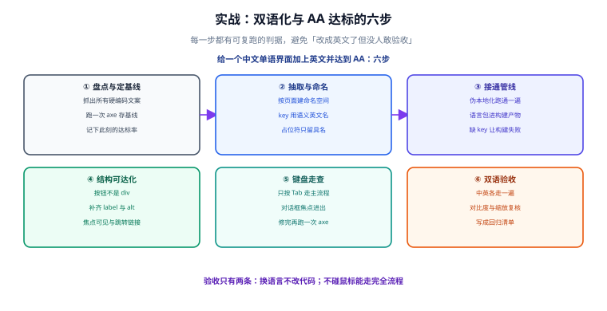

# 实战：双语化与 AA 达标

前八页讲的是各个侧面。这一页把它们组合成一条**可执行、可验收**的改造路线：给一个既有的中文单语界面加上英文，并达到 WCAG 2.2 AA。

## 一句话定位

> 改造的难点不在技术，而在**顺序**——先结构、再管线、最后验收；顺序错了就是无尽的返工。



## 改造前的基线：先量，再改

改造的第一步永远是「摸清现状」。没有基线，后面无法回答「到底改好了没有」。

```shell
# ① 统计硬编码文案（中文出现在模板/组件里，排除注释与 mock 数据）
rg -n --glob '*.{vue,tsx,ts,jsx,js,html}' '[\u4e00-\u9fa5]' src \
  | rg -v '(^\s*//|/\*|<!--|\bmock\b)' | wc -l

# ② 统计手写日期与数字格式
rg -n "toLocaleDateString\(|toFixed\(|'YYYY|new Intl" src | wc -l

# ③ 统计被清掉的焦点框
rg -n 'outline:\s*(none|0)' src

# ④ 跑一次无障碍扫描，保存基线
npx playwright test tests/a11y --reporter=json > baseline-a11y.json
```

把四个数字记下来，它们就是这次改造的**起点指标**。改造完成后要能一条条对比。

:::danger 不要跳过基线这一步
「感觉比之前好多了」不是验收。常见的情况是：文案抽出去了，但日期格式没变、焦点框还是被清掉的——基线是唯一能发现「局部完成」的手段。
:::

## 第 1 步：盘点与定基线

**做什么**：跑上面四条命令，产出一份现状清单。

**判据**：

- 四个数字都被记录，且可复现（同样的命令跑两次得到同样的结果）。
- 明确本次范围：本页示例的范围是「全部面向用户的文案 + 首页/列表/详情/表单四类页面」。

**输出的文件**：`docs/i18n-a11y-baseline.md`，含四类统计与本次改造范围。

## 第 2 步：抽取与命名

**做什么**：把组件里的中文字面量搬进语言包，并按 `<命名空间>.<模块>.<语义>` 命名。

```text
locales/zh-CN/common/action.json      → { "save": "保存", "cancel": "取消" }
locales/zh-CN/article/list.json       → { "title": "文章列表", "empty": "暂无文章" }
locales/zh-CN/article/detail.json     → { "publishedAt": "发布于 {date}" }
```

**判据**：

- `①` 的硬编码统计降到 **0**（排除注释与测试数据）。
- 每个 key 都能回答「这个词换到别的模块还能用吗」。
- 所有需要插值的地方都用**具名占位符**，不存在字符串拼接。

:::warning 这一步最容易偷懒
「先把页面文案搬过去，组件里的拼接留着以后改」——这是最贵的一种省事。拼接语句在切换到英文时必然错位，而且散落在各处极难排查。**抽取阶段就把拼接消灭掉**。
:::

## 第 3 步：接通管线

**做什么**：把语言包接入运行时，并把缺失检测挂到构建上。

```ts
// scripts/check-locales.mjs —— 构建前跑一次
import { readFileSync, readdirSync } from 'node:fs'

const locales = ['zh-CN', 'en-US']
const bundles = Object.fromEntries(locales.map((l) => [l, loadDir(`locales/${l}`)]))

const sourceKeys = new Set(bundles['zh-CN'].keys())
let failed = false
for (const locale of locales.filter((l) => l !== 'zh-CN')) {
  for (const key of sourceKeys) {
    if (!bundles[locale].has(key)) {
      console.error(`[missing] ${locale}: ${key}`)
      failed = true
    }
  }
}
process.exit(failed ? 1 : 0)
```

**判据**：

- **伪本地化能跑通**：切到伪语言，界面中**没有**未被 `[[ ]]` 包裹的文字（说明没有漏网的硬编码）。
- **缺 key 时构建失败**：临时删掉一个 `en-US` 的 key，构建报错并指出 key 名。
- **`②` 的数字降为 0**：所有日期与数字都走 `Intl`。

## 第 4 步：结构可达化

**做什么**：把「假元素」换成真元素，补齐名称与关联。

| 改造项 | 改造前 | 改造后 | 判据 |
| --- | --- | --- | --- |
| 按钮 | `<div class="btn" @click>` | `<button type="button">` | Tab 得到、Enter 能激活 |
| 链接 | `<span @click="go()">` | `<a :href>` 或路由链接组件 | 键盘可达，右键可复制地址 |
| 图标按钮 | `<i class="icon-close">` | `<button aria-label="关闭">` | 读屏念「关闭 按钮」 |
| 表单标签 | `placeholder="邮箱"` | `<label for>` + `aria-describedby` 关联错误 | 点标签聚焦输入框 |
| 图片 | `` 无 alt | 信息图给语义 `alt`，装饰图 `alt=""` | 扫描无 `image-alt` 违规 |
| 弹窗 | 自研 div 弹窗 | 原生 `<dialog>` + `showModal()` | Esc 可关，焦点归还 |
| 焦点框 | `outline: none` | `:focus-visible` 描边 | 键盘操作时焦点清晰可见 |

**判据**：

- `③` 的统计降为 **0**。
- 无障碍扫描的 `serious` / `critical` 违规为 **0**。

## 第 5 步：键盘与焦点走查

**做什么**：不使用鼠标，把主流程走一遍。

```text
□ 第一次 Tab 出现「跳到主内容」
□ Tab 顺序与视觉顺序一致
□ 每个可聚焦元素都有可见焦点框
□ 打开弹窗 → 焦点进入；Esc → 焦点归还触发按钮
□ 切换路由 → 焦点落在新页面主标题
□ 全程不用鼠标完成一次提交
```

**判据**：

- 六条全部通过。
- 修完后再跑一次扫描，违规数不应增加（焦点与交互类改动容易引入新的 ARIA 问题）。

## 第 6 步：双语验收

**做什么**：中英两种语言各走一遍完整流程，并做一次回归清单固化。

| 检查项 | 中文 | 英文 |
| --- | --- | --- |
| 界面无截断、无溢出 | ☐ | ☐ |
| 日期 / 数字 / 货币写法随语言变化 | ☐ | ☐ |
| `<html lang>` 与当前语言一致 | ☐ | ☐ |
| 关闭 JS 后文案仍正确（SSR 路径） | ☐ | ☐ |
| 页面无未翻译的中文残留 | ☐ | ☐ |
| 键盘走查六条通过 | ☐ | ☐ |
| 对比度与 200% 缩放通过 | ☐ | ☐ |

**判据**：

- 两种语言的 `<html lang>` 分别是 `zh-CN` 与 `en-US`。
- 英文页面上**没有**任何中文字符（品牌名除外，且需在白名单里声明）。
- 这份表格被固化进仓库，成为后续每次改动的回归清单。

## 与后端的分工

改造过程中最容易扯皮的部分：**哪些内容该由后端返回，哪些该由前端翻译？**

| 内容类型 | 谁负责 | 说明 |
| --- | --- | --- |
| 界面固定文案 | 前端语言包 | 「保存」「下一页」「暂无数据」 |
| 用户产生的内容 | 不翻译 | 文章正文、评论内容，原样展示 |
| 业务枚举（状态、分类） | **后端返回码，前端映射文案** | 返回 `PUBLISHED`，前端映射为「已发布」/「Published」 |
| 校验错误信息 | 后端返回**错误码与参数**，前端组装文案 | 返回 `EMAIL_FORMAT` + `{ example: 'name@example.com' }` |
| 邮件、短信等站外内容 | **后端模板** | 前端语言包覆盖不到 |

:::danger 最贵的返工：把业务枚举当文案返回
后端直接返回 `status: "已发布"`，前端就没法翻译——加一门语言就要改后端。正确做法是**后端只返回稳定的枚举值**，展示文案由前端映射。这条约定必须在改造开始时就写进接口契约。
:::

## 验收清单（可直接粘贴进仓库）

```text
【国际化】
□ 源码中面向用户的中文字面量为 0
□ 所有日期/时间/数字/货币都走 Intl，且时区显式指定
□ zh-CN 与 en-US 的 key 集合完全一致
□ 缺 key 时构建失败
□ 伪本地化走查无硬编码残留
□ 关闭 JS 后文案与 html lang 正确
□ 语言切换无闪变，URL（或 Cookie）承载语言

【无障碍】
□ 扫描 serious / critical 违规为 0
□ 键盘走查六条通过
□ 灰度截图下状态区分完整
□ 200% 缩放无裁切
□ 每个可交互元素都有有意义的可访问名称
□ 表单错误提示说明「哪一项、错在哪、怎么改」
□ 异步结果有状态消息播报
□ 上述检查已接进 CI，且有防退化基线
```

## 常见阻力与应对

| 阻力 | 应对 |
| --- | --- |
| 「这次先不翻译，以后再说」 | 只做**结构预留**（文案集中管理 + 格式化走 `Intl`），成本极低，为未来保留可能性 |
| 「设计稿就是这么窄的」 | 用伪本地化截图给设计看：`[[Sàvé]]` 被截断的样子比争论有效 |
| 「无障碍是给少数人做的」 | 键盘可用性同时也是**效率功能**（专业用户的常用操作）；对比度与缩放对所有人在强光、大屏下都有效 |
| 「加了门禁会拖慢发布」 | 门禁只扫六类模板页，几分钟；对比「上线后补一个 i18n 缺陷」的成本 |
| 「改不动老代码」 | 只对**本次要改动的页面**做改造，不专门排期存量；新代码一律按新标准 |

## 参考资料

- [WCAG 2.2 快速参考（按条目查判据）](https://www.w3.org/WAI/WCAG22/quickref/)
- [W3C：WCAG 一致性评估方法](https://www.w3.org/WAI/test-evaluate/)
- [MDN：国际化与本地化总览](https://developer.mozilla.org/zh-CN/docs/Web/JavaScript/Reference/Global_Objects/Intl)
- [ARIA Authoring Practices Guide（APG）模式清单](https://www.w3.org/WAI/ARIA/apg/patterns/)
