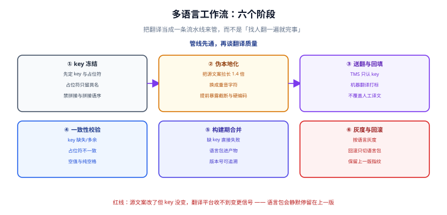

# 翻译工作流：从 key 冻结到灰度

架构决定「能不能翻」，工作流决定「翻得对不对、翻完会不会退化」。本页把翻译当成一条**有出口判据的流水线**来管。

## 一句话定位

> 翻译不是「找个人翻一遍」，而是一条流水线：**源文案改动会触发翻译任务，翻译结果会经过校验才能进产物，产物出错可以按语言回滚。**



## 管线六个阶段

| 阶段 | 输入 | 输出 | 判据 |
| --- | --- | --- | --- |
| ① key 冻结 | 功能需求 | 稳定的 key 与占位符约定 | key 集合可 diff，改动有记录 |
| ② 伪本地化 | 源语言包 | 假语言包 | 界面不截断、不溢出、无硬编码漏网 |
| ③ 送翻与回填 | 源语言包 | 目标语言包 | key 集合一致、占位符一致 |
| ④ 一致性校验 | 全部语言包 | 校验报告 | 七条规则全过 |
| ⑤ 构建期合并 | 校验通过的语言包 | 构建产物 | 缺 key 时构建失败 |
| ⑥ 灰度与回滚 | 产物 | 线上多语言 | 可按语言回滚，回滚只切资源 |

## 一、key 冻结：先定契约，再谈翻译

送翻前必须先冻结 key。冻结的含义是三条：

1. **key 不再变化**：源文案可以改，key 不变（否则翻译记忆库无法复用，每次都要重翻）。
2. **占位符只用具名形式**，且**在源语言与目标语言中必须完全一致**：源是 `{count}`，翻译回来不能变成 `{数量}`。
3. **同一条 key 的上下文写清楚**：给翻译者的说明里要写「这是按钮还是标题」「这是单数还是复数场景」。

:::danger 改文案不改 key 的代价
`cart.pay` 的原文从「结算」改成「去支付」，而 key 没变。大多数 TMS 只按 key 判断变更，**所以翻译平台收不到这次变更信号**，英文版会一直停留在 "Checkout"。

正确做法：**key 稳定 + 源文案变更要能触发重译**。实现方式是在语言包里带上一个内容指纹（或让 TMS 支持「按内容变更」的对比模式），而不是靠人记得提醒翻译。
:::

## 二、伪本地化：半天成本，省一周返工

**伪本地化（pseudo-localization）** 是把源语言文案机械地替换成「看起来像外语、但其实是垃圾」的版本，用来在不真的要翻译的前提下暴露布局与硬编码问题。

典型变换三条：

- **拉长**：把每个字符替换成更宽的字符，整体长度约 ×1.4（德语、俄语通常比英语长 30%~40%）。
- **加括号标记**：用 `[[ ... ]]` 包住，一眼看出哪些文案没被抽取。
- **加音标字符**：把 `a` 换成 `à`、`i` 换成 `í`，暴露字符编码与非 ASCII 处理问题。

```ts
// 把源语言包转换成伪本地化语言包：key 结构不变，只改值
type Bundle = Record<string, unknown>;

const WIDE: Record<string, string> = {
  a: 'à', b: 'ƀ', c: 'ç', d: 'ð', e: 'é', f: 'ƒ', g: 'ĝ', h: 'ĥ',
  i: 'í', j: 'ĵ', k: 'ķ', l: 'ļ', m: 'ɱ', n: 'ñ', o: 'ó', p: 'þ',
  q: 'q', r: 'ř', s: 'š', t: 'ţ', u: 'ú', v: 'v', w: 'ŵ', x: 'ẋ',
  y: 'ý', z: 'ž',
};

function pseudo(text: string): string {
  const widened = [...text].map((ch) => WIDE[ch] ?? ch).join('');
  return `[[${widened}]]`;
}

function pseudoBundle(bundle: Bundle): Bundle {
  const out: Bundle = {};
  for (const [k, v] of Object.entries(bundle)) {
    out[k] = typeof v === 'string' ? pseudo(v) : pseudoBundle(v as Bundle);
  }
  return out;
}
```

伪本地化能抓到四类问题：

| 现象 | 根因 |
| --- | --- |
| 界面里出现了没被 `[[ ]]` 包住的文字 | **硬编码文案**漏网 |
| 按钮文字被截断、省略号淹没了文本 | 布局按最短语言设计，没留伸缩空间 |
| 数字与文字叠在一起 | 容器用固定宽度而非 `min-width` / `flex` |
| 换行位置诡异、单词被拆开 | 缺少 `word-break` / `overflow-wrap` 策略 |

## 三、TMS 对接

翻译管理系统（TMS）接入的常见格式与要点：

| 格式 | 说明 | 适用 |
| --- | --- | --- |
| 嵌套 JSON | 目录结构即命名空间 | 前端最常用，与源码结构一致 |
| 扁平 key-value | `cart.items` 作为字面 key | 工具链通用，转换简单 |
| XLIFF / iOS `.strings` / Android `.xml` | 平台标准格式 | 移动端或跨端项目 |
| ICU MessageFormat | 支持复数、选择、嵌套 | 需要复杂语法的项目 |

对接四条纪律：

1. **只上传源语言包**：目标语言由 TMS 回填，不双向同步（否则人工在仓库里改的译文会被覆盖）。
2. **机器翻译必须打标**：标记出「未人工校对」的条目，上线前至少要人工过一遍高曝光页面。
3. **翻译记忆库（TM）要启用**：同一 key 的历史译文自动复用，改一个字不必重翻整句。
4. **术语表（Glossary）先行**：品牌名、专业术语的译法先定，否则同一个词在不同页面会出现多种译法。

## 四、CI 校验：七条规则

把下面七条做成构建前的一道门禁，任何一条不过就让构建失败：

```text
E1 key 缺失       目标语言有 key、源语言没有（多余）→ 报错
E2 key 缺少       源语言有 key、目标语言没有（漏翻）→ 报错
E3 占位符不一致     {count} ↔ {quantity}、少一个或多一个 → 报错
E4 空值           值为空字符串或纯空白 → 报错
E5 未翻译         值与源语言完全相同（同一条 key）→ 警告（品牌词允许一致）
E6 类型不一致     源是字符串、目标是对象（或反之）→ 报错
E7 复数类别缺失    源语言有 one/other，目标语言缺 other → 报错
```

一份可直接引用的校验脚本骨架：

```ts
type Bundle = Record<string, unknown>;

function flatten(bundle: Bundle, prefix = ''): Map<string, string> {
  const map = new Map<string, string>();
  for (const [k, v] of Object.entries(bundle)) {
    const key = prefix ? `${prefix}.${k}` : k;
    if (typeof v === 'string') map.set(key, v);
    else if (v && typeof v === 'object') {
      for (const [ck, cv] of flatten(v as Bundle, key)) map.set(ck, cv);
    } else {
      map.set(key, `__NON_STRING__:${typeof v}`);
    }
  }
  return map;
}

const PLACEHOLDER = /\{([a-zA-Z0-9_]+)\}/g;

function placeholders(text: string): string[] {
  return [...text.matchAll(PLACEHOLDER)].map((m) => m[1]).sort();
}

export function checkBundle(
  sourceId: string,
  source: Bundle,
  targetId: string,
  target: Bundle,
): string[] {
  const errors: string[] = [];
  const s = flatten(source);
  const t = flatten(target);

  for (const key of s.keys()) {
    if (!t.has(key)) errors.push(`E2 缺少 ${targetId}:${key}`);
  }
  for (const key of t.keys()) {
    if (!s.has(key)) errors.push(`E1 多余 ${targetId}:${key}`);
  }
  for (const key of s.keys()) {
    if (!t.has(key)) continue;
    const sv = s.get(key)!;
    const tv = t.get(key)!;
    if (tv.startsWith('__NON_STRING__')) {
      errors.push(`E6 类型不一致 ${targetId}:${key}`);
      continue;
    }
    if (tv.trim() === '') errors.push(`E4 空值 ${targetId}:${key}`);
    const sp = placeholders(sv).join(',');
    const tp = placeholders(tv).join(',');
    if (sp !== tp) errors.push(`E3 占位符不一致 ${targetId}:${key} (${sp} ≠ ${tp})`);
  }
  return errors;
}
```

:::tip 校验脚本自身也要有测试
用一份「故意缺一个 key、再把一个占位符改名」的假语言包跑一遍，断言**恰好报出 E2 与 E3 两条**。只断言「退出码非零」是不够的——别的规则报红会蒙对。
:::

## 五、构建期合并与版本

两条纪律：

1. **语言包进产物，不做运行时回源**。回源会引入首屏竞态与缓存不一致，且离线不可用。
2. **语言包要有可追溯的版本标识**（构建号或内容哈希）。线上出问题时，能回答「现在生效的是哪一版译文」。

```ts
// 产物里带上一份语言包指纹，便于线上排查
export const LOCALE_BUILD = {
  'zh-CN': 'sha256-2f8c…',
  'en-US': 'sha1-9d1a…',
} as const;
```

## 六、灰度与回滚

| 维度 | 做法 |
| --- | --- |
| 按语言灰度 | 先放出目标语言的一小部分（如仅 `en-US` 的内部用户），观察后再全量 |
| 回滚粒度 | **只切语言包**，不重新发布整个应用；保留上一版语言包资源 |
| 回滚判据 | 缺失 key 上报量、语言切换失败率、页面文本异常告警 |

回滚演练要写进上线清单：**上线前先演练一次「切回上一版语言包」**，确认不需要重新构建。

## 常见坑

:::danger 六个高频问题
1. **在中途更换占位符格式**（花括号换双花括号）：所有历史译文作废，全部重翻。
2. **目标语言与源语言 key 集合不一致时只打警告不报错**：上线后界面出现 key 文本。
3. **伪本地化只做一次**：新增页面不再验证，截断问题重新出现。应该把它挂在 `pnpm dev` 的一个语言选项上，随时可切。
4. **用「源语言全文」当 key**：文案一改，key 全变，翻译记忆库失效。
5. **多个人同时改同一个语言包**：合并冲突频繁，且冲突解决时容易丢译文。按命名空间分文件、按域分责任人。
6. **翻译平台上的译文直接覆盖仓库里的人工修订**：约定单一事实来源，其余方向只允许「平台 → 仓库」。
:::

## 验证方式

1. **伪本地化走查**：切到伪语言，逐页检查有无未被 `[[ ]]` 包裹的文字（硬编码）、有无截断与溢出。
2. **校验门禁演练**：故意删一个 key、改一个占位符，构建应当失败且报出 E2、E3。
3. **缺 key 演练**：把某个目标语言包换成空对象，构建应当失败。
4. **回滚演练**：切回上一版语言包，页面立即恢复，无需重新构建。
5. **语言包指纹核对**：线上产物的指纹与仓库构建产物一致。

## 参考资料

- [XLIFF 2.2 规范（OASIS）](https://docs.oasis-open.org/xliff/xliff-core/v2.2/xliff-core-v2.2.html)
- [ICU MessageFormat 语法](https://unicode-org.github.io/icu/userguide/format_parse/messages/)
- [Unicode CLDR：复数规则](https://cldr.unicode.org/index/cldr-spec/plural-rules)
- [W3C：国际化最佳实践（Internationalization Best Practices）](https://www.w3.org/International/)
