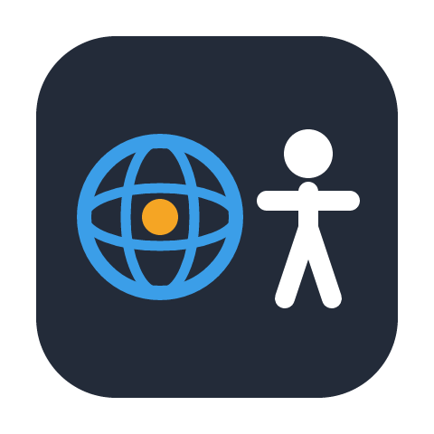
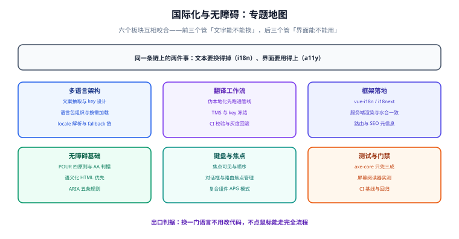

# 国际化与无障碍

**国际化（i18n，internationalization）** 解决的是「同一套界面怎么讲不同的语言」——文案、日期、数字、货币、复数、排序规则全都随语言变化；**无障碍（a11y，accessibility）** 解决的是「同一套界面怎么让所有人都能用」——不看屏幕的人靠键盘与读屏软件、看不清的人靠缩放与高对比度、不会用鼠标的人靠键盘走完全流程。

两者被放在同一个专题里，不是因为它们像，而是因为它们**共享同一条判断标准**：一个界面是否只在「我的机器 + 我的语言 + 我的鼠标」这一个特定条件下成立。i18n 打破语言与地区的假定，a11y 打破输入方式与感知能力的假定，二者都是把隐含假定显式化的工程。

一句话定位：**这个专题讲的是「把界面里的所有隐含假定找出来并消除」**——语言假定、地区假定、输入设备假定、感知能力假定。

## 标准与版本基线

以下是本专题涉及的标准与组件状态（**2026-10 核对，以官方发布页为准**）：

| 标准 / 规范 | 当前状态 | 说明 |
| --- | --- | --- |
| WCAG 2.2 | W3C **正式推荐标准**（Recommendation，2023-10-05） | 现行验收基线；A / AA / AAA 三级，商业项目通常以 **AA** 为合同口径 |
| WCAG 3.0 | 仍在**草案阶段**，无正式版本 | **不要照着草案做验收**；已有的 2.2 判据足以覆盖绝大多数场景 |
| WAI-ARIA 1.2 | W3C **正式推荐标准**（2023-06-06） | 角色、状态与属性的权威定义；ARIA 1.3 仍在推进中 |
| ECMA-402（`Intl`） | 随 ECMAScript 年度版本发布 | `Intl.Segmenter` 自 **ES2022** 起为标准成员，`Intl.DurationFormat` 已进入 **ES2025** |
| Unicode CLDR | 按固定节奏滚动发布 | 日期/数字/货币/复数规则的**事实来源**；浏览器与 Node 各自打包一份快照，因此同代码在不同环境可能给出不同结果 |
| GB/T 37668-2019 | 现行国家标准 | 《信息技术 互联网内容无障碍可访问性技术要求与测试方法》，国内项目的常见引用口径 |
| 法规面 | 欧盟《欧洲无障碍法案》自 **2025-06-28** 起适用；美国 DOJ 的 ADA 第二章网站规则分设 **2026 与 2027** 两个合规节点 | 具体适用范围与时间节点**以法规原文为准**，本文只作提示 |

:::warning 版本口径提示
`Intl` 的实现细节由各引擎自带的 CLDR 快照决定，**同一行代码在 Node 20 与 Node 22 上可能给出不同的格式化结果**（例如某个地区的货币符号或日期顺序）。凡是「格式化结果进快照测试」的项目，都要把 Node 版本写进测试环境说明。
:::

## 专题地图

## 页面导航

1. [概述：两层职责与标准速览](Overview/index.md) —— i18n 与 a11y 的边界、四层职责模型、与相邻专题的分工、什么时候不该做
2. [多语言架构：抽取、组织与加载](I18nArchitecture/index.md) —— 文案抽取与 key 设计、命名空间拆分、按需加载、locale 解析与 fallback 链
3. [原生 Intl：格式化与本地化](IntlApi/index.md) —— 八个 `Intl` 构造器的能力边界、时区与 locale 口径、性能与缓存
4. [翻译工作流：从 key 冻结到灰度](TranslationWorkflow/index.md) —— 伪本地化、TMS 对接、CI 校验规则、灰度与回滚
5. [框架落地：Vue / React / Nuxt](FrameworkIntegration/index.md) —— 三套方案的入口差异、服务端渲染的三条接缝、SEO 元信息
6. [无障碍基础：WCAG 与语义化](A11yFoundation/index.md) —— POUR 四原则与成功准则清单、语义化优先、可访问名称的计算顺序、ARIA 五规则
7. [键盘、焦点与复合组件](KeyboardFocus/index.md) —— 焦点顺序与可见性、焦点转移的三种场景、跳转链接、APG 模式清单
8. [无障碍测试与门禁](A11yTesting/index.md) —— 四层投入与覆盖率现实、工具链配置、人工走查清单、CI 基线与回归
9. [实战：双语化与 AA 达标](Practice/index.md) —— 六步改造流程、每步的判据、验收清单
10. [常见问题与最佳实践](FAQ/index.md) —— 三类高频现象的排查树、十二个高频问答

## 建议的阅读顺序

- **完全没做过国际化**：从 [概述](Overview/index.md) 读起，重点看「四层职责」——先搞清楚翻译只占其中一层，能省掉大量返工。
- **正在接第二个语言**：直接看 [多语言架构](I18nArchitecture/index.md) 与 [框架落地](FrameworkIntegration/index.md)，这两页决定改动面大小。
- **要过无障碍验收**：按 [无障碍基础](A11yFoundation/index.md) → [键盘与焦点](KeyboardFocus/index.md) → [测试与门禁](A11yTesting/index.md) 的顺序读，最后照 [实战](Practice/index.md) 的清单走一遍。
- **只想知道格式怎么写才不出错**：[原生 Intl](IntlApi/index.md) 一页就够，尤其是时区与 locale 两节。
- **上线后出问题**：直接跳到 [常见问题](FAQ/index.md) 的排查树，按现象分类。

## 本专题与相邻专题的分工

这几处边界**写死在页面上**，互不替代：

| 相邻专题 | 它讲什么 | 本专题讲什么 |
| --- | --- | --- |
| [React 无障碍](../Frame/React/Accessibility/index.md) | React 生态内的具体 API 与工具链（`useId`、ref 转发、React 专属 lint 规则） | **框架无关**的规范、判据与工程化：WCAG 条目怎么落到任何框架、键盘与焦点纪律、CI 门禁设计 |
| [HTML 语义化标签](../Basic/HTML/Semantic/index.md) | 元素本身的分类与语义（`article` / `section` / `nav` 怎么选） | 语义化**为什么是无障碍的第一手段**，以及它与角色树、可访问名称的关系 |
| [HTML 表单](../Basic/HTML/Form/index.md) | 表单元素的属性与提交行为 | 表单在无障碍层面的要求：label 关联、错误提示可读、必填与格式约束如何播报 |
| [前端工程化](../Others/FrontendEngineering/index.md) | 构建、规范、lint 与 CI 的整体工程结构 | 在既有工程里**多挂两条门禁**（语言包一致性与无障碍断言）的具体写法 |
| [前端测试](../Testing/index.md) | 单测、组件测试、E2E 的整体策略 | 无障碍测试**能自动化到什么程度**，以及剩下的部分怎么人工补 |
| [单页面应用](../Others/SPA/index.md) | 路由与状态管理带来的工程问题 | SPA 特有的一类无障碍缺陷：**路由切换后焦点与标题的管理** |
| [Nuxt](../Frame/Nuxt/index.md) | Nuxt 的渲染模式与服务端能力 | 服务端渲染下 i18n 的**水合一致**问题：为什么首帧语言必须与 HTML 一致 |

## 参考资料

- [W3C Web Content Accessibility Guidelines（WCAG）2.2](https://www.w3.org/TR/WCAG22/)
- [W3C WAI-ARIA 1.2 规范](https://www.w3.org/TR/wai-aria-1.2/)
- [W3C ARIA Authoring Practices Guide（APG）](https://www.w3.org/WAI/ARIA/apg/)
- [MDN：`Intl` 命名空间](https://developer.mozilla.org/zh-CN/docs/Web/JavaScript/Reference/Global_Objects/Intl)
- [Unicode CLDR 项目主页](https://cldr.unicode.org/)
- [国家标准全文公开系统：GB/T 37668-2019](https://openstd.samr.gov.cn/)
